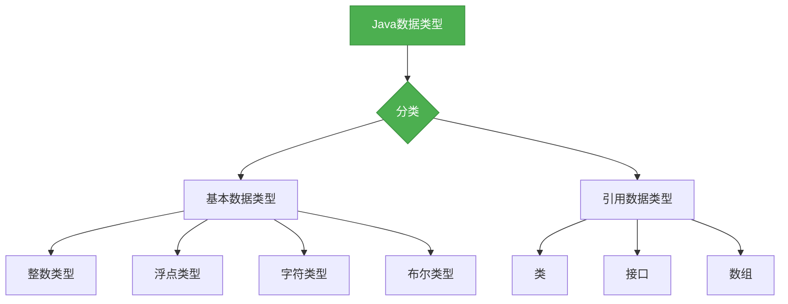

# Java基础-数据类型

## 概述

数据类型是Java语言的基础，它决定了变量可以存储什么样的值，以及可以对这些值进行什么样的操作。Java是一种强类型语言，每个变量都必须明确声明其数据类型。本章节将系统梳理Java中的数据类型分类及核心用法。



## 知识要点

### 1. 基本数据类型

基本数据类型是Java语言中内置的、不可再分的数据类型，它们直接存储值而不是引用。Java共有8种基本数据类型：

```java
public class BasicDataTypeDemo {
    // 整数类型
    byte b = 10; // 1字节，范围：-128 ~ 127
    short s = 100; // 2字节，范围：-32768 ~ 32767
    int i = 1000; // 4字节，范围：-2^31 ~ 2^31-1
    long l = 10000L; // 8字节，范围：-2^63 ~ 2^63-1
    
    // 浮点类型
    float f = 3.14f; // 4字节，精度：约6-7位小数
    double d = 3.14159; // 8字节，精度：约15-17位小数
    
    // 字符类型
    char c = 'A'; // 2字节，范围：0 ~ 65535
    
    // 布尔类型
    boolean bool = true; // 1位，值：true 或 false
}
```

### 2. 引用数据类型

引用数据类型是对对象的引用，它们存储的是对象的地址而不是对象本身。Java中的引用数据类型包括类、接口和数组：

```java
public class ReferenceDataTypeDemo {
    // 类
    String str = "Hello";
    Person person = new Person();
    
    // 接口
    Animal animal = new Dog();
    
    // 数组
    int[] arr = {1, 2, 3};
    String[] strArr = {"a", "b", "c"};
}

// 定义一个类
class Person {
    private String name;
    private int age;
    
    // 省略getter和setter方法
}

// 定义一个接口
interface Animal {
    void eat();
}

// 实现接口
class Dog implements Animal {
    @Override
    public void eat() {
        System.out.println("Dog eats骨头");
    }
}
```

### 3. 数据类型转换

Java中的数据类型转换分为自动类型转换和强制类型转换：

```java
public class TypeConversionDemo {
    public void conversion() {
        // 自动类型转换（小范围 -> 大范围）
        byte b = 10;
        short s = b;
        int i = s;
        long l = i;
        float f = l;
        double d = f;
        
        // 强制类型转换（大范围 -> 小范围）
        int i2 = (int)l;
        byte b2 = (byte)i2;
        
        // 注意：强制类型转换可能会导致精度丢失
        double d2 = 3.14159;
        int i3 = (int)d2; // 结果为3，丢失了小数部分
        
        // 字符串转换
        String str = "100";
        int i4 = Integer.parseInt(str);
        String str2 = String.valueOf(i4);
    }
}
```

## 知识扩展

### 设计思想

Java数据类型的设计体现了以下思想：
1. **简洁性**：基本数据类型数量控制在合理范围内，避免过多的类型
2. **一致性**：数据类型的命名和用法保持一致，便于学习和记忆
3. **扩展性**：通过引用数据类型提供灵活的扩展机制
4. **安全性**：强类型检查可以避免很多类型错误
5. **效率**：基本数据类型直接存储值，提高访问效率

### 避坑指南

1. **类型溢出**：注意整数类型的范围，避免溢出
2. **精度丢失**：注意浮点类型的精度限制，避免精度丢失
3. **空指针异常**：引用数据类型可能为null，使用前需要检查
4. **自动装箱/拆箱**：注意自动装箱/拆箱可能带来的性能问题
5. **类型转换**：强制类型转换时注意范围和精度问题

### 深度思考题

**思考题1:**
为什么Java要区分基本数据类型和引用数据类型？

**回答:**
Java区分基本数据类型和引用数据类型主要是出于效率和设计的考虑。基本数据类型直接存储值，访问效率高，适合存储简单的数值。引用数据类型存储的是对象的地址，它们可以引用复杂的对象，提供更灵活的功能。这种区分使得Java既可以高效地处理简单数据，又可以灵活地处理复杂对象。

**思考题2:**
什么是自动装箱和拆箱？它们有什么优缺点？

**回答:**
自动装箱是指将基本数据类型自动转换为对应的包装类对象，自动拆箱是指将包装类对象自动转换为对应的基本数据类型。它们的优点是简化了代码，使得开发者可以更方便地在基本数据类型和包装类之间进行转换。它们的缺点是可能会带来性能问题，因为频繁的装箱和拆箱会创建大量的临时对象，增加垃圾回收的负担。

**思考题3:**
为什么Java中的浮点数不适合用于金融计算？

**回答:**
Java中的浮点数（float和double）是基于IEEE 754标准的，它们使用二进制表示十进制小数，这会导致精度问题。例如，0.1在二进制中无法精确表示，它会被表示为一个近似值。这种精度问题在金融计算中是不可接受的，因为金融计算通常需要精确到小数点后几位。因此，在金融计算中，我们应该使用BigDecimal类而不是浮点数。