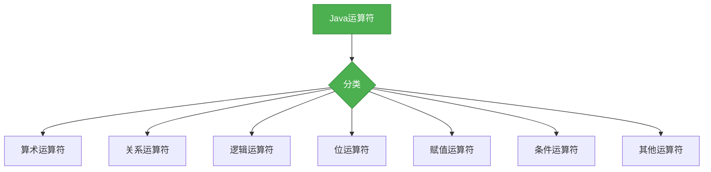

# Java基础-运算符

## 概述

运算符是Java语言中用于执行操作的特殊符号，它们可以用于操作变量和值。掌握Java运算符是学习Java语法的基础，本章节将系统梳理Java中的运算符分类及核心用法。



## 知识要点

### 1. 算术运算符

算术运算符用于执行基本的数学运算：

```java
public class ArithmeticOperatorDemo {
    public void arithmetic() {
        int a = 10;
        int b = 5;
        
        // 加法
        int add = a + b; // 15
        
        // 减法
        int sub = a - b; // 5
        
        // 乘法
        int mul = a * b; // 50
        
        // 除法
        int div = a / b; // 2
        
        // 取模
        int mod = a % b; // 0
        
        // 自增
        a++; // 11
        ++a; // 12
        
        // 自减
        b--; // 4
        --b; // 3
    }
}
```

### 2. 关系运算符

关系运算符用于比较两个值的关系：

```java
public class RelationalOperatorDemo {
    public void relational() {
        int a = 10;
        int b = 5;
        
        // 等于
        boolean eq = (a == b); // false
        
        // 不等于
        boolean ne = (a != b); // true
        
        // 大于
        boolean gt = (a > b); // true
        
        // 小于
        boolean lt = (a < b); // false
        
        // 大于等于
        boolean ge = (a >= b); // true
        
        // 小于等于
        boolean le = (a <= b); // false
    }
}
```

### 3. 逻辑运算符

逻辑运算符用于连接布尔表达式：

```java
public class LogicalOperatorDemo {
    public void logical() {
        boolean a = true;
        boolean b = false;
        
        // 逻辑与
        boolean and = a && b; // false
        
        // 逻辑或
        boolean or = a || b; // true
        
        // 逻辑非
        boolean not = !a; // false
        
        // 短路运算
        // 当a为false时，不会计算b的值
        boolean shortCircuitAnd = a && (b = true); // false
        
        // 当a为true时，不会计算b的值
        boolean shortCircuitOr = a || (b = false); // true
    }
}
```

### 4. 位运算符

位运算符用于操作二进制位：

```java
public class BitOperatorDemo {
    public void bit() {
        int a = 60; // 0011 1100
        int b = 13; // 0000 1101
        
        // 按位与
        int and = a & b; // 12 (0000 1100)
        
        // 按位或
        int or = a | b; // 61 (0011 1101)
        
        // 按位异或
        int xor = a ^ b; // 49 (0011 0001)
        
        // 按位非
        int not = ~a; // -61 (1100 0011)
        
        // 左移
        int leftShift = a << 2; // 240 (1111 0000)
        
        // 右移
        int rightShift = a >> 2; // 15 (0000 1111)
        
        // 无符号右移
        int unsignedRightShift = a >>> 2; // 15 (0000 1111)
    }
}
```

### 5. 赋值运算符

赋值运算符用于给变量赋值：

```java
public class AssignmentOperatorDemo {
    public void assignment() {
        int a = 10;
        
        // 简单赋值
        int b = a; // 10
        
        // 加法赋值
        b += a; // 20
        
        // 减法赋值
        b -= a; // 10
        
        // 乘法赋值
        b *= a; // 100
        
        // 除法赋值
        b /= a; // 10
        
        // 取模赋值
        b %= a; // 0
        
        // 位与赋值
        b &= a; // 0
        
        // 位或赋值
        b |= a; // 10
        
        // 位异或赋值
        b ^= a; // 0
        
        // 左移赋值
        b <<= a; // 0
        
        // 右移赋值
        b >>= a; // 0
        
        // 无符号右移赋值
        b >>>= a; // 0
    }
}
```

### 6. 条件运算符

条件运算符是Java中唯一的三目运算符：

```java
public class ConditionalOperatorDemo {
    public void conditional() {
        int a = 10;
        int b = 5;
        
        // 条件运算符
        int max = (a > b) ? a : b; // 10
        
        // 嵌套条件运算符
        int min = (a < b) ? a : ((a == b) ? a : b); // 5
    }
}
```

### 7. 其他运算符

Java中还有一些其他运算符：

```java
public class OtherOperatorDemo {
    public void other() {
        // 点运算符
        Person person = new Person();
        person.setName("张三");
        
        //  instanceof运算符
        boolean isPerson = person instanceof Person; // true
        
        // 括号运算符
        int result = (a + b) * c; // 先计算a + b，再乘以c
        
        // 数组访问运算符
        int[] arr = {1, 2, 3};
        int first = arr[0]; // 1
    }
}
```

## 知识扩展

### 设计思想

Java运算符的设计体现了以下思想：
1. **简洁性**：运算符符号简洁明了，便于记忆和使用
2. **一致性**：运算符的含义和用法保持一致，便于学习和记忆
3. **完备性**：提供了丰富的运算符，满足各种编程需求
4. **效率**：位运算符等可以直接操作二进制位，提高运行效率
5. **可读性**：运算符的使用使得代码更加简洁和可读

### 避坑指南

1. **整数除法**：注意整数除法会截断小数部分，而不是四舍五入
2. **优先级**：注意运算符的优先级，避免因优先级问题导致的错误
3. **短路运算**：注意逻辑运算符的短路特性，避免依赖未执行的代码
4. **溢出**：注意算术运算可能导致的溢出问题
5. **类型转换**：注意不同类型之间的运算可能导致的类型转换问题

### 深度思考题

**思考题1:**
什么是运算符的优先级？为什么要了解运算符的优先级？

**回答:**
运算符的优先级是指在表达式中，不同的运算符按照一定的顺序进行计算。了解运算符的优先级可以帮助我们正确地理解和编写表达式，避免因优先级问题导致的错误。例如，在表达式`a + b * c`中，乘法的优先级高于加法，所以会先计算`b * c`，然后再加上`a`。

**思考题2:**
什么是短路运算？它有什么优势？

**回答:**
短路运算是指在逻辑运算中，当确定整个表达式的结果后，就不再计算剩余的部分。例如，在表达式`a && b`中，如果`a`为`false`，那么无论`b`的值是什么，整个表达式的结果都是`false`，所以不会计算`b`的值。短路运算的优势是可以提高代码的执行效率，避免不必要的计算。

**思考题3:**
位运算符有什么应用场景？

**回答:**
位运算符的应用场景主要包括：
1. 底层编程：如操作系统、驱动程序等，需要直接操作硬件
2. 性能优化：位运算比算术运算更快，可以提高代码的执行效率
3. 数据压缩：如位图、音频、视频等的压缩
4. 加密算法：如对称加密、非对称加密等
5. 游戏开发：如碰撞检测、物理模拟等
6. 网络编程：如IP地址、端口号的处理等