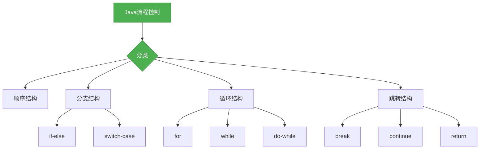

# Java基础-流程控制

## 概述

流程控制是Java语言中用于控制程序执行流程的机制，它决定了程序中的语句按照什么顺序执行。掌握流程控制是学习Java编程的基础，本章节将系统梳理Java中的流程控制分类及核心用法。



## 知识要点

### 1. 顺序结构

顺序结构是程序中最基本的流程控制结构，它按照代码的书写顺序依次执行：

```java
public class SequenceStructureDemo {
    public static void main(String[] args) {
        // 顺序执行
        System.out.println("第一步");
        System.out.println("第二步");
        System.out.println("第三步");
    }
}
```

### 2. 分支结构

分支结构根据条件决定执行哪一段代码：

#### 2.1 if-else

```java
public class IfElseDemo {
    public static void main(String[] args) {
        int score = 85;
        
        if (score >= 90) {
            System.out.println("优秀");
        } else if (score >= 80) {
            System.out.println("良好");
        } else if (score >= 70) {
            System.out.println("中等");
        } else if (score >= 60) {
            System.out.println("及格");
        } else {
            System.out.println("不及格");
        }
    }
}
```

#### 2.2 switch-case

```java
public class SwitchCaseDemo {
    public static void main(String[] args) {
        int month = 3;
        
        switch (month) {
            case 1:
                System.out.println("一月");
                break;
            case 2:
                System.out.println("二月");
                break;
            case 3:
                System.out.println("三月");
                break;
            case 4:
                System.out.println("四月");
                break;
            case 5:
                System.out.println("五月");
                break;
            case 6:
                System.out.println("六月");
                break;
            default:
                System.out.println("其他月份");
        }
    }
}
```

### 3. 循环结构

循环结构用于重复执行一段代码：

#### 3.1 for

```java
public class ForDemo {
    public static void main(String[] args) {
        // 基本for循环
        for (int i = 0; i < 5; i++) {
            System.out.println("i = " + i);
        }
        
        // 增强for循环（for-each）
        int[] arr = {1, 2, 3, 4, 5};
        for (int num : arr) {
            System.out.println("num = " + num);
        }
    }
}
```

#### 3.2 while

```java
public class WhileDemo {
    public static void main(String[] args) {
        int i = 0;
        while (i < 5) {
            System.out.println("i = " + i);
            i++;
        }
    }
}
```

#### 3.3 do-while

```java
public class DoWhileDemo {
    public static void main(String[] args) {
        int i = 0;
        do {
            System.out.println("i = " + i);
            i++;
        } while (i < 5);
    }
}
```

### 4. 跳转结构

跳转结构用于改变程序的执行流程：

#### 4.1 break

```java
public class BreakDemo {
    public static void main(String[] args) {
        for (int i = 0; i < 10; i++) {
            if (i == 5) {
                break; // 跳出循环
            }
            System.out.println("i = " + i);
        }
    }
}
```

#### 4.2 continue

```java
public class ContinueDemo {
    public static void main(String[] args) {
        for (int i = 0; i < 10; i++) {
            if (i == 5) {
                continue; // 跳过当前循环
            }
            System.out.println("i = " + i);
        }
    }
}
```

#### 4.3 return

```java
public class ReturnDemo {
    public static void main(String[] args) {
        System.out.println("开始");
        test();
        System.out.println("结束");
    }
    
    public static void test() {
        for (int i = 0; i < 5; i++) {
            if (i == 3) {
                return; // 结束方法
            }
            System.out.println("i = " + i);
        }
    }
}
```

## 知识扩展

### 设计思想

Java流程控制的设计体现了以下思想：
1. **结构化**：提供了结构化的流程控制语句，避免了 goto 语句带来的混乱
2. **简洁性**：流程控制语句简洁明了，便于记忆和使用
3. **灵活性**：提供了丰富的流程控制语句，满足各种编程需求
4. **可读性**：流程控制语句的使用使得代码更加清晰和可读
5. **可维护性**：结构化的流程控制使得代码更容易维护和修改

### 避坑指南

1. **无限循环**：注意循环条件，避免无限循环
2. **边界条件**：注意循环的边界条件，避免多执行或少执行一次
3. **break和continue的区别**：break用于跳出循环，continue用于跳过当前循环
4. **switch-case的穿透性**：注意switch-case语句的穿透性，不要忘记添加break
5. **空语句块**：避免出现空的语句块，这可能会导致逻辑错误

### 深度思考题

**思考题1:**
为什么Java要避免使用goto语句？

**回答:**
Java避免使用goto语句主要是因为goto语句会破坏程序的结构化特性，使得代码难以理解和维护。goto语句可以跳转到程序的任何位置，这可能会导致代码的执行流程变得混乱，难以跟踪。此外，goto语句也可能会导致一些难以发现的错误，例如跳过了一些重要的初始化或清理代码。

**思考题2:**
for、while和do-while循环有什么区别？

**回答:**
for、while和do-while循环的主要区别在于它们的语法和执行条件的检查时机：
1. for循环：语法上包含初始化、循环条件和更新表达式，适合于已知循环次数的情况
2. while循环：只有循环条件，没有初始化和更新表达式，适合于未知循环次数的情况
3. do-while循环：先执行循环体，然后检查循环条件，至少会执行一次循环体

**思考题3:**
什么是死循环？如何避免死循环？

**回答:**
死循环是指循环条件始终为true，导致循环永远不会结束的情况。避免死循环的方法主要有：
1. 确保循环条件最终会变为false
2. 避免在循环体中修改循环条件相关的变量
3. 使用break语句在适当的时候跳出循环
4. 对于复杂的循环条件，进行充分的测试
5. 避免使用过于复杂的循环条件，保持简洁明了