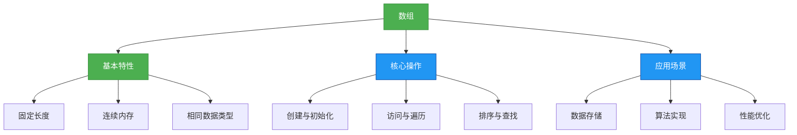
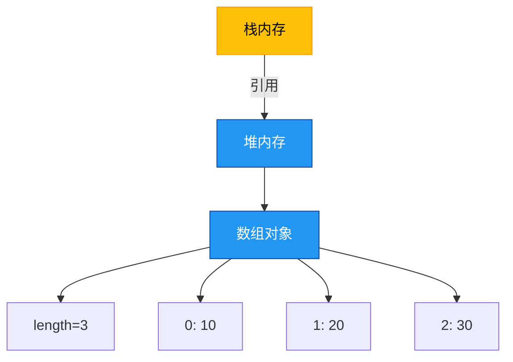

# 1.2.1 数组


## 概述
数组是Java中最基础的数据结构之一，它是一种连续存储相同数据类型元素的容器。数组具有固定长度、随机访问效率高、内存连续分配等特点，是实现其他复杂数据结构的基础。



## 知识要点
### 2.1 数组的定义与初始化
数组在Java中可以通过两种方式定义：声明数组变量和创建数组对象。初始化方式包括静态初始化和动态初始化。

#### 2.1.1 数组声明
```java
// 方式一：数据类型[] 数组名
int[] numbers;
String[] names;

// 方式二：数据类型 数组名[] (不推荐，易混淆)
int ages[];
```

#### 2.1.2 数组初始化
```java
// 1. 静态初始化：声明的同时赋值
int[] scores = {90, 85, 95, 80}; // 长度为4的int数组
String[] fruits = new String[]{"apple", "banana", "orange"};

// 2. 动态初始化：指定长度，默认初始化值
int[] ids = new int[5]; // 长度为5，默认值为0
Object[] objects = new Object[3]; // 长度为3，默认值为null

// 3. 数组创建后赋值
String[] colors = new String[3];
colors[0] = "red";
colors[1] = "green";
colors[2] = "blue";
```

### 2.2 数组的访问与遍历
数组通过索引访问元素，索引从0开始。遍历数组常用for循环和增强for循环两种方式。

#### 2.2.1 数组访问
```java
int[] arr = {10, 20, 30, 40};
System.out.println(arr[0]); // 访问第一个元素，输出10
System.out.println(arr[2]); // 访问第三个元素，输出30
arr[1] = 25; // 修改第二个元素的值
```

#### 2.2.2 数组遍历
```java
int[] numbers = {1, 2, 3, 4, 5};

// 1. 普通for循环
for (int i = 0; i < numbers.length; i++) {
    System.out.println(numbers[i]);
}

// 2. 增强for循环(foreach)
for (int num : numbers) {
    System.out.println(num);
}

// 3. 使用Arrays.toString()打印数组
import java.util.Arrays;
System.out.println(Arrays.toString(numbers)); // 输出: [1, 2, 3, 4, 5]
```

### 2.3 数组的常用操作
Java提供了`java.util.Arrays`工具类来简化数组操作，包括排序、查找、填充等。

#### 2.3.1 数组排序
```java
import java.util.Arrays;

int[] arr = {3, 1, 4, 2, 5};
Arrays.sort(arr); // 对数组进行升序排序
System.out.println(Arrays.toString(arr)); // 输出: [1, 2, 3, 4, 5]
```

#### 2.3.2 数组查找
```java
import java.util.Arrays;

int[] arr = {10, 20, 30, 40, 50};
int index = Arrays.binarySearch(arr, 30); // 二分查找，返回索引
System.out.println(index); // 输出: 2
```

#### 2.3.3 数组复制
```java
import java.util.Arrays;

int[] original = {1, 2, 3};
int[] copy = Arrays.copyOf(original, original.length); // 复制整个数组
int[] rangeCopy = Arrays.copyOfRange(original, 1, 3); // 复制指定范围

System.out.println(Arrays.toString(copy)); // 输出: [1, 2, 3]
System.out.println(Arrays.toString(rangeCopy)); // 输出: [2, 3]
```

### 2.4 数组的内存特性
数组在Java中是引用类型，存储在堆内存中，数组变量存储的是数组对象的引用地址。



## 知识扩展
### 3.1 设计思想
#### 3.1.1 数组的优缺点
**优点**：
- 随机访问效率高，时间复杂度为O(1)
- 内存连续，缓存利用率高
- 实现简单，是其他数据结构的基础

**缺点**：
- 长度固定，扩容需要创建新数组
- 插入删除效率低，时间复杂度为O(n)
- 只能存储相同类型的数据

#### 3.1.2 数组与集合的选择
- 当元素数量固定且需要频繁访问时，选择数组
- 当元素数量不确定且需要频繁增删时，选择集合框架(如ArrayList)

### 3.2 避坑指南
#### 3.2.1 数组越界异常
**问题**：访问数组时索引超出范围
**解决方案**：始终检查数组边界，使用数组长度控制循环

```java
int[] arr = {1, 2, 3};
// 错误示例
for (int i = 0; i <= arr.length; i++) { // i <= arr.length 导致越界
    System.out.println(arr[i]);
}

// 正确示例
for (int i = 0; i < arr.length; i++) {
    System.out.println(arr[i]);
}
```

#### 3.2.2 空指针异常
**问题**：访问未初始化的数组或已置为null的数组
**解决方案**：初始化数组后再使用，避免将数组引用置为null

```java
int[] arr = null;
// 错误示例
System.out.println(arr.length); // 抛出NullPointerException

// 正确示例
int[] arr = new int[0]; // 空数组但已初始化
System.out.println(arr.length); // 输出: 0
```

### 3.3 深度思考题
1. 如何实现一个动态数组(ArrayList的简化版)？
2. 数组去重有哪些方法？各有什么优缺点？
3. 如何找出数组中出现次数最多的元素？

#### 思考题参考答案
1. 动态数组实现思路：
```java
public class DynamicArray {
    private int[] elements;
    private int size;
    private static final int DEFAULT_CAPACITY = 10;

    public DynamicArray() {
        elements = new int[DEFAULT_CAPACITY];
        size = 0;
    }

    // 添加元素，容量不足时扩容
    public void add(int element) {
        if (size == elements.length) {
            // 扩容为原来的1.5倍
            int newCapacity = elements.length * 3 / 2;
            elements = Arrays.copyOf(elements, newCapacity);
        }
        elements[size++] = element;
    }

    // 获取元素
    public int get(int index) {
        if (index < 0 || index >= size) {
            throw new IndexOutOfBoundsException();
        }
        return elements[index];
    }

    // 其他方法：remove、size等
}
```