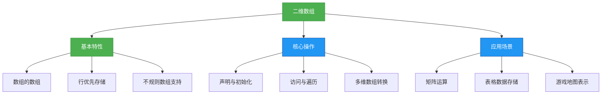
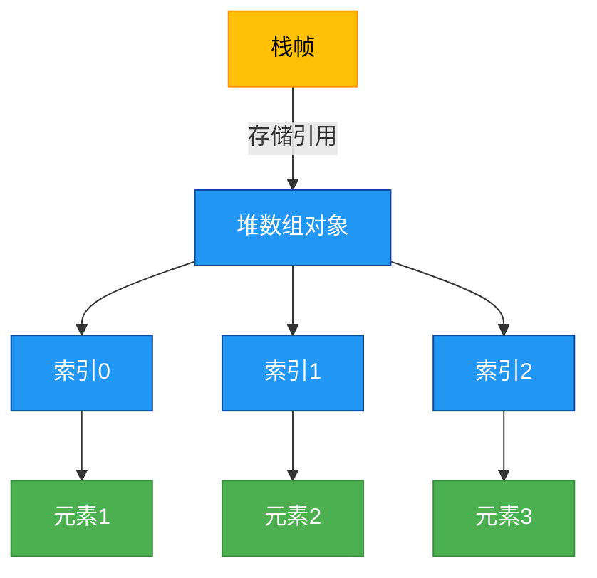

# 1.2.2 二维数组


## 概述
二维数组是数组的数组，它在内存中以行优先的方式存储，可以看作是具有行和列的表格结构。二维数组常用于表示矩阵、表格数据等具有二维结构的信息，是处理多维数据的基础。



## 知识要点
### 2.1 二维数组的定义与初始化
二维数组可以理解为每个元素都是一维数组的数组，它有多种声明和初始化方式。

#### 2.1.1 二维数组声明
```java
// 方式一：数据类型[][] 数组名
int[][] matrix;
String[][] table;

// 方式二：数据类型 数组名[][] (不推荐)
int scores[][];
```

#### 2.1.2 二维数组初始化
```java
// 1. 静态初始化
int[][] identityMatrix = {
    {1, 0, 0},
    {0, 1, 0},
    {0, 0, 1}
};

// 2. 动态初始化 - 确定行和列
int[][] intArray = new int[3][4]; // 3行4列的二维数组

// 3. 动态初始化 - 先确定行，后确定列（不规则数组）
int[][] jaggedArray = new int[3][];
jaggedArray[0] = new int[2]; // 第一行2列
jaggedArray[1] = new int[3]; // 第二行3列
jaggedArray[2] = new int[1]; // 第三行1列

// 4. 初始化后赋值
String[][] names = new String[2][2];
names[0][0] = "Alice";
names[0][1] = "Bob";
names[1][0] = "Charlie";
names[1][1] = "David";
```

### 2.2 二维数组的访问与遍历
二维数组通过行索引和列索引访问元素，遍历方式包括嵌套for循环和增强for循环。

#### 2.2.1 元素访问
```java
int[][] matrix = {
    {1, 2, 3},
    {4, 5, 6},
    {7, 8, 9}
};

System.out.println(matrix[0][0]); // 访问第一行第一列元素，输出1
System.out.println(matrix[1][2]); // 访问第二行第三列元素，输出6
matrix[2][1] = 88; // 修改第三行第二列元素
```

#### 2.2.2 数组遍历
```java
int[][] numbers = {
    {1, 2, 3},
    {4, 5, 6},
    {7, 8, 9}
};

// 1. 嵌套for循环
for (int i = 0; i < numbers.length; i++) { // 遍历行
    for (int j = 0; j < numbers[i].length; j++) { // 遍历列
        System.out.print(numbers[i][j] + " ");
    }
    System.out.println();
}

// 2. 增强for循环
for (int[] row : numbers) { // 遍历每一行
    for (int num : row) { // 遍历行中的每个元素
        System.out.print(num + " ");
    }
    System.out.println();
}

// 3. 使用Arrays.deepToString()打印二维数组
import java.util.Arrays;
System.out.println(Arrays.deepToString(numbers));
// 输出: [[1, 2, 3], [4, 5, 6], [7, 8, 9]]
```

### 2.3 二维数组的内存结构
二维数组在内存中表现为数组引用的数组，每个引用指向一个一维数组。规则数组和不规则数组在内存结构上有所不同。



### 2.4 二维数组的常用操作
#### 2.4.1 矩阵转置
```java
public class MatrixOperations {
    // 矩阵转置：将行变为列
    public static int[][] transpose(int[][] matrix) {
        int rows = matrix.length;
        int cols = matrix[0].length;
        int[][] result = new int[cols][rows];

        for (int i = 0; i < rows; i++) {
            for (int j = 0; j < cols; j++) {
                result[j][i] = matrix[i][j];
            }
        }
        return result;
    }
}
```

#### 2.4.2 矩阵相加
```java
public class MatrixOperations {
    // 矩阵相加：对应位置元素相加
    public static int[][] add(int[][] a, int[][] b) {
        int rows = a.length;
        int cols = a[0].length;
        int[][] result = new int[rows][cols];

        for (int i = 0; i < rows; i++) {
            for (int j = 0; j < cols; j++) {
                result[i][j] = a[i][j] + b[i][j];
            }
        }
        return result;
    }
}
```

## 知识扩展
### 3.1 设计思想
#### 3.1.1 二维数组的适用场景
- **矩阵运算**：科学计算、图形处理中的矩阵操作
- **表格数据**：数据库查询结果、Excel表格数据
- **游戏开发**：二维游戏地图、棋盘游戏（如五子棋、象棋）
- **图像处理**：像素点矩阵表示

#### 3.1.2 多维数组的替代方案
对于复杂的多维数据，考虑使用：
- **集合的集合**：如`List<List<Integer>>`，更灵活但性能略低
- **自定义对象**：将二维数据封装为对象，提高代码可读性
- **稀疏矩阵**：当大部分元素为0时，使用稀疏矩阵存储节省空间

### 3.2 避坑指南
#### 3.2.1 不规则数组的空指针问题
**问题**：动态初始化不规则数组时，如果未初始化子数组就访问元素
**解决方案**：确保每个子数组都已正确初始化

```java
int[][] jaggedArray = new int[3][];
jaggedArray[0] = new int[2];
// 错误示例：jaggedArray[1]未初始化
System.out.println(jaggedArray[1][0]); // 抛出NullPointerException

// 正确示例
jaggedArray[1] = new int[3];
System.out.println(jaggedArray[1][0]); // 输出0
```

#### 3.2.2 数组长度陷阱
**问题**：错误地认为二维数组的列长度统一
**解决方案**：获取每行的实际长度

```java
int[][] array = {
    {1, 2},
    {3},
    {4, 5, 6}
};

// 错误示例：假设所有行长度相同
for (int i = 0; i < array.length; i++) {
    for (int j = 0; j < array[0].length; j++) { // array[0].length=2，第三行会越界
        System.out.println(array[i][j]);
    }
}

// 正确示例：使用当前行的长度
for (int i = 0; i < array.length; i++) {
    for (int j = 0; j < array[i].length; j++) {
        System.out.println(array[i][j]);
    }
}
```

### 3.3 深度思考题
1. 如何实现矩阵乘法？
2. 如何将二维数组转换为一维数组？有哪些转换策略？
3. 如何处理大型二维数组以提高性能？

#### 思考题参考答案
1. 矩阵乘法实现：
```java
public class MatrixMultiplication {
    public static int[][] multiply(int[][] a, int[][] b) {
        int aRows = a.length;
        int aCols = a[0].length;
        int bRows = b.length;
        int bCols = b[0].length;

        // 检查矩阵乘法条件：a的列数必须等于b的行数
        if (aCols != bRows) {
            throw new IllegalArgumentException("矩阵a的列数必须等于矩阵b的行数");
        }

        int[][] result = new int[aRows][bCols];

        for (int i = 0; i < aRows; i++) {
            for (int j = 0; j < bCols; j++) {
                int sum = 0;
                for (int k = 0; k < aCols; k++) {
                    sum += a[i][k] * b[k][j];
                }
                result[i][j] = sum;
            }
        }
        return result;
    }
}
```