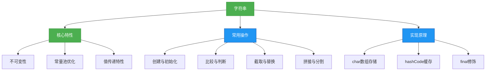

# 1.2.2 字符串


## 概述
字符串是Java中最常用的数据类型之一，用于表示文本数据。Java中的字符串由`java.lang.String`类实现，具有不可变性、常量池优化等特性。字符串操作是Java开发中的基础技能，掌握字符串的特性和常用方法对编写高效代码至关重要。



## 知识要点
### 2.1 字符串的创建与初始化
Java中字符串有多种创建方式，不同方式在内存分配和性能上存在差异。

#### 2.1.1 字符串创建方式
```java
// 1. 字符串字面量（存储在常量池）
String str1 = "hello";
String str2 = "hello"; // 复用常量池中的对象

// 2. new关键字（存储在堆内存）
String str3 = new String("hello");
String str4 = new String("hello"); // 创建新的对象

// 3. 字符数组转换
char[] chars = {'h', 'e', 'l', 'l', 'o'};
String str5 = new String(chars);

// 4. 字节数组转换
byte[] bytes = {104, 101, 108, 108, 111}; // ASCII码
String str6 = new String(bytes);
```

#### 2.1.2 字符串常量池机制
```java
String s1 = "java";
String s2 = "java";
String s3 = new String("java");
String s4 = s3.intern(); // 将字符串对象加入常量池

System.out.println(s1 == s2); // true，引用常量池同一对象
System.out.println(s1 == s3); // false，s3在堆内存
System.out.println(s1 == s4); // true，s4指向常量池对象
```

### 2.2 字符串的不可变性
String类被final修饰，其内部char数组也被final修饰，因此字符串对象创建后内容不可修改，任何修改操作都会创建新的字符串对象。

```java
public final class String {
    private final char value[]; // 存储字符串的字符数组
    // ...其他代码
}
```

#### 2.2.1 不可变性的表现
```java
String s = "hello";
String s2 = s.toUpperCase(); // 创建新对象
String s3 = s.concat(" world"); // 创建新对象

System.out.println(s); // 输出: hello，原字符串不变
System.out.println(s == s2); // false，不同对象
```

#### 2.2.2 不可变性的好处
- **线程安全**：不可变对象天然线程安全
- **常量池优化**：可被共享，节省内存
- **哈希码缓存**：hashCode计算后缓存，提高Map等容器的性能
- **安全性**：作为参数传递时不会被修改

### 2.3 字符串常用方法
#### 2.3.1 字符串比较
```java
String str1 = "Hello";
String str2 = "hello";

// 1. equals()：比较内容
boolean isEqual = str1.equals(str2); // false

// 2. equalsIgnoreCase()：忽略大小写比较
boolean isEqualIgnoreCase = str1.equalsIgnoreCase(str2); // true

// 3. compareTo()：按字典顺序比较，返回int值
int compareResult = str1.compareTo(str2); // 区分大小写
int compareResultIgnoreCase = str1.compareToIgnoreCase(str2); // 忽略大小写

// 4. ==：比较引用（地址）
boolean isSameObject = (str1 == str2); // false
```

#### 2.3.2 字符串查找
```java
String str = "Java Programming Language";

// 1. 包含判断
boolean contains = str.contains("Program"); // true

// 2. 前缀后缀判断
boolean startsWith = str.startsWith("Java"); // true
boolean endsWith = str.endsWith("age"); // true

// 3. 字符位置查找
int indexOf = str.indexOf('P'); // 5（第一次出现位置）
int lastIndexOf = str.lastIndexOf('g'); // 18（最后一次出现位置）
int indexOfSub = str.indexOf("Language"); // 17（子串位置）
```

#### 2.3.3 字符串截取与替换
```java
String str = "Hello, World!";

// 1. 截取子串
String substring1 = str.substring(7); // 从索引7开始到结束: "World!"
String substring2 = str.substring(0, 5); // 从索引0到5（不包含5）: "Hello"

// 2. 替换操作
String replaced1 = str.replace('o', 'O'); // 替换字符: "HellO, WOrld!"
String replaced2 = str.replace("World", "Java"); // 替换子串: "Hello, Java!"
String replaced3 = str.replaceAll("[aeiou]", "*"); // 正则替换: "H*ll*, W*rld!"
```

#### 2.3.4 字符串分割与拼接
```java
// 1. 字符串分割
String str = "apple,banana,orange"; 
String[] fruits = str.split(","); // 按逗号分割

// 2. 字符串拼接
String s1 = "Hello"; 
String s2 = "World"; 
String s3 = s1 + " " + s2; // 使用+号拼接
String s4 = String.join(" ", s1, s2); // 使用String.join()
```

### 2.4 字符串与其他类型转换
```java
// 1. 基本类型转字符串
String numStr = String.valueOf(123); // "123"
String boolStr = String.valueOf(true); // "true"

// 2. 字符串转基本类型
int num = Integer.parseInt("123"); // 123
double d = Double.parseDouble("3.14"); // 3.14
boolean b = Boolean.parseBoolean("true"); // true

// 3. 字符串转字符数组
char[] chars = "hello".toCharArray();

// 4. 字符数组转字符串
String str = new String(chars);
```

## 知识扩展
### 3.1 设计思想
#### 3.1.1 String、StringBuilder与StringBuffer
| 类 | 可变性 | 线程安全 | 性能 | 适用场景 |
|----|--------|----------|------|----------|
| String | 不可变 | 是 | 低（每次修改创建新对象） | 少量字符串操作 |
| StringBuilder | 可变 | 否 | 高 | 单线程大量字符串拼接 |
| StringBuffer | 可变 | 是（方法加synchronized） | 中 | 多线程环境 |

#### 3.1.2 字符串拼接性能对比
```java
// 1. String拼接（性能差）
String str = ""; 
for (int i = 0; i < 10000; i++) {
    str += i; // 每次创建新对象
}

// 2. StringBuilder拼接（性能好）
StringBuilder sb = new StringBuilder();
for (int i = 0; i < 10000; i++) {
    sb.append(i); // 同一对象操作
}
String result = sb.toString();
```

### 3.2 避坑指南
#### 3.2.1 字符串比较使用==的陷阱
**问题**：使用==比较字符串内容
**解决方案**：使用equals()方法比较内容，==用于比较对象引用

```java
String s1 = "java";
String s2 = new String("java");

// 错误示例
if (s1 == s2) { ... } // false，比较的是引用

// 正确示例
if (s1.equals(s2)) { ... } // true，比较的是内容

// 更安全的写法（避免空指针）
if ("java".equals(s2)) { ... } // 常量在前
```

#### 3.2.2 字符串空值判断
**问题**：未正确处理null和空字符串
**解决方案**：使用工具类或短路判断

```java
String str = null;

// 错误示例
if (str.equals("")) { ... } // 抛出NullPointerException

// 正确示例
if (str == null || str.isEmpty()) { ... } // 先判断null

// JDK1.6+推荐使用
if (str == null || str.length() == 0) { ... }

// Apache Commons工具类
if (StringUtils.isEmpty(str)) { ... }
```

### 3.3 深度思考题
1. 为什么String类被设计为不可变的？
2. 如何实现一个高效的字符串反转算法？
3. String.intern()方法的作用及使用场景？
4. 字符串常量池的实现原理是什么？

#### 思考题参考答案
1. String类不可变的设计原因：
   - 安全：字符串常被用作参数，不可变保证参数不被修改
   - 高效：可被缓存和共享，节省内存
   - 线程安全：无需同步即可在多线程中使用
   - 哈希稳定：哈希码可缓存，适合作为Map键

2. 高效字符串反转实现：
```java
public class StringReverse {
    // 方法1：使用StringBuilder
    public static String reverse1(String s) {
        if (s == null) return null;
        return new StringBuilder(s).reverse().toString();
    }

    // 方法2：字符数组反转（手动实现）
    public static String reverse2(String s) {
        if (s == null) return null;
        char[] chars = s.toCharArray();
        int left = 0, right = chars.length - 1;

        while (left < right) {
            // 交换字符
            char temp = chars[left];
            chars[left] = chars[right];
            chars[right] = temp;
            left++;
            right--;
        }
        return new String(chars);
    }
}
```