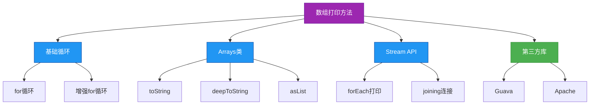

# 1.2.3 打印数组


## 概述
在Java开发中，数组打印是日常调试和数据展示的常见需求。由于数组直接打印会输出内存地址而非实际内容，掌握正确的数组打印方法对开发效率至关重要。本章将系统介绍Java中打印数组的多种方式，包括基础循环打印、工具类打印、流打印等方法，并分析各种方法的适用场景和性能特点。



## 知识要点
### 2.1 基础循环打印法
循环打印是最原始但最灵活的数组打印方式，适用于所有数组类型，尤其适合需要自定义格式的场景。

#### 2.1.1 for循环打印一维数组
```java
public class ArrayPrintDemo {
    public static void printArrayWithForLoop() {
        int[] numbers = {1, 2, 3, 4, 5};
        
        System.out.print("[");
        for (int i = 0; i < numbers.length; i++) {
            System.out.print(numbers[i]);
            if (i < numbers.length - 1) {
                System.out.print(", ");
            }
        }
        System.out.println("]");
        // 输出: [1, 2, 3, 4, 5]
    }
}
```

#### 2.1.2 增强for循环打印数组
```java
public class ArrayPrintDemo {
    public static void printArrayWithEnhancedFor() {
        String[] fruits = {"Apple", "Banana", "Orange"};
        
        System.out.print("[");
        boolean first = true;
        for (String fruit : fruits) {
            if (!first) {
                System.out.print(", ");
            }
            System.out.print(fruit);
            first = false;
        }
        System.out.println("]");
        // 输出: [Apple, Banana, Orange]
    }
}
```

#### 2.1.3 嵌套循环打印二维数组
```java
public class ArrayPrintDemo {
    public static void print2DArrayWithLoop() {
        int[][] matrix = { {1, 2, 3}, {4, 5, 6}, {7, 8, 9} };
        
        System.out.println("[");
        for (int i = 0; i < matrix.length; i++) {
            System.out.print("  [");
            for (int j = 0; j < matrix[i].length; j++) {
                System.out.print(matrix[i][j]);
                if (j < matrix[i].length - 1) {
                    System.out.print(", ");
                }
            }
            System.out.println("]");
        }
        System.out.println("]");
        /* 输出:
        [
          [1, 2, 3]
          [4, 5, 6]
          [7, 8, 9]
        ]
        */
    }
}
```

### 2.2 Arrays工具类打印法
Java提供了`java.util.Arrays`工具类，封装了常用的数组操作方法，其中`toString()`和`deepToString()`是打印数组的便捷工具。

#### 2.2.1 Arrays.toString()打印一维数组
```java
import java.util.Arrays;

public class ArrayPrintDemo {
    public static void printWithArraysToString() {
        int[] numbers = {1, 2, 3, 4, 5};
        String[] fruits = {"Apple", "Banana", "Orange"};
        double[] prices = {10.99, 20.50, 5.99};
        
        System.out.println(Arrays.toString(numbers));  // [1, 2, 3, 4, 5]
        System.out.println(Arrays.toString(fruits));   // [Apple, Banana, Orange]
        System.out.println(Arrays.toString(prices));   // [10.99, 20.5, 5.99]
    }
}
```

#### 2.2.2 Arrays.deepToString()打印多维数组
```java
import java.util.Arrays;

public class ArrayPrintDemo {
    public static void printWithArraysDeepToString() {
        int[][] matrix = { {1, 2, 3}, {4, 5, 6}, {7, 8, 9} };
        String[][] names = { {"Alice", "Bob"}, {"Charlie", "David"} };
        
        System.out.println(Arrays.deepToString(matrix));  // [[1, 2, 3], [4, 5, 6], [7, 8, 9]]
        System.out.println(Arrays.deepToString(names));   // [[Alice, Bob], [Charlie, David]]
    }
}
```

#### 2.2.3 Arrays.asList()配合打印
```java
import java.util.Arrays;

public class ArrayPrintDemo {
    public static void printWithArraysAsList() {
        String[] fruits = {"Apple", "Banana", "Orange"};
        
        // Arrays.asList()将数组转换为List集合
        System.out.println(Arrays.asList(fruits));  // [Apple, Banana, Orange]
    }
}
```

### 2.3 Java 8+流API打印法
Java 8引入的Stream API提供了更现代、更灵活的数组打印方式，支持函数式编程风格。

#### 2.3.1 使用Stream.forEach()打印
```java
import java.util.Arrays;

public class ArrayPrintDemo {
    public static void printWithStreamForEach() {
        int[] numbers = {1, 2, 3, 4, 5};
        String[] fruits = {"Apple", "Banana", "Orange"};
        
        // 打印int数组
        System.out.print("[");
        Arrays.stream(numbers).forEach(n -> System.out.print(n + ", "));
        System.out.println("]");  // [1, 2, 3, 4, 5, ]
        
        // 打印String数组
        System.out.print("[");
        Arrays.stream(fruits).forEach(f -> System.out.print(f + ", "));
        System.out.println("]");  // [Apple, Banana, Orange, ]
    }
}
```

#### 2.3.2 使用Collectors.joining()格式化打印
```java
import java.util.Arrays;
import java.util.stream.Collectors;

public class ArrayPrintDemo {
    public static void printWithCollectorsJoining() {
        String[] fruits = {"Apple", "Banana", "Orange"};
        
        // 使用Stream API和Collectors.joining()格式化
        String result = Arrays.stream(fruits)
                              .collect(Collectors.joining(", ", "[", "]"));
        
        System.out.println(result);  // [Apple, Banana, Orange]
    }
}
```

### 2.4 常见数组类型打印对比
不同类型的数组需要采用不同的打印策略，以下是常见数组类型的最佳打印实践：

#### 2.4.1 基本类型数组
```java
import java.util.Arrays;

public class ArrayPrintDemo {
    public static void printPrimitiveArrays() {
        int[] intArray = {1, 2, 3};
        char[] charArray = {'a', 'b', 'c'};
        boolean[] boolArray = {true, false, true};
        
        // 基本类型数组推荐使用Arrays.toString()
        System.out.println(Arrays.toString(intArray));   // [1, 2, 3]
        System.out.println(Arrays.toString(charArray));  // [a, b, c]
        System.out.println(Arrays.toString(boolArray));  // [true, false, true]
    }
}
```

#### 2.4.2 对象数组
```java
import java.util.Arrays;

class Person {
    private String name;
    private int age;
    
    public Person(String name, int age) {
        this.name = name;
        this.age = age;
    }
    
    // 重写toString()方法
    @Override
    public String toString() {
        return name + "(" + age + ")";
    }
}

public class ArrayPrintDemo {
    public static void printObjectArrays() {
        Person[] people = {
            new Person("Alice", 25),
            new Person("Bob", 30)
        };
        
        // 对象数组打印依赖于对象的toString()方法
        System.out.println(Arrays.toString(people));  // [Alice(25), Bob(30)]
    }
}
```

## 知识扩展
### 3.1 设计思想
#### 3.1.1 数组打印方法性能对比
| 方法 | 优点 | 缺点 | 适用场景 |
|------|------|------|----------|
| for循环 | 完全自定义，无额外依赖 | 代码冗长，易出错 | 需要高度自定义格式 |
| Arrays.toString() | 简洁高效，代码量少 | 格式固定，无法自定义 | 快速打印，调试场景 |
| Stream API | 函数式风格，可链式操作 | JDK8+依赖，性能略低 | 复杂格式化，函数式编程 |
| 第三方库 | 功能丰富，使用简单 | 引入外部依赖 | 企业级项目，复杂需求 |

#### 3.1.2 自定义数组打印工具类
```java
import java.util.Arrays;

public class ArrayPrinter {
    // 私有化构造方法，防止实例化
    private ArrayPrinter() {}
    
    // 打印一维数组
    public static <T> void print(T[] array) {
        if (array == null) {
            System.out.println("null");
            return;
        }
        System.out.println(Arrays.toString(array));
    }
    
    // 打印基本类型int数组
    public static void print(int[] array) {
        if (array == null) {
            System.out.println("null");
            return;
        }
        System.out.println(Arrays.toString(array));
    }
    
    // 打印多维数组
    public static void print(Object[][] array) {
        if (array == null) {
            System.out.println("null");
            return;
        }
        System.out.println(Arrays.deepToString(array));
    }
    
    // 自定义格式打印
    public static <T> void printCustom(T[] array, String prefix, String suffix, String delimiter) {
        if (array == null) {
            System.out.println(prefix + suffix);
            return;
        }
        
        StringBuilder sb = new StringBuilder(prefix);
        for (int i = 0; i < array.length; i++) {
            sb.append(array[i]);
            if (i < array.length - 1) {
                sb.append(delimiter);
            }
        }
        sb.append(suffix);
        System.out.println(sb.toString());
    }
}
```

### 3.2 避坑指南
#### 3.2.1 直接打印数组引用的陷阱
**问题**：直接打印数组变量会输出内存地址而非内容
**解决方案**：使用Arrays.toString()或其他打印方法

```java
int[] numbers = {1, 2, 3};

// 错误示例
System.out.println(numbers);  // 输出类似: [I@1b6d3586

// 正确示例
System.out.println(Arrays.toString(numbers));  // [1, 2, 3]
```

#### 3.2.2 多维数组打印的问题
**问题**：使用Arrays.toString()打印多维数组无法正确显示嵌套内容
**解决方案**：使用Arrays.deepToString()方法

```java
int[][] matrix = { {1, 2, 3}, {4, 5, 6} };

// 错误示例
System.out.println(Arrays.toString(matrix));  // [[I@4554617c, [I@74a14482]

// 正确示例
System.out.println(Arrays.deepToString(matrix));  // [[1, 2, 3], [4, 5, 6]]
```

#### 3.2.3 对象数组打印无意义内容
**问题**：对象数组打印时显示类似`com.example.Person@123456`
**解决方案**：重写对象的toString()方法

```java
class Person {
    private String name;
    private int age;
    
    // 构造方法省略
    
    // 重写toString()方法
    @Override
    public String toString() {
        return "Person{name='" + name + "', age=" + age + "}";
    }
}

// 打印结果将变为有意义的内容
// [Person{name='Alice', age=25}, Person{name='Bob', age=30}]
```

### 3.3 深度思考题
1. Arrays.toString()和Arrays.deepToString()的实现原理有何不同？
2. 为什么基本类型数组和对象数组的打印方式需要区分对待？
3. 如何实现一个通用的数组打印工具类，支持任意类型、任意维度的数组？
4. 在大数据量数组打印时，如何避免内存溢出和性能问题？

#### 思考题参考答案
1. Arrays.toString()与Arrays.deepToString()的实现区别：
   - Arrays.toString()：适用于一维数组，直接遍历数组元素并拼接字符串
   - Arrays.deepToString()：适用于多维数组，通过递归方式处理嵌套数组
   - 源码核心区别在于deepToString()会检查元素是否为数组类型，如果是则递归调用

2. 通用数组打印工具类实现思路：
```java
public class UniversalArrayPrinter {
    public static String toString(Object array) {
        if (array == null) return "null";
        if (!array.getClass().isArray()) return array.toString();
        
        StringBuilder sb = new StringBuilder();
        sb.append("[");
        
        int length = java.lang.reflect.Array.getLength(array);
        for (int i = 0; i < length; i++) {
            Object element = java.lang.reflect.Array.get(array, i);
            if (i > 0) sb.append(", ");
            sb.append(toString(element)); // 递归处理
        }
        
        sb.append("]");
        return sb.toString();
    }
}
```