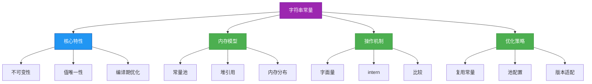
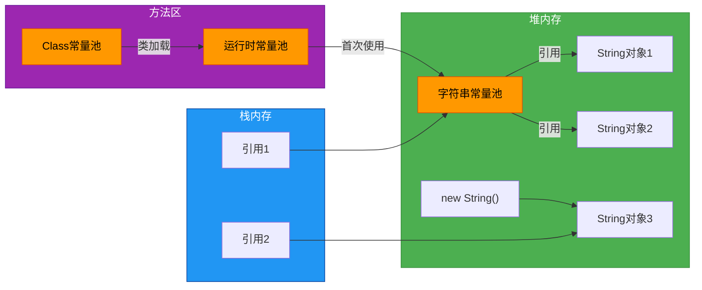

# 1.2.4 字符串常量


## 概述
字符串常量是Java中一种特殊的字符串表示形式，具有不可变性和常量池存储特性。理解字符串常量的实现机制对于编写高效Java代码至关重要。本章将深入探讨字符串常量的内存模型、常量池工作原理、字符串驻留机制以及相关的性能优化策略，帮助开发者掌握字符串常量的正确使用方法和最佳实践。



## 知识要点
### 2.1 字符串常量的定义与特性
字符串常量是通过双引号直接声明的字符串，在编译期确定其值，并存储在字符串常量池中，具有不可变性和全局唯一性。

#### 2.1.1 字符串常量的声明方式
```java
public class StringConstantDemo {
    public static void main(String[] args) {
        // 字符串常量声明（存储在常量池）
        String str1 = "Hello World";
        String str2 = "Hello World"; // 复用常量池中的同一对象
        
        // 字符串对象声明（存储在堆内存）
        String str3 = new String("Hello World");
        String str4 = new String("Hello World"); // 创建新的堆对象
        
        System.out.println(str1 == str2); // true，引用常量池同一对象
        System.out.println(str1 == str3); // false，引用不同内存区域
        System.out.println(str3 == str4); // false，引用不同堆对象
    }
}
```

#### 2.1.2 不可变性的底层实现
String类的不可变性通过类声明和内部存储结构实现，确保字符串对象创建后其值无法被修改。

```java
public final class String {
    private final char value[]; // 存储字符串的字符数组
    private int hash; // 缓存的哈希码
    
    // 构造方法
    public String(String original) {
        this.value = original.value;
        this.hash = original.hash;
    }
    
    // 所有修改方法都会创建新的String对象
    public String substring(int beginIndex) {
        // ...实现逻辑
        return new String(result, 0, len);
    }
}
```

### 2.2 字符串常量池机制
字符串常量池是Java堆内存中的一个特殊区域，用于存储字符串常量，实现字符串的复用和内存优化。

#### 2.2.1 常量池的内存结构


#### 2.2.2 字符串常量池的工作流程
1. **编译期**：字符串常量被记录在Class文件的常量池中
2. **类加载期**：Class常量池内容被加载到运行时常量池
3. **运行期**：首次使用字符串常量时，JVM在字符串常量池中查找或创建对应对象

```java
public class ConstantPoolWorkflow {
    public static void main(String[] args) {
        // 编译期："Java"被记录在Class常量池
        // 类加载期："Java"被加载到运行时常量池
        // 运行期首次使用：在字符串常量池创建"Java"对象
        String s1 = "Java"; 
        
        // 运行期再次使用：直接引用常量池已有的"Java"对象
        String s2 = "Java"; 
        
        System.out.println(s1 == s2); // true，引用同一对象
    }
}
```

### 2.3 String.intern()方法
intern()方法是Java提供的显式操作字符串常量池的方式，用于将字符串对象加入常量池并返回常量池中的引用。

#### 2.3.1 intern()方法的基本使用
```java
public class StringInternDemo {
    public static void main(String[] args) {
        // 创建堆内存字符串对象
        String s1 = new String("Hello");
        String s2 = new String("Hello");
        
        // 将对象加入常量池并获取引用
        String s3 = s1.intern();
        String s4 = s2.intern();
        
        // 常量池中的字符串字面量
        String s5 = "Hello";
        
        System.out.println(s1 == s2); // false，不同堆对象
        System.out.println(s3 == s4); // true，引用常量池同一对象
        System.out.println(s3 == s5); // true，引用常量池同一对象
        System.out.println(s1 == s3); // false，堆对象与常量池对象
    }
}
```

#### 2.3.2 JDK版本中intern()行为差异
| JDK版本 | intern()行为 | 常量池位置 |
|---------|-------------|-----------|
| JDK 6及之前 | 复制字符串到永久代常量池 | 永久代 |
| JDK 7及之后 | 仅在常量池存储引用（指向堆中对象） | 堆内存 |

```java
// JDK 6与JDK 7+行为对比示例
public class InternVersionDiff {
    public static void main(String[] args) {
        String s = new String("1");
        s.intern();
        String s2 = "1";
        System.out.println(s == s2); // JDK6: false; JDK7+: false
        
        String s3 = new String("2") + new String("2");
        s3.intern();
        String s4 = "22";
        System.out.println(s3 == s4); // JDK6: false; JDK7+: true
    }
}
```

### 2.4 字符串常量的比较操作
字符串常量比较需要区分引用比较(==)和内容比较(equals())，理解两者差异对避免常见错误至关重要。

#### 2.4.1 ==与equals()的区别
```java
public class StringComparisonDemo {
    public static void main(String[] args) {
        String s1 = "hello";
        String s2 = "hello";
        String s3 = new String("hello");
        String s4 = new String("hello");
        
        // 引用比较（==）
        System.out.println(s1 == s2); // true，同一常量池对象
        System.out.println(s1 == s3); // false，不同内存区域
        System.out.println(s3 == s4); // false，不同堆对象
        
        // 内容比较（equals()）
        System.out.println(s1.equals(s2)); // true，内容相同
        System.out.println(s1.equals(s3)); // true，内容相同
        System.out.println(s3.equals(s4)); // true，内容相同
    }
}
```

#### 2.4.2 常量折叠现象
编译器会对字符串常量表达式进行优化，在编译期计算结果并合并相同字符串。

```java
public class ConstantFoldingDemo {
    public static void main(String[] args) {
        String s1 = "a" + "b" + "c"; // 编译期优化为"abc"
        String s2 = "abc";
        System.out.println(s1 == s2); // true
        
        String a = "a";
        String s3 = a + "bc"; // 运行期拼接，new String("abc")
        System.out.println(s3 == s2); // false
        
        // final变量也会触发常量折叠
        final String b = "b";
        String s4 = "a" + b + "c"; // 编译期优化为"abc"
        System.out.println(s4 == s2); // true
    }
}
```

## 知识扩展
### 3.1 设计思想
#### 3.1.1 字符串常量池的设计目的
- **内存优化**：避免相同字符串的重复创建，节省内存空间
- **性能提升**：常量比较可直接使用==，提高比较效率
- **安全保障**：不可变字符串适合作为哈希表键和参数传递

#### 3.1.2 字符串常量 vs 字符串对象
| 特性 | 字符串常量 | 字符串对象 |
|------|-----------|-----------|
| 创建方式 | 字面量声明：`"abc"` | new关键字：`new String("abc")` |
| 存储位置 | 字符串常量池 | 堆内存 |
| 复用性 | 自动复用，全局唯一 | 每次创建新对象 |
| 内存效率 | 高，避免重复存储 | 低，可能存在重复对象 |
| 适用场景 | 固定不变的字符串 | 需要动态修改的字符串 |

### 3.2 避坑指南
#### 3.2.1 字符串常量比较错误
**问题**：错误使用==比较字符串内容
**解决方案**：使用equals()比较内容，==仅用于判断引用是否相同

```java
String username = getUserInput();

// 错误示例
if (username == "admin") { // 比较的是引用而非内容
    // 逻辑处理
}

// 正确示例
if ("admin".equals(username)) { // 安全比较，避免空指针
    // 逻辑处理
}

// 带空值判断的比较
if (username != null && username.equals("admin")) { 
    // 逻辑处理
}
```

#### 3.2.2 过度使用intern()方法
**问题**：盲目使用intern()方法尝试优化内存
**解决方案**：仅对高频复用字符串使用intern()

```java
// 不推荐：低频使用的字符串无需intern()
String lowFrequencyStr = new String(getDynamicInput()).intern();

// 推荐：高频复用的字符串适合intern()
public class Constants {
    public static final String ERROR_CODE_404 = "NOT_FOUND".intern();
    public static final String ERROR_CODE_500 = "INTERNAL_ERROR".intern();
    // ...其他常量
}
```

#### 3.2.3 字符串拼接性能问题
**问题**：在循环中使用+拼接字符串常量
**解决方案**：使用StringBuilder或StringBuffer

```java
// 性能差：每次循环创建新String对象
String result = 
```