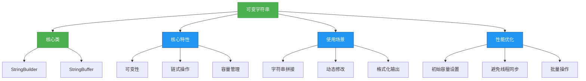
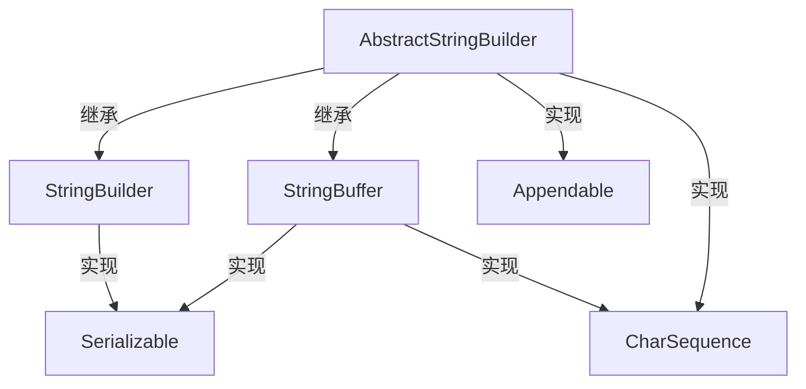

# 1.2.5 可变字符串


## 概述
可变字符串是Java中用于处理动态字符串内容的重要工具，主要通过`StringBuilder`和`StringBuffer`类实现。与不可变的`String`类不同，可变字符串允许在原有对象上进行修改操作，避免频繁创建新对象带来的性能开销。本章将深入讲解可变字符串的实现原理、使用方法、性能特性以及在不同场景下的最佳实践，帮助开发者高效处理字符串动态拼接和修改需求。



## 知识要点
### 2.1 可变字符串核心类
Java提供了两个主要的可变字符串类：`StringBuilder`（非线程安全）和`StringBuffer`（线程安全），均继承自`AbstractStringBuilder`抽象类。

#### 2.1.1 类继承关系与核心结构


#### 2.1.2 类定义与核心字段
```java
// AbstractStringBuilder核心结构
abstract class AbstractStringBuilder implements Appendable, CharSequence {
    char[] value; // 存储字符的数组（非final，支持修改）
    int count; // 实际字符数量
    
    // 构造方法
    AbstractStringBuilder(int capacity) {
        value = new char[capacity];
    }
}

// StringBuilder类定义（JDK8）
public final class StringBuilder
    extends AbstractStringBuilder
    implements java.io.Serializable, CharSequence {
    // 无额外字段，继承自父类
    
    // 构造方法
    public StringBuilder() { super(16); } // 默认容量16
    public StringBuilder(int capacity) { super(capacity); }
    public StringBuilder(String str) { super(str.length() + 16); append(str); }
}

// StringBuffer类定义（JDK8）
public final class StringBuffer
    extends AbstractStringBuilder
    implements java.io.Serializable, CharSequence {
    // 无额外字段，继承自父类
    
    // 构造方法
    public StringBuffer() { super(16); } // 默认容量16
    public StringBuffer(int capacity) { super(capacity); }
    public StringBuffer(String str) { super(str.length() + 16); append(str); }
}
```

### 2.2 StringBuilder的使用
`StringBuilder`是单线程环境下的首选可变字符串类，提供了丰富的字符串修改方法，支持链式调用。

#### 2.2.1 基本操作方法
```java
public class StringBuilderDemo {
    public static void main(String[] args) {
        // 创建StringBuilder对象
        StringBuilder sb = new StringBuilder();
        
        // 追加操作
        sb.append("Hello");
        sb.append(" ");
        sb.append("World");
        System.out.println(sb.toString()); // Hello World
        
        // 插入操作
        sb.insert(5, ","); // 在索引5处插入逗号
        System.out.println(sb.toString()); // Hello, World
        
        // 删除操作
        sb.delete(5, 6); // 删除索引5-6（不包含6）的字符
        System.out.println(sb.toString()); // Hello World
        
        // 替换操作
        sb.replace(6, 11, "Java"); // 替换索引6-11的字符
        System.out.println(sb.toString()); // Hello Java
        
        // 反转操作
        sb.reverse();
        System.out.println(sb.toString()); // avaJ olleH
        
        // 清空操作
        sb.setLength(0);
        System.out.println(sb.length()); // 0
    }
}
```

#### 2.2.2 链式调用特性
```java
public class StringBuilderChainDemo {
    public static void main(String[] args) {
        // 链式调用示例
        String result = new StringBuilder()
            .append("User: ")
            .append("Alice")
            .append(" (ID: ")
            .append(12345)
            .append(")")
            .toString();
        
        System.out.println(result); // User: Alice (ID: 12345)
    }
}
```

### 2.3 StringBuffer的使用
`StringBuffer`与`StringBuilder` API完全一致，但所有方法都添加了`synchronized`修饰，确保多线程安全。

#### 2.3.1 线程安全实现
```java
// StringBuffer的append方法（带同步锁）
public synchronized StringBuffer append(String str) {
    toStringCache = null;
    super.append(str);
    return this;
}

// StringBuilder的append方法（无同步锁）
public StringBuilder append(String str) {
    super.append(str);
    return this;
}
```

#### 2.3.2 多线程环境使用示例
```java
import java.util.concurrent.CountDownLatch;

public class StringBufferThreadSafeDemo {
    private static final int THREAD_COUNT = 10;
    private static StringBuffer safeBuffer = new StringBuffer();
    private static StringBuilder unsafeBuilder = new StringBuilder();
    private static CountDownLatch latch = new CountDownLatch(THREAD_COUNT);
    
    public static void main(String[] args) throws InterruptedException {
        // 启动多个线程操作字符串
        for (int i = 0; i < THREAD_COUNT; i++) {
            final int threadId = i;
            new Thread(() -> {
                try {
                    safeBuffer.append("thread").append(threadId).append(",");
                    unsafeBuilder.append("thread").append(threadId).append(",");
                } finally {
                    latch.countDown();
                }
            }).start();
        }
        
        latch.await(); // 等待所有线程完成
        System.out.println("StringBuffer结果长度: " + safeBuffer.length()); // 预期: 10*(6+1+1)=80
        System.out.println("StringBuilder结果长度: " + unsafeBuilder.length()); // 可能小于80（因线程不安全）
    }
}
```

### 2.4 容量管理机制
可变字符串内部通过字符数组存储数据，合理的容量管理对性能至关重要。

#### 2.4.1 容量与长度的区别
- **容量(Capacity)**：内部字符数组的总长度
- **长度(Length)**：实际存储的字符数量

```java
public class CapacityDemo {
    public static void main(String[] args) {
        StringBuilder sb = new StringBuilder();
        System.out.println("初始容量: " + sb.capacity()); // 16
        System.out.println("初始长度: " + sb.length());   // 0
        
        sb.append("HelloWorld");
        System.out.println("添加后容量: " + sb.capacity()); // 16（未超过）
        System.out.println("添加后长度: " + sb.length());   // 10
        
        // 追加超出当前容量的内容
        sb.append("1234567"); // 总长度变为17
        System.out.println("扩容后容量: " + sb.capacity()); // 34（原容量*2+2）
    }
}
```

#### 2.4.2 扩容机制
当追加内容导致长度超过容量时，会触发扩容：
- JDK6及之前：新容量 = 原容量 * 2 + 2
- JDK7及之后：若原容量*2 < 所需容量，则新容量 = 所需容量；否则新容量 = 原容量*2

```java
// AbstractStringBuilder的扩容逻辑
void ensureCapacityInternal(int minimumCapacity) {
    // overflow-conscious code
    if (minimumCapacity - value.length > 0) {
        value = Arrays.copyOf(value, newCapacity(minimumCapacity));
    }
}

private int newCapacity(int minCapacity) {
    // overflow-conscious code
    int newCapacity = (value.length << 1) + 2; // 原容量*2+2
    if (newCapacity - minCapacity < 0) {
        newCapacity = minCapacity;
    }
    return (newCapacity <= 0 || MAX_ARRAY_SIZE - newCapacity < 0)
        ? hugeCapacity(minCapacity)
        : newCapacity;
}
```

## 知识扩展
### 3.1 设计思想
#### 3.1.1 StringBuilder vs StringBuffer vs String
| 特性 | String | StringBuilder | StringBuffer |
|------|--------|--------------|--------------|
| 可变性 | 不可变 | 可变 | 可变 |
| 线程安全 | 安全（不可变） | 不安全 | 安全（同步方法） |
| 性能 | 低（每次修改创建新对象） | 高 | 中（同步开销） |
| 适用场景 | 少量固定字符串 | 单线程大量字符串操作 | 多线程字符串操作 |
| 继承关系 | 直接实现CharSequence | 继承AbstractStringBuilder | 继承AbstractStringBuilder |

#### 3.1.2 性能对比测试
```java
public class PerformanceComparison {
    private static final int ITERATIONS = 100000;
    
    public static void main(String[] args) {
        // String拼接性能测试
        long startTime = System.currentTimeMillis();
        String str = "";
        for (int i = 0; i < ITERATIONS; i++) {
            str += i;
        }
        long stringTime = System.currentTimeMillis() - startTime;
        
        // StringBuilder性能测试
        startTime = System.currentTimeMillis();
        StringBuilder sb = new StringBuilder();
        for (int i = 0; i < ITERATIONS; i++) {
            sb.append(i);
        }
        long sbTime = System.currentTimeMillis() - startTime;
        
        // StringBuffer性能测试
        startTime = System.currentTimeMillis();
        StringBuffer sbf = new StringBuffer();
        for (int i = 0; i < ITERATIONS; i++) {
            sbf.append(i);
        }
        long sbfTime = System.currentTimeMillis() - startTime;
        
        System.out.println("String耗时: " + stringTime + "ms");       // 最慢
        System.out.println("StringBuilder耗时: " + sbTime + "ms"); // 最快
        System.out.println("StringBuffer耗时: " + sbfTime + "ms"); // 中等
    }
}
```

### 3.2 避坑指南
#### 3.2.1 初始容量设置不当
**问题**：未指定初始容量导致频繁扩容
**解决方案**：预估字符串长度并设置初始容量

```java
// 不推荐：默认容量16，可能导致多次扩容
StringBuilder sb = new StringBuilder();

// 推荐：根据预期长度设置初始容量
int expectedLength = 1000;
StringBuilder sb = new StringBuilder(expectedLength);
```

#### 3.2.2 多线程误用StringBuilder
**问题**：在多线程环境使用StringBuilder导致数据错乱
**解决方案**：使用StringBuffer或手动同步

```java
// 错误示例：多线程使用StringBuilder
StringBuilder sb = new StringBuilder();
// 多线程同时调用sb.append()...

// 正确示例1：使用StringBuffer
StringBuffer sb = new StringBuffer();

// 正确示例2：手动同步StringBuilder
StringBuilder sb = new StringBuilder();
synchronized(sb) {
    sb.append("thread-safe");
}
```

#### 3.2.3 不必要的toString()调用
**问题**：循环中频繁调用toString()方法
**解决方案**：循环结束后一次性调用

```java
// 不推荐：每次循环都创建新String对象
StringBuilder sb = new StringBuilder();
for (int i = 0; i < 100; i++) {
    sb.append(i);
    System.out.println(sb.toString()); // 每次调用创建新String
}

// 推荐：循环结束后调用一次
StringBuilder sb = new StringBuilder();
for (int i = 0; i < 100; i++) {
    sb.append(i);
}
System.out.println(sb.toString()); // 仅创建一个String对象
```

### 3.3 深度思考题
1. 为什么StringBuilder和StringBuffer的默认初始容量是16？
2. 如何实现一个自定义的线程安全且高性能的可变字符串类？
3. 在JDK9及以上版本中，String类的实现改为byte数组存储，这对StringBuilder有影响吗？
4. 分析以下代码的性能瓶颈及优化方案：

```java
public String processData(List<String> dataList) {
    String result = "";
    for (String data : dataList) {
        result += "[" + data + "]";
    }
    return result;
}
```

#### 思考题参考答案
1. 默认容量16的设计考量：
   - 平衡内存占用和扩容频率
   - 大多数字符串操作场景下，16个字符足以避免初始扩容
   - 较小的初始容量可减少内存浪费
   - 二进制计算友好（2^4=16）

2. 高性能线程安全可变字符串实现思路：
```java
import java.util.concurrent.locks.ReentrantLock;

public class FastStringBuffer {
    private final ReentrantLock lock = new ReentrantLock();
    private char[] value;
    private int count;
    
    public FastStringBuffer(int capacity) {
        value = new char[capacity > 0 ? capacity : 16];
    }
    
    public FastStringBuffer append(String str) {
        lock.lock();
        try {
            // 实现追加逻辑，参考AbstractStringBuilder
            int len = str.length();
            ensureCapacityInternal(count + len);
            str.getChars(0, len, value, count);
            count += len;
            return this;
        } finally {
            lock.unlock();
        }
    }
    
    // 其他方法实现...
    
    private void ensureCapacityInternal(int minimumCapacity) {
        // 扩容逻辑...
    }
}
```