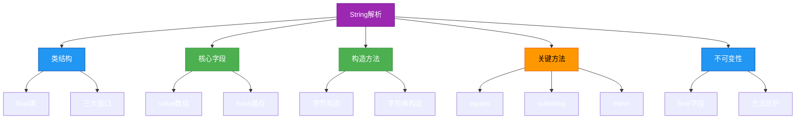
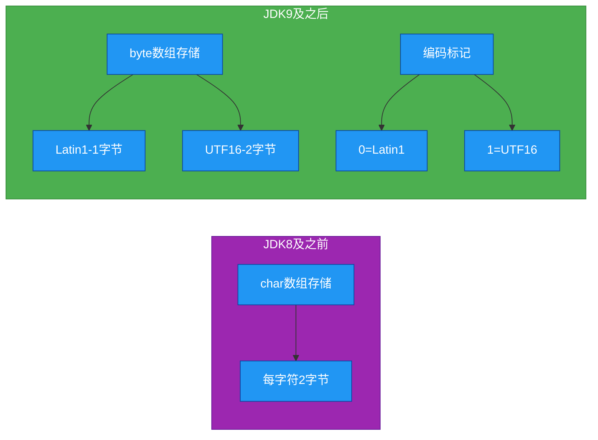
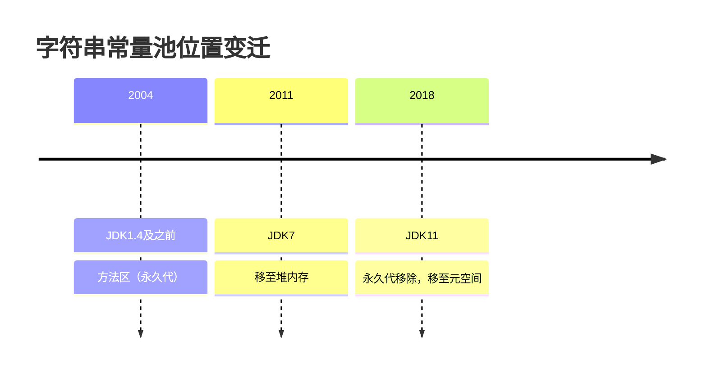

# 1.2.6 字符串源码解读


## 概述
Java中的`String`类是最常用的类之一，其源码实现蕴含了丰富的设计思想和性能优化技巧。本章将深入JDK源码，剖析`String`类的内部结构、核心方法实现、不可变性机制以及字符串常量池的工作原理。通过对源码的解读，帮助开发者理解`String`类的底层实现，掌握字符串操作的性能特性，避免常见的使用误区，并能在实际开发中做出更合理的技术选择。



## 知识要点
### 2.1 String类的定义与结构
#### 2.1.1 类定义与继承关系
```java
// JDK8 String类定义
gpublic final class String
    implements java.io.Serializable, Comparable<String>, CharSequence {
    // 类主体
}
```

关键特性：
- 使用`final`修饰，不能被继承
- 实现`Serializable`接口，支持序列化
- 实现`Comparable`接口，支持自然排序
- 实现`CharSequence`接口，提供字符序列操作

#### 2.1.2 核心字段（JDK8）
```java
// 存储字符串的字符数组，使用final修饰确保不可变性
private final char value[];

// 缓存字符串的哈希码，默认为0
private int hash; // Default to 0

// 序列化版本号
private static final long serialVersionUID = -6849794470754667710L;

// 用于支持字符串拼接的特殊构造方法标记
private static final ObjectStreamField[] serialPersistentFields = new ObjectStreamField[0];
```

#### 2.1.3 JDK9及以上版本的结构变化
JDK9对String的实现进行了优化，将存储结构从`char[]`改为`byte[]`，并增加了编码标识：
```java
// JDK9+ String类核心字段
private final byte[] value;

// 编码标识：0-Latin-1(单字节), 1-UTF-16(双字节)
private final byte coder;

// 哈希码缓存
private int hash;
```

优化原因：
- 大多数字符串使用Latin-1字符集，每个字符仅需1个字节
- 相比char[]节省50%的内存空间
- 保留UTF-16支持以处理复杂字符



### 2.2 构造方法实现
String类提供了多种构造方法，用于从不同数据源创建字符串对象。

#### 2.2.1 常用构造方法（JDK8）
```java
// 1. 无参构造方法（已过时，JDK1.1引入，JDK9标记为过时）
@Deprecated(since="9")
public String() {
    this.value = "".value;
}

// 2. 通过char数组创建
public String(char value[]) {
    this.value = Arrays.copyOf(value, value.length);
}

// 3. 通过char数组指定范围创建
public String(char value[], int offset, int count) {
    // 边界检查
    if (offset < 0) {
        throw new StringIndexOutOfBoundsException(offset);
    }
    if (count <= 0) {
        if (count < 0) {
            throw new StringIndexOutOfBoundsException(count);
        }
        if (offset <= value.length) {
            this.value = "".value;
            return;
        }
    }
    // Note: offset or count might be near -1>>>1.
    if (offset > value.length - count) {
        throw new StringIndexOutOfBoundsException(offset + count);
    }
    this.value = Arrays.copyOfRange(value, offset, offset+count);
}

// 4. 通过String对象创建（字符串常量池相关）
public String(String original) {
    this.value = original.value;
    this.hash = original.hash;
}
```

#### 2.2.2 构造方法的深拷贝特性
String构造方法对传入的数组参数进行深拷贝，确保外部数组修改不会影响String内部：
```java
public class StringConstructorDemo {
    public static void main(String[] args) {
        char[] arr = {'h', 'e', 'l', 'l', 'o'};
        String str = new String(arr);
        arr[0] = 'H'; // 修改原数组
        System.out.println(str); // 输出"hello"，不受原数组修改影响
    }
}
```

### 2.3 核心方法源码解析
#### 2.3.1 equals()方法
String重写了Object的equals()方法，基于字符序列比较：
```java
public boolean equals(Object anObject) {
    // 1. 引用相同对象，直接返回true
    if (this == anObject) {
        return true;
    }
    // 2. 检查是否为String类型
    if (anObject instanceof String) {
        String anotherString = (String)anObject;
        int n = value.length;
        // 3. 长度相同才继续比较
        if (n == anotherString.value.length) {
            char v1[] = value;
            char v2[] = anotherString.value;
            int i = 0;
            // 4. 逐个字符比较
            while (n-- != 0) {
                if (v1[i] != v2[i])
                    return false;
                i++;
            }
            return true;
        }
    }
    return false;
}
```

性能特点：
- 时间复杂度：O(n)，n为字符串长度
- 短路比较：发现第一个不同字符立即返回
- 先比较引用，再比较类型，最后比较内容

#### 2.3.2 hashCode()方法
String重写了Object的hashCode()方法，基于字符序列计算哈希值：
```java
public int hashCode() {
    int h = hash;
    if (h == 0 && value.length > 0) {
        char val[] = value;
        // 哈希计算公式：s[0]*31^(n-1) + s[1]*31^(n-2) + ... + s[n-1]
        for (int i = 0; i < value.length; i++) {
            h = 31 * h + val[i];
        }
        hash = h;
    }
    return h;
}
```

选择31作为乘数的原因：
- 31是一个奇素数，减少哈希碰撞
- 31 = 2^5 - 1，编译器可优化为位运算：31 * i = (i << 5) - i
- 历史原因，早期Java实现选择后一直沿用

#### 2.3.3 substring()方法
JDK6与JDK7+的substring实现有显著差异：

**JDK6实现（存在内存泄漏风险）**：
```java
public String substring(int beginIndex, int endIndex) {
    // 直接使用原字符数组的引用
    return new String(offset + beginIndex, endIndex - beginIndex, value);
}
```

**JDK7+实现（解决内存泄漏问题）**：
```java
public String substring(int beginIndex, int endIndex) {
    // 边界检查
    if (beginIndex < 0) {
        throw new StringIndexOutOfBoundsException(beginIndex);
    }
    if (endIndex > value.length) {
        throw new StringIndexOutOfBoundsException(endIndex);
    }
    int subLen = endIndex - beginIndex;
    if (subLen < 0) {
        throw new StringIndexOutOfBoundsException(subLen);
    }
    // 创建新的字符数组
    return ((beginIndex == 0) && (endIndex == value.length)) ? this
        : new String(value, beginIndex, subLen);
}
```

JDK7改进原因：
- 原实现会导致小字符串引用大字符数组，造成内存泄漏
- 新实现通过Arrays.copyOfRange创建新数组，切断对原数组的引用

#### 2.3.4 intern()方法
intern()方法用于将字符串加入常量池并返回池中的引用：
```java
public native String intern();
```

这是一个本地方法，其实现与字符串常量池密切相关：
- 如果常量池中已存在该字符串，返回池中的引用
- 如果不存在，将当前字符串加入常量池并返回其引用

JDK6与JDK7+的intern()差异：
- JDK6：常量池在永久代，intern()会复制字符串到永久代
- JDK7+：常量池在堆中，intern()不会复制字符串，仅记录引用

### 2.4 不可变性机制
String的不可变性是通过多重机制保证的：

#### 2.4.1 不可变性的实现方式
1. **char数组使用final修饰**：value数组引用不可变
2. **无修改数组的方法**：String类没有提供修改value数组的方法
3. **私有字段**：value数组是private的，外部无法直接访问
4. **防御性拷贝**：构造方法接收外部数组时进行深拷贝

```java
// String类中没有类似setCharAt()的修改方法
// 所有"修改"操作都会创建新的String对象
public String toUpperCase() {
    // ... 创建新字符串的逻辑 ...
}
```

#### 2.4.2 不可变性的好处
1. **线程安全**：不可变对象天然线程安全
2. **常量池优化**：可在常量池中共享相同字符串
3. **哈希码缓存**：hashCode可缓存，提升Map等集合性能
4. **安全性**：作为参数传递时不会被修改

### 2.5 字符串常量池实现
字符串常量池是JVM为优化字符串性能而设计的缓存机制。

#### 2.5.1 常量池存储位置变迁


#### 2.5.2 字符串创建与常量池交互
```java
public class StringPoolDemo {
    public static void main(String[] args) {
        // 直接赋值：使用常量池中的对象
        String s1 = "abc";
        String s2 = "abc";
        System.out.println(s1 == s2); // true，引用同一对象
        
        // new关键字：在堆中创建新对象
        String s3 = new String("abc");
        System.out.println(s1 == s3); // false，引用不同对象
        
        // intern()方法：强制使用常量池
        String s4 = s3.intern();
        System.out.println(s1 == s4); // true，引用常量池对象
    }
}
```

#### 2.5.3 字符串拼接与常量池
```java
public class StringConcatenationDemo {
    public static void main(String[] args) {
        String s1 = "a";
        String s2 = "b";
        String s3 = "ab";
        
        // 编译期优化：等同于"ab"
        String s4 = "a" + "b";
        System.out.println(s3 == s4); // true
        
        // 运行期拼接：new String("ab")
        String s5 = s1 + s2;
        System.out.println(s3 == s5); // false
        
        // final变量拼接：编译期优化
        final String s6 = "a";
        final String s7 = "b";
        String s8 = s6 + s7;
        System.out.println(s3 == s8); // true
    }
}
```

## 知识扩展
### 3.1 设计思想
#### 3.1.1 不可变对象设计模式
String类是不可变对象设计模式的经典实现，遵循以下原则：
- 类声明为final，避免被继承
- 所有字段声明为private final
- 不提供修改内部状态的方法
- 对可变对象参数进行防御性拷贝
- 返回副本而非原对象引用

不可变模式的适用场景：
- 字符串、数值等基础数据类型
- 多线程环境下的共享对象
- 哈希表的键（Key）
- 常量值

#### 3.1.2 享元模式在常量池中的应用
字符串常量池采用享元模式（Flyweight Pattern）优化内存使用：
- 共享：相同字符串只存储一份
- 细粒度：字符串是最小粒度的共享单位
- 外部状态：通过String.intern()控制是否共享

### 3.2 性能优化
#### 3.2.1 字符串拼接性能对比
| 拼接方式 | 原理 | 性能 | 适用场景 |
|---------|------|------|---------|
| + 运算符 | 编译期转换为StringBuilder | 中等 | 少量、简单拼接 |
| StringBuilder | 可变字符序列，无同步 | 高 | 单线程大量拼接 |
| StringBuffer | 可变字符序列，有同步 | 中 | 多线程拼接 |
| String.join() | 内部使用StringJoiner | 中 | 集合元素拼接 |

#### 3.2.2 合理使用intern()方法
intern()使用建议：
- 对频繁出现的字符串（如数据库表名、配置项）使用intern()
- 避免对长字符串使用intern()，可能导致常量池膨胀
- JDK7+中，intern()性能优于JDK6，可适当使用

性能测试示例：
```java
public class InternPerformanceTest {
    public static void main(String[] args) {
        int iterations = 1000000;
        
        // 不使用intern()
        long start = System.currentTimeMillis();
        for (int i = 0; i < iterations; i++) {
            String s = new String("test" + i % 100);
        }
        long noInternTime = System.currentTimeMillis() - start;
        
        // 使用intern()
        start = System.currentTimeMillis();
        for (int i = 0; i < iterations; i++) {
            String s = new String(
```