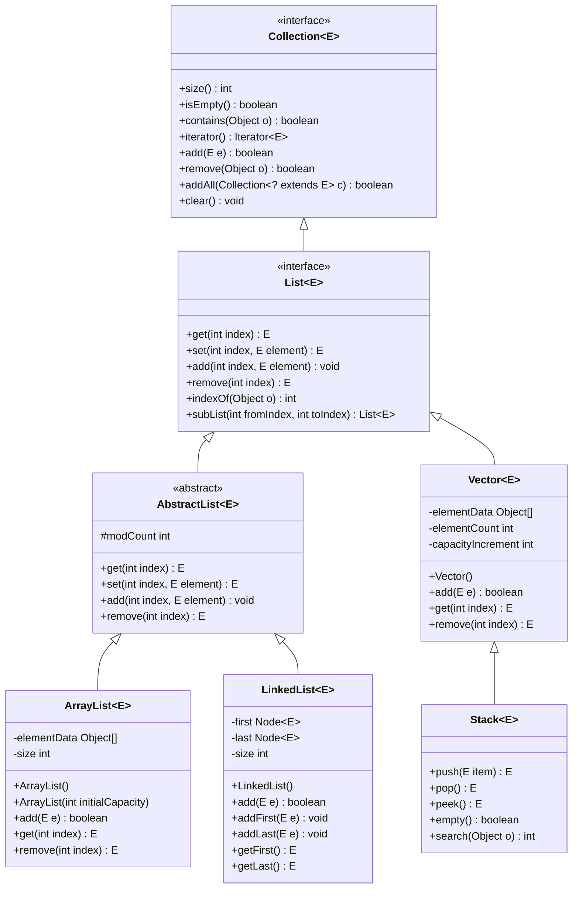
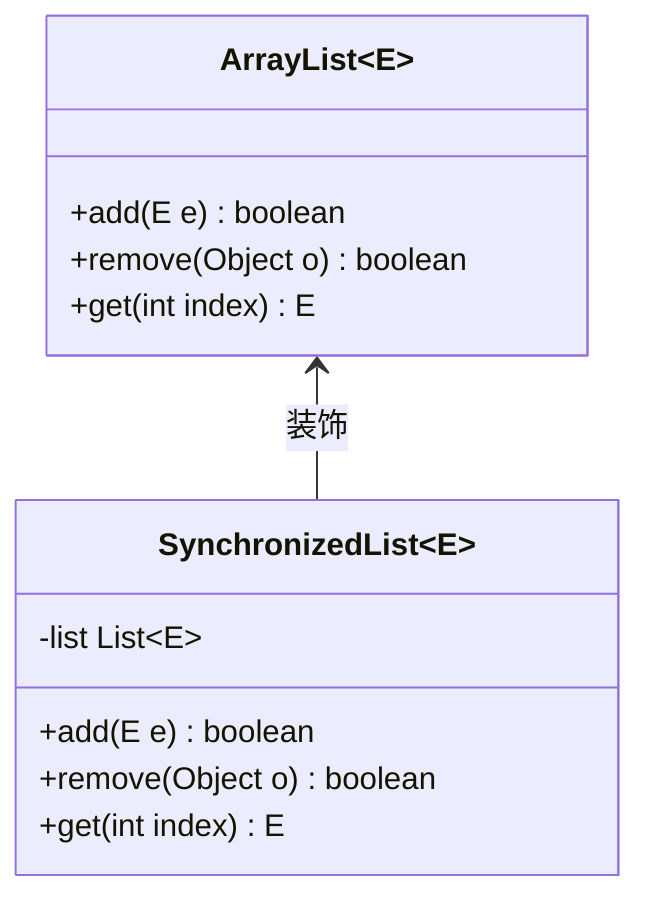

# 1.3.1 集合-List

## 核心理论

### 1.1 List接口概述

List是Java集合框架中最基础的有序集合接口，继承自Collection接口，具有以下核心特性：
- **有序性**：元素按插入顺序排列，支持通过索引访问
- **可重复性**：允许存储重复元素
- **动态容量**：相比数组，无需在创建时指定固定大小
- **泛型支持**：支持泛型编程，提供类型安全

List接口的定义如下：
```java
public interface List<E> extends Collection<E> {
    // 基本操作
    int size();
    boolean isEmpty();
    boolean contains(Object o);
    Iterator<E> iterator();
    Object[] toArray();
    <T> T[] toArray(T[] a);
    boolean add(E e);
    boolean remove(Object o);
    boolean containsAll(Collection<?> c);
    boolean addAll(Collection<? extends E> c);
    boolean addAll(int index, Collection<? extends E> c);
    boolean removeAll(Collection<?> c);
    boolean retainAll(Collection<?> c);
    void clear();
    boolean equals(Object o);
    int hashCode();
    
    // List特有操作
    E get(int index);
    E set(int index, E element);
    void add(int index, E element);
    E remove(int index);
    int indexOf(Object o);
    int lastIndexOf(Object o);
    ListIterator<E> listIterator();
    ListIterator<E> listIterator(int index);
    List<E> subList(int fromIndex, int toIndex);
}
```

### 1.2 List接口的继承体系



### 1.3 主要实现类对比

| 实现类 | 底层数据结构 | 线程安全 | 随机访问 | 插入删除 | 内存占用 | 初始容量 | 扩容机制 |
|-------|------------|---------|---------|---------|---------|---------|---------|
| ArrayList | 动态数组 | 否 | 快(O(1)) | 慢(O(n)) | 低 | 10 | 1.5倍扩容 |
| LinkedList | 双向链表 | 否 | 慢(O(n)) | 快(O(1)) | 高 | - | 无需扩容 |
| Vector | 动态数组 | 是 | 快(O(1)) | 慢(O(n)) | 中 | 10 | 2倍扩容 |
| Stack | 动态数组 | 是 | 快(O(1)) | 慢(O(n)) | 中 | 10 | 2倍扩容 |

### 1.4 底层数据结构详解

#### 1.4.1 ArrayList的动态数组

ArrayList基于动态数组实现，其核心是维护一个Object类型的数组`elementData`：
- **初始容量**：默认10（JDK 7+）
- **扩容阈值**：当元素数量达到容量时触发扩容
- **扩容机制**：新容量 = 旧容量 + (旧容量 >> 1)，即1.5倍扩容
- **空间浪费**：可能存在未使用的数组空间

JDK 8中ArrayList的关键源码：
```java
// 默认初始容量
private static final int DEFAULT_CAPACITY = 10;
// 空数组实例
private static final Object[] DEFAULTCAPACITY_EMPTY_ELEMENTDATA = {};
// 存储元素的数组
transient Object[] elementData;
// 元素数量
private int size;

// 构造函数
public ArrayList() {
    this.elementData = DEFAULTCAPACITY_EMPTY_ELEMENTDATA;
}

// 添加元素
public boolean add(E e) {
    ensureCapacityInternal(size + 1);  // 确保容量
    elementData[size++] = e;
    return true;
}

// 扩容核心方法
private void ensureCapacityInternal(int minCapacity) {
    if (elementData == DEFAULTCAPACITY_EMPTY_ELEMENTDATA) {
        minCapacity = Math.max(DEFAULT_CAPACITY, minCapacity);
    }
    ensureExplicitCapacity(minCapacity);
}

private void ensureExplicitCapacity(int minCapacity) {
    modCount++;
    if (minCapacity - elementData.length > 0)
        grow(minCapacity);
}

// 实际扩容方法
private void grow(int minCapacity) {
    int oldCapacity = elementData.length;
    int newCapacity = oldCapacity + (oldCapacity >> 1); // 1.5倍扩容
    if (newCapacity - minCapacity < 0)
        newCapacity = minCapacity;
    if (newCapacity - MAX_ARRAY_SIZE > 0)
        newCapacity = hugeCapacity(minCapacity);
    // 数组复制
    elementData = Arrays.copyOf(elementData, newCapacity);
}
```

#### 1.4.2 LinkedList的双向链表

LinkedList基于双向链表实现，每个节点包含前驱节点、后继节点和数据：
```java
private static class Node<E> {
    E item;
    Node<E> next;
    Node<E> prev;

    Node(Node<E> prev, E element, Node<E> next) {
        this.item = element;
        this.next = next;
        this.prev = prev;
    }
}
```

LinkedList同时实现了Deque接口，因此可以作为双端队列使用，提供了高效的首尾操作：
- `addFirst(E e)`/`offerFirst(E e)`：在头部添加元素
- `addLast(E e)`/`offerLast(E e)`：在尾部添加元素
- `getFirst()`/`peekFirst()`：获取头部元素
- `getLast()`/`peekLast()`：获取尾部元素
- `removeFirst()`/`pollFirst()`：删除头部元素
- `removeLast()`/`pollLast()`：删除尾部元素

### 1.5 List接口的JDK版本特性

| JDK版本 | 新增特性 |
|--------|---------|
| JDK 1.2 | 引入List接口及ArrayList、LinkedList、Vector |
| JDK 1.4 | 引入ListIterator，支持双向遍历 |
| JDK 5 | 支持泛型、增强for循环 |
| JDK 8 | 引入stream()、forEach()、removeIf()等函数式方法 |
| JDK 9 | 引入of()方法创建不可变List |
| JDK 10 | 引入copyOf()方法创建不可变副本 |
| JDK 16 | 引入toArray(IntFunction<T[]> generator)方法 |

不可变List示例（JDK 9+）：
```java
// 创建不可变List
List<String> immutableList = List.of("a", "b", "c");
// 创建现有集合的不可变副本
List<String> copy = List.copyOf(immutableList);
```

## 代码实践

### 2.1 List的初始化与基本操作

#### 2.1.1 初始化方式对比

```java
import java.util.ArrayList;
import java.util.Arrays;
import java.util.LinkedList;
import java.util.List;

public class ListInitialization {
    public static void main(String[] args) {
        // 1. 无初始元素
        List<String> arrayList1 = new ArrayList<>();
        List<String> linkedList1 = new LinkedList<>();
        
        // 2. 指定初始容量（仅ArrayList适用）
        List<String> arrayList2 = new ArrayList<>(20);
        
        // 3. 从现有集合初始化
        List<String> arrayList3 = new ArrayList<>(Arrays.asList("a", "b", "c"));
        List<String> linkedList2 = new LinkedList<>(Arrays.asList("x", "y", "z"));
        
        // 4. JDK 9+ of()方法创建不可变List
        List<String> immutableList = List.of("1", "2", "3");
        
        // 5. 使用匿名内部类（不推荐）
        List<String> anonymousList = new ArrayList<String>() {{
            add("one");
            add("two");
            add("three");
        }};
    }
}
```

#### 2.1.2 常用操作示例

```java
import java.util.ArrayList;
import java.util.List;

/**
 * List常用操作示例
 */
public class ListCommonOperations {
    public static void main(String[] args) {
        List<String> fruits = new ArrayList<>();
        
        // 添加元素
        fruits.add("Apple");
        fruits.add("Banana");
        fruits.add("Cherry");
        System.out.println("添加元素后: " + fruits); // [Apple, Banana, Cherry]
        
        // 在指定位置添加元素
        fruits.add(1, "Blueberry");
        System.out.println("指定位置添加后: " + fruits); // [Apple, Blueberry, Banana, Cherry]
        
        // 获取元素
        String firstFruit = fruits.get(0);
        System.out.println("第一个元素: " + firstFruit); // Apple
        
        // 修改元素
        fruits.set(2, "Blackberry");
        System.out.println("修改元素后: " + fruits); // [Apple, Blueberry, Blackberry, Cherry]
        
        // 查找元素索引
        int index = fruits.indexOf("Cherry");
        System.out.println("Cherry的索引: " + index); // 3
        
        // 判断是否包含元素
        boolean contains = fruits.contains("Apple");
        System.out.println("是否包含Apple: " + contains); // true
        
        // 删除元素
        fruits.remove(1); // 按索引删除
        System.out.println("按索引删除后: " + fruits); // [Apple, Blackberry, Cherry]
        
        fruits.remove("Cherry"); // 按元素删除
        System.out.println("按元素删除后: " + fruits); // [Apple, Blackberry]
        
        // 获取子列表
        List<String> subList = fruits.subList(0, 1);
        System.out.println("子列表: " + subList); // [Apple]
        
        // 清空列表
        fruits.clear();
        System.out.println("清空后: " + fruits); // []
        System.out.println("是否为空: " + fruits.isEmpty()); // true
    }
}
```

### 2.2 List的遍历方式

```java
import java.util.ArrayList;
import java.util.Iterator;
import java.util.List;
import java.util.ListIterator;

/**
 * List遍历方式对比
 */
public class ListTraversal {
    public static void main(String[] args) {
        List<String> languages = new ArrayList<>();
        languages.add("Java");
        languages.add("Python");
        languages.add("C++");
        languages.add("JavaScript");
        languages.add("Go");
        
        // 1. 普通for循环
        System.out.println("普通for循环:");
        for (int i = 0; i < languages.size(); i++) {
            System.out.println(languages.get(i));
        }
        
        // 2. 增强for循环
        System.out.println("\n增强for循环:");
        for (String lang : languages) {
            System.out.println(lang);
        }
        
        // 3. Iterator迭代器
        System.out.println("\nIterator迭代器:");
        Iterator<String> iterator = languages.iterator();
        while (iterator.hasNext()) {
            System.out.println(iterator.next());
        }
        
        // 4. ListIterator双向迭代器
        System.out.println("\nListIterator正向遍历:");
        ListIterator<String> listIterator = languages.listIterator();
        while (listIterator.hasNext()) {
            System.out.println(listIterator.next());
        }
        
        System.out.println("\nListIterator反向遍历:");
        while (listIterator.hasPrevious()) {
            System.out.println(listIterator.previous());
        }
        
        // 5. forEach()方法 (JDK 8+)
        System.out.println("\nforEach()方法:");
        languages.forEach(System.out::println);
        
        // 6. stream流 (JDK 8+)
        System.out.println("\nstream流:");
        languages.stream().forEach(System.out::println);
    }
}
```

### 2.3 List的排序与查找

```java
import java.util.ArrayList;
import java.util.Collections;
import java.util.Comparator;
import java.util.List;

/**
 * List排序与查找示例
 */
public class ListSortAndSearch {
    public static void main(String[] args) {
        // 创建并初始化列表
        List<Integer> numbers = new ArrayList<>();
        numbers.add(3);
        numbers.add(1);
        numbers.add(4);
        numbers.add(1);
        numbers.add(5);
        numbers.add(9);
        numbers.add(2);
        numbers.add(6);
        
        System.out.println("原始列表: " + numbers);
        
        // 1. 自然排序 (升序)
        Collections.sort(numbers);
        System.out.println("自然排序后: " + numbers);
        
        // 2. 自定义排序 (降序)
        Collections.sort(numbers, Collections.reverseOrder());
        System.out.println("降序排序后: " + numbers);
        
        // 3. 使用Comparator排序 (JDK 8+ Lambda)
        numbers.sort((a, b) -> a.compareTo(b)); // 升序
        System.out.println("Lambda升序排序: " + numbers);
        
        // 4. 查找元素 (二分查找，必须先排序)
        int index = Collections.binarySearch(numbers, 5);
        System.out.println("元素5的索引: " + index);
        
        // 5. 查找最大值和最小值
        Integer max = Collections.max(numbers);
        Integer min = Collections.min(numbers);
        System.out.println("最大值: " + max + ", 最小值: " + min);
        
        // 6. 打乱列表顺序
        Collections.shuffle(numbers);
        System.out.println("打乱后: " + numbers);
    }
}
```

### 2.4 ArrayList与LinkedList性能对比

```java
import java.util.ArrayList;
import java.util.LinkedList;
import java.util.List;

/**
 * ArrayList与LinkedList性能对比测试
 */
public class ListPerformanceComparison {
    private static final int ELEMENT_COUNT = 100000;
    private static final int TEST_ROUNDS = 10;
    
    public static void main(String[] args) {
        // 测试添加性能
        testAddPerformance();
        
        // 测试访问性能
        testAccessPerformance();
        
        // 测试删除性能
        testRemovePerformance();
    }
    
    /**
     * 测试添加元素性能
     */
    private static void testAddPerformance() {
        System.out.println("=== 添加性能测试 ===");
        
        // 测试尾部添加
        long arrayListAddLastTime = testAdd(new ArrayList<>(), true);
        long linkedListAddLastTime = testAdd(new LinkedList<>(), true);
        
        // 测试头部添加
        long arrayListAddFirstTime = testAdd(new ArrayList<>(), false);
        long linkedListAddFirstTime = testAdd(new LinkedList<>(), false);
        
        System.out.println("尾部添加 - ArrayList: " + arrayListAddLastTime + "ms");
        System.out.println("尾部添加 - LinkedList: " + linkedListAddLastTime + "ms");
        System.out.println("头部添加 - ArrayList: " + arrayListAddFirstTime + "ms");
        System.out.println("头部添加 - LinkedList: " + linkedListAddFirstTime + "ms");
    }
    
    /**
     * 测试访问元素性能
     */
    private static void testAccessPerformance() {
        System.out.println("\n=== 访问性能测试 ===");
        
        List<Integer> arrayList = new ArrayList<>();
        List<Integer> linkedList = new LinkedList<>();
        
        // 初始化数据
        for (int i = 0; i < ELEMENT_COUNT; i++) {
            arrayList.add(i);
            linkedList.add(i);
        }
        
        // 测试随机访问
        long arrayListAccessTime = 0;
        long linkedListAccessTime = 0;
        
        for (int r = 0; r < TEST_ROUNDS; r++) {
            long startTime = System.currentTimeMillis();
            for (int i = 0; i < ELEMENT_COUNT; i++) {
                arrayList.get(i);
            }
            arrayListAccessTime += System.currentTimeMillis() - startTime;
            
            startTime = System.currentTimeMillis();
            for (int i = 0; i < ELEMENT_COUNT; i++) {
                linkedList.get(i);
            }
            linkedListAccessTime += System.currentTimeMillis() - startTime;
        }
        
        System.out.println("随机访问 - ArrayList: " + (arrayListAccessTime / TEST_ROUNDS) + "ms");
        System.out.println("随机访问 - LinkedList: " + (linkedListAccessTime / TEST_ROUNDS) + "ms");
    }
    
    /**
     * 测试删除元素性能
     */
    private static void testRemovePerformance() {
        System.out.println("\n=== 删除性能测试 ===");
        
        // 测试尾部删除
        long arrayListRemoveLastTime = testRemove(new ArrayList<>(), true);
        long linkedListRemoveLastTime = testRemove(new LinkedList<>(), true);
        
        // 测试头部删除
        long arrayListRemoveFirstTime = testRemove(new ArrayList<>(), false);
        long linkedListRemoveFirstTime = testRemove(new LinkedList<>(), false);
        
        System.out.println("尾部删除 - ArrayList: " + arrayListRemoveLastTime + "ms");
        System.out.println("尾部删除 - LinkedList: " + linkedListRemoveLastTime + "ms");
        System.out.println("头部删除 - ArrayList: " + arrayListRemoveFirstTime + "ms");
        System.out.println("头部删除 - LinkedList: " + linkedListRemoveFirstTime + "ms");
    }
    
    /**
     * 测试添加元素
     * @param list 要测试的列表
     * @param addLast 是否添加到尾部
     * @return 耗时(毫秒)
     */
    private static long testAdd(List<Integer> list, boolean addLast) {
        long totalTime = 0;
        
        for (int r = 0; r < TEST_ROUNDS; r++) {
            list.clear();
            long startTime = System.currentTimeMillis();
            
            for (int i = 0; i < ELEMENT_COUNT; i++) {
                if (addLast) {
                    list.add(i); // 尾部添加
                } else {
                    list.add(0, i); // 头部添加
                }
            }
            
            totalTime += System.currentTimeMillis() - startTime;
        }
        
        return totalTime / TEST_ROUNDS;
    }
    
    /**
     * 测试删除元素
     * @param list 要测试的列表
     * @param removeLast 是否从尾部删除
     * @return 耗时(毫秒)
     */
    private static long testRemove(List<Integer> list, boolean removeLast) {
        long totalTime = 0;
        
        for (int r = 0; r < TEST_ROUNDS; r++) {
            // 初始化数据
            list.clear();
            for (int i = 0; i < ELEMENT_COUNT; i++) {
                list.add(i);
            }
            
            long startTime = System.currentTimeMillis();
            
            while (!list.isEmpty()) {
                if (removeLast) {
                    list.remove(list.size() - 1); // 尾部删除
                } else {
                    list.remove(0); // 头部删除
                }
            }
            
            totalTime += System.currentTimeMillis() - startTime;
        }
        
        return totalTime / TEST_ROUNDS;
    }
}
```

### 2.5 线程安全的List实现

```java
import java.util.ArrayList;
import java.util.Collections;
import java.util.List;
import java.util.Vector;
import java.util.concurrent.CopyOnWriteArrayList;

/**
 * 线程安全的List实现对比
 */
public class ThreadSafeListExamples {
    public static void main(String[] args) {
        // 1. Vector (古老的线程安全实现)
        List<String> vector = new Vector<>();
        
        // 2. 使用Collections.synchronizedList()包装
        List<String> synchronizedList = Collections.synchronizedList(new ArrayList<>());
        
        // 3. CopyOnWriteArrayList (JDK 5+ 并发容器)
        List<String> cowList = new CopyOnWriteArrayList<>();
        
        // 使用示例
        threadSafeListDemo(cowList);
    }
    
    /**
     * 演示线程安全List的使用
     */
    private static void threadSafeListDemo(List<String> list) {
        // 创建多个线程同时操作列表
        Runnable task = () -> {
            for (int i = 0; i < 1000; i++) {
                list.add(Thread.currentThread().getName() + ": " + i);
            }
        };
        
        // 启动10个线程
        Thread[] threads = new Thread[10];
        for (int i = 0; i < threads.length; i++) {
            threads[i] = new Thread(task, "Thread-" + i);
            threads[i].start();
        }
        
        // 等待所有线程完成
        try {
            for (Thread thread : threads) {
                thread.join();
            }
        } catch (InterruptedException e) {
            Thread.currentThread().interrupt();
            return;
        }
        
        System.out.println("列表大小: " + list.size());
        System.out.println("预期大小: 10000");
    }
}
```

### 2.6 List的高级操作（JDK 8+）

```java
import java.util.ArrayList;
import java.util.List;
import java.util.stream.Collectors;

/**
 * List的高级操作示例 (JDK 8+)
 */
public class ListAdvancedOperations {
    public static void main(String[] args) {
        List<Person> people = new ArrayList<>();
        people.add(new Person("张三", 25, "男", "北京"));
        people.add(new Person("李四", 30, "男", "上海"));
        people.add(new Person("王五", 28, "女", "广州"));
        people.add(new Person("赵六", 35, "男", "北京"));
        people.add(new Person("钱七", 22, "女", "深圳"));
        
        // 1. 过滤 (年龄大于等于28岁)
        List<Person> adults = people.stream()
                .filter(person -> person.getAge() >= 28)
                .collect(Collectors.toList());
        System.out.println("年龄大于等于28岁的人: " + adults);
        
        // 2. 映射 (提取所有人名)
        List<String> names = people.stream()
                .map(Person::getName)
                .collect(Collectors.toList());
        System.out.println("所有人名: " + names);
        
        // 3. 排序 (按年龄升序)
        List<Person> sortedByAge = people.stream()
                .sorted((p1, p2) -> p1.getAge() - p2.getAge())
                .collect(Collectors.toList());
        System.out.println("按年龄排序: " + sortedByAge);
        
        // 4. 分组 (按城市分组)
        java.util.Map<String, List<Person>> groupedByCity = people.stream()
                .collect(Collectors.groupingBy(Person::getCity));
        System.out.println("按城市分组: " + groupedByCity);
        
        // 5. 聚合 (计算平均年龄)
        double averageAge = people.stream()
                .mapToInt(Person::getAge)
                .average()
                .orElse(0);
        System.out.println("平均年龄: " + averageAge);
        
        // 6. 批量删除 (删除年龄小于25岁的人)
        people.removeIf(person -> person.getAge() < 25);
        System.out.println("删除年龄小于25岁后: " + people);
    }
    
    /**
     * 人员实体类
     */
    static class Person {
        private String name;
        private int age;
        private String gender;
        private String city;
        
        public Person(String name, int age, String gender, String city) {
            this.name = name;
            this.age = age;
            this.gender = gender;
            this.city = city;
        }
        
        // Getters and toString
        public String getName() { return name; }
        public int getAge() { return age; }
        public String getGender() { return gender; }
        public String getCity() { return city; }
        
        @Override
        public String toString() {
            return name + "(" + age + ")";
        }
    }
}
```

## 设计思想

### 3.1 接口与实现分离原则

List接口体现了Java集合框架的核心设计思想——**接口与实现分离**：
- **接口层**：定义了List的行为规范（如add、remove、get等方法）
- **实现层**：提供不同的数据结构实现（动态数组、链表等）

这种设计带来的好处：
1. **灵活性**：同一接口可有多种实现，适应不同场景
2. **可替换性**：更换实现类无需修改使用接口的代码
3. **扩展性**：可以轻松添加新的实现类

### 3.2 迭代器模式

List接口继承了Iterable接口，支持迭代器模式，提供了统一的遍历方式：
- **Iterator**：支持单向遍历和删除操作
- **ListIterator**：支持双向遍历、添加、修改操作

迭代器模式的优势：
- **简化遍历**：统一的遍历接口，无需关注底层数据结构
- **解耦**：遍历逻辑与集合实现分离
- **支持并发修改检测**：通过modCount机制检测并发修改

### 3.3 动态数组与链表的设计权衡

ArrayList和LinkedList代表了两种经典的数据结构设计，体现了**时间与空间的权衡**：

#### ArrayList的设计思想
- **空间局部性**：数组元素连续存储，充分利用CPU缓存
- **预分配与扩容**：通过预分配空间减少频繁扩容开销
- **随机访问优化**：通过索引直接访问，时间复杂度O(1)

#### LinkedList的设计思想
- **非连续存储**：元素分散存储，无需连续内存空间
- **节点复用**：通过节点引用连接，插入删除无需移动大量元素
- **双端队列支持**：可高效实现栈、队列等数据结构

### 3.4 不可变集合设计

JDK 9引入的不可变List设计体现了**不可变对象模式**：
- **安全性**：不可变对象天然线程安全
- **简洁性**：API简洁，无需考虑并发修改
- **性能优化**：可共享内部数据结构，节省内存

不可变List的实现原理：
- 没有提供修改方法（add、remove等）
- 内部数组使用final修饰
- 对修改操作抛出UnsupportedOperationException

### 3.5 装饰器模式

Collections.synchronizedList()使用了装饰器模式：
- **透明增强**：不改变原有类，动态添加功能（线程安全）
- **职责单一**：原有类专注于数据存储，装饰器专注于同步控制
- **灵活组合**：可叠加多个装饰器，实现多种功能组合



## 避坑指南

### 4.1 常见异常及解决方案

#### 4.1.1 ConcurrentModificationException（并发修改异常）

**产生原因**：在迭代过程中修改了集合结构（添加/删除元素）

```java
// 错误示例
List<String> list = new ArrayList<>(Arrays.asList("a", "b", "c"));
for (String s : list) {
    if (s.equals("b")) {
        list.remove(s); // 会抛出ConcurrentModificationException
    }
}
```

**解决方案**：
1. 使用迭代器的remove()方法
```java
Iterator<String> iterator = list.iterator();
while (iterator.hasNext()) {
    String s = iterator.next();
    if (s.equals("b")) {
        iterator.remove(); // 正确方式
    }
}
```

2. 使用Stream API的filter()方法
```java
list = list.stream().filter(s -> !s.equals("b")).collect(Collectors.toList());
```

3. 使用CopyOnWriteArrayList（适用于读多写少场景）
```java
List<String> list = new CopyOnWriteArrayList<>(Arrays.asList("a", "b", "c"));
for (String s : list) {
    if (s.equals("b")) {
        list.remove(s); // 不会抛出异常
    }
}
```

#### 4.1.2 IndexOutOfBoundsException（索引越界异常）

**产生原因**：访问了不存在的索引位置

```java
List<String> list = new ArrayList<>();
list.add("a");
String element = list.get(1); // 索引1不存在，抛出异常
```

**解决方案**：
1. 访问前检查索引范围
```java
if (index >= 0 && index < list.size()) {
    String element = list.get(index);
}
```

2. 使用增强for循环遍历，避免手动索引

#### 4.1.3 UnsupportedOperationException（不支持操作异常）

**产生原因**：对不可变集合执行修改操作

```java
List<String> list = List.of("a", "b", "c");
list.add("d"); // 抛出UnsupportedOperationException
```

**解决方案**：
1. 创建可变副本
```java
List<String> mutableList = new ArrayList<>(List.of("a", "b", "c"));
mutableList.add("d"); // 正常执行
```

### 4.2 ArrayList的性能陷阱

#### 4.2.1 频繁扩容问题

**问题**：当ArrayList元素数量接近容量时，会触发扩容，导致数组复制开销

**解决方案**：
1. 预估容量，初始化时指定合适大小
```java
List<String> list = new ArrayList<>(1000); // 已知需要存储约1000个元素
```

2. 使用ensureCapacity()提前扩容
```java
list.ensureCapacity(1000); // 提前扩容到至少1000容量
```

#### 4.2.2 数组复制开销

**问题**：add(int index, E element)和remove(int index)操作会导致大量元素移动

**解决方案**：
1. 频繁插入删除操作使用LinkedList
2. 批量添加使用addAll()方法
3. 考虑使用CopyOnWriteArrayList（读多写少场景）

#### 4.2.3 subList()方法的陷阱

**问题**：subList()返回的是原列表的视图，不是独立副本

```java
List<Integer> list = new ArrayList<>(Arrays.asList(1, 2, 3, 4, 5));
List<Integer> subList = list.subList(1, 4); // [2, 3, 4]
subList.clear(); // 会影响原列表
System.out.println(list); // [1, 5]
```

**解决方案**：创建独立副本
```java
List<Integer> subList = new ArrayList<>(list.subList(1, 4));
```

### 4.3 LinkedList的使用误区

#### 4.3.1 随机访问性能问题

**问题**：LinkedList的get(int index)方法时间复杂度为O(n)

```java
List<String> linkedList = new LinkedList<>();
// 添加10000个元素...
for (int i = 0; i < linkedList.size(); i++) {
    String element = linkedList.get(i); // 性能极差，O(n²)时间复杂度
}
```

**解决方案**：
1. 需要随机访问时使用ArrayList
2. 遍历LinkedList使用迭代器或增强for循环

#### 4.3.2 作为队列使用的最佳实践

LinkedList实现了Queue接口，作为队列使用时应优先使用Queue接口方法：

| 操作 | 失败时抛出异常 | 失败时返回特殊值 |
|------|--------------|----------------| 
| 添加 | add(e) | offer(e) |
| 移除 | remove() | poll() |
| 查看 | element() | peek() |

**推荐使用offer/poll/peek方法**，避免抛出异常，代码更健壮。

### 4.4 线程安全问题

#### 4.4.1 ArrayList的线程不安全

**问题**：ArrayList在多线程环境下可能导致数据不一致、数组越界等问题

**解决方案**：
1. 使用Vector（不推荐，性能差）
2. 使用Collections.synchronizedList()
3. 使用CopyOnWriteArrayList（JDK 5+，推荐）
4. 使用ConcurrentLinkedQueue（如果用作队列）

#### 4.4.2 迭代器的弱一致性

**问题**：CopyOnWriteArrayList的迭代器是弱一致性的，不反映迭代过程中的修改

```java
CopyOnWriteArrayList<String> list = new CopyOnWriteArrayList<>(Arrays.asList("a", "b", "c"));
Iterator<String> iterator = list.iterator();
list.add("d");

while (iterator.hasNext()) {
    System.out.println(iterator.next()); // 不会输出"d"
}
```

**解决方案**：了解并接受这种特性，或在需要强一致性时使用其他同步机制。

## 深度思考题

### 思考题1：ArrayList和LinkedList的性能对比及适用场景

**问题**：详细对比ArrayList和LinkedList在不同操作（添加、删除、访问）上的性能差异，并分析各自的适用场景。

**思考题回答**：

ArrayList和LinkedList的性能差异主要源于其底层数据结构：

1. **添加操作**：
   - ArrayList尾部添加：O(1)（无扩容时），O(n)（需要扩容时）
   - ArrayList中间/头部添加：O(n)（需要移动元素）
   - LinkedList尾部/头部添加：O(1)
   - LinkedList中间添加：O(n)（需要遍历找到位置）

2. **删除操作**：
   - ArrayList尾部删除：O(1)
   - ArrayList中间/头部删除：O(n)（需要移动元素）
   - LinkedList尾部/头部删除：O(1)
   - LinkedList中间删除：O(n)（需要遍历找到位置）

3. **访问操作**：
   - ArrayList：O(1)（随机访问）
   - LinkedList：O(n)（顺序访问）

**适用场景**：
- **ArrayList**：适合频繁访问、较少插入删除的场景，如数据存储、查找为主的场景
- **LinkedList**：适合频繁在首尾插入删除、较少随机访问的场景，如实现队列、栈等数据结构

在大多数业务场景中，ArrayList的综合性能优于LinkedList，除非有大量的首尾操作。

### 思考题2：ArrayList的扩容机制及优化

**问题**：详细描述ArrayList的扩容机制，并探讨如何优化ArrayList在频繁添加大量元素时的性能。

**思考题回答**：

**ArrayList扩容机制**：
1. 初始容量：JDK 7+中，ArrayList默认初始容量为10，但在首次添加元素时才会初始化数组
2. 扩容阈值：当元素数量(size)达到当前容量时触发扩容
3. 扩容公式：新容量 = 旧容量 + (旧容量 >> 1)，即1.5倍扩容
4. 数组复制：使用Arrays.copyOf()方法将旧数组元素复制到新数组
5. 最大容量：Integer.MAX_VALUE - 8（避免内存溢出）

**性能优化策略**：
1. **预指定容量**：在已知元素数量时，创建ArrayList时指定初始容量
   ```java
   List<String> list = new ArrayList<>(1000); // 已知需要存储1000个元素
   ```

2. **批量添加**：使用addAll()方法代替多次add()，减少扩容次数
   ```java
   List<String> elements = ...; // 包含大量元素
   list.addAll(elements); // 一次添加
   ```

3. **提前扩容**：使用ensureCapacity(int minCapacity)方法提前扩容
   ```java
   list.ensureCapacity(1000); // 确保容量至少为1000
   ```

4. **使用合适的数据结构**：如果需要频繁添加大量元素，考虑使用LinkedList或ArrayDeque

5. **JDK版本选择**：JDK 8及以上版本对ArrayList的实现进行了优化，包括延迟初始化等

### 思考题3：如何实现一个线程安全的List

**问题**：除了使用Java提供的线程安全List实现，如何自己实现一个线程安全的List？比较不同实现方式的优缺点。

**思考题回答**：

实现线程安全的List主要有以下几种方式：

1. **同步方法**：对所有public方法添加synchronized修饰符
   ```java
   public class SynchronizedList<E> implements List<E> {
       private final List<E> list = new ArrayList<>();
       
       @Override
       public synchronized int size() {
           return list.size();
       }
       
       @Override
       public synchronized boolean add(E e) {
           return list.add(e);
       }
       
       // 其他方法...
   }
   ```
   **优点**：实现简单，安全性高
   **缺点**：并发性差，同一时间只能有一个线程访问

2. **同步代码块**：使用细粒度的同步代码块，减少锁竞争
   ```java
   public class FineGrainedSyncList<E> implements List<E> {
       private final List<E> list = new ArrayList<>();
       private final Object lock = new Object();
       
       @Override
       public int size() {
           synchronized (lock) {
               return list.size();
           }
       }
       
       @Override
       public boolean add(E e) {
           synchronized (lock) {
               return list.add(e);
           }
       }
       
       // 其他方法...
   }
   ```
   **优点**：可自定义锁对象，灵活性高
   **缺点**：并发性仍然受限

3. **读写锁**：使用ReentrantReadWriteLock分离读写操作，提高并发性
   ```java
   public class ReadWriteList<E> implements List<E> {
       private final List<E> list = new ArrayList<>();
       private final ReentrantReadWriteLock rwLock = new ReentrantReadWriteLock();
       private final Lock readLock = rwLock.readLock();
       private final Lock writeLock = rwLock.writeLock();
       
       @Override
       public int size() {
           readLock.lock();
           try {
               return list.size();
           } finally {
               readLock.unlock();
           }
       }
       
       @Override
       public boolean add(E e) {
           writeLock.lock();
           try {
               return list.add(e);
           } finally {
               writeLock.unlock();
           }
       }
       
       // 其他方法...
   }
   ```
   **优点**：读操作可并发执行，适合读多写少场景
   **缺点**：实现复杂，写操作仍需互斥

4. **Copy-On-Write**：写时复制，读操作无锁，写操作复制整个数组
   ```java
   public class CopyOnWriteList<E> implements List<E> {
       private volatile Object[] array;
       
       public CopyOnWriteList() {
           array = new Object[0];
       }
       
       @Override
       public boolean add(E e) {
           synchronized (this) {
               Object[] oldArray = array;
               int newLen = oldArray.length + 1;
               Object[] newArray = Arrays.copyOf(oldArray, newLen);
               newArray[newLen - 1] = e;
               array = newArray;
               return true;
           }
       }
       
       @Override
       public E get(int index) {
           return (E) array[index]; // 无锁读取
       }
       
       // 其他方法...
   }
   ```
   **优点**：读操作性能优异，无锁竞争
   **缺点**：写操作成本高，内存占用大，不保证实时一致性

**对比总结**：
- 同步方法/代码块：实现简单，适合并发量小的场景
- 读写锁：适合读多写少场景，平衡了性能和一致性
- Copy-On-Write：适合读操作远多于写操作的场景，如缓存

在实际开发中，推荐使用Java并发包提供的线程安全集合，如CopyOnWriteArrayList、ConcurrentLinkedQueue等，而非自己实现。

### 思考题4：List的排序算法实现

**问题**：Java中的Collections.sort()使用什么排序算法？分析其时间复杂度和空间复杂度，并探讨为什么选择这种算法。

**思考题回答**：

Java中的Collections.sort()方法在不同版本使用了不同的排序算法：

1. **JDK 6及之前**：使用**归并排序**（Merge Sort）
   - 时间复杂度：O(n log n)
   - 空间复杂度：O(n)
   - 特点：稳定排序，但需要额外空间

2. **JDK 7及之后**：使用**TimSort**算法
   - 时间复杂度：平均O(n log n)，最坏O(n log n)
   - 空间复杂度：O(n)
   - 特点：稳定排序，是归并排序和插入排序的混合体

**TimSort算法原理**：
TimSort是一种自适应的排序算法，它利用了数据可能已部分排序的特点：
1. 将数组分成多个"run"（连续的升序或降序序列）
2. 对每个run使用插入排序进行排序
3. 使用归并排序将多个run合并成最终有序数组
4. 优化合并过程，减少比较次数

**选择TimSort的原因**：
1. **实际性能优异**：在真实世界的数据中，很多数据都有部分有序的特性，TimSort能很好地利用这一点
2. **稳定性**：保持相等元素的相对顺序，这对对象排序很重要
3. **最坏情况保证**：虽然快速排序平均性能好，但最坏情况是O(n²)，而TimSort最坏情况仍是O(n log n)
4. **适应性**：对不同类型的数据有良好的适应性
5. **工业验证**：TimSort最初由Python引入，表现优异后被Java、Android等采用

**注意**：对于基本类型数组，Java使用双轴快速排序（Dual-Pivot Quicksort），因为基本类型排序不需要稳定性，而快速排序的空间效率更高。

### 思考题5：JDK 9+中不可变集合的实现原理

**问题**：JDK 9引入了List.of()等方法创建不可变集合，分析其实现原理、与Collections.unmodifiableList()的区别，以及使用场景。

**思考题回答**：

**JDK 9+不可变集合实现原理**：
JDK 9引入的不可变集合（List.of()、Set.of()、Map.of()等）是通过专门的不可变实现类实现的，如：
- List.of() -> ImmutableCollections.ListN
- Set.of() -> ImmutableCollections.SetN
- Map.of() -> ImmutableCollections.MapN

这些实现类的特点：
1. **无修改方法**：没有实现add、remove、set等修改方法
2. **final字段**：内部存储结构使用final修饰，确保引用不可变
3. **紧凑存储**：根据元素数量使用不同的存储方式，减少内存占用
4. **快速失败**：对修改操作抛出UnsupportedOperationException
5. **null拒绝**：不允许存储null元素（Map的key和value都不允许）

**与Collections.unmodifiableList()的区别**：

| 特性 | Collections.unmodifiableList() | List.of() |
|------|-------------------------------|-----------|
| 实现方式 | 装饰器模式，包装可变集合 | 专门的不可变实现类 |
| 原始集合修改 | 会影响视图 | 不可能，本身就是源集合 |
| 修改操作 | 抛出异常，但集合本身可变 | 抛出异常，集合本身不可变 |
| null元素 | 允许（取决于原始集合） | 不允许 |
| 性能 | 有包装开销，间接访问 | 直接访问，性能更好 |
| 内存占用 | 额外的包装对象 | 更紧凑，无额外开销 |

**使用场景**：
1. **常量集合**：存储固定不变的数据，如配置项、枚举值等
2. **线程安全**：多线程环境下共享数据，无需同步
3. **防御性编程**：返回不可变视图，防止外部修改内部集合
4. **API设计**：作为方法参数或返回值，明确表示不希望被修改
5. **流处理**：作为流操作的结果收集容器

**注意事项**：
- 不可变集合不允许null元素，尝试添加null会抛出NullPointerException
- 不可变集合的equals()方法是基于内容的比较
- 对于包含可变对象的不可变集合，集合本身不可变，但元素对象仍可变

**示例**：
```java
// 创建不可变List
List<String> immutableList = List.of("a", "b", "c");

// 尝试修改会抛出异常
immutableList.add("d"); // UnsupportedOperationException

// 与unmodifiableList对比
List<String> mutableList = new ArrayList<>();
List<String> unmodifiable = Collections.unmodifiableList(mutableList);
mutableList.add("x"); // 可以通过原始集合修改
System.out.println(unmodifiable); // [x]，反映了原始集合的变化
```

综上所述，JDK 9+的不可变集合提供了更安全、更高效的不可变集合实现，推荐优先使用。