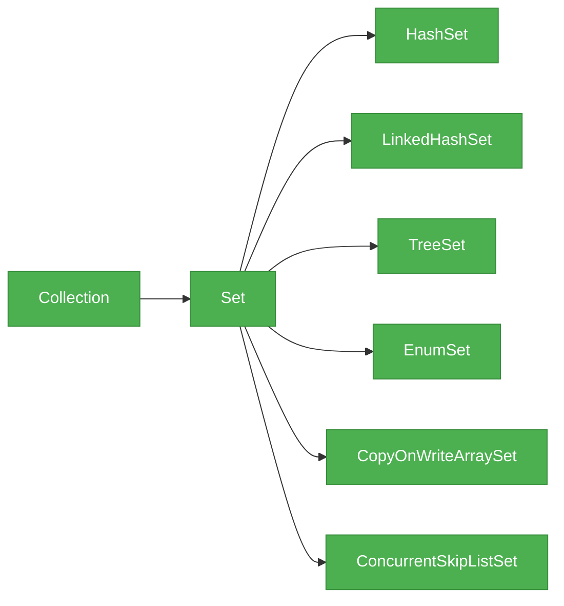
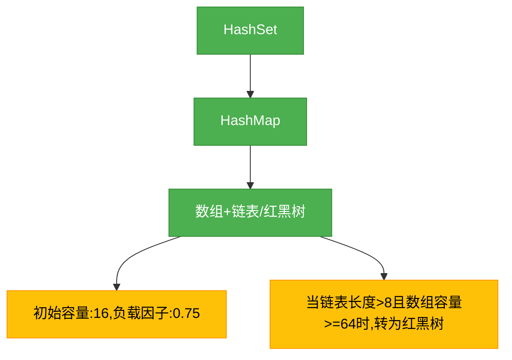
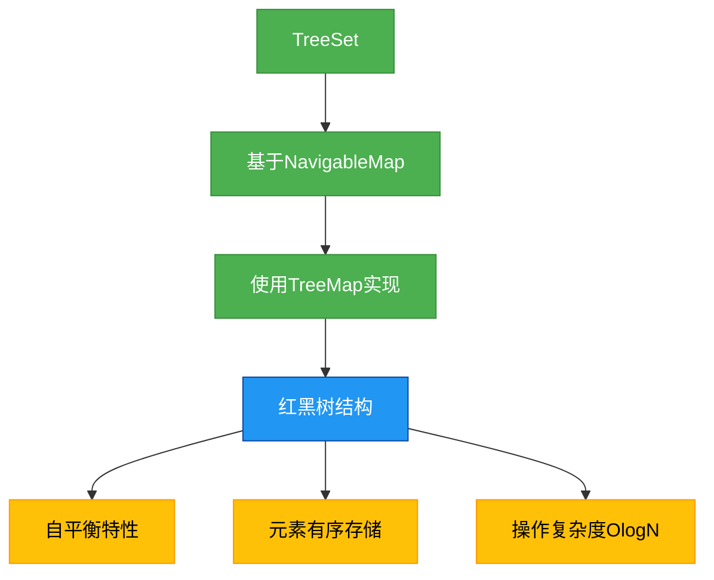
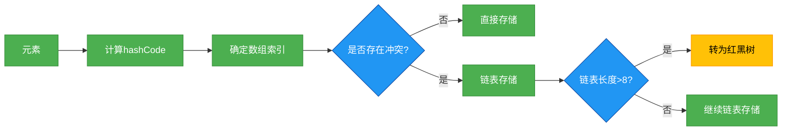

# 1.3.2 集合-Set

## 一、核心理论
### 1.1 Set接口概述
Set接口继承自Collection接口，是一种不允许包含重复元素的集合。它维持元素的无序性（除特定实现类外），并且最多只能包含一个null元素。Set接口常用于需要保证元素唯一性的场景，如数据去重、关键字存储等。

### 1.2 继承体系


### 1.3 主要实现类对比
| 实现类 | 底层数据结构 | 有序性 | 线程安全 | 允许null | 插入性能 | 查找性能 |
|--------|--------------|--------|----------|----------|----------|----------|
| HashSet | 哈希表 | 无序 | 否 | 是 | O(1) | O(1) |
| LinkedHashSet | 哈希表+双向链表 | 插入顺序 | 否 | 是 | O(1) | O(1) |
| TreeSet | 红黑树 | 自然排序/定制排序 | 否 | 否 | O(log n) | O(log n) |
| EnumSet | 位向量 | 枚举顺序 | 否 | 否 | O(1) | O(1) |
| CopyOnWriteArraySet | 数组 | 插入顺序 | 是 | 是 | O(n) | O(n) |
| ConcurrentSkipListSet | 跳表 | 自然排序 | 是 | 否 | O(log n) | O(log n) |

### 1.4 底层数据结构详解
#### 1.4.1 HashSet
HashSet基于哈希表（HashMap）实现，通过计算元素的hashCode值来确定存储位置。当两个元素的hashCode相同且equals方法返回true时，视为重复元素，后添加的元素会覆盖前一个元素。



#### 1.4.2 TreeSet
TreeSet基于红黑树（NavigableMap）实现，能够保证元素按照自然顺序或定制顺序进行排序。它不允许插入null元素，因为null无法参与比较。



### 1.5 JDK版本特性
- **JDK 8**：HashSet的底层HashMap实现引入红黑树优化，当链表长度超过8时转为红黑树
- **JDK 9**：引入of()方法创建不可变Set集合
- **JDK 16**：增加toUnmodifiableSet()方法，将集合转换为不可变Set
- **JDK 21**：增强了Set集合的stream操作，支持更多并行处理功能

## 二、代码实践
### 2.1 初始化与基本操作
```java
import java.util.*;
import java.util.stream.Collectors;

public class SetDemo {
    public static void main(String[] args) {
        // 1. 初始化方式
        Set<String> hashSet = new HashSet<>();
        Set<String> linkedHashSet = new LinkedHashSet<>();
        Set<String> treeSet = new TreeSet<>();
        Set<String> enumSet = EnumSet.noneOf(Season.class);
        Set<String> copyOnWriteSet = new CopyOnWriteArraySet<>();
        Set<String> concurrentSkipListSet = new ConcurrentSkipListSet<>();

        // JDK 9+ 不可变集合
        Set<String> immutableSet = Set.of("a", "b", "c");

        // 2. 添加元素
        hashSet.add("apple");
        hashSet.add("banana");
        hashSet.add("cherry");
        hashSet.add("apple"); // 重复元素，添加失败

        // 3. 删除元素
        hashSet.remove("banana");

        // 4. 判断元素是否存在
        boolean contains = hashSet.contains("apple");

        // 5. 集合大小
        int size = hashSet.size();

        // 6. 清空集合
        hashSet.clear();

        // 7. 集合转换
        List<String> list = Arrays.asList("a", "b", "c", "a");
        Set<String> distinctSet = new HashSet<>(list); // 去重
    }
}

enum Season {
    SPRING, SUMMER, AUTUMN, WINTER
}
```

### 2.2 遍历方式
```java
public class SetTraversalDemo {
    public static void main(String[] args) {
        Set<String> fruits = new HashSet<>(Arrays.asList("apple", "banana", "cherry"));

        // 1. 增强for循环
        for (String fruit : fruits) {
            System.out.println(fruit);
        }

        // 2. 迭代器
        Iterator<String> iterator = fruits.iterator();
        while (iterator.hasNext()) {
            String fruit = iterator.next();
            if (fruit.startsWith("a")) {
                iterator.remove(); // 安全删除
            }
        }

        // 3. forEach + Lambda
        fruits.forEach(fruit -> System.out.println(fruit));

        // 4. 流操作
        fruits.stream()
              .filter(fruit -> fruit.length() > 5)
              .forEach(System.out::println);
    }
}
```

### 2.3 排序与查找
```java
public class SetSortDemo {
    public static void main(String[] args) {
        // 1. TreeSet自然排序
        Set<Integer> numbers = new TreeSet<>(Arrays.asList(3, 1, 2, 5, 4));
        System.out.println(numbers); // [1, 2, 3, 4, 5]

        // 2. 定制排序
        Set<String> words = new TreeSet<>((s1, s2) -> s2.compareTo(s1)); // 降序
        words.addAll(Arrays.asList("apple", "banana", "cherry"));
        System.out.println(words); // [cherry, banana, apple]

        // 3. 查找操作
        TreeSet<Integer> sortedNumbers = new TreeSet<>(Arrays.asList(1, 2, 3, 4, 5));
        Integer lower = sortedNumbers.lower(3); // 小于3的最大元素: 2
        Integer higher = sortedNumbers.higher(3); // 大于3的最小元素: 4
        Integer floor = sortedNumbers.floor(3); // 小于等于3的最大元素: 3
        Integer ceiling = sortedNumbers.ceiling(3); // 大于等于3的最小元素: 3
        Integer first = sortedNumbers.first(); // 第一个元素: 1
        Integer last = sortedNumbers.last(); // 最后一个元素: 5
    }
}
```

### 2.4 集合运算
```java
public class SetOperationDemo {
    public static void main(String[] args) {
        Set<String> setA = new HashSet<>(Arrays.asList("a", "b", "c"));
        Set<String> setB = new HashSet<>(Arrays.asList("b", "c", "d"));

        // 1. 并集
        Set<String> union = new HashSet<>(setA);
        union.addAll(setB); // [a, b, c, d]

        // 2. 交集
        Set<String> intersection = new HashSet<>(setA);
        intersection.retainAll(setB); // [b, c]

        // 3. 差集
        Set<String> difference = new HashSet<>(setA);
        difference.removeAll(setB); // [a]

        // 4. 对称差集
        Set<String> symmetricDifference = new HashSet<>(setA);
        symmetricDifference.addAll(setB);
        Set<String> temp = new HashSet<>(setA);
        temp.retainAll(setB);
        symmetricDifference.removeAll(temp); // [a, d]

        // 5. 包含关系
        boolean isSubset = setA.containsAll(setB); // false
    }
}
```

### 2.5 线程安全的Set实现
```java
import java.util.Collections;
import java.util.HashSet;
import java.util.Set;
import java.util.concurrent.CopyOnWriteArraySet;
import java.util.concurrent.ConcurrentSkipListSet;

public class ThreadSafeSetDemo {
    public static void main(String[] args) {
        // 1. 使用Collections.synchronizedSet
        Set<String> syncSet = Collections.synchronizedSet(new HashSet<>());

        // 2. CopyOnWriteArraySet (读多写少场景)
        Set<String> cowSet = new CopyOnWriteArraySet<>();

        // 3. ConcurrentSkipListSet (有序且线程安全)
        Set<String> skipListSet = new ConcurrentSkipListSet<>();
    }
}
```

## 三、设计思想
### 3.1 接口与实现分离
Set接口定义了集合的行为规范，而具体实现类则提供了不同的数据结构和性能特性。这种设计使得用户可以根据具体需求选择合适的实现，而无需修改使用集合的代码。

### 3.2 哈希表设计
HashSet的哈希表设计采用了数组+链表/红黑树的结构，通过哈希函数将元素映射到数组索引。当发生哈希冲突时，使用链表存储相同哈希值的元素，当链表长度超过阈值时转为红黑树，以提高查找性能。



### 3.3 红黑树应用
TreeSet使用红黑树作为底层数据结构，它是一种自平衡的二叉查找树，能够保证插入、删除和查找操作的时间复杂度为O(log n)。红黑树通过一系列的旋转和变色操作来维持树的平衡，确保性能稳定。

### 3.4 不可变集合设计
JDK 9引入的不可变Set集合（通过Set.of()方法创建）采用了不可变设计模式，一旦创建就无法修改。这种设计具有线程安全、内存高效等优点，适用于存储常量数据或作为方法返回值防止外部修改。

### 3.5 装饰器模式
Collections.synchronizedSet()方法使用装饰器模式，为普通Set集合添加线程同步功能。这种设计避免了为每个Set实现类单独编写线程安全版本，提高了代码复用性。

## 四、避坑指南
### 4.1 常见异常及解决方案
#### 4.1.1 ConcurrentModificationException
当使用迭代器遍历集合时，如果同时修改集合结构（添加/删除元素），会抛出此异常。

**解决方案**：
- 使用迭代器的remove()方法
- 使用并发集合（如CopyOnWriteArraySet）
- 在遍历期间对集合进行复制

```java
// 错误示例
Set<String> set = new HashSet<>(Arrays.asList("a", "b", "c"));
for (String s : set) {
    if (s.equals("a")) {
        set.remove(s); // 抛出ConcurrentModificationException
    }
}

// 正确示例
Iterator<String> iterator = set.iterator();
while (iterator.hasNext()) {
    String s = iterator.next();
    if (s.equals("a")) {
        iterator.remove(); // 安全删除
    }
}
```

#### 4.1.2 NullPointerException
HashSet允许存储null元素，但TreeSet不允许，插入null会抛出NullPointerException。

**解决方案**：
- 使用TreeSet时确保元素不为null
- 如需存储可能为null的元素，选择HashSet或LinkedHashSet

### 4.2 HashSet性能陷阱
#### 4.2.1 哈希冲突
当大量元素的hashCode值相同时，哈希表会退化为链表，导致插入和查找性能下降。

**解决方案**：
- 重写hashCode()方法，确保分布均匀
- 避免使用常量hashCode
- 合理设置初始容量和负载因子

#### 4.2.2 初始容量和负载因子
初始容量过小或负载因子过高会导致频繁扩容和rehash操作，影响性能。

**解决方案**：
- 根据预期元素数量设置初始容量（建议为预期数量 / 负载因子）
- 负载因子默认0.75，一般无需修改

```java
// 优化初始容量
int expectedSize = 1000;
Set<String> optimizedSet = new HashSet<>((int)(expectedSize / 0.75) + 1);
```

### 4.3 TreeSet使用误区
#### 4.3.1 自定义对象排序
使用TreeSet存储自定义对象时，如果未实现Comparable接口且未提供Comparator，会抛出ClassCastException。

**解决方案**：
- 实现Comparable接口
- 提供Comparator比较器

```java
class Person implements Comparable<Person> {
    private String name;
    private int age;

    @Override
    public int compareTo(Person o) {
        return Integer.compare(this.age, o.age);
    }
    // getters and setters
}

// 或使用Comparator
Set<Person> personSet = new TreeSet<>((p1, p2) -> p1.getName().compareTo(p2.getName()));
```

### 4.4 线程安全问题
HashSet、LinkedHashSet和TreeSet都是线程不安全的，多线程环境下可能导致数据不一致或ConcurrentModificationException。

**解决方案**：
- 使用Collections.synchronizedSet()
- 使用CopyOnWriteArraySet（读多写少场景）
- 使用ConcurrentSkipListSet（有序且线程安全）

## 五、深度思考题
### 思考题1：HashSet、LinkedHashSet和TreeSet的性能对比及适用场景
**思考题回答**：
HashSet：基于哈希表实现，插入和查找性能为O(1)，但元素无序。适用于不需要保证元素顺序，追求插入和查找效率的场景。

LinkedHashSet：基于哈希表+双向链表实现，插入和查找性能略低于HashSet，但能保持元素的插入顺序。适用于需要保证元素插入顺序，同时兼顾查找效率的场景。

TreeSet：基于红黑树实现，插入、删除和查找性能为O(log n)，但能保证元素有序。适用于需要对元素进行排序或需要执行范围查询的场景。

### 思考题2：如何实现一个线程安全的HashSet
**思考题回答**：
实现线程安全的HashSet有以下几种方式：

1. 使用Collections.synchronizedSet()方法包装普通HashSet：
```java
Set<String> syncSet = Collections.synchronizedSet(new HashSet<>());
```
这种方式通过在每个方法上添加同步锁实现线程安全，但并发性能较差。

2. 使用CopyOnWriteArraySet：
```java
Set<String> cowSet = new CopyOnWriteArraySet<>();
```
这种方式通过写时复制机制实现线程安全，读操作无需加锁，适用于读多写少的场景。

3. 基于ConcurrentHashMap实现自定义线程安全HashSet：
```java
public class ConcurrentHashSet<E> {
    private final ConcurrentHashMap<E, Object> map;
    private static final Object PRESENT = new Object();

    public ConcurrentHashSet() {
        map = new ConcurrentHashMap<>();
    }

    public boolean add(E e) {
        return map.put(e, PRESENT) == null;
    }

    public boolean remove(E e) {
        return map.remove(e) == PRESENT;
    }

    // 其他方法...
}
```
这种方式利用ConcurrentHashMap的线程安全特性，实现高效的线程安全HashSet。

### 思考题3：HashSet如何检查元素是否重复
**思考题回答**：
HashSet通过以下步骤检查元素是否重复：

1. 计算新元素的hashCode值，确定在哈希表中的存储位置。
2. 检查该位置是否已有元素：
   - 如果没有，直接存储新元素。
   - 如果有，通过equals方法比较新元素与已有元素是否相等：
     - 如果equals返回true，视为重复元素，不存储。
     - 如果equals返回false，说明发生哈希冲突，将新元素添加到链表或红黑树中。

因此，为了保证HashSet能正确检查重复元素，需要同时重写元素类的hashCode()和equals()方法，并且确保相等的对象具有相同的hashCode。

### 思考题4：JDK 8中HashSet的红黑树优化原理
**思考题回答**：
JDK 8中HashSet的底层实现HashMap引入了红黑树优化，当链表长度超过8且数组容量大于等于64时，会将链表转换为红黑树。这是因为在哈希冲突严重的情况下，链表的查找性能会退化为O(n)，而红黑树的查找性能为O(log n)，能够显著提高性能。

当红黑树的节点数量减少到6个时，会自动转换回链表，因为在元素数量较少的情况下，链表的性能反而优于红黑树（红黑树需要维护平衡，有额外开销）。

### 思考题5：不可变Set的实现原理及应用场景
**思考题回答**：
JDK 9引入的不可变Set（通过Set.of()方法创建）具有以下特点：

1. 实现原理：
   - 使用final修饰集合，防止引用被修改
   - 内部存储结构使用不可变数组
   - 所有修改方法（add、remove等）都直接抛出UnsupportedOperationException
   - 不允许存储null元素

2. 应用场景：
   - 存储常量数据，如配置信息、枚举值等
   - 作为方法返回值，防止外部修改内部集合
   - 多线程环境下共享数据，无需同步
   - 作为Map的key（不可变对象更适合作为Map的key）

不可变Set相比普通Set具有线程安全、内存高效、防止意外修改等优点，但不适合需要频繁修改的场景。