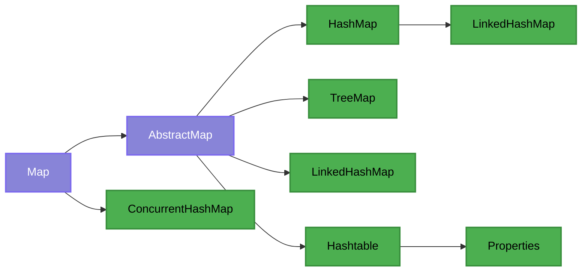
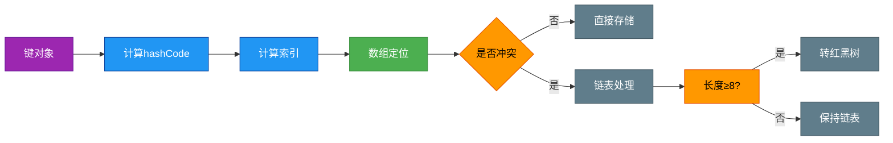

# 1.3.3 集合-Map集合

## 一、核理论
### 1.1 Map接口概述
Map接口是Java集合框架中的双列集合根接口，用于存储键值对(key-value)映射关系。它提供了一种通过键快速查找值的机制，键不能重复，每个键最多映射到一个值。

### 1.2 继承体系


### 1.3 主要实现类对比
| 实现类 | 底层数据结构 | 线程安全 | 有序性 | 允许null键/值 | 初始容量 | 扩容因子 |
|--------|--------------|----------|--------|---------------|----------|----------|
| HashMap | 数组+链表+红黑树 | 否 | 无序 | 是/是 | 16 | 0.75 |
| TreeMap | 红黑树 | 否 | 有序(自然排序/定制排序) | 否/是 | - | - |
| LinkedHashMap | 哈希表+双向链表 | 否 | 插入顺序/访问顺序 | 是/是 | 16 | 0.75 |
| Hashtable | 数组+链表 | 是 | 无序 | 否/否 | 11 | 0.75 |
| ConcurrentHashMap | 数组+链表+红黑树(Segment/JDK8:CAS+synchronized) | 是 | 无序 | 否/否 | 16 | 0.75 |

### 1.4 底层数据结构详解
#### 1.4.1 HashMap数据结构(JDK8+)


#### 1.4.2 ConcurrentHashMap数据结构演变
- JDK7: Segment分段锁机制
- JDK8+:  CAS+synchronized+红黑树

### 1.5 JDK版本特性
- **JDK 1.2**: 引入HashMap、Hashtable
- **JDK 1.4**: 引入LinkedHashMap
- **JDK 1.5**: 引入ConcurrentHashMap
- **JDK 8**: HashMap引入红黑树优化，ConcurrentHashMap重构为CAS+synchronized
- **JDK 9**: Map接口新增of()方法创建不可变集合
- **JDK 16**: HashMap新增putIfAbsentElseThrow()方法

## 二、代码实践
### 2.1 初始化与基本操作
```java
import java.util.*;
import java.util.concurrent.ConcurrentHashMap;

/**
 * Map集合初始化与基本操作示例
 * 展示不同Map实现类的创建方式和常用API
 */
public class MapInitializationExample {
    public static void main(String[] args) {
        // 1. HashMap初始化与操作
        Map<String, Integer> hashMap = new HashMap<>();
        hashMap.put("apple", 10);
        hashMap.put("banana", 20);
        hashMap.put("orange", 30);
        System.out.println("HashMap: " + hashMap);

        // 2. TreeMap初始化(自然排序)
        Map<String, Integer> treeMap = new TreeMap<>();
        treeMap.putAll(hashMap);
        System.out.println("TreeMap(自然排序): " + treeMap);

        // 3. LinkedHashMap初始化(保持插入顺序)
        Map<String, Integer> linkedHashMap = new LinkedHashMap<>();
        linkedHashMap.put("apple", 10);
        linkedHashMap.put("banana", 20);
        linkedHashMap.put("orange", 30);
        System.out.println("LinkedHashMap(插入顺序): " + linkedHashMap);

        // 4. ConcurrentHashMap初始化(线程安全)
        Map<String, Integer> concurrentHashMap = new ConcurrentHashMap<>();
        concurrentHashMap.putAll(hashMap);
        System.out.println("ConcurrentHashMap: " + concurrentHashMap);

        // 5. JDK9+不可变Map
        Map<String, Integer> immutableMap = Map.of("a", 1, "b", 2, "c", 3);
        System.out.println("不可变Map: " + immutableMap);
    }
}
```

### 2.2 遍历方式
```java
import java.util.*;
import java.util.function.BiConsumer;

/**
 * Map集合遍历方式示例
 * 展示5种常见的Map遍历方法及其适用场景
 */
public class MapTraversalExample {
    public static void main(String[] args) {
        Map<String, Integer> map = new HashMap<>();
        map.put("apple", 10);
        map.put("banana", 20);
        map.put("orange", 30);

        // 方式1: 遍历entrySet(推荐,效率高)
        System.out.println("方式1: 遍历entrySet");
        for (Map.Entry<String, Integer> entry : map.entrySet()) {
            System.out.println("Key: " + entry.getKey() + ", Value: " + entry.getValue());
        }

        // 方式2: 遍历keySet
        System.out.println("\n方式2: 遍历keySet");
        for (String key : map.keySet()) {
            System.out.println("Key: " + key + ", Value: " + map.get(key));
        }

        // 方式3: 遍历values
        System.out.println("\n方式3: 遍历values");
        for (Integer value : map.values()) {
            System.out.println("Value: " + value);
        }

        // 方式4: Lambda表达式(JDK8+)
        System.out.println("\n方式4: Lambda表达式");
        map.forEach((key, value) -> System.out.println("Key: " + key + ", Value: " + value));

        // 方式5: 迭代器遍历(支持删除操作)
        System.out.println("\n方式5: 迭代器遍历");
        Iterator<Map.Entry<String, Integer>> iterator = map.entrySet().iterator();
        while (iterator.hasNext()) {
            Map.Entry<String, Integer> entry = iterator.next();
            if ("banana".equals(entry.getKey())) {
                iterator.remove(); // 安全删除
            } else {
                System.out.println("Key: " + entry.getKey() + ", Value: " + entry.getValue());
            }
        }
        System.out.println("删除后Map: " + map);
    }
}
```

### 2.3 排序与查找
```java
import java.util.*;
import java.util.stream.Collectors;

/**
 * Map排序与查找示例
 * 展示按键、按值排序及高效查找的实现
 */
public class MapSortAndSearchExample {
    public static void main(String[] args) {
        Map<String, Integer> map = new HashMap<>();
        map.put("apple", 10);
        map.put("banana", 20);
        map.put("orange", 5);
        map.put("grape", 15);

        // 1. 按键排序(升序)
        Map<String, Integer> sortedByKeyAsc = map.entrySet()
                .stream()
                .sorted(Map.Entry.comparingByKey())
                .collect(Collectors.toMap(
                        Map.Entry::getKey,
                        Map.Entry::getValue,
                        (oldValue, newValue) -> oldValue,
                        LinkedHashMap::new
                ));
        System.out.println("按键升序排序: " + sortedByKeyAsc);

        // 2. 按值排序(降序)
        Map<String, Integer> sortedByValueDesc = map.entrySet()
                .stream()
                .sorted(Map.Entry.<String, Integer>comparingByValue().reversed())
                .collect(Collectors.toMap(
                        Map.Entry::getKey,
                        Map.Entry::getValue,
                        (oldValue, newValue) -> oldValue,
                        LinkedHashMap::new
                ));
        System.out.println("按值降序排序: " + sortedByValueDesc);

        // 3. 查找最大值
        Map.Entry<String, Integer> maxEntry = map.entrySet()
                .stream()
                .max(Map.Entry.comparingByValue())
                .orElseThrow(() -> new NoSuchElementException("Map is empty"));
        System.out.println("最大值: " + maxEntry);

        // 4. 查找符合条件的元素
        List<Map.Entry<String, Integer>> filteredEntries = map.entrySet()
                .stream()
                .filter(entry -> entry.getValue() > 10)
                .collect(Collectors.toList());
        System.out.println("值大于10的元素: " + filteredEntries);
    }
}
```

### 2.4 HashMap与TreeMap性能对比
```java
import java.util.HashMap;
import java.util.Map;
import java.util.TreeMap;

/**
 * HashMap与TreeMap性能对比测试
 * 测试两种Map在不同操作上的性能表现
 */
public class MapPerformanceComparison {
    private static final int OPERATION_COUNT = 1000000;

    public static void main(String[] args) {
        // 测试HashMap
        Map<Integer, String> hashMap = new HashMap<>();
        long hashMapPutTime = testPutPerformance(hashMap);
        long hashMapGetTime = testGetPerformance(hashMap);
        long hashMapRemoveTime = testRemovePerformance(hashMap);

        // 测试TreeMap
        Map<Integer, String> treeMap = new TreeMap<>();
        long treeMapPutTime = testPutPerformance(treeMap);
        long treeMapGetTime = testGetPerformance(treeMap);
        long treeMapRemoveTime = testRemovePerformance(treeMap);

        // 输出结果
        System.out.println("操作次数: " + OPERATION_COUNT);
        System.out.println("HashMap - 插入: " + hashMapPutTime + "ms, 查询: " + hashMapGetTime + "ms, 删除: " + hashMapRemoveTime + "ms");
        System.out.println("TreeMap  - 插入: " + treeMapPutTime + "ms, 查询: " + treeMapGetTime + "ms, 删除: " + treeMapRemoveTime + "ms");
    }

    private static long testPutPerformance(Map<Integer, String> map) {
        long startTime = System.currentTimeMillis();
        for (int i = 0; i < OPERATION_COUNT; i++) {
            map.put(i, "value" + i);
        }
        return System.currentTimeMillis() - startTime;
    }

    private static long testGetPerformance(Map<Integer, String> map) {
        long startTime = System.currentTimeMillis();
        for (int i = 0; i < OPERATION_COUNT; i++) {
            map.get(i);
        }
        return System.currentTimeMillis() - startTime;
    }

    private static long testRemovePerformance(Map<Integer, String> map) {
        long startTime = System.currentTimeMillis();
        for (int i = 0; i < OPERATION_COUNT; i++) {
            map.remove(i);
        }
        return System.currentTimeMillis() - startTime;
    }
}
```

### 2.5 线程安全的Map实现
```java
import java.util.Collections;
import java.util.HashMap;
import java.util.Map;
import java.util.concurrent.ConcurrentHashMap;
import java.util.concurrent.ConcurrentSkipListMap;

/**
 * 线程安全Map实现对比
 * 展示四种线程安全Map的使用场景和特性
 */
public class ThreadSafeMapExample {
    public static void main(String[] args) {
        // 1. Hashtable(古老实现,不推荐)
        Map<String, Integer> hashtable = new java.util.Hashtable<>();

        // 2. Collections.synchronizedMap(装饰器模式)
        Map<String, Integer> synchronizedMap = Collections.synchronizedMap(new HashMap<>());

        // 3. ConcurrentHashMap(高性能并发实现)
        Map<String, Integer> concurrentHashMap = new ConcurrentHashMap<>();

        // 4. ConcurrentSkipListMap(并发有序映射)
        Map<String, Integer> concurrentSkipListMap = new ConcurrentSkipListMap<>();

        // 演示ConcurrentHashMap的原子操作
        concurrentHashMap.putIfAbsent("a", 1);
        concurrentHashMap.computeIfAbsent("b", k -> k.hashCode());
        concurrentHashMap.merge("a", 2, Integer::sum);

        System.out.println("ConcurrentHashMap结果: " + concurrentHashMap);
    }
}
```

## 三、设计思想
### 3.1 接口与实现分离
Map接口定义了键值对映射的规范，而具体实现类则提供不同的存储结构和性能特性。这种设计使得用户可以根据需求选择合适的实现，而无需修改使用Map的代码。

### 3.2 哈希表设计
HashMap采用哈希表作为底层结构，通过哈希函数将键映射到数组索引。当发生哈希冲突时，使用链表和红黑树解决冲突，保证了平均O(1)的查找效率。

```mermaid
 graph LR
     A[键] --> B[计算hashCode]
     B --> C[计算索引]
     C --> D[数组位置]
     D --> E{冲突检测}
     E -->|无| F[存储节点]
     E -->|有| G[链表或红黑树]
     
     classDef action fill:#4CAF50,stroke:#388E3C,color:white;
     classDef decision fill:#FF9800,stroke:#E65100,color:black;
     
     class A,B,C,D,F,G action;
     class E decision;
 ```

### 3.3 红黑树应用
当HashMap中链表长度超过阈值(默认8)且数组长度不小于64时，链表会转换为红黑树，将最坏情况下的时间复杂度从O(n)优化为O(log n)。

### 3.4 不可变集合设计
JDK9引入的Map.of()方法创建不可变集合，通过以下方式保证不可变性：
- 私有构造函数
- 不可变内部存储
- 不支持修改操作
- 对null值严格检查

### 3.5 并发设计
ConcurrentHashMap在JDK8中的设计：
- 取消Segment分段锁，使用CAS+synchronized实现并发控制
- 对数组元素(链表头)加锁，减小锁粒度
- 支持高并发读写，读操作无锁
- 扩容时支持并发操作

## 四、避坑指南
### 4.1 常见异常及解决方案
#### 4.1.1 NullPointerException
**原因**：使用null作为HashMap的键或值，而某些操作不允许null
**解决方案**：
```java
// 错误示例
Map<String, String> map = new HashMap<>();
map.put(null, "value"); // 允许
String value = map.get(null); // 允许

// TreeMap不允许null键
Map<String, String> treeMap = new TreeMap<>();
treeMap.put(null, "value"); // 抛出NullPointerException

// 解决方案: 使用Optional或空对象模式
String safeValue = Optional.ofNullable(map.get(key)).orElse("default");
```

#### 4.1.2 ConcurrentModificationException
**原因**：迭代过程中修改Map结构
**解决方案**：
```java
// 错误示例
for (String key : map.keySet()) {
    if (key.startsWith("temp")) {
        map.remove(key); // 抛出ConcurrentModificationException
    }
}

// 正确示例: 使用迭代器
Iterator<Map.Entry<String, String>> iterator = map.entrySet().iterator();
while (iterator.hasNext()) {
    Map.Entry<String, String> entry = iterator.next();
    if (entry.getKey().startsWith("temp")) {
        iterator.remove(); // 安全删除
    }
}

// 或使用ConcurrentHashMap
ConcurrentHashMap<String, String> concurrentMap = new ConcurrentHashMap<>();
for (String key : concurrentMap.keySet()) {
    if (key.startsWith("temp")) {
        concurrentMap.remove(key); // 不会抛出异常
    }
}
```

### 4.2 HashMap性能陷阱
#### 4.2.1 哈希冲突
**问题**：不当的hashCode()实现导致大量哈希冲突，性能退化
**解决方案**：
- 实现合理的hashCode()方法，使哈希值分布均匀
- 对于自定义对象作为键，重写hashCode()和equals()方法

#### 4.2.2 频繁扩容
**问题**：初始容量设置不当导致频繁扩容
**解决方案**：
```java
// 预估元素数量时指定初始容量
int expectedSize = 1000;
// 初始容量 = 预期元素数 / 负载因子 + 1
Map<String, Object> map = new HashMap<>((int)(expectedSize / 0.75f) + 1);
```

### 4.3 线程安全问题
**问题**：在多线程环境下使用非线程安全的Map
**解决方案**：
- 低并发: Collections.synchronizedMap()
- 高并发: ConcurrentHashMap
- 并发且有序: ConcurrentSkipListMap

## 五、深度思考题
### 思考题1: HashMap和ConcurrentHashMap的实现原理及性能对比
**思考题回答**:
HashMap基于数组+链表+红黑树实现，非线程安全，在并发环境下可能导致死循环或数据不一致。ConcurrentHashMap在JDK7使用Segment分段锁，JDK8及以上使用CAS+synchronized实现，支持高并发操作。

性能方面，单线程环境下HashMap性能略优，多线程环境下ConcurrentHashMap表现更好，特别是读多写少场景。ConcurrentHashMap的get操作是无锁的，而HashMap在并发修改时可能抛出ConcurrentModificationException。

### 思考题2: 如何实现一个自定义的LRU缓存
**思考题回答**:
可以使用LinkedHashMap实现LRU(最近最少使用)缓存，重写removeEldestEntry()方法：
```java
import java.util.LinkedHashMap;
import java.util.Map;

public class LRUCache<K, V> extends LinkedHashMap<K, V> {
    private final int capacity;

    public LRUCache(int capacity) {
        super(capacity, 0.75f, true);
        this.capacity = capacity;
    }

    @Override
    protected boolean removeEldestEntry(Map.Entry<K, V> eldest) {
        return size() > capacity;
    }

    public static void main(String[] args) {
        LRUCache<Integer, String> cache = new LRUCache<>(3);
        cache.put(1, "a");
        cache.put(2, "b");
        cache.put(3, "c");
        System.out.println(cache); // {1=a, 2=b, 3=c}

        cache.get(2); // 访问2
        cache.put(4, "d"); // 超出容量，移除最近最少使用的1
        System.out.println(cache); // {3=c, 2=b, 4=d}
    }
}
```

### 思考题3: HashMap在JDK8中的优化有哪些
**思考题回答**:
JDK8对HashMap的主要优化包括：
1. 引入红黑树：当链表长度超过阈值(8)且数组长度>=64时，将链表转换为红黑树，提高查询性能
2. 优化哈希函数：简化哈希计算，减少碰撞
3. 扩容优化：扩容时不需要重新计算哈希值，通过高位运算确定新位置
4. 新增函数：如computeIfAbsent、forEach、merge等便捷方法
5. 改进迭代器：使用fast-fail机制，及时检测并发修改

### 思考题4: 如何实现线程安全的HashMap
**思考题回答**:
实现线程安全的HashMap有以下几种方式：
1. 使用Hashtable：所有方法加synchronized，性能较差
2. 使用Collections.synchronizedMap()：装饰器模式，对所有方法加锁
3. 使用ConcurrentHashMap：JDK7分段锁，JDK8 CAS+synchronized，性能最优
4. 使用读写锁：ReadWriteLock，读多写少场景性能好

示例代码(读写锁实现)：
```java
import java.util.HashMap;
import java.util.Map;
import java.util.concurrent.locks.ReadWriteLock;
import java.util.concurrent.locks.ReentrantReadWriteLock;

public class ThreadSafeHashMap<K, V> {
    private final Map<K, V> map = new HashMap<>();
    private final ReadWriteLock lock = new ReentrantReadWriteLock();

    public V get(K key) {
        lock.readLock().lock();
        try {
            return map.get(key);
        } finally {
            lock.readLock().unlock();
        }
    }

    public V put(K key, V value) {
        lock.writeLock().lock();
        try {
            return map.put(key, value);
        } finally {
            lock.writeLock().unlock();
        }
    }
}
```