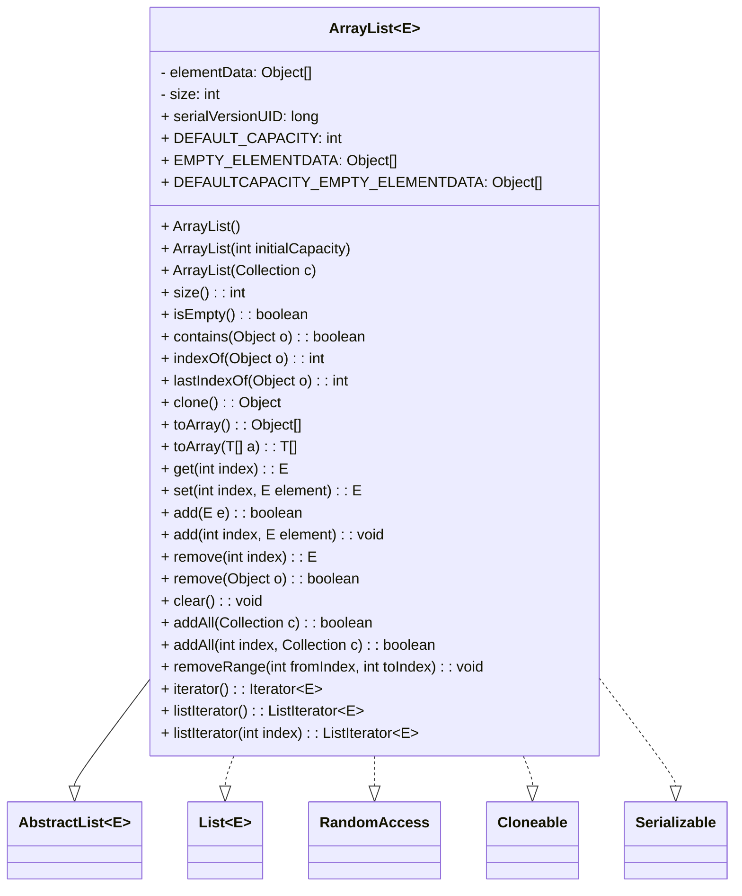
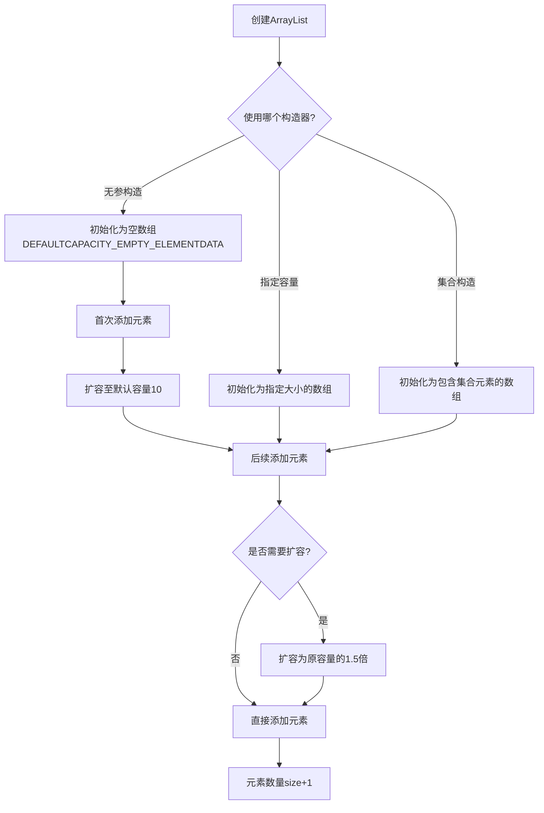
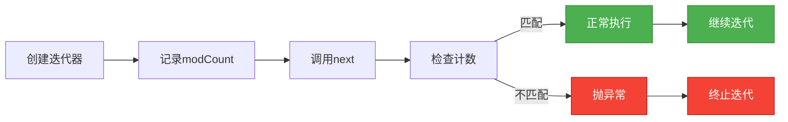

# 1.3.4 集合-ArrayList源码

## 一、核理论
### 1.1 ArrayList类结构分析
ArrayList是Java集合框架中最常用的动态数组实现，实现了List接口，继承自AbstractList抽象类，支持快速随机访问。其核心特点是基于数组实现、容量动态扩展、允许null元素、非线程安全。



### 1.2 核心成员变量
```java
// 存储元素的数组，非私有以简化嵌套类访问
transient Object[] elementData; // JDK 8及之前版本
// private Object[] elementData; // JDK 11及之后版本

// 集合中的元素数量
private int size;

// 默认初始容量
private static final int DEFAULT_CAPACITY = 10;

// 空数组实例（指定初始容量为0时使用）
private static final Object[] EMPTY_ELEMENTDATA = {};

// 默认空数组实例（无参构造时使用）
private static final Object[] DEFAULTCAPACITY_EMPTY_ELEMENTDATA = {};

// 最大数组容量（Integer.MAX_VALUE - 8，留出头部信息空间）
private static final int MAX_ARRAY_SIZE = Integer.MAX_VALUE - 8;
```

### 1.3 版本差异特性
| 版本 | 重要特性 |
|------|----------|
| JDK 1.2 | 首次引入ArrayList |
| JDK 1.4 | 新增`addAll()`, `removeAll()`, `retainAll()`等批量操作方法 |
| JDK 5 | 支持泛型，引入`foreach`循环支持 |
| JDK 6 | 新增`ensureCapacity(int minCapacity)`方法 |
| JDK 7 | 优化扩容算法，引入`Arrays.copyOf()`替代手动数组复制 |
| JDK 8 | 新增`removeIf()`, `forEach()`, `spliterator()`等方法 |
| JDK 11 | 将`elementData`从`transient`改为`private`，增强封装性 |
| JDK 16 | 新增`forEachRemaining(Consumer<? super E> action)`方法 |
| JDK 17 | 优化迭代器实现，增强并发修改检测 |

## 二、代码实践
### 2.1 构造方法实现
```java
/**
 * 无参构造方法，使用默认空数组
 * 首次添加元素时会扩容至默认容量10
 */
public ArrayList() {
    this.elementData = DEFAULTCAPACITY_EMPTY_ELEMENTDATA;
}

/**
 * 指定初始容量的构造方法
 * @param initialCapacity 初始容量
 * @throws IllegalArgumentException 如果初始容量为负数
 */
public ArrayList(int initialCapacity) {
    if (initialCapacity > 0) {
        this.elementData = new Object[initialCapacity];
    } else if (initialCapacity == 0) {
        this.elementData = EMPTY_ELEMENTDATA;
    } else {
        throw new IllegalArgumentException("Illegal Capacity: " + initialCapacity);
    }
}

/**
 * 通过集合创建ArrayList的构造方法
 * @param c 包含要放入此列表的元素的集合
 * @throws NullPointerException 如果指定的集合为null
 */
public ArrayList(Collection<? extends E> c) {
    elementData = c.toArray();
    if ((size = elementData.length) != 0) {
        // 检查c.toArray()是否正确返回Object[]类型
        if (elementData.getClass() != Object[].class) {
            elementData = Arrays.copyOf(elementData, size, Object[].class);
        }
    } else {
        // 集合为空时使用空数组
        this.elementData = EMPTY_ELEMENTDATA;
    }
}
```

### 2.2 添加元素核心方法
```java
/**
 * 在列表末尾添加指定元素
 * @param e 要添加的元素
 * @return true（始终返回true，符合Collection接口规范）
 */
public boolean add(E e) {
    // 确保容量足够，size+1
    ensureCapacityInternal(size + 1);  // Increments modCount!!
    // 将元素添加到数组的size位置，然后size自增
    elementData[size++] = e;
    return true;
}

/**
 * 在指定位置插入元素
 * @param index 要插入元素的位置
 * @param element 要插入的元素
 * @throws IndexOutOfBoundsException 如果索引超出范围
 */
public void add(int index, E element) {
    // 检查索引是否合法
    rangeCheckForAdd(index);
    // 确保容量足够
    ensureCapacityInternal(size + 1);  // Increments modCount!!
    // 将index及其后的元素向后移动一位
    System.arraycopy(elementData, index, elementData, index + 1, size - index);
    // 在index位置插入新元素
    elementData[index] = element;
    // 元素数量加1
    size++;
}

/**
 * 确保内部容量足够
 * @param minCapacity 所需的最小容量
 */
private void ensureCapacityInternal(int minCapacity) {
    ensureExplicitCapacity(calculateCapacity(elementData, minCapacity));
}

/**
 * 计算所需容量
 * @param elementData 当前存储元素的数组
 * @param minCapacity 所需最小容量
 * @return 计算后的容量
 */
private static int calculateCapacity(Object[] elementData, int minCapacity) {
    // 如果是使用无参构造创建的空数组，返回默认容量10和minCapacity中的较大值
    if (elementData == DEFAULTCAPACITY_EMPTY_ELEMENTDATA) {
        return Math.max(DEFAULT_CAPACITY, minCapacity);
    }
    return minCapacity;
}

/**
 * 确保显式容量
 * @param minCapacity 所需最小容量
 */
private void ensureExplicitCapacity(int minCapacity) {
    modCount++;
    // 如果所需容量大于当前数组长度，则需要扩容
    if (minCapacity - elementData.length > 0) {
        grow(minCapacity);
    }
}
```

### 2.3 扩容机制实现
```java
/**
 * 扩容数组以支持至少minCapacity的容量
 * @param minCapacity 所需的最小容量
 * @return 扩容后的数组
 */
private void grow(int minCapacity) {
    // 获取当前数组长度
    int oldCapacity = elementData.length;
    // 新容量为旧容量的1.5倍（oldCapacity >> 1 相当于 oldCapacity / 2）
    int newCapacity = oldCapacity + (oldCapacity >> 1);
    // 如果新容量仍然小于所需容量，则直接使用所需容量
    if (newCapacity - minCapacity < 0) {
        newCapacity = minCapacity;
    }
    // 如果新容量超过最大数组容量，则使用Integer.MAX_VALUE
    if (newCapacity - MAX_ARRAY_SIZE > 0) {
        newCapacity = hugeCapacity(minCapacity);
    }
    // 复制原数组元素到新数组
    elementData = Arrays.copyOf(elementData, newCapacity);
}

/**
 * 处理大容量情况
 * @param minCapacity 所需最小容量
 * @return 合适的大容量值
 * @throws OutOfMemoryError 如果minCapacity超过Integer.MAX_VALUE
 */
private static int hugeCapacity(int minCapacity) {
    if (minCapacity < 0) {
        throw new OutOfMemoryError();
    }
    // 如果所需容量超过MAX_ARRAY_SIZE，则返回Integer.MAX_VALUE，否则返回MAX_ARRAY_SIZE
    return (minCapacity > MAX_ARRAY_SIZE) ? Integer.MAX_VALUE : MAX_ARRAY_SIZE;
}
```

### 2.4 获取和修改元素
```java
/**
 * 获取指定位置的元素
 * @param index 要获取的元素索引
 * @return 指定位置的元素
 * @throws IndexOutOfBoundsException 如果索引超出范围
 */
public E get(int index) {
    // 检查索引是否合法
    rangeCheck(index);
    // 返回指定位置的元素
    return elementData(index);
}

/**
 * 修改指定位置的元素
 * @param index 要修改的元素索引
 * @param element 要设置的新元素
 * @return 被替换的旧元素
 * @throws IndexOutOfBoundsException 如果索引超出范围
 */
public E set(int index, E element) {
    // 检查索引是否合法
    rangeCheck(index);
    // 获取旧元素
    E oldValue = elementData(index);
    // 设置新元素
    elementData[index] = element;
    // 返回旧元素
    return oldValue;
}

/**
 * 检查索引是否超出范围
 * @param index 要检查的索引
 * @throws IndexOutOfBoundsException 如果索引超出范围
 */
private void rangeCheck(int index) {
    if (index >= size) {
        throw new IndexOutOfBoundsException(outOfBoundsMsg(index));
    }
}

/**
 * 检查添加操作的索引是否合法
 * @param index 要检查的索引
 * @throws IndexOutOfBoundsException 如果索引超出范围
 */
private void rangeCheckForAdd(int index) {
    if (index > size || index < 0) {
        throw new IndexOutOfBoundsException(outOfBoundsMsg(index));
    }
}

/**
 * 生成索引越界异常消息
 * @param index 越界的索引
 * @return 异常消息
 */
private String outOfBoundsMsg(int index) {
    return "Index: " + index + ", Size: " + size;
}

/**
 * 元素数据访问，将Object类型转换为泛型E
 * @param index 元素索引
 * @return 泛型E类型的元素
 */
@SuppressWarnings("unchecked")
E elementData(int index) {
    return (E) elementData[index];
}
```

### 2.5 删除元素操作
```java
/**
 * 删除指定位置的元素
 * @param index 要删除的元素索引
 * @return 被删除的元素
 * @throws IndexOutOfBoundsException 如果索引超出范围
 */
public E remove(int index) {
    // 检查索引是否合法
    rangeCheck(index);
    // 修改次数加1
    modCount++;
    // 获取要删除的元素
    E oldValue = elementData(index);
    // 计算需要移动的元素数量
    int numMoved = size - index - 1;
    if (numMoved > 0) {
        // 将index+1及其后的元素向前移动一位
        System.arraycopy(elementData, index + 1, elementData, index, numMoved);
    }
    // 将最后一个元素置为null，帮助GC回收
    elementData[--size] = null; // clear to let GC do its work
    // 返回被删除的元素
    return oldValue;
}

/**
 * 删除指定元素（首次出现的）
 * @param o 要删除的元素，如果为null则删除null元素
 * @return 如果列表包含指定元素则返回true
 */
public boolean remove(Object o) {
    if (o == null) {
        for (int index = 0; index < size; index++) {
            if (elementData[index] == null) {
                fastRemove(index);
                return true;
            }
        }
    } else {
        for (int index = 0; index < size; index++) {
            if (o.equals(elementData[index])) {
                fastRemove(index);
                return true;
            }
        }
    }
    return false;
}

/**
 * 快速删除指定位置的元素，不进行边界检查，不返回被删除元素
 * @param index 要删除的元素索引
 */
private void fastRemove(int index) {
    // 修改次数加1
    modCount++;
    // 计算需要移动的元素数量
    int numMoved = size - index - 1;
    if (numMoved > 0) {
        // 将index+1及其后的元素向前移动一位
        System.arraycopy(elementData, index + 1, elementData, index, numMoved);
    }
    // 将最后一个元素置为null，帮助GC回收
    elementData[--size] = null; // clear to let GC do its work
}

/**
 * 清空列表
 */
public void clear() {
    // 修改次数加1
    modCount++;
    // 将所有元素置为null，帮助GC回收
    for (int i = 0; i < size; i++) {
        elementData[i] = null;
    }
    // 重置元素数量为0
    size = 0;
}
```

### 2.6 迭代器实现
```java
/**
 * 返回列表的迭代器
 * @return 列表的迭代器
 */
public Iterator<E> iterator() {
    return new Itr();
}

/**
 * ArrayList的内部迭代器实现
 */
private class Itr implements Iterator<E> {
    // 下一个要返回的元素索引
    int cursor;       // index of next element to return
    // 最后一个返回的元素索引
    int lastRet = -1; // index of last element returned; -1 if no such
    // 期望的修改次数，用于检测并发修改
    int expectedModCount = modCount;

    Itr() {}

    /**
     * 判断是否还有下一个元素
     * @return 如果还有元素则返回true
     */
    public boolean hasNext() {
        return cursor != size;
    }

    /**
     * 获取下一个元素
     * @return 下一个元素
     * @throws NoSuchElementException 如果没有更多元素
     * @throws ConcurrentModificationException 如果检测到并发修改
     */
    @SuppressWarnings("unchecked")
    public E next() {
        // 检查并发修改
        checkForComodification();
        int i = cursor;
        if (i >= size) {
            throw new NoSuchElementException();
        }
        Object[] elementData = ArrayList.this.elementData;
        if (i >= elementData.length) {
            throw new ConcurrentModificationException();
        }
        cursor = i + 1;
        return (E) elementData[lastRet = i];
    }

    /**
     * 删除当前元素
     * @throws IllegalStateException 如果没有下一个元素
     * @throws ConcurrentModificationException 如果检测到并发修改
     */
    public void remove() {
        if (lastRet < 0) {
            throw new IllegalStateException();
        }
        // 检查并发修改
        checkForComodification();

        try {
            // 调用ArrayList的remove方法
            ArrayList.this.remove(lastRet);
            cursor = lastRet;
            lastRet = -1;
            // 更新期望的修改次数
            expectedModCount = modCount;
        } catch (IndexOutOfBoundsException ex) {
            throw new ConcurrentModificationException();
        }
    }

    /**
     * 检查并发修改
     * @throws ConcurrentModificationException 如果修改次数不匹配
     */
    final void checkForComodification() {
        if (modCount != expectedModCount) {
            throw new ConcurrentModificationException();
        }
    }
}
```

## 三、设计思想
### 3.1 动态数组设计
ArrayList的核心设计思想是基于动态数组实现，通过自动扩容机制提供灵活的容量管理：


### 3.2 快速失败机制
ArrayList通过modCount（修改次数）实现快速失败(fail-fast)机制：
- 每次结构性修改（add、remove等）都会使modCount自增
- 迭代器创建时记录expectedModCount = modCount
- 迭代过程中检查modCount是否等于expectedModCount
- 如果不等，说明集合被并发修改，抛出ConcurrentModificationException



### 3.3 内存优化策略
ArrayList采用了多种内存优化策略：
1. **延迟初始化**：无参构造时不立即分配容量，首次添加元素时才扩容至10
2. **空间预分配**：扩容时预留1.5倍容量，减少频繁扩容次数
3. **内存释放**：删除元素时将不再使用的数组位置置为null，帮助GC回收
4. **trimToSize()**：提供该方法允许手动将容量调整为元素数量，释放多余空间
5. **数组复用**：使用静态空数组实例（EMPTY_ELEMENTDATA和DEFAULTCAPACITY_EMPTY_ELEMENTDATA）复用空数组，减少对象创建

### 3.4 接口设计原则
ArrayList遵循了多个重要的接口设计原则：
1. **单一职责**：专注于动态数组的实现，不负责线程安全
2. **接口隔离**：实现了List、RandomAccess等多个专门接口
3. **开闭原则**：通过继承AbstractList实现基础功能，自身专注于数组特性
4. **里氏替换**：可以在任何需要List的地方使用ArrayList
5. **封装性**：内部数组elementData私有，通过方法暴露操作

## 四、避坑指南
### 4.1 并发修改异常
**问题**：在迭代过程中修改集合（如添加/删除元素）会抛出ConcurrentModificationException
**解决方案**：
```java
// 错误示例
List<String> list = new ArrayList<>();
list.add("a");
list.add("b");
list.add("c");

for (String item : list) {
    if (item.equals("b")) {
        list.remove(item); // 抛出ConcurrentModificationException
    }
}

// 正确方案1: 使用迭代器的remove()方法
Iterator<String> iterator = list.iterator();
while (iterator.hasNext()) {
    String item = iterator.next();
    if (item.equals("b")) {
        iterator.remove(); // 安全删除
    }
}

// 正确方案2: 使用Stream API（JDK 8+）
List<String> newList = list.stream()
    .filter(item -> !item.equals("b"))
    .collect(Collectors.toList());

// 正确方案3: 使用CopyOnWriteArrayList（高并发场景）
List<String> cowList = new CopyOnWriteArrayList<>(list);
for (String item : cowList) {
    if (item.equals("b")) {
        cowList.remove(item);
    }
}
```

### 4.2 扩容性能问题
**问题**：频繁扩容会导致性能开销，特别是大数据量时
**解决方案**：
```java
// 错误示例: 频繁扩容
List<Integer> list = new ArrayList<>();
for (int i = 0; i < 100000; i++) {
    list.add(i); // 会触发多次扩容
}

// 正确方案: 预估容量，指定初始大小
List<Integer> list = new ArrayList<>(100000); // 避免多次扩容
for (int i = 0; i < 100000; i++) {
    list.add(i);
}

// 正确方案: 已知集合大小，使用ensureCapacity()
List<Integer> list = new ArrayList<>();
list.ensureCapacity(100000); // 预扩容
for (int i = 0; i < 100000; i++) {
    list.add(i);
}
```

### 4.3 数组下标越界
**问题**：get/set/remove时使用无效索引导致IndexOutOfBoundsException
**解决方案**：
```java
List<String> list = new ArrayList<>();
list.add("a");
list.add("b");

// 错误示例
String item = list.get(2); // 抛出IndexOutOfBoundsException

// 正确方案1: 使用前检查索引
int index = 2;
if (index >= 0 && index < list.size()) {
    String item = list.get(index);
} else {
    // 处理索引无效情况
    System.out.println("索引超出范围");
}

// 正确方案2: 使用try-catch捕获异常
try {
    String item = list.get(2);
} catch (IndexOutOfBoundsException e) {
    // 处理异常
    System.err.println("获取元素失败: " + e.getMessage());
}
```

### 4.4 内存泄漏风险
**问题**：ArrayList可能导致内存泄漏，特别是作为类成员变量时
**解决方案**：
```java
public class MemoryLeakExample {
    private List<Object> largeList = new ArrayList<>();

    // 错误示例: 只清空元素但不释放引用
    public void clearListWrong() {
        largeList.clear(); // 元素被清空，但list本身仍占用内存
    }

    // 正确方案1: 清空并设置为null
    public void clearListCorrect1() {
        largeList.clear();
        largeList = null; // 允许GC回收整个列表
    }

    // 正确方案2: 替换为新的空列表
    public void clearListCorrect2() {
        largeList = new ArrayList<>(); // 旧列表可被GC回收
    }

    // 正确方案3: 使用trimToSize()释放多余容量
    public void optimizeMemory() {
        largeList.trimToSize(); // 将容量调整为元素数量
    }
}
```

### 4.5 自动装箱性能损耗
**问题**：存储基本类型时会自动装箱，导致性能损耗
**解决方案**：
```java
// 错误示例: 大量自动装箱操作
List<Integer> list = new ArrayList<>();
for (int i = 0; i < 1000000; i++) {
    list.add(i); // 每次添加都会自动装箱为Integer
}

// 正确方案1: JDK 8+使用IntStream避免装箱
List<Integer> list = IntStream.range(0, 1000000)
    .boxed()
    .collect(Collectors.toCollection(() -> new ArrayList<>(1000000)));

// 正确方案2: 使用专门的基本类型集合库（如Eclipse Collections、FastUtil）
IntList intList = new IntArrayList(1000000);
for (int i = 0; i < 1000000; i++) {
    intList.add(i); // 无装箱操作
}
```

## 五、深度思考题
### 思考题1: ArrayList和Vector的区别及适用场景
**思考题回答**:
ArrayList和Vector都是基于动态数组的List实现，但存在以下关键区别：

1. **线程安全性**：
   - Vector是线程安全的，几乎所有方法都使用synchronized修饰
   - ArrayList是非线程安全的，没有同步机制

2. **性能**：
   - Vector由于同步开销，单线程环境下性能低于ArrayList
   - ArrayList在多线程环境下需要手动同步，否则会有线程安全问题

3. **扩容机制**：
   - Vector默认扩容为原来的2倍（可通过capacityIncrement设置增量）
   - ArrayList默认扩容为原来的1.5倍

4. **迭代器**：
   - Vector的elements()方法返回Enumeration，不支持快速失败
   - ArrayList的iterator()返回Iterator，支持快速失败

5. **API丰富度**：
   - Vector提供了更多古老的方法，如elementAt()、insertElementAt()等
   - ArrayList遵循Collection框架标准API

**适用场景**：
- 单线程环境或可手动控制同步：优先使用ArrayList，性能更优
- 多线程环境且需要内置同步：使用Vector（但更推荐使用Collections.synchronizedList或CopyOnWriteArrayList）
- 需要精细化控制扩容策略：Vector可通过capacityIncrement参数调整

### 思考题2: ArrayList的扩容为什么是1.5倍而不是2倍或其他倍数
**思考题回答**:
ArrayList选择1.5倍作为扩容因子主要基于时间和空间效率的权衡：

1. **时间复杂度分析**：
   - 假设初始容量为C，扩容因子为k，添加n个元素的总时间复杂度为O(n)
   - 无论k是1.5还是2，均能保证分摊时间复杂度为O(1)
   - 1.5倍扩容的重分配次数略多于2倍扩容，但单次复制成本更低

2. **空间复杂度分析**：
   - 2倍扩容可能导致更多的内存浪费，尤其当集合达到较大规模后
   - 1.5倍扩容在内存利用率上更优，减少内存浪费
   - 1.5是斐波那契数列比例，有助于减少内存碎片

3. **数学原理**：
   - 1.5是黄金分割比例的近似值(约0.618)的倒数，具有较好的分布特性
   - 从数学上证明，1.5倍扩容可以使新分配的数组空间与旧空间的重叠概率最小
   - 这有助于减少内存分配的冲突，提高内存利用率

4. **实际应用考量**：
   - Java集合框架设计者在时间和空间之间选择了平衡
   - 对于大多数应用场景，1.5倍既能满足性能需求，又不会过度浪费内存
   - 如果需要更多空间预分配，可以通过ensureCapacity()方法手动控制

### 思考题3: 如何实现一个线程安全的ArrayList
**思考题回答**:
实现线程安全的ArrayList有以下几种方案：

1. **使用Collections.synchronizedList()**：
```java
List<String> syncList = Collections.synchronizedList(new ArrayList<>());
// 使用方式与普通ArrayList相同，但所有方法都通过同步包装器实现线程安全
```
原理：通过包装器模式，为所有方法添加synchronized同步块，保证线程安全。
优点：实现简单，适用于并发度不高的场景。
缺点：性能较差，每次操作都需要获取锁，可能导致线程竞争。

2. **使用CopyOnWriteArrayList**：
```java
List<String> cowList = new CopyOnWriteArrayList<>();
// 读操作无锁，写操作复制整个数组
```
原理：写时复制机制，修改操作会创建新数组并复制元素，然后替换旧数组引用。
优点：读操作性能极高，适合读多写少场景。
缺点：写操作成本高，内存占用大，数据一致性较弱。

3. **自定义同步ArrayList**：
```java
public class SynchronizedArrayList<E> {
    private final List<E> list = new ArrayList<>();
    private final Object lock = new Object();

    public boolean add(E e) {
        synchronized (lock) {
            return list.add(e);
        }
    }

    public E get(int index) {
        synchronized (lock) {
            return list.get(index);
        }
    }

    // 实现其他必要方法...
}
```
原理：使用显式锁对象，对关键操作进行同步。
优点：可根据需求灵活控制同步粒度，性能可优化。
缺点：实现复杂，需要确保所有访问路径都经过同步。

4. **使用ReentrantLock实现细粒度同步**：
```java
public class LockBasedArrayList<E> {
    private final List<E> list = new ArrayList<>();
    private final ReentrantLock lock = new ReentrantLock();

    public boolean add(E e) {
        lock.lock();
        try {
            return list.add(e);
        } finally {
            lock.unlock();
        }
    }

    // 实现其他方法...
}
```
原理：使用可重入锁实现同步，支持更灵活的锁定策略。
优点：支持尝试锁定、超时锁定等高级特性，可中断。
缺点：实现复杂度高于synchronized。

**选择建议**：
- 低并发场景：Collections.synchronizedList()简单易用
- 读多写少高并发场景：CopyOnWriteArrayList性能最优
- 复杂并发控制需求：自定义ReentrantLock实现