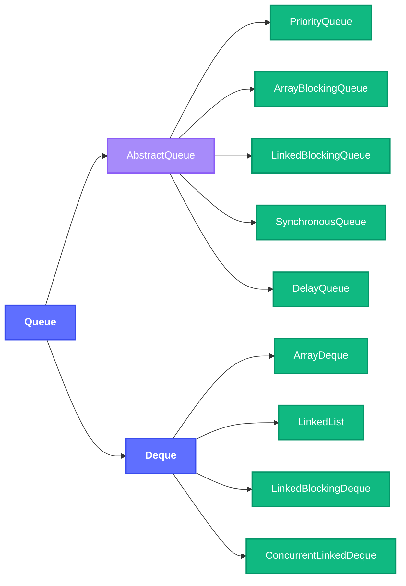
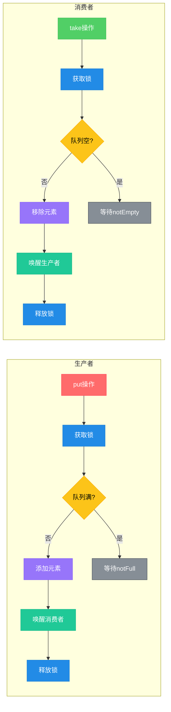

# 1.3.4 集合-Queue

## 一、核心理论
### 1.1 Queue接口概述
Queue接口是Java集合框架中的队列数据结构，遵循FIFO(先进先出)原则，用于存储按顺序排列的元素。除了基本的Collection操作外，Queue还提供了专门的插入、删除和检查操作，并针对这些操作定义了两种行为模式：当操作失败时要么抛出异常，要么返回特殊值。

### 1.2 继承体系


### 1.3 主要实现类对比
| 实现类 | 底层结构 | 阻塞特性 | 有序性 | 容量限制 | 线程安全 | 适用场景 |
|--------|----------|----------|--------|----------|----------|----------|
| PriorityQueue | 数组/堆 | 非阻塞 | 自然排序/定制排序 | 无(动态扩容) | 否 | 优先级任务调度 |
| ArrayDeque | 数组 | 非阻塞 | 插入顺序 | 无(动态扩容) | 否 | 栈/队列实现 |
| LinkedList | 双向链表 | 非阻塞 | 插入顺序 | 无 | 否 | 简单队列实现 |
| ArrayBlockingQueue | 数组 | 阻塞 | FIFO | 有界 | 是 | 固定容量并发场景 |
| LinkedBlockingQueue | 链表 | 阻塞 | FIFO | 可选有界 | 是 | 高并发生产者-消费者 |
| SynchronousQueue | 无缓冲 | 阻塞 | FIFO | 容量为0 | 是 | 线程间直接移交数据 |
| DelayQueue | 优先级队列 | 阻塞 | 延迟时间 | 无 | 是 | 定时任务调度 |
| ConcurrentLinkedQueue | 链表 | 非阻塞 | FIFO | 无 | 是 | 高并发非阻塞场景 |

### 1.4 核心操作对比
| 操作类型 | 抛出异常 | 返回特殊值 | 阻塞 | 超时退出 |
|----------|----------|------------|------|----------|
| 插入 | add(e) | offer(e) | put(e) | offer(e, time, unit) |
| 删除 | remove() | poll() | take() | poll(time, unit) |
| 检查 | element() | peek() | - | - |

### 1.5 JDK版本特性
- **JDK 1.5**: 引入Queue接口及PriorityQueue、ConcurrentLinkedQueue
- **JDK 1.6**: 完善阻塞队列实现，新增SynchronousQueue等
- **JDK 8**: 新增Stream API支持，如queue.stream()
- **JDK 9**: 新增of()方法创建不可变队列
- **JDK 16**: 新增addAll()默认实现

## 二、代码实践
### 2.1 基本操作示例
```java
import java.util.*;
import java.util.concurrent.ArrayBlockingQueue;
import java.util.concurrent.LinkedBlockingQueue;
import java.util.concurrent.TimeUnit;

/**
 * Queue接口基本操作示例
 * 展示不同类型队列的创建和常用API
 */
public class QueueBasicOperations {
    public static void main(String[] args) throws InterruptedException {
        // 1. 优先级队列(自然排序)
        Queue<Integer> priorityQueue = new PriorityQueue<>();
        priorityQueue.add(3);
        priorityQueue.add(1);
        priorityQueue.add(2);
        System.out.println("PriorityQueue: " + priorityQueue); // [1, 3, 2]
        System.out.println("Poll: " + priorityQueue.poll()); // 1

        // 2. 双端队列
        Deque<String> arrayDeque = new ArrayDeque<>();
        arrayDeque.addFirst("a");
        arrayDeque.addLast("b");
        arrayDeque.push("c"); // 等价于addFirst
        System.out.println("ArrayDeque: " + arrayDeque); // [c, a, b]
        System.out.println("Pop: " + arrayDeque.pop()); // c

        // 3. 阻塞队列
        BlockingQueue<String> blockingQueue = new ArrayBlockingQueue<>(2);
        blockingQueue.put("x");
        blockingQueue.put("y");
        System.out.println("BlockingQueue size: " + blockingQueue.size()); // 2

        // 超时插入
        boolean inserted = blockingQueue.offer("z", 1, TimeUnit.SECONDS);
        System.out.println("插入成功? " + inserted); // false

        // 4. 并发队列
        Queue<String> concurrentQueue = new ConcurrentLinkedQueue<>();
        concurrentQueue.offer("A");
        concurrentQueue.offer("B");
        concurrentQueue.offer("C");
        System.out.println("ConcurrentLinkedQueue: " + concurrentQueue); // [A, B, C]
    }
}
```

### 2.2 生产者-消费者模型实现
```java
import java.util.concurrent.ArrayBlockingQueue;
import java.util.concurrent.BlockingQueue;
import java.util.concurrent.ExecutorService;
import java.util.concurrent.Executors;

/**
 * 使用阻塞队列实现生产者-消费者模型
 * 展示ArrayBlockingQueue在并发场景下的应用
 */
public class ProducerConsumerExample {
    // 缓冲区大小
    private static final int BUFFER_SIZE = 5;
    // 产品数量
    private static final int PRODUCT_COUNT = 10;

    public static void main(String[] args) {
        // 创建有界阻塞队列作为缓冲区
        BlockingQueue<Integer> buffer = new ArrayBlockingQueue<>(BUFFER_SIZE);

        // 创建生产者和消费者
        ExecutorService executor = Executors.newFixedThreadPool(3);
        executor.submit(new Producer(buffer, PRODUCT_COUNT));
        executor.submit(new Consumer(buffer, PRODUCT_COUNT));
        executor.submit(new Consumer(buffer, PRODUCT_COUNT));

        executor.shutdown();
    }

    /**
     * 生产者线程
     */
    static class Producer implements Runnable {
        private final BlockingQueue<Integer> buffer;
        private final int productCount;

        public Producer(BlockingQueue<Integer> buffer, int productCount) {
            this.buffer = buffer;
            this.productCount = productCount;
        }

        @Override
        public void run() {
            try {
                for (int i = 1; i <= productCount; i++) {
                    System.out.println("生产者生产产品: " + i);
                    buffer.put(i); // 若缓冲区满则阻塞
                    Thread.sleep(100); // 模拟生产耗时
                }
                System.out.println("生产者完成生产任务");
            } catch (InterruptedException e) {
                Thread.currentThread().interrupt();
            }
        }
    }

    /**
     * 消费者线程
     */
    static class Consumer implements Runnable {
        private final BlockingQueue<Integer> buffer;
        private final int productCount;
        private static int totalConsumed = 0;

        public Consumer(BlockingQueue<Integer> buffer, int productCount) {
            this.buffer = buffer;
            this.productCount = productCount;
        }

        @Override
        public void run() {
            try {
                while (totalConsumed < productCount) {
                    Integer product = buffer.take(); // 若缓冲区空则阻塞
                    synchronized (Consumer.class) {
                        if (totalConsumed < productCount) {
                            System.out.println("消费者消费产品: " + product);
                            totalConsumed++;
                            Thread.sleep(200); // 模拟消费耗时
                        }
                    }
                }
                System.out.println("消费者完成消费任务");
            } catch (InterruptedException e) {
                Thread.currentThread().interrupt();
            }
        }
    }
}
```

### 2.3 延迟队列应用
```java
import java.util.concurrent.DelayQueue;
import java.util.concurrent.Delayed;
import java.util.concurrent.TimeUnit;

/**
 * 延迟队列(DelayQueue)应用示例
 * 实现定时任务调度功能
 */
public class DelayQueueExample {
    public static void main(String[] args) throws InterruptedException {
        DelayQueue<DelayedTask> delayQueue = new DelayQueue<>();

        // 添加延迟任务
        delayQueue.put(new DelayedTask("任务1", 1, TimeUnit.SECONDS));
        delayQueue.put(new DelayedTask("任务2", 3, TimeUnit.SECONDS));
        delayQueue.put(new DelayedTask("任务3", 2, TimeUnit.SECONDS));

        System.out.println("开始执行延迟任务...");

        // 执行延迟任务
        while (!delayQueue.isEmpty()) {
            DelayedTask task = delayQueue.take(); // 阻塞直到有任务到期
            task.run();
        }
    }

    /**
     * 延迟任务类
     */
    static class DelayedTask implements Delayed, Runnable {
        private final String taskName;
        private final long executeTime;

        public DelayedTask(String taskName, long delay, TimeUnit unit) {
            this.taskName = taskName;
            this.executeTime = System.currentTimeMillis() + unit.toMillis(delay);
        }

        @Override
        public long getDelay(TimeUnit unit) {
            return unit.convert(executeTime - System.currentTimeMillis(), TimeUnit.MILLISECONDS);
        }

        @Override
        public int compareTo(Delayed other) {
            return Long.compare(this.executeTime, ((DelayedTask) other).executeTime);
        }

        @Override
        public void run() {
            System.out.println("执行任务: " + taskName + ", 当前时间: " + System.currentTimeMillis());
        }
    }
}
```

### 2.4 双端队列实现栈和队列
```java
import java.util.ArrayDeque;
import java.util.Deque;

/**
 * 使用ArrayDeque实现栈和队列
 * 展示双端队列的灵活性
 */
public class DequeAsStackAndQueue {
    public static void main(String[] args) {
        // 1. 作为栈使用(LIFO)
        Deque<Integer> stack = new ArrayDeque<>();
        stack.push(1);
        stack.push(2);
        stack.push(3);
        System.out.println("栈顶元素: " + stack.peek()); // 3
        System.out.println("弹出元素: " + stack.pop()); // 3
        System.out.println("栈大小: " + stack.size()); // 2

        // 2. 作为队列使用(FIFO)
        Deque<Integer> queue = new ArrayDeque<>();
        queue.offer(1);
        queue.offer(2);
        queue.offer(3);
        System.out.println("队首元素: " + queue.peek()); // 1
        System.out.println("出队元素: " + queue.poll()); // 1
        System.out.println("队列大小: " + queue.size()); // 2

        // 3. 双端操作
        Deque<Integer> deque = new ArrayDeque<>();
        deque.addFirst(1);
        deque.addLast(2);
        deque.addFirst(0);
        System.out.println("双端队列: " + deque); // [0, 1, 2]
        System.out.println("移除第一个: " + deque.removeFirst()); // 0
        System.out.println("移除最后一个: " + deque.removeLast()); // 2
    }
}
```

## 三、设计思想
### 3.1 接口设计模式
Queue接口采用了"接口继承+功能扩展"的设计模式，在Collection接口基础上扩展了队列特有操作，并通过不同的实现类提供多样化的队列特性。这种设计保证了接口的简洁性和实现的灵活性。

### 3.2 阻塞队列实现原理
阻塞队列通过ReentrantLock和Condition实现线程间的协调：


### 3.3 优先级队列设计
PriorityQueue基于二叉小顶堆实现，通过数组存储元素，利用堆的特性实现元素的自动排序：
- 父节点索引：i
- 左子节点索引：2i+1
- 右子节点索引：2i+2
- 插入时"上浮"调整
- 删除时"下沉"调整

### 3.4 并发队列设计
ConcurrentLinkedQueue采用无锁CAS操作实现高并发性能：
- 基于单向链表实现
- 使用volatile变量保证可见性
- 通过CAS操作实现原子性
- 采用Michael-Scott非阻塞算法

## 四、避坑指南
### 4.1 常见异常及解决方案
#### 4.1.1 NoSuchElementException
**原因**：队列为空时调用element()或remove()方法
**解决方案**：
```java
Queue<String> queue = new LinkedList<>();
// 错误示例
queue.element(); // 抛出NoSuchElementException

// 正确示例
if (!queue.isEmpty()) {
    String element = queue.element();
}

// 更优方案: 使用peek()
String element = queue.peek(); // 队列为空时返回null
```

#### 4.1.2 IllegalStateException
**原因**：队列已满时调用add()方法
**解决方案**：
```java
Queue<String> queue = new ArrayBlockingQueue<>(1);
queue.add("a");

// 错误示例
queue.add("b"); // 抛出IllegalStateException

// 正确示例
boolean success = queue.offer("b"); // 队列满时返回false
if (!success) {
    System.out.println("队列已满，添加失败");
}
```

### 4.2 线程安全问题
**问题**：在多线程环境下使用非线程安全的队列（如LinkedList、PriorityQueue）
**解决方案**：
```java
// 错误示例 - 多线程下不安全
Queue<String> unsafeQueue = new LinkedList<>();

// 正确方案1: 使用线程安全的实现类
Queue<String> safeQueue1 = new ConcurrentLinkedQueue<>();

// 正确方案2: 使用阻塞队列
BlockingQueue<String> safeQueue2 = new LinkedBlockingQueue<>();

// 正确方案3: 使用Collections.synchronized包装
Queue<String> safeQueue3 = Collections.synchronizedQueue(new LinkedList<>());
```

### 4.3 PriorityQueue陷阱
#### 4.3.1 无序遍历
**问题**：PriorityQueue的迭代器不保证有序遍历
**解决方案**：
```java
PriorityQueue<Integer> pq = new PriorityQueue<>();
pq.add(3);
pq.add(1);
pq.add(2);

// 错误: 直接遍历不保证有序
for (Integer num : pq) {
    System.out.print(num + " "); // 可能输出: 1 3 2
}

// 正确: 逐个poll()获取有序元素
while (!pq.isEmpty()) {
    System.out.print(pq.poll() + " "); // 输出: 1 2 3
}
```

#### 4.3.2 null元素
**问题**：PriorityQueue不允许添加null元素
**解决方案**：
```java
PriorityQueue<String> pq = new PriorityQueue<>();
// 错误示例
pq.add(null); // 抛出NullPointerException

// 正确示例: 使用特殊值代替null
pq.add("NULL_VALUE");
```

## 五、深度思考题
### 思考题1: 阻塞队列如何实现线程间通信
**思考题回答**:
阻塞队列通过内置锁和条件变量实现线程间通信。以ArrayBlockingQueue为例，其内部维护了一个ReentrantLock和两个Condition（notEmpty和notFull）。当队列满时，生产者线程调用put()方法会被阻塞在notFull条件上；当队列空时，消费者线程调用take()方法会被阻塞在notEmpty条件上。当有元素入队时，会唤醒notEmpty条件上的消费者；当有元素出队时，会唤醒notFull条件上的生产者。这种机制实现了生产者和消费者之间的高效协作。

### 思考题2: ArrayDeque与LinkedList作为队列和栈的性能对比
**思考题回答**:
ArrayDeque通常比LinkedList作为队列和栈时性能更好，原因如下：
1. **内存结构**：ArrayDeque基于数组实现，内存连续，缓存利用率高；LinkedList基于节点，内存分散，可能导致更多缓存失效
2. **操作效率**：ArrayDeque的add/remove操作都是O(1)时间复杂度且实现简单；LinkedList需要创建节点对象，涉及更多内存操作
3. **空间开销**：LinkedList每个元素需要额外存储前后指针，空间开销更大
4. **迭代性能**：ArrayDeque的迭代器实现更简单高效

唯一适合使用LinkedList的场景是需要在队列中间进行插入/删除操作，或者需要实现双向迭代器的场景。

### 思考题3: 如何实现一个线程安全的非阻塞队列
**思考题回答**:
可以使用CAS(Compare-And-Swap)操作实现非阻塞队列，核心思想是通过原子操作避免使用锁：
1. 使用volatile变量存储头节点和尾节点，保证可见性
2. 入队时通过CAS原子更新尾节点
3. 出队时通过CAS原子更新头节点
4. 处理并发情况下的节点引用更新冲突

简化实现示例：
```java
import java.util.concurrent.atomic.AtomicReference;

public class ConcurrentNonBlockingQueue<T> {
    // 节点定义
    private static class Node<T> {
        final T item;
        AtomicReference<Node<T>> next;

        Node(T item) {
            this.item = item;
            this.next = new AtomicReference<>(null);
        }
    }

    // 头节点和尾节点(AtomicReference保证原子操作)
    private final AtomicReference<Node<T>> head = new AtomicReference<>(new Node<>(null));
    private final AtomicReference<Node<T>> tail = new AtomicReference<>(head.get());

    // 入队操作
    public void enqueue(T item) {
        Node<T> newNode = new Node<>(item);
        while (true) {
            Node<T> currentTail = tail.get();
            Node<T> tailNext = currentTail.next.get();
            // 检查尾节点是否被修改
            if (currentTail == tail.get()) {
                // 如果尾节点的next为null，表示可以插入新节点
                if (tailNext == null) {
                    if (currentTail.next.compareAndSet(null, newNode)) {
                        // 成功插入，更新尾节点
                        tail.compareAndSet(currentTail, newNode);
                        return;
                    }
                } else {
                    // 尾节点已被其他线程修改，帮助更新尾节点
                    tail.compareAndSet(currentTail, tailNext);
                }
            }
        }
    }

    // 出队操作
    public T dequeue() {
        while (true) {
            Node<T> currentHead = head.get();
            Node<T> currentTail = tail.get();
            Node<T> headNext = currentHead.next.get();
            // 检查头节点是否被修改
            if (currentHead == head.get()) {
                // 队列为空
                if (currentHead == currentTail) {
                    if (headNext == null) {
                        return null; // 队列为空
                    }
                    // 帮助更新尾节点
                    tail.compareAndSet(currentTail, headNext);
                } else {
                    T item = headNext.item;
                    // 尝试更新头节点
                    if (head.compareAndSet(currentHead, headNext)) {
                        return item;
                    }
                }
            }
        }
    }
}
```

### 思考题4: DelayQueue的实现原理及应用场景
**思考题回答**:
DelayQueue是一个支持延迟获取元素的无界阻塞队列，其实现原理如下：
1. 底层基于PriorityQueue实现，元素必须实现Delayed接口
2. Delayed接口定义了getDelay()方法返回剩余延迟时间和compareTo()方法定义排序规则
3. 只有当元素的延迟时间<=0时才能被取出
4. 内部通过ReentrantLock保证线程安全
5. 使用Condition等待直到有元素延迟到期

应用场景包括：
1. **定时任务调度**：如定时执行的任务队列
2. **缓存过期清理**：存储带有过期时间的缓存项
3. **订单超时处理**：处理超过一定时间未支付的订单
4. **会话超时管理**：管理用户会话的过期时间
5. **重试机制实现**：失败操作的定时重试队列