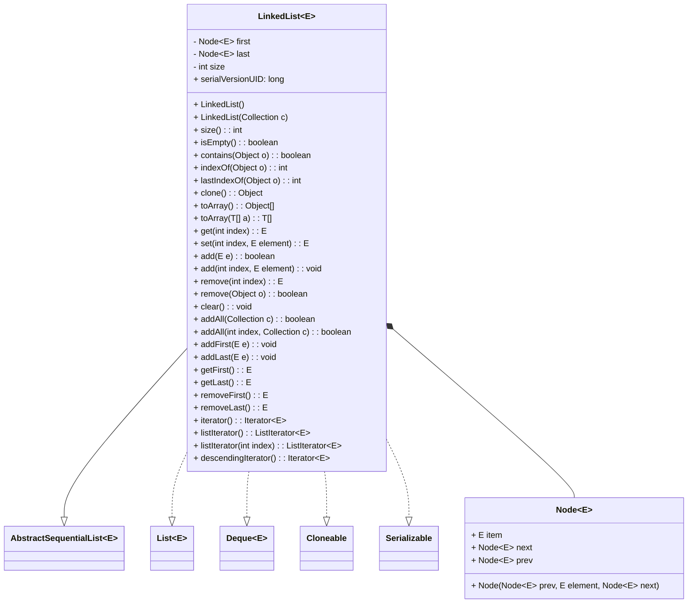
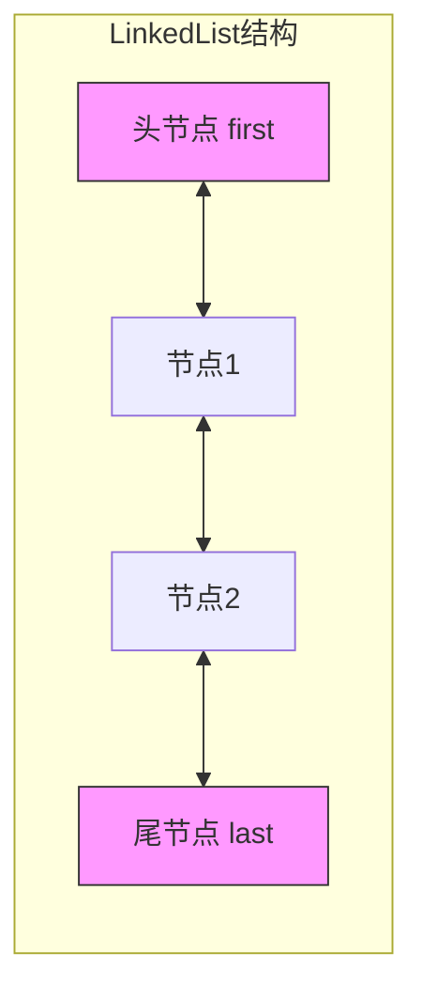
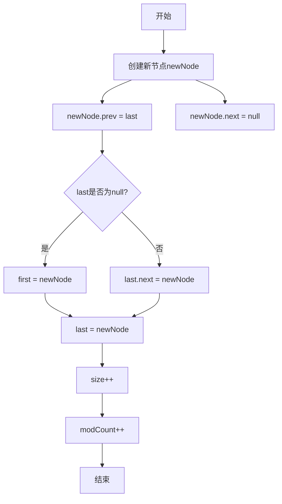
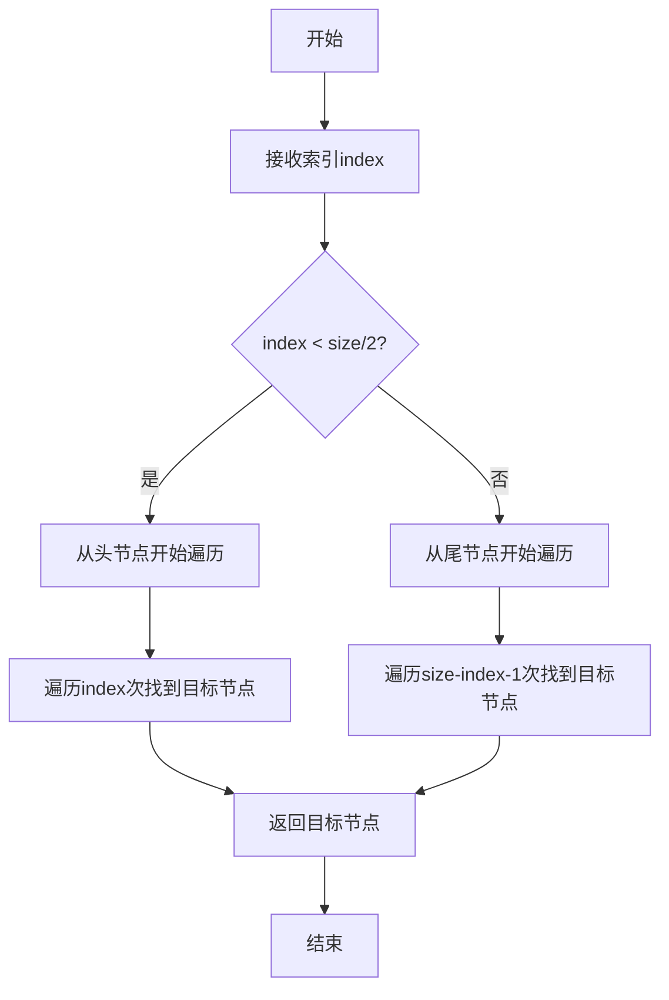
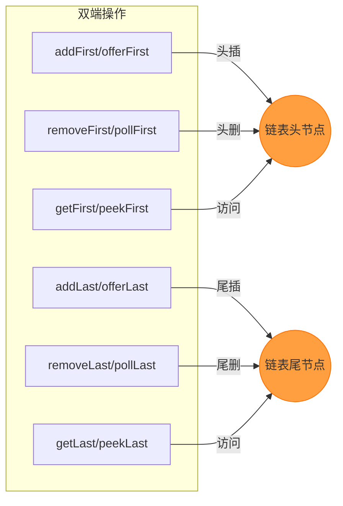

# 1.3.5 集合-LinkedList源码

## 一、核理论
### 1.1 LinkedList类结构分析
LinkedList是Java集合框架中基于双向链表实现的List接口实现类，同时实现了Deque接口，因此兼具列表和双端队列的特性。其核心特点是插入删除效率高（O(1)时间复杂度）、随机访问效率低（O(n)时间复杂度）、允许null元素、非线程安全。



### 1.2 核心成员变量与内部类
```java
// 双向链表的头节点
transient Node<E> first;

// 双向链表的尾节点
transient Node<E> last;

// 集合中的元素数量
transient int size = 0;

// 序列化版本号
private static final long serialVersionUID = 876323262645176354L;

/**
 * 双向链表节点内部类
 */
private static class Node<E> {
    // 节点存储的元素
    E item;
    // 指向下一个节点的引用
    Node<E> next;
    // 指向前一个节点的引用
    Node<E> prev;

    // 节点构造方法
    Node(Node<E> prev, E element, Node<E> next) {
        this.item = element;
        this.next = next;
        this.prev = prev;
    }
}
```

### 1.3 版本差异特性
| 版本 | 重要特性 |
|------|----------|
| JDK 1.2 | 首次引入LinkedList |
| JDK 1.4 | 实现Deque接口，新增双端队列相关方法 |
| JDK 5 | 支持泛型，引入`foreach`循环支持 |
| JDK 6 | 优化迭代器实现，增强快速失败机制 |
| JDK 8 | 新增`removeIf()`, `forEach()`, `spliterator()`等方法 |
| JDK 9 | 新增`of()`静态工厂方法，支持创建不可变LinkedList |
| JDK 16 | 新增`forEachRemaining(Consumer<? super E> action)`方法 |
| JDK 17 | 优化序列化机制，增强安全性 |

## 二、代码实践
### 2.1 构造方法实现
```java
/**
 * 无参构造方法，创建一个空的LinkedList
 */
public LinkedList() {
}

/**
 * 通过集合创建LinkedList的构造方法
 * @param c 包含要放入此列表的元素的集合
 * @throws NullPointerException 如果指定的集合为null
 */
public LinkedList(Collection<? extends E> c) {
    this();
    addAll(c);
}
```

### 2.2 添加元素核心方法
```java
/**
 * 在链表末尾添加指定元素
 * @param e 要添加的元素
 * @return true（始终返回true，符合Collection接口规范）
 */
public boolean add(E e) {
    linkLast(e);
    return true;
}

/**
 * 在指定位置插入元素
 * @param index 要插入元素的位置
 * @param element 要插入的元素
 * @throws IndexOutOfBoundsException 如果索引超出范围
 */
public void add(int index, E element) {
    // 检查索引是否合法
    checkPositionIndex(index);

    if (index == size) {
        // 如果索引等于元素数量，直接添加到末尾
        linkLast(element);
    } else {
        // 否则添加到指定节点之前
        linkBefore(element, node(index));
    }
}

/**
 * 将元素链接到链表末尾
 * @param e 要链接的元素
 */
void linkLast(E e) {
    // 保存尾节点
    final Node<E> l = last;
    // 创建新节点，前驱为当前尾节点，后继为null
    final Node<E> newNode = new Node<>(l, e, null);
    // 更新尾节点为新节点
    last = newNode;
    if (l == null) {
        // 如果原链表为空，头节点也指向新节点
        first = newNode;
    } else {
        // 否则原尾节点的后继指向新节点
        l.next = newNode;
    }
    // 元素数量加1
    size++;
    // 修改次数加1
    modCount++;
}

/**
 * 将元素链接到指定节点之前
 * @param e 要链接的元素
 * @param succ 指定的节点
 */
void linkBefore(E e, Node<E> succ) {
    // 获取指定节点的前驱
    final Node<E> pred = succ.prev;
    // 创建新节点，前驱为pred，后继为succ
    final Node<E> newNode = new Node<>(pred, e, succ);
    // 更新succ的前驱为新节点
    succ.prev = newNode;
    if (pred == null) {
        // 如果pred为null，说明succ是头节点，更新头节点为新节点
        first = newNode;
    } else {
        // 否则pred的后继指向新节点
        pred.next = newNode;
    }
    // 元素数量加1
    size++;
    // 修改次数加1
    modCount++;
}

/**
 * 检查位置索引是否合法
 * @param index 要检查的索引
 * @throws IndexOutOfBoundsException 如果索引超出范围
 */
private void checkPositionIndex(int index) {
    if (!isPositionIndex(index)) {
        throw new IndexOutOfBoundsException(outOfBoundsMsg(index));
    }
}

/**
 * 判断位置索引是否合法
 * @param index 要判断的索引
 * @return 如果索引在0到size之间则返回true
 */
private boolean isPositionIndex(int index) {
    return index >= 0 && index <= size;
}
```

### 2.3 获取和修改元素
```java
/**
 * 获取指定位置的元素
 * @param index 要获取的元素索引
 * @return 指定位置的元素
 * @throws IndexOutOfBoundsException 如果索引超出范围
 */
public E get(int index) {
    // 检查索引是否合法
    checkElementIndex(index);
    // 返回指定节点的元素
    return node(index).item;
}

/**
 * 修改指定位置的元素
 * @param index 要修改的元素索引
 * @param element 要设置的新元素
 * @return 被替换的旧元素
 * @throws IndexOutOfBoundsException 如果索引超出范围
 */
public E set(int index, E element) {
    // 检查索引是否合法
    checkElementIndex(index);
    // 获取指定节点
    Node<E> x = node(index);
    // 保存旧元素
    E oldVal = x.item;
    // 设置新元素
    x.item = element;
    // 返回旧元素
    return oldVal;
}

/**
 * 返回指定索引处的节点
 * @param index 要获取的节点索引
 * @return 指定索引处的节点
 */
Node<E> node(int index) {
    // 优化：如果索引在前半部分，从头节点开始遍历
    if (index < (size >> 1)) {
        Node<E> x = first;
        for (int i = 0; i < index; i++) {
            x = x.next;
        }
        return x;
    } else {
        // 如果索引在后半部分，从尾节点开始遍历
        Node<E> x = last;
        for (int i = size - 1; i > index; i--) {
            x = x.prev;
        }
        return x;
    }
}

/**
 * 检查元素索引是否合法
 * @param index 要检查的索引
 * @throws IndexOutOfBoundsException 如果索引超出范围
 */
private void checkElementIndex(int index) {
    if (!isElementIndex(index)) {
        throw new IndexOutOfBoundsException(outOfBoundsMsg(index));
    }
}

/**
 * 判断元素索引是否合法
 * @param index 要判断的索引
 * @return 如果索引在0到size-1之间则返回true
 */
private boolean isElementIndex(int index) {
    return index >= 0 && index < size;
}
```

### 2.4 删除元素操作
```java
/**
 * 删除指定位置的元素
 * @param index 要删除的元素索引
 * @return 被删除的元素
 * @throws IndexOutOfBoundsException 如果索引超出范围
 */
public E remove(int index) {
    // 检查索引是否合法
    checkElementIndex(index);
    // 解除指定节点的链接并返回其元素
    return unlink(node(index));
}

/**
 * 删除首次出现的指定元素
 * @param o 要删除的元素，如果为null则删除null元素
 * @return 如果列表包含指定元素则返回true
 */
public boolean remove(Object o) {
    if (o == null) {
        // 遍历链表寻找null元素
        for (Node<E> x = first; x != null; x = x.next) {
            if (x.item == null) {
                unlink(x);
                return true;
            }
        }
    } else {
        // 遍历链表寻找指定元素
        for (Node<E> x = first; x != null; x = x.next) {
            if (o.equals(x.item)) {
                unlink(x);
                return true;
            }
        }
    }
    return false;
}

/**
 * 解除指定节点的链接
 * @param x 要解除链接的节点
 * @return 被解除链接的节点的元素
 */
E unlink(Node<E> x) {
    // 获取节点的元素
    final E element = x.item;
    // 获取节点的后继
    final Node<E> next = x.next;
    // 获取节点的前驱
    final Node<E> prev = x.prev;

    if (prev == null) {
        // 如果前驱为null，说明是头节点，更新头节点为后继
        first = next;
    } else {
        // 否则前驱的后继指向后继
        prev.next = next;
        // 帮助GC回收，将节点的前驱置为null
        x.prev = null;
    }

    if (next == null) {
        // 如果后继为null，说明是尾节点，更新尾节点为前驱
        last = prev;
    } else {
        // 否则后继的前驱指向前驱
        next.prev = prev;
        // 帮助GC回收，将节点的后继置为null
        x.next = null;
    }

    // 帮助GC回收，将节点的元素置为null
    x.item = null;
    // 元素数量减1
    size--;
    // 修改次数加1
    modCount++;
    // 返回被删除的元素
    return element;
}

/**
 * 清空链表
 */
public void clear() {
    // 遍历链表，将所有节点的引用置为null，帮助GC回收
    for (Node<E> x = first; x != null; ) {
        Node<E> next = x.next;
        x.item = null;
        x.next = null;
        x.prev = null;
        x = next;
    }
    // 重置头节点和尾节点为null
    first = last = null;
    // 重置元素数量为0
    size = 0;
    // 修改次数加1
    modCount++;
}
```

### 2.5 双端队列特有方法
```java
/**
 * 在链表头部添加元素
 * @param e 要添加的元素
 */
public void addFirst(E e) {
    linkFirst(e);
}

/**
 * 在链表尾部添加元素
 * @param e 要添加的元素
 */
public void addLast(E e) {
    linkLast(e);
}

/**
 * 将元素链接到链表头部
 * @param e 要链接的元素
 */
private void linkFirst(E e) {
    // 保存头节点
    final Node<E> f = first;
    // 创建新节点，前驱为null，后继为当前头节点
    final Node<E> newNode = new Node<>(null, e, f);
    // 更新头节点为新节点
    first = newNode;
    if (f == null) {
        // 如果原链表为空，尾节点也指向新节点
        last = newNode;
    } else {
        // 否则原头节点的前驱指向新节点
        f.prev = newNode;
    }
    // 元素数量加1
    size++;
    // 修改次数加1
    modCount++;
}

/**
 * 获取头部元素
 * @return 头部元素
 * @throws NoSuchElementException 如果链表为空
 */
public E getFirst() {
    final Node<E> f = first;
    if (f == null) {
        throw new NoSuchElementException();
    }
    return f.item;
}

/**
 * 获取尾部元素
 * @return 尾部元素
 * @throws NoSuchElementException 如果链表为空
 */
public E getLast() {
    final Node<E> l = last;
    if (l == null) {
        throw new NoSuchElementException();
    }
    return l.item;
}

/**
 * 删除并返回头部元素
 * @return 头部元素
 * @throws NoSuchElementException 如果链表为空
 */
public E removeFirst() {
    final Node<E> f = first;
    if (f == null) {
        throw new NoSuchElementException();
    }
    return unlinkFirst(f);
}

/**
 * 删除并返回尾部元素
 * @return 尾部元素
 * @throws NoSuchElementException 如果链表为空
 */
public E removeLast() {
    final Node<E> l = last;
    if (l == null) {
        throw new NoSuchElementException();
    }
    return unlinkLast(l);
}

/**
 * 解除头节点的链接
 * @param f 头节点
 * @return 头节点的元素
 */
private E unlinkFirst(Node<E> f) {
    // 获取头节点的元素
    final E element = f.item;
    // 获取头节点的后继
    final Node<E> next = f.next;
    // 帮助GC回收，将头节点的元素和后继置为null
    f.item = null;
    f.next = null; // help GC
    // 更新头节点为后继
    first = next;
    if (next == null) {
        // 如果后继为null，说明链表为空，尾节点也置为null
        last = null;
    } else {
        // 否则后继的前驱置为null
        next.prev = null;
    }
    // 元素数量减1
    size--;
    // 修改次数加1
    modCount++;
    // 返回被删除的元素
    return element;
}

/**
 * 解除尾节点的链接
 * @param l 尾节点
 * @return 尾节点的元素
 */
private E unlinkLast(Node<E> l) {
    // 获取尾节点的元素
    final E element = l.item;
    // 获取尾节点的前驱
    final Node<E> prev = l.prev;
    // 帮助GC回收，将尾节点的元素和前驱置为null
    l.item = null;
    l.prev = null; // help GC
    // 更新尾节点为前驱
    last = prev;
    if (prev == null) {
        // 如果前驱为null，说明链表为空，头节点也置为null
        first = null;
    } else {
        // 否则前驱的后继置为null
        prev.next = null;
    }
    // 元素数量减1
    size--;
    // 修改次数加1
    modCount++;
    // 返回被删除的元素
    return element;
}
```

### 2.6 迭代器实现
```java
/**
 * 返回列表的迭代器
 * @return 列表的迭代器
 */
public Iterator<E> iterator() {
    return new ListItr(0);
}

/**
 * 返回从指定位置开始的列表迭代器
 * @param index 开始的位置
 * @return 列表迭代器
 */
public ListIterator<E> listIterator(int index) {
    checkPositionIndex(index);
    return new ListItr(index);
}

/**
 * 返回逆序迭代器
 * @return 逆序迭代器
 */
public Iterator<E> descendingIterator() {
    return new DescendingIterator();
}

/**
 * 列表迭代器实现
 */
private class ListItr implements ListIterator<E> {
    // 最后返回的节点
    private Node<E> lastReturned;
    // 下一个要返回的节点
    private Node<E> next;
    // 下一个要返回的节点的索引
    private int nextIndex;
    // 期望的修改次数
    private int expectedModCount = modCount;

    ListItr(int index) {
        // 断言index是否合法
        // assert isPositionIndex(index);
        next = (index == size) ? null : node(index);
        nextIndex = index;
    }

    /**
     * 判断是否还有下一个元素
     * @return 如果还有元素则返回true
     */
    public boolean hasNext() {
        return nextIndex < size;
    }

    /**
     * 获取下一个元素
     * @return 下一个元素
     * @throws NoSuchElementException 如果没有更多元素
     * @throws ConcurrentModificationException 如果检测到并发修改
     */
    public E next() {
        checkForComodification();
        if (!hasNext()) {
            throw new NoSuchElementException();
        }

        lastReturned = next;
        next = next.next;
        nextIndex++;
        return lastReturned.item;
    }

    /**
     * 判断是否还有前一个元素
     * @return 如果还有前一个元素则返回true
     */
    public boolean hasPrevious() {
        return nextIndex > 0;
    }

    /**
     * 获取前一个元素
     * @return 前一个元素
     * @throws NoSuchElementException 如果没有更多元素
     * @throws ConcurrentModificationException 如果检测到并发修改
     */
    public E previous() {
        checkForComodification();
        if (!hasPrevious()) {
            throw new NoSuchElementException();
        }

        lastReturned = next = (next == null) ? last : next.prev;
        nextIndex--;
        return lastReturned.item;
    }

    /**
     * 获取下一个元素的索引
     * @return 下一个元素的索引
     */
    public int nextIndex() {
        return nextIndex;
    }

    /**
     * 获取前一个元素的索引
     * @return 前一个元素的索引
     */
    public int previousIndex() {
        return nextIndex - 1;
    }

    /**
     * 删除当前元素
     * @throws IllegalStateException 如果没有下一个元素
     * @throws ConcurrentModificationException 如果检测到并发修改
     */
    public void remove() {
        checkForComodification();
        if (lastReturned == null) {
            throw new IllegalStateException();
        }

        Node<E> lastNext = lastReturned.next;
        unlink(lastReturned);
        if (next == lastReturned) {
            next = lastNext;
        } else {
            nextIndex--;
        }
        lastReturned = null;
        expectedModCount = modCount;
    }

    /**
     * 设置当前元素
     * @param e 要设置的元素
     * @throws IllegalStateException 如果没有下一个元素
     * @throws ConcurrentModificationException 如果检测到并发修改
     */
    public void set(E e) {
        if (lastReturned == null) {
            throw new IllegalStateException();
        }
        checkForComodification();
        lastReturned.item = e;
    }

    /**
     * 添加元素
     * @param e 要添加的元素
     * @throws ConcurrentModificationException 如果检测到并发修改
     */
    public void add(E e) {
        checkForComodification();
        lastReturned = null;
        if (next == null) {
            linkLast(e);
        } else {
            linkBefore(e, next);
        }
        nextIndex++;
        expectedModCount = modCount;
    }

    /**
     * 检查并发修改
     * @throws ConcurrentModificationException 如果修改次数不匹配
     */
    final void checkForComodification() {
        if (modCount != expectedModCount) {
            throw new ConcurrentModificationException();
        }
    }
}

/**
 * 逆序迭代器实现
 */
private class DescendingIterator implements Iterator<E> {
    private final ListItr itr = new ListItr(size());

    /**
     * 判断是否还有下一个元素（逆序）
     * @return 如果还有元素则返回true
     */
    public boolean hasNext() {
        return itr.hasPrevious();
    }

    /**
     * 获取下一个元素（逆序）
     * @return 下一个元素
     */
    public E next() {
        return itr.previous();
    }

    /**
     * 删除当前元素
     */
    public void remove() {
        itr.remove();
    }
}
```

## 三、设计思想
### 3.1 双向链表设计
LinkedList的核心设计思想是基于双向链表实现，每个节点包含前驱和后继引用，从而实现高效的插入和删除操作：


添加元素到尾部的流程：


### 3.2 索引访问优化
LinkedList针对索引访问进行了优化，通过判断索引位置在前半部分还是后半部分，选择从头节点或尾节点开始遍历，从而将最坏情况下的时间复杂度从O(n)优化为O(n/2)：


### 3.3 双端队列实现
LinkedList实现了Deque接口，通过维护头节点和尾节点的引用，实现了高效的双端操作：


### 3.4 与ArrayList的设计对比
| 特性 | ArrayList | LinkedList |
|------|-----------|------------|
| 数据结构 | 动态数组 | 双向链表 |
| 随机访问 | O(1) | O(n) |
| 头部插入/删除 | O(n) | O(1) |
| 尾部插入/删除 | O(1)（ amortized） | O(1) |
| 中间插入/删除 | O(n) | O(n)（查找节点耗时） |
| 内存占用 | 连续内存空间，可能有冗余容量 | 每个节点额外存储前后指针，内存开销更大 |
| 迭代效率 | 高（缓存友好） | 低（节点分散存储） |
| 扩容机制 | 需要扩容，复制数组 | 无需扩容 |

## 四、避坑指南
### 4.1 随机访问性能问题
**问题**：使用get(int index)进行随机访问时性能低下，时间复杂度为O(n)
**解决方案**：
```java
// 错误示例: 频繁使用get()方法访问元素
LinkedList<Integer> list = new LinkedList<>();
// 添加元素...
for (int i = 0; i < list.size(); i++) {
    Integer value = list.get(i); // 时间复杂度O(n^2)
    // 处理value...
}

// 正确方案1: 使用迭代器遍历
Iterator<Integer> iterator = list.iterator();
while (iterator.hasNext()) {
    Integer value = iterator.next(); // 时间复杂度O(n)
    // 处理value...
}

// 正确方案2: 使用增强for循环
for (Integer value : list) {
    // 处理value...
}

// 正确方案3: 如果需要随机访问，考虑使用ArrayList
List<Integer> list = new ArrayList<>(); // 随机访问O(1)
```

### 4.2 误用LinkedList作为栈或队列
**问题**：直接使用LinkedList的add()/remove()方法实现栈或队列，语义不清晰
**解决方案**：
```java
// 错误示例: 语义不清晰
LinkedList<String> stack = new LinkedList<>();
stack.add(stack.push("a")); // 混淆add和push
String top = stack.get(0); // 不直观

// 正确方案1: 使用Deque接口声明栈
Deque<String> stack = new LinkedList<>();
stack.push("a"); // 入栈
stack.push("b");
String top = stack.pop(); // 出栈，获取"b"

// 正确方案2: 使用Deque接口声明队列
Deque<String> queue = new LinkedList<>();
queue.offer("a"); // 入队
queue.offer("b");
String front = queue.poll(); // 出队，获取"a"

// 正确方案3: JDK 6+推荐使用ArrayDeque（性能更优）
Deque<String> stack = new ArrayDeque<>();
Deque<String> queue = new ArrayDeque<>();
```

### 4.3 并发修改异常
**问题**：在迭代过程中修改集合（如添加/删除元素）会抛出ConcurrentModificationException
**解决方案**：
```java
// 错误示例
LinkedList<String> list = new LinkedList<>();
list.add("a");
list.add("b");
list.add("c");

for (String item : list) {
    if (item.equals("b")) {
        list.remove(item); // 抛出ConcurrentModificationException
    }
}

// 正确方案1: 使用迭代器的remove()方法
Iterator<String> iterator = list.iterator();
while (iterator.hasNext()) {
    String item = iterator.next();
    if (item.equals("b")) {
        iterator.remove(); // 安全删除
    }
}

// 正确方案2: 使用ListIterator的add()/remove()方法
ListIterator<String> listIterator = list.listIterator();
while (listIterator.hasNext()) {
    String item = listIterator.next();
    if (item.equals("b")) {
        listIterator.remove(); // 安全删除
        listIterator.add("d"); // 安全添加
    }
}

// 正确方案3: 使用CopyOnWriteArrayList（高并发场景）
List<String> cowList = new CopyOnWriteArrayList<>(list);
for (String item : cowList) {
    if (item.equals("b")) {
        cowList.remove(item);
    }
}
```

### 4.4 内存泄漏风险
**问题**：LinkedList可能导致内存泄漏，特别是在迭代过程中保留节点引用时
**解决方案**：
```java
public class MemoryLeakExample {
    private LinkedList<Object> list = new LinkedList<>();
    private Node<Object> lastNode; // 可能导致内存泄漏

    public void processList() {
        Iterator<Object> iterator = list.iterator();
        while (iterator.hasNext()) {
            Object item = iterator.next();
            // 错误示例: 保存节点引用
            if (item.equals("target")) {
                // 注意：这里只是演示，实际无法直接获取Node对象
                // lastNode = (Node<Object>) item;
            }
        }
    }

    // 正确方案: 不保留节点引用，只保存必要数据
    public void correctProcessList() {
        Object targetData = null;
        for (Object item : list) {
            if (item.equals("target")) {
                targetData = item; // 只保存数据，不保存节点
                break;
            }
        }
        // 使用targetData...
    }

    // 正确方案: 清空列表时确保所有引用被释放
    public void clearList() {
        list.clear(); // 内部会将所有节点的引用置为null
        // 如果有其他引用，也需要置为null
        // lastNode = null;
    }
}
```

### 4.5 错误的集合转换
**问题**：将LinkedList转换为数组时使用toArray()方法，可能导致类型转换异常
**解决方案**：
```java
LinkedList<String> list = new LinkedList<>();
list.add("a");
list.add("b");

// 错误示例
String[] array = (String[]) list.toArray(); // 抛出ClassCastException

// 正确方案1: 使用带参数的toArray()方法
String[] array = list.toArray(new String[0]);

// 正确方案2: 指定数组大小（更高效）
String[] array = list.toArray(new String[list.size()]);

// 正确方案3: JDK 8+使用Stream API
String[] array = list.stream().toArray(String[]::new);
```

## 五、深度思考题
### 思考题1: LinkedList和ArrayList的性能对比及适用场景
**思考题回答**:
LinkedList和ArrayList作为List接口的两个主要实现类，在性能和适用场景上有显著差异：

**性能对比**:
1. **随机访问**：
   - ArrayList：O(1)时间复杂度，基于数组的直接索引访问
   - LinkedList：O(n)时间复杂度，需要从头或尾遍历节点
   - 差距在大数据量时尤为明显，ArrayList优势显著

2. **插入删除操作**：
   - 头部操作：LinkedList为O(1)，ArrayList为O(n)
   - 尾部操作：两者均为O(1)（ArrayList在需要扩容时为O(n)）
   - 中间操作：两者均为O(n)，但原因不同：
     * ArrayList：需要移动元素
     * LinkedList：需要遍历找到目标节点
   - 小数据量时差异不明显，大数据量时LinkedList在头部操作有优势

3. **内存占用**：
   - ArrayList：连续内存空间，可能有未使用的容量
   - LinkedList：每个节点需要额外存储前后指针，内存开销更大
   - 数据量越大，LinkedList的内存劣势越明显

4. **迭代性能**：
   - ArrayList：由于内存连续性，缓存命中率高，迭代速度快
   - LinkedList：节点分散存储，缓存命中率低，迭代速度慢

**适用场景**:
- **优先选择ArrayList**：
  - 需要频繁随机访问元素
  - 元素数量相对稳定，插入删除操作较少
  - 遍历操作频繁
  - 内存资源有限

- **优先选择LinkedList**：
  - 需要频繁在头部或尾部进行插入删除操作
  - 实现栈或队列数据结构
  - 元素数量不确定，频繁进行插入删除操作
  - 不需要随机访问元素

- **特殊场景**：
  - 实现LRU缓存：LinkedList的removeLast()和addFirst()可高效实现
  - 实现双端队列：LinkedList实现了Deque接口，功能完善
  - 高并发场景：两者均非线程安全，需额外同步或使用CopyOnWriteArrayList

**最佳实践**：
在大多数业务场景中，ArrayList的综合性能优于LinkedList，除非有明确的频繁头部操作需求，否则建议优先使用ArrayList。

### 思考题2: LinkedList如何实现LRU缓存
**思考题回答**:
LRU（Least Recently Used，最近最少使用）缓存是一种常见的缓存淘汰策略，当缓存满时，会淘汰最近最少使用的元素。LinkedList可以与HashMap结合实现LRU缓存：

**实现原理**：
1. 使用LinkedList维护元素的访问顺序，最近访问的元素移到头部，最少访问的元素在尾部
2. 使用HashMap提供O(1)时间复杂度的查找
3. 当缓存满时，删除LinkedList尾部元素

**代码实现**：
```java
import java.util.*;

public class LRUCache<K, V> {
    // 缓存容量
    private final int capacity;
    // 存储键值对，提供O(1)查找
    private final Map<K, Node> cacheMap;
    // 维护访问顺序，头部为最近访问，尾部为最少访问
    private final LinkedList<Node> accessOrder;

    // 节点类，存储键和值
    private class Node {
        K key;
        V value;

        Node(K key, V value) {
            this.key = key;
            this.value = value;
        }
    }

    // 构造方法，指定缓存容量
    public LRUCache(int capacity) {
        if (capacity <= 0) {
            throw new IllegalArgumentException("Capacity must be positive");
        }
        this.capacity = capacity;
        this.cacheMap = new HashMap<>(capacity);
        this.accessOrder = new LinkedList<>();
    }

    /**
     * 获取缓存中的值
     * @param key 键
     * @return 值，如果不存在返回null
     */
    public V get(K key) {
        if (!cacheMap.containsKey(key)) {
            return null;
        }

        // 获取节点
        Node node = cacheMap.get(key);
        // 将节点移到头部，表示最近访问
        accessOrder.remove(node);
        accessOrder.addFirst(node);

        return node.value;
    }

    /**
     * 向缓存中放入键值对
     * @param key 键
     * @param value 值
     */
    public void put(K key, V value) {
        if (cacheMap.containsKey(key)) {
            // 如果键已存在，更新值并移到头部
            Node node = cacheMap.get(key);
            node.value = value;
            accessOrder.remove(node);
            accessOrder.addFirst(node);
            return;
        }

        // 如果缓存已满，删除最少访问的元素（尾部元素）
        if (cacheMap.size() >= capacity) {
            Node leastUsed = accessOrder.removeLast();
            cacheMap.remove(leastUsed.key);
        }

        // 添加新节点到头部
        Node newNode = new Node(key, value);
        accessOrder.addFirst(newNode);
        cacheMap.put(key, newNode);
    }

    /**
     * 移除缓存中的键值对
     * @param key 键
     * @return 被移除的值，如果不存在返回null
     */
    public V remove(K key) {
        if (!cacheMap.containsKey(key)) {
            return null;
        }

        Node node = cacheMap.remove(key);
        accessOrder.remove(node);
        return node.value;
    }

    /**
     * 清空缓存
     */
    public void clear() {
        cacheMap.clear();
        accessOrder.clear();
    }

    /**
     * 获取缓存大小
     * @return 缓存大小
     */
    public int size() {
        return cacheMap.size();
    }
}
```

**性能分析**：
- get操作：HashMap查找O(1)，LinkedList的remove(node)操作O(n)，整体O(n)
- put操作：最坏情况下O(n)（需要删除尾部元素并添加新元素）
- 空间复杂度：O(capacity)

**JDK中的实现**：
JDK提供了LinkedHashMap类，通过设置accessOrder=true可以直接实现LRU缓存功能，其内部也是通过双向链表维护访问顺序。

**优化建议**：
上述实现中，LinkedList的remove(node)操作是O(n)时间复杂度，可以通过使用自定义双向链表并维护节点引用，将其优化为O(1)时间复杂度，这也是LinkedHashMap的实现方式。

### 思考题3: LinkedList的线程安全问题及解决方案
**思考题回答**:
LinkedList是非线程安全的集合类，在多线程环境下进行并发修改可能导致数据不一致或ConcurrentModificationException异常。解决LinkedList的线程安全问题有以下几种方案：

**1. 使用Collections.synchronizedList()**
```java
// 创建线程安全的LinkedList
List<String> syncList = Collections.synchronizedList(new LinkedList<>());

// 使用方式
// 读操作
String element = syncList.get(0);

// 写操作
syncList.add("element");

// 迭代操作（需要手动同步）
synchronized (syncList) {
    Iterator<String> iterator = syncList.iterator();
    while (iterator.hasNext()) {
        String element = iterator.next();
        // 处理元素
    }
}
```
原理：通过包装器模式，为所有方法添加synchronized同步块，保证线程安全。
优点：实现简单，适用于并发度不高的场景。
缺点：
- 性能较差，每次操作都需要获取锁
- 迭代操作需要手动同步，否则可能抛出ConcurrentModificationException
- 可能导致线程竞争和阻塞

**2. 使用CopyOnWriteArrayList**
```java
// 创建CopyOnWriteArrayList（虽然不是LinkedList，但可作为替代方案）
List<String> cowList = new CopyOnWriteArrayList<>();

// 使用方式
cowList.add("element");
String element = cowList.get(0);

// 迭代操作（无需同步）
for (String item : cowList) {
    // 处理元素
}
```
原理：写时复制机制，修改操作会创建新数组并复制元素，然后替换旧数组引用。
优点：
- 读操作无锁，性能极高
- 迭代操作不会抛出ConcurrentModificationException
- 适合读多写少的高并发场景
缺点：
- 不是LinkedList实现，而是ArrayList的变体
- 写操作成本高，需要复制整个数组
- 内存占用大，可能导致GC压力
- 数据一致性较弱，读取的可能是旧数据

**3. 使用显式锁（ReentrantLock）**
```java
import java.util.LinkedList;
import java.util.List;
import java.util.concurrent.locks.Lock;
import java.util.concurrent.locks.ReentrantLock;

public class LockedLinkedList<E> {
    private final List<E> list = new LinkedList<>();
    private final Lock lock = new ReentrantLock();

    public boolean add(E e) {
        lock.lock();
        try {
            return list.add(e);
        } finally {
            lock.unlock();
        }
    }

    public E get(int index) {
        lock.lock();
        try {
            return list.get(index);
        } finally {
            lock.unlock();
        }
    }

    // 实现其他必要方法...
}
```
原理：使用可重入锁实现同步，支持更灵活的锁定策略。
优点：
- 可灵活控制锁定粒度
- 支持尝试锁定、超时锁定等高级特性
- 可中断锁获取
缺点：
- 实现复杂，需要手动管理锁的获取和释放
- 仍需注意迭代操作的线程安全

**4. 使用ConcurrentLinkedDeque**
```java
import java.util.concurrent.ConcurrentLinkedDeque;

// 创建并发安全的双端队列
ConcurrentLinkedDeque<String> concurrentDeque = new ConcurrentLinkedDeque<>();

// 使用方式
concurrentDeque.add("element");
String element = concurrentDeque.getFirst();
```
原理：基于无锁算法（CAS）实现的并发双端队列。
优点：
- 真正的并发集合，支持高并发场景
- 无锁设计，避免线程阻塞
- 实现了Deque接口，功能与LinkedList类似
- 迭代器弱一致性，不会抛出ConcurrentModificationException
缺点：
- JDK 7+才提供
- 内存占用较大
- 某些操作的实现复杂

**选择建议**：
- 低并发场景：Collections.synchronizedList()简单易用
- 读多写少场景：CopyOnWriteArrayList性能最优
- 高并发场景：ConcurrentLinkedDeque是最佳选择
- 需要细粒度控制：使用ReentrantLock自定义实现

**注意事项**：
- 即使使用了线程安全的包装，复合操作（如"检查-然后-执行"）仍需额外同步
- 例如：if (!list.contains(element)) { list.add(element); }
- 这种情况需要使用外部同步机制保证原子性