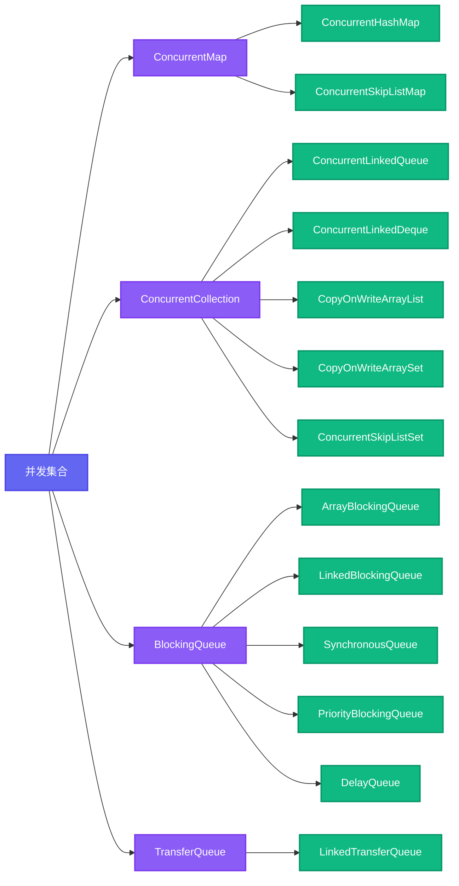
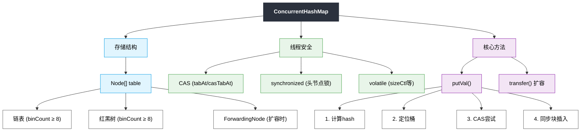
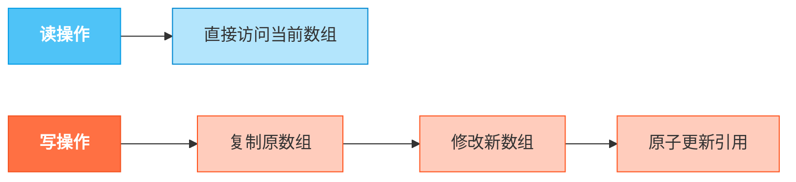

# 1.3.5 集合-并发集合

## 一、核心理论
### 1.1 并发集合概述
并发集合是Java集合框架中专门为多线程环境设计的集合类，位于java.util.concurrent包下。它们通过精细的同步机制或无锁算法，在保证线程安全的同时提供了较高的并发性能，解决了传统集合在多线程环境下需要手动同步的问题。

### 1.2 并发集合体系


### 1.3 并发集合对比
| 集合类 | 底层结构 | 并发机制 | 读写性能 | 迭代特性 | 适用场景 |
|--------|----------|----------|----------|----------|----------|
| ConcurrentHashMap | 数组+链表+红黑树 | 分段锁/CAS+synchronized | 高 | 弱一致性 | 高并发键值对存储 |
| CopyOnWriteArrayList | 数组 | 写时复制 | 读高写低 | 弱一致性 | 读多写少场景 |
| ConcurrentLinkedQueue | 链表 | CAS | 高 | 弱一致性 | 高并发FIFO队列 |
| ArrayBlockingQueue | 数组 | 显式锁 | 中 | 弱一致性 | 有界缓冲区 |
| LinkedBlockingQueue | 链表 | 显式锁 | 中 | 弱一致性 | 无界/有界缓冲区 |
| SynchronousQueue | 无缓冲 | 转移机制 | 高 | 不支持 | 线程间直接通信 |
| ConcurrentSkipListMap | 跳表 | CAS | 高 | 弱一致性 | 有序并发映射 |

### 1.4 并发级别
并发集合的并发度设计：
- **分段锁**：将数据分成多个段，每段单独加锁（如ConcurrentHashMap早期版本）
- **CAS操作**：无锁算法，通过比较并交换实现原子操作
- **写时复制**：写操作时复制整个数组，读操作无锁（如CopyOnWriteArrayList）
- **分离锁**：读写操作使用不同的锁（如LinkedBlockingQueue的takeLock和putLock）

### 1.5 JDK版本演进
- **JDK 1.5**：引入ConcurrentHashMap、ConcurrentLinkedQueue等早期并发集合
- **JDK 1.6**：优化ConcurrentHashMap性能，引入TransferQueue
- **JDK 1.7**：ConcurrentHashMap使用分段锁（Segment）实现
- **JDK 1.8**：ConcurrentHashMap彻底重构，使用CAS+synchronized替代分段锁
- **JDK 9**：新增不可变集合工厂方法，如List.of()、Map.of()
- **JDK 16**：ConcurrentHashMap新增stream()相关方法优化

## 二、代码实践
### 2.1 ConcurrentHashMap使用示例
```java
import java.util.Map;
import java.util.concurrent.ConcurrentHashMap;
import java.util.concurrent.ExecutorService;
import java.util.concurrent.Executors;
import java.util.concurrent.TimeUnit;

/**
 * ConcurrentHashMap并发操作示例
 * 展示高并发环境下的安全读写操作
 */
public class ConcurrentHashMapExample {
    private static final int THREAD_COUNT = 10;
    private static final int OPERATIONS_PER_THREAD = 10000;
    private static final Map<String, Integer> concurrentMap = new ConcurrentHashMap<>();

    public static void main(String[] args) throws InterruptedException {
        // 初始化计数器
        concurrentMap.put("counter", 0);

        // 创建线程池
        ExecutorService executor = Executors.newFixedThreadPool(THREAD_COUNT);

        // 提交增量任务
        for (int i = 0; i < THREAD_COUNT; i++) {
            executor.submit(() -> {
                for (int j = 0; j < OPERATIONS_PER_THREAD; j++) {
                    // 原子操作: increment by 1
                    concurrentMap.computeIfPresent("counter", (k, v) -> v + 1);
                }
            });
        }

        // 关闭线程池并等待完成
        executor.shutdown();
        executor.awaitTermination(1, TimeUnit.MINUTES);

        // 输出结果
        System.out.println("预期结果: " + (THREAD_COUNT * OPERATIONS_PER_THREAD));
        System.out.println("实际结果: " + concurrentMap.get("counter"));
    }
}
```

### 2.2 CopyOnWriteArrayList使用示例
```java
import java.util.Iterator;
import java.util.List;
import java.util.concurrent.CopyOnWriteArrayList;
import java.util.concurrent.ExecutorService;
import java.util.concurrent.Executors;
import java.util.concurrent.TimeUnit;

/**
 * CopyOnWriteArrayList使用示例
 * 展示读多写少场景下的并发安全
 */
public class CopyOnWriteArrayListExample {
    private static final List<String> cowList = new CopyOnWriteArrayList<>();

    public static void main(String[] args) throws InterruptedException {
        // 初始化列表
        cowList.add("元素1");
        cowList.add("元素2");
        cowList.add("元素3");

        // 创建线程池
        ExecutorService executor = Executors.newFixedThreadPool(2);

        // 读线程
        executor.submit(() -> {
            System.out.println("读线程开始遍历");
            Iterator<String> iterator = cowList.iterator();
            while (iterator.hasNext()) {
                String element = iterator.next();
                System.out.println("读取元素: " + element);
                try {
                    Thread.sleep(1000); // 模拟读取耗时
                } catch (InterruptedException e) {
                    Thread.currentThread().interrupt();
                }
            }
        });

        // 写线程
        executor.submit(() -> {
            try {
                Thread.sleep(500); // 等待读线程开始遍历
                System.out.println("写线程添加元素");
                cowList.add("元素4");
                System.out.println("写线程修改完成，当前列表大小: " + cowList.size());
            } catch (InterruptedException e) {
                Thread.currentThread().interrupt();
            }
        });

        // 关闭线程池
        executor.shutdown();
        executor.awaitTermination(5, TimeUnit.SECONDS);

        // 最终列表内容
        System.out.println("最终列表内容: " + cowList);
    }
}
```

### 2.3 并发队列性能对比
```java
import java.util.Queue;
import java.util.concurrent.*;

/**
 * 不同并发队列的性能对比测试
 */
public class ConcurrentQueuePerformanceTest {
    private static final int THREADS = 4;
    private static final int OPERATIONS = 100000;

    public static void main(String[] args) {
        testQueue("ConcurrentLinkedQueue", new ConcurrentLinkedQueue<>());
        testQueue("ArrayBlockingQueue", new ArrayBlockingQueue<>(1000));
        testQueue("LinkedBlockingQueue", new LinkedBlockingQueue<>());
        testQueue("SynchronousQueue", new SynchronousQueue<>());
    }

    private static void testQueue(String name, Queue<Integer> queue) {
        ExecutorService executor = Executors.newFixedThreadPool(THREADS);
        long startTime = System.nanoTime();

        // 生产者
        Runnable producer = () -> {
            for (int i = 0; i < OPERATIONS; i++) {
                try {
                    queue.add(i);
                } catch (Exception e) {
                    e.printStackTrace();
                }
            }
        };

        // 消费者
        Runnable consumer = () -> {
            for (int i = 0; i < OPERATIONS; i++) {
                try {
                    queue.poll();
                } catch (Exception e) {
                    e.printStackTrace();
                }
            }
        };

        // 提交任务
        executor.submit(producer);
        executor.submit(consumer);
        executor.submit(producer);
        executor.submit(consumer);

        // 等待完成
        executor.shutdown();
        try {
            executor.awaitTermination(1, TimeUnit.MINUTES);
        } catch (InterruptedException e) {
            Thread.currentThread().interrupt();
        }

        // 计算耗时
        long duration = (System.nanoTime() - startTime) / 1_000_000;
        System.out.printf("%s: 耗时 %d ms, 最终大小: %d%n", name, duration, queue.size());
    }
}
```

### 2.4 并发集合在实际项目中的应用
```java
import java.util.Map;
import java.util.Set;
import java.util.concurrent.ConcurrentHashMap;
import java.util.concurrent.CopyOnWriteArraySet;

/**
 * 并发集合在实际项目中的应用示例
 * 实现一个线程安全的用户会话管理器
 */
public class ConcurrentSessionManager {
    // 存储用户会话: 用户ID -> 会话对象
    private final Map<String, Session> sessions = new ConcurrentHashMap<>();
    // 存储在线用户ID
    private final Set<String> onlineUsers = new CopyOnWriteArraySet<>();

    /**
     * 创建新会话
     */
    public Session createSession(String userId) {
        // 原子操作: 如果不存在则创建
        Session session = sessions.computeIfAbsent(userId, k -> new Session(userId));
        onlineUsers.add(userId);
        return session;
    }

    /**
     * 获取会话
     */
    public Session getSession(String userId) {
        return sessions.get(userId);
    }

    /**
     * 销毁会话
     */
    public void destroySession(String userId) {
        sessions.remove(userId);
        onlineUsers.remove(userId);
    }

    /**
     * 获取在线用户数
     */
    public int getOnlineUserCount() {
        return onlineUsers.size();
    }

    /**
     * 会话类
     */
    public static class Session {
        private final String userId;
        private final long createTime;
        private long lastAccessTime;

        public Session(String userId) {
            this.userId = userId;
            this.createTime = System.currentTimeMillis();
            this.lastAccessTime = createTime;
        }

        // 省略getter和setter
    }
}
```

## 三、设计思想
### 3.1 ConcurrentHashMap实现原理
JDK 8中ConcurrentHashMap的实现：


核心优化点：
1. **取消分段锁**：使用CAS+synchronized实现更细粒度的同步
2. **红黑树转换**：链表长度超过阈值(8)时转为红黑树
3. **volatile可见性**：节点值和next指针使用volatile修饰
4. **懒加载初始化**：首次使用时才初始化数组
5. **并发扩容**：支持多线程同时参与扩容

### 3.2 写时复制容器原理
CopyOnWriteArrayList的实现机制：


优缺点分析：
- **优点**：读操作无锁，性能高；读多写少场景下效率极高
- **缺点**：写操作复制整个数组，内存开销大；数据一致性弱

### 3.3 非阻塞队列算法
ConcurrentLinkedQueue采用Michael-Scott非阻塞队列算法：
1. 使用CAS操作实现无锁入队和出队
2. 维护头节点和尾节点的volatile引用
3. 允许短暂的不一致状态，但最终会达到一致
4. 失败重试机制保证操作最终成功

### 3.4 并发集合的迭代特性
并发集合的迭代器特性：
- **弱一致性**：迭代器可以看到迭代开始时的元素，可能看不到后续修改
- **快速失败**：传统集合的迭代器在检测到并发修改时抛出ConcurrentModificationException
- **安全失败**：并发集合的迭代器从不抛出ConcurrentModificationException

## 四、避坑指南
### 4.1 ConcurrentHashMap常见问题
#### 4.1.1 size()方法的陷阱
**问题**：ConcurrentHashMap的size()方法返回的不是精确值
**解决方案**：
```java
ConcurrentHashMap<String, Integer> map = new ConcurrentHashMap<>();
// 添加元素...

// 错误: 期望精确计数
int size = map.size(); // 可能不是最新值

// 正确: 需要精确计数时使用
long accurateSize = map.mappingCount(); // JDK 8+提供，返回long类型

// 更好的方式: 避免依赖精确计数
// 设计不需要精确知道集合大小的算法
```

#### 4.1.2 原子操作的重要性
**问题**：错误地组合多个操作，导致竞态条件
**解决方案**：
```java
ConcurrentHashMap<String, Integer> map = new ConcurrentHashMap<>();

// 错误: 非原子操作组合
if (map.containsKey("key")) {
    map.put("key", map.get("key") + 1); // 存在竞态条件
}

// 正确: 使用原子方法
map.computeIfPresent("key", (k, v) -> v + 1);

// 或者
map.putIfAbsent("key", 0);
map.compute("key", (k, v) -> v + 1);

// 对于简单计数
map.merge("key", 1, Integer::sum);
```

### 4.2 CopyOnWriteArrayList使用误区
#### 4.2.1 内存占用问题
**问题**：在大数据量和频繁修改场景下使用CopyOnWriteArrayList
**解决方案**：
```java
// 错误: 大数据量频繁修改场景
List<LargeObject> list = new CopyOnWriteArrayList<>();
for (int i = 0; i < 100000; i++) {
    list.add(new LargeObject()); // 每次添加都会复制整个数组
}

// 正确: 根据场景选择合适的集合
if (readHeavy && writeRare) {
    // 读多写少场景使用CopyOnWriteArrayList
    List<LargeObject> list = new CopyOnWriteArrayList<>();
} else if (concurrentModification) {
    // 一般并发场景使用ConcurrentLinkedQueue或其他
    Queue<LargeObject> queue = new ConcurrentLinkedQueue<>();
} else {
    // 单线程或低并发场景使用普通ArrayList
    List<LargeObject> list = new ArrayList<>();
    // 手动同步
    Collections.synchronizedList(list);
}
```

#### 4.2.2 迭代器数据一致性
**问题**：期望迭代器反映最新数据
**解决方案**：
```java
CopyOnWriteArrayList<String> list = new CopyOnWriteArrayList<>();
list.add("a");
list.add("b");

Iterator<String> iterator = list.iterator();
list.add("c");

// 迭代器不会看到添加的"c"元素
while (iterator.hasNext()) {
    System.out.println(iterator.next()); // 只输出a和b
}

// 如果需要最新数据，应重新获取迭代器
iterator = list.iterator();
while (iterator.hasNext()) {
    System.out.println(iterator.next()); // 输出a、b和c
}
```

### 4.3 阻塞队列使用不当
#### 4.3.1 队列容量设置不合理
**问题**：ArrayBlockingQueue容量设置过小导致频繁阻塞
**解决方案**：
```java
// 错误: 容量设置过小
BlockingQueue<String> queue = new ArrayBlockingQueue<>(10);

// 正确: 根据实际吞吐量设置合理容量
int expectedThroughput = 1000;
BlockingQueue<String> queue = new ArrayBlockingQueue<>(expectedThroughput / 2);

// 或者使用可动态调整的容量策略
BlockingQueue<String> queue = new LinkedBlockingQueue<>(); // 无界队列

// 或者使用饱和策略
RejectedExecutionHandler handler = new ThreadPoolExecutor.CallerRunsPolicy();
ThreadPoolExecutor executor = new ThreadPoolExecutor(
    corePoolSize, maxPoolSize, keepAliveTime, unit, queue, handler);
```

## 五、深度思考题
### 思考题1: ConcurrentHashMap在JDK 7和JDK 8中的实现差异
**思考题回答**:
ConcurrentHashMap在JDK 7和JDK 8中的实现有显著差异：

1. **锁机制**：
   - JDK 7: 使用分段锁(Segment)，将整个数组分成多个Segment，每个Segment是一个小的HashMap，拥有独立的锁
   - JDK 8: 取消分段锁，使用CAS+synchronized实现同步，只锁定链表头节点或红黑树的根节点

2. **数据结构**：
   - JDK 7: Segment数组 + HashEntry数组 + 链表
   - JDK 8: Node数组 + 链表/红黑树，与HashMap结构类似

3. **并发度**：
   - JDK 7: 并发度由Segment数量决定，默认16，且不可动态调整
   - JDK 8: 理论上并发度为数组长度，可动态扩容，并发性能更高

4. **扩容机制**：
   - JDK 7: 每个Segment独立扩容，扩容粒度大
   - JDK 8: 支持多线程并发扩容，每个线程负责一部分桶的迁移

5. **功能增强**：
   - JDK 8新增了compute(), forEach(), merge()等原子操作方法
   - 支持Stream API和Lambda表达式

这些改进使JDK 8的ConcurrentHashMap在高并发场景下具有更好的性能和可扩展性。

### 思考题2: 如何选择合适的并发集合
**思考题回答**:
选择并发集合应考虑以下因素：

1. **数据结构需求**：
   - 键值对存储：ConcurrentHashMap、ConcurrentSkipListMap
   - 列表存储：CopyOnWriteArrayList、ConcurrentLinkedQueue
   - 队列操作：根据是否阻塞、是否有界、是否需要优先级选择

2. **操作类型比例**：
   - 读多写少：CopyOnWriteArrayList、CopyOnWriteArraySet
   - 读写均衡：ConcurrentHashMap、ConcurrentLinkedQueue
   - 写操作频繁：考虑ConcurrentHashMap或阻塞队列

3. **线程安全需求**：
   - 强一致性：阻塞队列如ArrayBlockingQueue
   - 弱一致性：ConcurrentHashMap、ConcurrentLinkedQueue
   - 原子操作支持：优先选择提供原子方法的集合

4. **性能要求**：
   - 高并发读：CopyOnWriteArrayList性能最佳
   - 高并发写：ConcurrentHashMap (JDK8+)性能优异
   - 有序性需求：ConcurrentSkipListMap/Set提供排序功能

5. **内存占用**：
   - 大数据量：避免使用CopyOnWrite容器
   - 小数据量：CopyOnWrite容器的性能优势更明显

选择流程建议：先确定数据结构类型，再根据读写比例和一致性需求选择具体实现，最后进行性能测试验证。

### 思考题3: 并发集合的弱一致性实现原理
**思考题回答**:
并发集合的弱一致性(weakly consistent)是指：

1. **定义**：迭代器可以看到迭代开始时集合的状态，可能看不到迭代过程中的修改，但不会抛出ConcurrentModificationException

2. **实现原理**：
   - **ConcurrentHashMap**：迭代器遍历的是数组的快照，对于已遍历的节点，即使发生修改也不会影响迭代结果
   - **ConcurrentLinkedQueue**：迭代器保存了初始节点引用，后续修改不会影响已创建的迭代器
   - **CopyOnWriteArrayList**：迭代器基于创建时的数组快照，后续修改操作会创建新数组，不影响旧迭代器

3. **实现机制**：
   - 使用volatile变量保证节点引用的可见性
   - 不使用快速失败机制(fail-fast)，避免抛出ConcurrentModificationException
   - 迭代过程中不加锁，允许并发修改
   - 通过内存屏障或原子操作保证部分操作的有序性

4. **优缺点**：
   - **优点**：迭代过程中不需要加锁，性能高；不会抛出异常中断迭代
   - **缺点**：可能读取到过期数据；无法保证数据的实时一致性

弱一致性是并发性能和数据一致性之间的权衡，适用于可以接受短暂数据不一致的高并发场景。

### 思考题4: 如何实现一个自定义的并发安全集合
**思考题回答**:
实现自定义并发安全集合可采用以下方案：

1. **基于现有并发集合封装**：
```java
public class CustomConcurrentSet<T> {
    private final ConcurrentHashMap<T, Boolean> backingMap;

    public CustomConcurrentSet() {
        this.backingMap = new ConcurrentHashMap<>();
    }

    public boolean add(T element) {
        return backingMap.putIfAbsent(element, Boolean.TRUE) == null;
    }

    public boolean remove(T element) {
        return backingMap.remove(element) != null;
    }

    public boolean contains(T element) {
        return backingMap.containsKey(element);
    }

    // 其他方法...
}
```

2. **基于锁机制实现**：
```java
import java.util.*;
import java.util.concurrent.locks.ReentrantLock;

public class LockBasedConcurrentList<T> {
    private final List<T> list = new ArrayList<>();
    private final ReentrantLock lock = new ReentrantLock();

    public void add(T element) {
        lock.lock();
        try {
            list.add(element);
        } finally {
            lock.unlock();
        }
    }

    public T get(int index) {
        lock.lock();
        try {
            return list.get(index);
        } finally {
            lock.unlock();
        }
    }

    // 其他方法...
}
```

3. **基于CAS操作实现**：
```java
import java.util.concurrent.atomic.AtomicReference;

public class CASBasedStack<T> {
    private static class Node<T> {
        T value;
        Node<T> next;

        Node(T value, Node<T> next) {
            this.value = value;
            this.next = next;
        }
    }

    private final AtomicReference<Node<T>> top = new AtomicReference<>();

    public void push(T value) {
        Node<T> newNode;
        Node<T> currentTop;
        do {
            currentTop = top.get();
            newNode = new Node<>(value, currentTop);
        } while (!top.compareAndSet(currentTop, newNode));
    }

    public T pop() {
        Node<T> currentTop;
        Node<T> newTop;
        do {
            currentTop = top.get();
            if (currentTop == null) {
                return null;
            }
            newTop = currentTop.next;
        } while (!top.compareAndSet(currentTop, newTop));
        return currentTop.value;
    }
}
```

实现要点：
1. 选择合适的基础数据结构
2. 根据并发需求选择同步机制（锁、CAS或两者结合）
3. 实现原子操作避免竞态条件
4. 考虑迭代器的一致性保证
5. 提供适当的性能优化（如锁粒度控制、无锁设计）
6. 进行充分的并发测试验证线程安全性