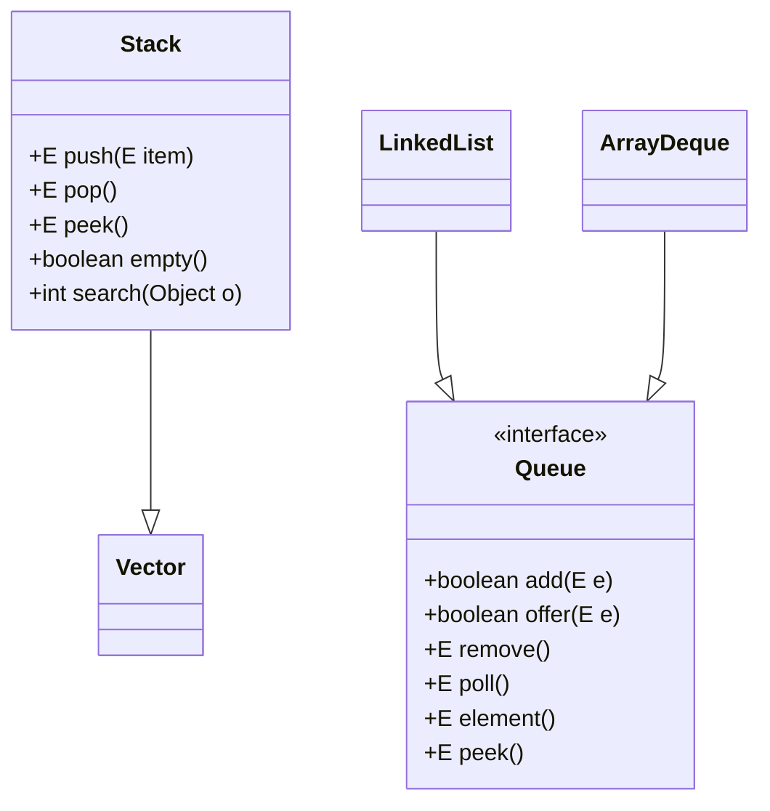
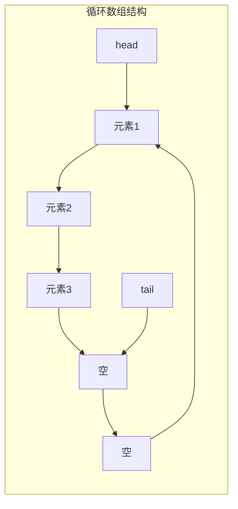

# 1.3.6 集合-Stack&Queue源码

## 一、核理论
### 1.1 Stack与Queue类结构分析
Stack是基于Vector实现的后进先出(LIFO)数据结构，而Queue接口则提供了先进先出(FIFO)的规范，主要实现类包括ArrayDeque、LinkedList等。



### 1.2 核心成员变量
- Stack: 继承Vector，底层使用数组存储元素
- ArrayDeque: 使用循环数组实现，维护head和tail指针
- LinkedList: 基于双向链表实现，维护first和last指针

### 1.3 JDK版本特性差异
- JDK 1.0: 引入Stack类
- JDK 1.5: 引入Queue接口及LinkedList实现
- JDK 1.6: 引入ArrayDeque，提供更高效的双端队列实现
- JDK 21: 未对Stack和Queue接口做重大修改，但ArrayDeque性能持续优化

## 二、代码实践
### 2.1 Stack核心方法实现
```java
/**
 * 栈的入栈操作
 * @param item 要入栈的元素
 * @return 入栈的元素
 */
public E push(E item) {
    addElement(item);
    return item;
}

/**
 * 栈的出栈操作
 * @return 出栈的元素
 * @throws EmptyStackException 如果栈为空
 */
public synchronized E pop() {
    E       obj;
    int     len = size();

    obj = peek();
    removeElementAt(len - 1);

    return obj;
}
```

### 2.2 ArrayDeque核心方法实现
```java
/**
 * 双端队列的尾部添加元素
 * @param e 要添加的元素
 * @return true (始终返回true)
 * @throws NullPointerException 如果指定元素为null
 */
public boolean add(E e) {
    addLast(e);
    return true;
}

/**
 * 双端队列的头部移除并返回元素
 * @return 头部元素，如果队列为空则返回null
 */
public E poll() {
    return pollFirst();
}
```

### 2.3 实际应用示例
#### 2.3.1 使用Stack实现括号匹配
```java
/**
 * 检查括号是否匹配
 * @param s 输入字符串
 * @return 如果括号匹配则返回true，否则返回false
 */
public boolean isValid(String s) {
    Stack<Character> stack = new Stack<>();
    for (char c : s.toCharArray()) {
        if (c == '(' || c == '{' || c == '[') {
            stack.push(c);
        } else {
            if (stack.isEmpty()) return false;
            char top = stack.pop();
            if ((c == ')' && top != '(') || 
                (c == '}' && top != '{') || 
                (c == ']' && top != '[')) {
                return false;
            }
        }
    }
    return stack.isEmpty();
}
```

#### 2.3.2 使用Queue实现生产者-消费者模型
```java
/**
 * 生产者-消费者模型示例
 */
public class ProducerConsumer {
    private final Queue<Integer> queue = new LinkedList<>();
    private final int CAPACITY = 5;
    private int count = 0;

    /**
     * 生产者线程
     */
    public void produce() throws InterruptedException {
        while (true) {
            synchronized (this) {
                while (queue.size() == CAPACITY) {
                    wait();
                }
                System.out.println("生产者生产: " + count);
                queue.add(count++);
                notifyAll();
                Thread.sleep(1000);
            }
        }
    }

    /**
     * 消费者线程
     */
    public void consume() throws InterruptedException {
        while (true) {
            synchronized (this) {
                while (queue.isEmpty()) {
                    wait();
                }
                int val = queue.poll();
                System.out.println("消费者消费: " + val);
                notifyAll();
                Thread.sleep(1000);
            }
        }
    }
}
```

## 三、设计思想
### 3.1 Stack的设计缺陷
Stack继承自Vector，导致其所有方法都是同步的，性能较差。同时，继承Vector暴露了过多的公共方法，破坏了栈的封装性。

### 3.2 ArrayDeque的高效设计
ArrayDeque使用循环数组实现，避免了LinkedList的节点创建开销，同时通过head和tail指针实现高效的双端操作。



### 3.3 接口与实现分离原则
Queue接口定义了队列的规范，而具体实现由LinkedList、ArrayDeque等类提供，体现了面向接口编程的思想。

## 四、避坑指南
### 4.1 Stack的线程安全问题
虽然Stack是线程安全的，但性能较差，在单线程环境下建议使用ArrayDeque替代。

### 4.2 Queue的add()与offer()区别
- add(): 当队列满时抛出IllegalStateException
- offer(): 当队列满时返回false
建议使用offer()方法并检查返回值，避免异常抛出。

### 4.3 ArrayDeque的null元素问题
ArrayDeque不允许添加null元素，否则会抛出NullPointerException，而LinkedList允许添加null元素。

## 五、深度思考题
1. 为什么Java官方推荐使用Deque接口及其实现类替代Stack类？
2. ArrayDeque和LinkedList作为Queue和Deque的实现，各自的性能特点是什么？
3. 如何实现一个线程安全的非阻塞队列？
4. JDK中的PriorityQueue是如何实现的？它与普通Queue有何区别？

思考题回答:
1. Java官方推荐使用Deque接口替代Stack类的主要原因是:
   - Stack继承自Vector，所有方法都是同步的，性能较差
   - Stack暴露了过多的公共方法，破坏了栈的封装性
   - Deque接口提供了更完整的双端队列操作，同时ArrayDeque实现性能更优

2. ArrayDeque和LinkedList的性能特点对比:
   - ArrayDeque基于数组实现，随机访问性能更好，添加删除元素时可能需要扩容
   - LinkedList基于链表实现，添加删除元素不需要移动其他元素，但随机访问性能较差
   - 对于队列操作，ArrayDeque通常比LinkedList性能更好，因为它避免了节点创建和回收的开销