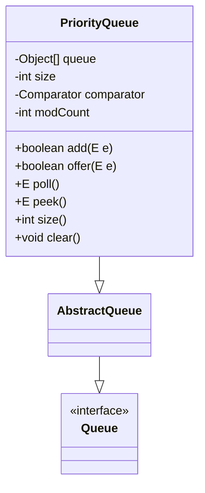
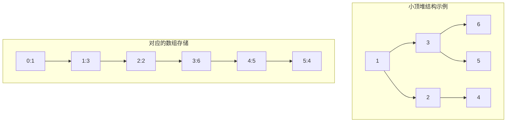

# 1.3.7 集合-PriorityQueue 源码

## 一、核理论
### 1.1 PriorityQueue类结构分析
PriorityQueue是基于优先级堆实现的无界队列，它根据元素的自然顺序或构造时提供的Comparator进行排序。不同于普通队列的FIFO原则，PriorityQueue中的元素按照指定的优先级顺序出队。



### 1.2 核心成员变量
- `queue[]`: 存储元素的数组，实现二叉堆结构
- `size`: 当前元素数量
- `comparator`: 比较器，用于元素排序，null表示自然排序
- `modCount`: 用于快速失败机制的修改计数器

### 1.3 JDK版本特性差异
- JDK 1.5: 引入PriorityQueue
- JDK 1.8: 优化siftUp和siftDown方法，使用Comparator时性能提升
- JDK 9: 引入of()静态工厂方法创建不可变PriorityQueue
- JDK 15: 优化堆结构调整算法，减少比较次数
- JDK 21: 未引入重大变更，但持续优化性能

## 二、代码实践
### 2.1 构造方法实现
```java
/**
 * 使用指定初始容量和比较器创建优先级队列
 * @param initialCapacity 初始容量
 * @param comparator 比较器，null表示自然排序
 * @throws IllegalArgumentException 如果初始容量小于1
 */
public PriorityQueue(int initialCapacity, Comparator<? super E> comparator) {
    if (initialCapacity < 1)
        throw new IllegalArgumentException();
    this.queue = new Object[initialCapacity];
    this.comparator = comparator;
}
```

### 2.2 核心方法实现
#### 2.2.1 入队操作(offer)
```java
/**
 * 将指定元素插入优先级队列
 * @param e 要插入的元素
 * @return true (始终返回true)
 * @throws NullPointerException 如果指定元素为null
 */
public boolean offer(E e) {
    if (e == null)
        throw new NullPointerException();
    modCount++;
    int i = size;
    if (i >= queue.length)
        grow(i + 1); // 扩容
    size = i + 1;
    if (i == 0)
        queue[0] = e;
    else
        siftUp(i, e); // 向上调整堆
    return true;
}
```

#### 2.2.2 出队操作(poll)
```java
/**
 * 获取并移除队列头部元素
 * @return 队列头部元素，如果队列为空则返回null
 */
public E poll() {
    if (size == 0)
        return null;
    int s = --size;
    modCount++;
    E result = (E) queue[0];
    E x = (E) queue[s];
    queue[s] = null;
    if (s != 0)
        siftDown(0, x); // 向下调整堆
    return result;
}
```

#### 2.2.3 堆调整核心算法
```java
/**
 * 向上调整堆结构
 * @param k 插入位置
 * @param x 插入元素
 */
private void siftUp(int k, E x) {
    if (comparator != null)
        siftUpUsingComparator(k, x);
    else
        siftUpComparable(k, x);
}

/**
 * 使用比较器向上调整
 */
private void siftUpUsingComparator(int k, E x) {
    while (k > 0) {
        int parent = (k - 1) >>> 1; // 父节点索引
        Object e = queue[parent];
        if (comparator.compare(x, (E) e) >= 0)
            break;
        queue[k] = e;
        k = parent;
    }
    queue[k] = x;
}

/**
 * 向下调整堆结构
 * @param k 起始位置
 * @param x 调整元素
 */
private void siftDown(int k, E x) {
    if (comparator != null)
        siftDownUsingComparator(k, x);
    else
        siftDownComparable(k, x);
}
```

### 2.3 实际应用示例
#### 2.3.1 自定义对象排序
```java
/**
 * 学生类，实现Comparable接口
 */
class Student implements Comparable<Student> {
    private String name;
    private int score;

    public Student(String name, int score) {
        this.name = name;
        this.score = score;
    }

    // 按分数升序排序
    @Override
    public int compareTo(Student o) {
        return Integer.compare(this.score, o.score);
    }

    @Override
    public String toString() {
        return name + ":" + score;
    }
}

// 使用示例
public class PriorityQueueExample {
    public static void main(String[] args) {
        PriorityQueue<Student> pq = new PriorityQueue<>();
        pq.offer(new Student("Alice", 85));
        pq.offer(new Student("Bob", 92));
        pq.offer(new Student("Charlie", 78));

        // 输出结果: Charlie:78, Alice:85, Bob:92
        while (!pq.isEmpty()) {
            System.out.print(pq.poll() + " ");
        }
    }
}
```

#### 2.3.2 使用Comparator实现降序排序
```java
// 创建降序优先级队列
PriorityQueue<Integer> maxHeap = new PriorityQueue<>((a, b) -> Integer.compare(b, a));
maxHeap.offer(3);
maxHeap.offer(1);
maxHeap.offer(2);

// 输出结果: 3, 2, 1
while (!maxHeap.isEmpty()) {
    System.out.print(maxHeap.poll() + " ");
}
```

## 三、设计思想
### 3.1 二叉堆数据结构
PriorityQueue底层使用二叉小顶堆实现，堆中每个节点的值小于等于其子节点的值。堆使用数组存储，对于索引为i的节点：
- 左孩子索引：2*i + 1
- 右孩子索引：2*i + 2
- 父节点索引：(i-1) >>> 1 (等价于(i-1)/2)



### 3.2 动态扩容机制
当元素数量达到容量时，PriorityQueue会自动扩容：
- 当容量小于64时，每次扩容为原来的2倍+2
- 当容量大于等于64时，每次扩容为原来的1.5倍

### 3.3 优先级排序策略
- 自然排序：元素必须实现Comparable接口
- 定制排序：通过Comparator实现，优先级更高

## 四、避坑指南
### 4.1 空元素异常
PriorityQueue不允许添加null元素，否则会抛出NullPointerException。

### 4.2 无序遍历
PriorityQueue的迭代器不保证按优先级顺序遍历元素，若需有序遍历，需先转成数组排序或不断调用poll()方法。

```java
// 错误方式：遍历顺序不保证有序
for (Integer num : pq) {
    System.out.print(num + " ");
}

// 正确方式：使用poll()方法
while (!pq.isEmpty()) {
    System.out.print(pq.poll() + " ");
}
```

### 4.3 线程不安全
PriorityQueue是非线程安全的，多线程环境下需使用Collections.synchronizedQueue()包装或使用ConcurrentSkipListSet。

```java
// 线程安全包装
Queue<Integer> safePq = Collections.synchronizedQueue(new PriorityQueue<>());
```

### 4.4 初始容量选择
合理设置初始容量可以减少扩容次数，提高性能。如果大致知道元素数量，建议在构造时指定合适的初始容量。

## 五、深度思考题
1. PriorityQueue的时间复杂度分析：add、poll、peek操作的时间复杂度分别是多少？
2. 如何实现一个支持动态修改优先级的优先级队列？
3. PriorityQueue和TreeSet有什么异同？各自适用场景是什么？
4. JDK中的PriorityQueue为什么选择小顶堆而不是大顶堆实现？
5. 如何实现一个延迟队列（DelayQueue）？它与PriorityQueue有什么关系？

思考题回答:
1. PriorityQueue操作时间复杂度分析:
   - add/offer: O(log n)，需要向上调整堆
   - poll: O(log n)，需要向下调整堆
   - peek: O(1)，直接返回堆顶元素
   - contains: O(n)，需要遍历整个数组
   - remove: O(n)，需要遍历找到元素后删除并调整堆

2. 实现动态修改优先级的优先级队列可以通过以下方式:
   - 使用哈希表记录元素在堆中的索引
   - 当元素优先级改变时，同时更新哈希表和堆，并调用siftUp和siftDown调整堆结构
   - 注意处理并发修改和快速失败机制