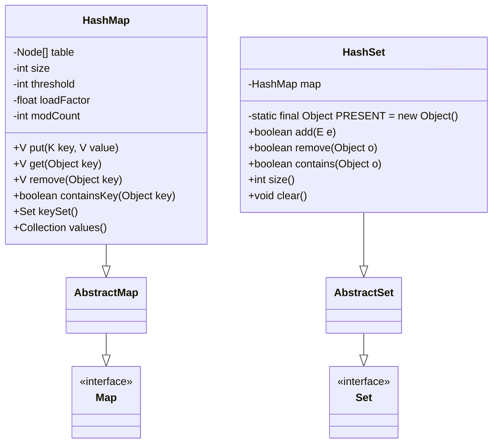
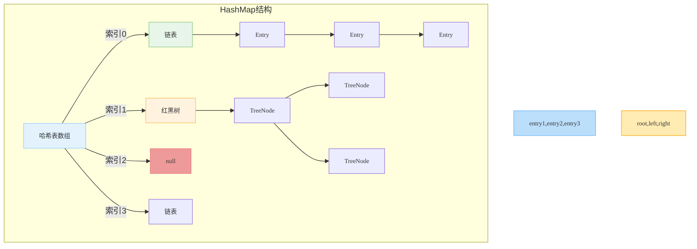

# 1.3.8 集合-HashSet&HashMap 源码

## 一、核心理论
### 1.1 HashMap与HashSet类结构分析
HashMap是基于哈希表实现的键值对存储结构，而HashSet则是基于HashMap实现的集合，用于存储不重复元素。两者都允许null值，但不保证元素顺序，且都是非线程安全的。



### 1.2 核心成员变量
#### HashMap核心变量
- `table[]`: 存储键值对的哈希表数组，每个元素是链表或红黑树的头节点
- `size`: 键值对数量
- `threshold`: 扩容阈值，等于容量×负载因子
- `loadFactor`: 负载因子，默认为0.75f
- `modCount`: 结构修改计数器，用于快速失败机制

#### HashSet核心变量
- `map`: 内部使用的HashMap实例
- `PRESENT`: 静态常量，作为HashMap中的value占位符

### 1.3 JDK版本特性差异
#### HashMap版本演进
- JDK 1.2: 引入HashMap，基于数组+链表实现
- JDK 1.4: 引入LinkedHashMap
- JDK 1.7: 优化哈希算法，引入"扰动函数"增强哈希分布
- JDK 1.8: 重大优化，引入红黑树结构，当链表长度超过8时转为红黑树
- JDK 1.8: 优化resize过程，避免多线程下的死循环问题
- JDK 1.9: 引入of()静态工厂方法创建不可变Map
- JDK 16: 引入record类作为键时的优化
- JDK 21: 未引入重大变更，但持续优化哈希冲突处理

## 二、代码实践
### 2.1 HashMap核心方法实现
#### 2.1.1 哈希计算与索引定位
```java
/**
 * 计算键的哈希值
 * @param key 键对象
 * @return 计算后的哈希值
 */
static final int hash(Object key) {
    int h;
    // 扰动函数：将高16位与低16位异或，减少哈希冲突
    return (key == null) ? 0 : (h = key.hashCode()) ^ (h >>> 16);
}

/**
 * 根据哈希值和数组长度计算索引
 * @param hash 哈希值
 * @param length 数组长度
 * @return 数组索引
 */
static int indexFor(int hash, int length) {
    return hash & (length - 1); // 等价于hash % length，但效率更高
}
```

#### 2.1.2 put方法实现
```java
/**
 * 将键值对放入映射
 * @param key 键
 * @param value 值
 * @return 之前与key关联的值，或null
 */
public V put(K key, V value) {
    return putVal(hash(key), key, value, false, true);
}

/**
 * put操作的核心实现
 */
final V putVal(int hash, K key, V value, boolean onlyIfAbsent,
               boolean evict) {
    Node<K,V>[] tab; Node<K,V> p; int n, i;
    // 初始化哈希表
    if ((tab = table) == null || (n = tab.length) == 0)
        n = (tab = resize()).length;
    // 计算索引并检查是否为空
    if ((p = tab[i = (n - 1) & hash]) == null)
        tab[i] = newNode(hash, key, value, null);
    else {
        Node<K,V> e; K k;
        // 键已存在，直接替换值
        if (p.hash == hash &&
            ((k = p.key) == key || (key != null && key.equals(k))))
            e = p;
        // 红黑树节点
        else if (p instanceof TreeNode)
            e = ((TreeNode<K,V>)p).putTreeVal(this, tab, hash, key, value);
        // 链表节点
        else {
            for (int binCount = 0; ; ++binCount) {
                if ((e = p.next) == null) {
                    p.next = newNode(hash, key, value, null);
                    // 链表长度超过8，转为红黑树
                    if (binCount >= TREEIFY_THRESHOLD - 1) // -1 for 1st
                        treeifyBin(tab, hash);
                    break;
                }
                // 找到相同的键，退出循环
                if (e.hash == hash &&
                    ((k = e.key) == key || (key != null && key.equals(k))))
                    break;
                p = e;
            }
        }
        // 替换旧值
        if (e != null) { // existing mapping for key
            V oldValue = e.value;
            if (!onlyIfAbsent || oldValue == null)
                e.value = value;
            afterNodeAccess(e);
            return oldValue;
        }
    }
    ++modCount;
    // 检查是否需要扩容
    if (++size > threshold)
        resize();
    afterNodeInsertion(evict);
    return null;
}
```

#### 2.1.3 扩容机制(resize)
```java
/**
 * 调整哈希表大小
 * @return 新的哈希表数组
 */
final Node<K,V>[] resize() {
    Node<K,V>[] oldTab = table;
    int oldCap = (oldTab == null) ? 0 : oldTab.length;
    int oldThr = threshold;
    int newCap, newThr = 0;
    if (oldCap > 0) {
        // 超过最大容量，不再扩容
        if (oldCap >= MAXIMUM_CAPACITY) {
            threshold = Integer.MAX_VALUE;
            return oldTab;
        }
        // 容量翻倍
        else if ((newCap = oldCap << 1) < MAXIMUM_CAPACITY &&
                 oldCap >= DEFAULT_INITIAL_CAPACITY)
            newThr = oldThr << 1; // threshold也翻倍
    }
    else if (oldThr > 0) // 初始容量在构造函数中设置
        newCap = oldThr;
    else { // 使用默认值
        newCap = DEFAULT_INITIAL_CAPACITY; // 16
        newThr = (int)(DEFAULT_LOAD_FACTOR * DEFAULT_INITIAL_CAPACITY); // 12
    }
    // 计算新的扩容阈值
    if (newThr == 0) {
        float ft = (float)newCap * loadFactor;
        newThr = (newCap < MAXIMUM_CAPACITY && ft < (float)MAXIMUM_CAPACITY ?
                  (int)ft : Integer.MAX_VALUE);
    }
    threshold = newThr;
    @SuppressWarnings({"rawtypes","unchecked"})
    Node<K,V>[] newTab = (Node<K,V>[])new Node[newCap];
    table = newTab;
    if (oldTab != null) {
        // 将旧表中的节点转移到新表
        for (int j = 0; j < oldCap; ++j) {
            Node<K,V> e;
            if ((e = oldTab[j]) != null) {
                oldTab[j] = null;
                if (e.next == null)
                    newTab[e.hash & (newCap - 1)] = e;
                else if (e instanceof TreeNode)
                    ((TreeNode<K,V>)e).split(this, newTab, j, oldCap);
                else { // 保持链表顺序
                    Node<K,V> loHead = null, loTail = null;
                    Node<K,V> hiHead = null, hiTail = null;
                    Node<K,V> next;
                    do {
                        next = e.next;
                        // 原索引
                        if ((e.hash & oldCap) == 0) {
                            if (loTail == null)
                                loHead = e;
                            else
                                loTail.next = e;
                            loTail = e;
                        }
                        // 原索引 + oldCap
                        else {
                            if (hiTail == null)
                                hiHead = e;
                            else
                                hiTail.next = e;
                            hiTail = e;
                        }
                    } while ((e = next) != null);
                    // 放到新数组的原索引位置
                    if (loTail != null) {
                        loTail.next = null;
                        newTab[j] = loHead;
                    }
                    // 放到新数组的原索引+oldCap位置
                    if (hiTail != null) {
                        hiTail.next = null;
                        newTab[j + oldCap] = hiHead;
                    }
                }
            }
        }
    }
    return newTab;
}
```

### 2.2 HashSet核心方法实现
```java
/**
 * 向集合中添加元素
 * @param e 要添加的元素
 * @return 如果元素不存在且添加成功则返回true
 */
public boolean add(E e) {
    return map.put(e, PRESENT) == null;
}

/**
 * 从集合中移除元素
 * @param o 要移除的元素
 * @return 如果元素存在且移除成功则返回true
 */
public boolean remove(Object o) {
    return map.remove(o) == PRESENT;
}

/**
 * 检查集合是否包含指定元素
 * @param o 要检查的元素
 * @return 如果包含则返回true
 */
public boolean contains(Object o) {
    return map.containsKey(o);
}
```

### 2.3 实际应用示例
#### 2.3.1 HashMap性能优化示例
```java
/**
 * 创建高效的HashMap
 * 初始容量设置为预期元素数量 / 负载因子 + 1
 * 避免频繁扩容
 */
public class OptimizedHashMapExample {
    public static void main(String[] args) {
        // 预期存储1000个元素
        int expectedSize = 1000;
        // 计算初始容量: expectedSize / loadFactor + 1
        int initialCapacity = (int) (expectedSize / 0.75f) + 1;
        
        // 创建优化初始容量的HashMap
        Map<String, Integer> optimizedMap = new HashMap<>(initialCapacity);
        
        // 添加元素
        for (int i = 0; i < expectedSize; i++) {
            optimizedMap.put("key" + i, i);
        }
    }
}
```

#### 2.3.2 自定义对象作为HashMap键
```java
/**
 * 自定义对象作为HashMap键的正确实现
 * 必须重写hashCode()和equals()方法
 */
class Person {
    private String name;
    private int age;

    public Person(String name, int age) {
        this.name = name;
        this.age = age;
    }

    // 重写equals方法
    @Override
    public boolean equals(Object o) {
        if (this == o) return true;
        if (o == null || getClass() != o.getClass()) return false;
        Person person = (Person) o;
        return age == person.age && Objects.equals(name, person.name);
    }

    // 重写hashCode方法
    @Override
    public int hashCode() {
        return Objects.hash(name, age);
    }
}

// 使用示例
Map<Person, String> personMap = new HashMap<>();
personMap.put(new Person("Alice", 30), "Engineer");
// 正确获取值，因为重写了hashCode和equals
String occupation = personMap.get(new Person("Alice", 30));
```

## 三、设计思想
### 3.1 哈希表数据结构
HashMap采用数组+链表+红黑树的复合数据结构：
- 数组（哈希表）：存储链表或红黑树的头节点，通过哈希值快速定位
- 链表：解决哈希冲突，当冲突较少时使用
- 红黑树：当链表长度超过阈值（默认8）时转换，提高查询效率



### 3.2 哈希冲突解决策略
HashMap使用链地址法解决哈希冲突：
1. 当两个不同的键计算出相同的索引时，将新节点添加到链表末尾
2. 当链表长度超过阈值（默认8）且数组长度不小于64时，将链表转为红黑树
3. 当红黑树节点数量少于阈值（默认6）时，将红黑树转回链表

### 3.3 动态扩容机制
HashMap的动态扩容机制是其高性能的关键：
- 初始容量：默认16，可通过构造函数指定
- 负载因子：默认0.75，平衡空间和时间效率
- 扩容阈值：容量×负载因子，达到该值时触发扩容
- 扩容操作：创建原容量2倍的新数组，并重新哈希所有节点

### 3.4  fail-fast机制
HashMap通过modCount实现快速失败机制：
- 当HashMap被修改（添加/删除元素）时，modCount自增
- 迭代器创建时记录expectedModCount
- 迭代过程中检查modCount是否等于expectedModCount，不等则抛出ConcurrentModificationException

## 四、避坑指南
### 4.1 键的哈希值不可变
作为HashMap键的对象必须保证哈希值不变，否则会导致无法正确获取值：
```java
// 错误示例：使用可变对象作为键
class MutableKey {
    private int value;
    // 省略构造方法和getter
    
    @Override
    public int hashCode() {
        return value;
    }
}

Map<MutableKey, String> map = new HashMap<>();
MutableKey key = new MutableKey(1);
map.put(key, "value");
key.setValue(2); // 修改键的哈希值
String value = map.get(key); // null，无法获取值
```

### 4.2 线程安全问题
HashMap是非线程安全的，多线程环境下可能导致：
- 数据不一致
- 扩容时的死循环（JDK 1.7及之前）
- ConcurrentModificationException异常

解决方案：
```java
// 1. 使用Collections.synchronizedMap
Map<String, Integer> syncMap = Collections.synchronizedMap(new HashMap<>());

// 2. 使用ConcurrentHashMap (推荐)
Map<String, Integer> concurrentMap = new ConcurrentHashMap<>();
```

### 4.3 初始容量选择
初始容量设置不当会导致频繁扩容，影响性能：
- 过小：导致频繁扩容
- 过大：浪费内存空间

正确做法：根据预期元素数量计算初始容量
```java
int expectedSize = 1000;
int initialCapacity = (int) (expectedSize / 0.75f) + 1;
Map<String, Integer> map = new HashMap<>(initialCapacity);
```

### 4.4 遍历方式选择
不同遍历方式性能差异较大：
```java
// 1. 推荐：entrySet遍历键值对
for (Map.Entry<String, Integer> entry : map.entrySet()) {
    String key = entry.getKey();
    Integer value = entry.getValue();
}

// 2. 不推荐：keySet遍历后get获取值（多一次哈希查找）
for (String key : map.keySet()) {
    Integer value = map.get(key);
}
```

## 五、深度思考题
1. HashMap在JDK 7和JDK 8中的实现有哪些主要区别？这些改进带来了什么好处？
2. 为什么HashMap的容量必须是2的幂次方？如果传入非2的幂次方的初始容量，会发生什么？
3. HashMap、Hashtable和ConcurrentHashMap的线程安全特性有何区别？各自的实现原理是什么？
4. 如何实现一个自定义的HashMap，支持按照插入顺序或访问顺序遍历？
5. HashMap中的红黑树与TreeMap中的红黑树有何异同？

思考题回答:
1. JDK 7和JDK 8中HashMap的主要区别:
   - 数据结构: JDK 7使用数组+链表；JDK 8使用数组+链表+红黑树
   - 哈希计算: JDK 8优化了扰动函数，减少了哈希冲突
   - 扩容机制: JDK 8优化了resize过程，避免了多线程下的死循环
   - 插入方式: JDK 7使用头插法；JDK 8使用尾插法
   - 查询性能: JDK 8在哈希冲突严重时查询性能从O(n)提升到O(log n)

2. HashMap容量必须是2的幂次方的原因:
   - 便于使用位运算计算索引: hash & (length - 1)，效率高于取模运算
   - 扩容时可以通过hash & oldCap快速判断元素应该放在原索引还是新索引
   - 如果传入非2的幂次方的初始容量，HashMap会通过tableSizeFor()方法将其转换为大于等于该值的最小2的幂次方