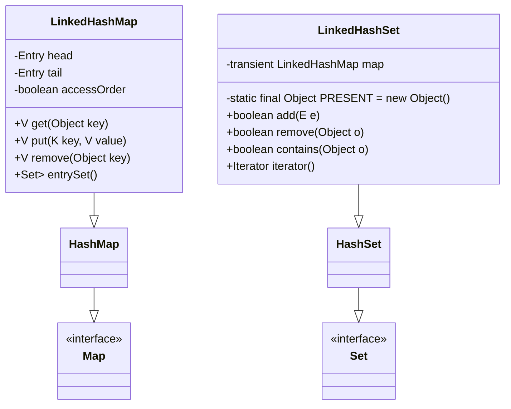
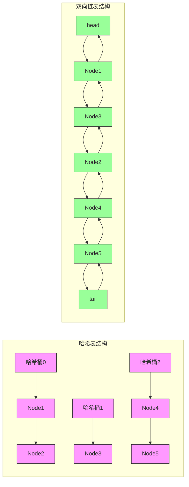

# 1.3.9 集合-LinkedHashSet&LinkedHashMap 源码

## 一、核心理论
### 1.1 类结构分析
LinkedHashMap是HashMap的子类，在HashMap的基础上通过维护一个双向链表来保持元素的插入顺序或访问顺序。LinkedHashSet则是基于LinkedHashMap实现的，其内部持有一个LinkedHashMap实例，利用其key的唯一性来实现集合功能。



### 1.2 核心成员变量
#### LinkedHashMap核心变量
- `head`: 双向链表的头节点
- `tail`: 双向链表的尾节点
- `accessOrder`: 排序模式标志，false表示插入顺序，true表示访问顺序
- `entrySet`: 缓存的entry集合视图

#### LinkedHashSet核心变量
- `map`: 内部使用的LinkedHashMap实例
- `PRESENT`: 静态常量，作为Map中的value占位符

### 1.3 双向链表节点结构
LinkedHashMap的Entry节点继承自HashMap的Node节点，并增加了两个指针用于维护双向链表：
```java
static class Entry<K,V> extends HashMap.Node<K,V> {
    Entry<K,V> before, after;
    Entry(int hash, K key, V value, Node<K,V> next) {
        super(hash, key, value, next);
    }
}
```

### 1.4 JDK版本特性
- JDK 1.4: 引入LinkedHashMap和LinkedHashSet
- JDK 8: 优化了红黑树转换逻辑，当链表长度超过阈值时转为红黑树
- JDK 9: 引入of()静态工厂方法创建不可变LinkedHashMap
- JDK 21: 增强了性能，优化了迭代器实现

## 二、代码实践
### 2.1 LinkedHashMap核心方法实现
#### 2.1.1 初始化方法
```java
/**
 * 构造方法，指定初始容量、加载因子和排序模式
 * @param initialCapacity 初始容量
 * @param loadFactor 加载因子
 * @param accessOrder 排序模式，true表示访问顺序，false表示插入顺序
 */
public LinkedHashMap(int initialCapacity, float loadFactor, boolean accessOrder) {
    super(initialCapacity, loadFactor);
    this.accessOrder = accessOrder;
}
```

#### 2.1.2 put方法实现
LinkedHashMap并未重写put方法，而是通过重写HashMap的newNode()和afterNodeInsertion()方法来维护双向链表：
```java
/**
 * 创建新节点，并添加到双向链表尾部
 */
Node<K,V> newNode(int hash, K key, V value, Node<K,V> e) {
    LinkedHashMap.Entry<K,V> p = new LinkedHashMap.Entry<K,V>(hash, key, value, e);
    linkNodeLast(p);
    return p;
}

/**
 * 将节点链接到双向链表尾部
 */
private void linkNodeLast(LinkedHashMap.Entry<K,V> p) {
    LinkedHashMap.Entry<K,V> last = tail;
    tail = p;
    if (last == null)
        head = p;
    else {
        p.before = last;
        last.after = p;
    }
}

/**
 * 插入节点后回调，用于移除 eldest 节点（LRU实现）
 */
void afterNodeInsertion(boolean evict) {
    LinkedHashMap.Entry<K,V> first;
    if (evict && (first = head) != null && removeEldestEntry(first)) {
        K key = first.key;
        removeNode(hash(key), key, null, false, true);
    }
}
```

#### 2.1.3 get方法实现
```java
/**
 * 获取指定key的值，并在访问顺序模式下移动节点到链表尾部
 * @param key 键
 * @return 对应的value，不存在则返回null
 */
public V get(Object key) {
    Node<K,V> e;
    if ((e = getNode(hash(key), key)) == null)
        return null;
    if (accessOrder)
        afterNodeAccess(e);
    return e.value;
}

/**
 * 访问节点后回调，将节点移动到双向链表尾部
 */
void afterNodeAccess(Node<K,V> e) {
    LinkedHashMap.Entry<K,V> last;
    if (accessOrder && (last = tail) != e) {
        LinkedHashMap.Entry<K,V> p = (LinkedHashMap.Entry<K,V>)e,
            b = p.before, a = p.after;
        p.after = null;
        if (b == null)
            head = a;
        else
            b.after = a;
        if (a != null)
            a.before = b;
        else
            last = b;
        if (last == null)
            head = p;
        else {
            p.before = last;
            last.after = p;
        }
        tail = p;
        ++modCount;
    }
}
```

#### 2.1.4 remove方法实现
LinkedHashMap通过重写afterNodeRemoval()方法在节点删除后维护双向链表：
```java
/**
 * 删除节点后回调，从双向链表中移除该节点
 */
void afterNodeRemoval(Node<K,V> e) {
    LinkedHashMap.Entry<K,V> p = (LinkedHashMap.Entry<K,V>)e,
        b = p.before, a = p.after;
    p.before = p.after = null;
    if (b == null)
        head = a;
    else
        b.after = a;
    if (a == null)
        tail = b;
    else
        a.before = b;
}
```

### 2.2 LinkedHashSet核心方法实现
```java
/**
 * 构造方法，创建一个空的LinkedHashSet
 */
public LinkedHashSet() {
    map = new LinkedHashMap<>();
}

/**
 * 向集合中添加元素
 * @param e 要添加的元素
 * @return 如果元素不存在且添加成功则返回true
 */
public boolean add(E e) {
    return map.put(e, PRESENT) == null;
}

/**
 * 移除集合中的元素
 * @param o 要移除的元素
 * @return 如果元素存在且移除成功则返回true
 */
public boolean remove(Object o) {
    return map.remove(o) == PRESENT;
}

/**
 * 判断集合是否包含指定元素
 * @param o 要检查的元素
 * @return 如果包含则返回true
 */
public boolean contains(Object o) {
    return map.containsKey(o);
}
```

### 2.3 LRU缓存实现示例
利用LinkedHashMap的访问顺序模式可以轻松实现LRU（最近最少使用）缓存：
```java
/**
 * LRU缓存实现
 * @param <K> 键类型
 * @param <V> 值类型
 */
class LRUCache<K, V> extends LinkedHashMap<K, V> {
    private final int capacity;

    /**
     * 构造方法
     * @param capacity 缓存容量
     */
    public LRUCache(int capacity) {
        super(capacity, 0.75f, true);
        this.capacity = capacity;
    }

    /**
     * 判断是否移除最老的元素
     * @param eldest 最老的元素
     * @return 如果当前大小超过容量则返回true
     */
    @Override
    protected boolean removeEldestEntry(Map.Entry<K, V> eldest) {
        return size() > capacity;
    }

    public static void main(String[] args) {
        LRUCache<Integer, String> cache = new LRUCache<>(3);
        cache.put(1, "A");
        cache.put(2, "B");
        cache.put(3, "C");
        System.out.println(cache); // {1=A, 2=B, 3=C}

        cache.get(2); // 访问2，使其变为最近使用
        cache.put(4, "D"); // 超过容量，移除最老的1
        System.out.println(cache); // {3=C, 2=B, 4=D}
    }
}
```

## 三、设计思想
### 3.1 数据结构设计
LinkedHashMap结合了哈希表和双向链表的优点：
- **哈希表**：提供O(1)时间复杂度的get和put操作
- **双向链表**：维护元素的顺序，支持按插入顺序或访问顺序迭代



### 3.2 迭代顺序保证
LinkedHashMap提供两种迭代顺序：
1. **插入顺序**：元素的迭代顺序与插入顺序一致
2. **访问顺序**：每次get或put操作会将元素移到链表尾部，迭代顺序为最近访问的元素在后

这种设计使得LinkedHashMap非常适合实现需要保持插入顺序或实现LRU缓存策略的场景。

### 3.3 性能权衡
与HashMap相比，LinkedHashMap通过增加双向链表的维护开销，换取了迭代顺序的保证：
- **优点**：迭代时不需要像HashMap那样遍历整个哈希表，只需遍历双向链表，时间复杂度为O(n)
- **缺点**：插入和删除操作需要同时维护哈希表和双向链表，开销略高于HashMap

### 3.4 接口设计原则
LinkedHashMap遵循了以下设计原则：
- **里氏替换原则**：可以完全替代HashMap，API兼容
- **单一职责原则**：哈希表负责快速查找，双向链表负责顺序维护
- **开闭原则**：通过重写removeEldestEntry()方法可轻松扩展功能（如LRU缓存）

## 四、避坑指南
### 4.1 性能陷阱
- **迭代性能**：LinkedHashMap的迭代性能优于HashMap，尤其是在哈希表稀疏时
- **频繁修改影响**：在accessOrder=true模式下，频繁get操作会导致链表频繁调整，影响性能
- **初始容量选择**：与HashMap一样，选择合适的初始容量可减少扩容次数

### 4.2 并发问题
LinkedHashMap和LinkedHashSet都是非线程安全的，多线程环境下可能导致：
- 迭代时抛出ConcurrentModificationException
- 数据不一致

解决方案：
```java
// 使用Collections.synchronizedSet包装
Set<String> syncSet = Collections.synchronizedSet(new LinkedHashSet<>());

// 使用ConcurrentHashMap实现线程安全的LinkedHashMap功能
Map<String, Integer> concurrentMap = new ConcurrentHashMap<>();
// 结合ConcurrentLinkedQueue维护顺序
```

### 4.3 序列化问题
LinkedHashMap的序列化需要特别注意：
- 默认序列化会保存整个哈希表结构，包括未使用的桶，导致序列化后体积较大
- 解决方法：重写writeObject()和readObject()方法，只序列化双向链表

### 4.4 正确实现LRU缓存
实现LRU缓存时需注意：
```java
// 错误示例：未正确重写removeEldestEntry()
class BadLRUCache extends LinkedHashMap<Object, Object> {
    private int maxSize;
    public BadLRUCache(int maxSize) {
        super(maxSize, 0.75f, true);
        this.maxSize = maxSize;
    }
    // 错误：应该比较size() > maxSize
    protected boolean removeEldestEntry(Map.Entry<Object, Object> eldest) {
        return size() == maxSize; // 当达到容量时就移除，实际应在超过容量时移除
    }
}
```

## 五、深度思考题
1. LinkedHashMap在JDK 8中如何处理哈希冲突？当红黑树转换发生时，双向链表如何维护？
2. 比较LinkedHashMap的accessOrder=true模式与LRU算法的异同，如何实现一个线程安全的LRU缓存？
3. LinkedHashSet与HashSet、TreeSet的性能对比如何？在什么场景下应该选择LinkedHashSet？
4. 如何利用LinkedHashMap实现一个简单的FIFO（先进先出）缓存？
5. 分析LinkedHashMap的迭代器实现，为什么它比HashMap的迭代器更快？

思考题回答:
1. LinkedHashMap在JDK 8中处理哈希冲突的方式与HashMap相同，当链表长度超过8时转为红黑树。红黑树节点同样继承自LinkedHashMap.Entry，因此双向链表的维护方式与普通节点相同，只是节点在哈希表中的结构变为红黑树。

2. LinkedHashMap的accessOrder=true模式本质上是一种近似LRU算法，它只记录了访问顺序但没有时间戳。实现线程安全的LRU缓存可使用ConcurrentHashMap+ConcurrentLinkedQueue，或使用Collections.synchronizedMap包装LinkedHashMap并配合锁机制。

3. 性能对比：HashSet插入查找最快但无序，TreeSet有序但性能较差(O(log n))，LinkedHashSet性能略低于HashSet但提供有序性。当需要保持插入顺序且频繁迭代时，应选择LinkedHashSet。

4. 实现FIFO缓存只需重写removeEldestEntry()方法，当size() > capacity时返回true，不需要设置accessOrder=true。