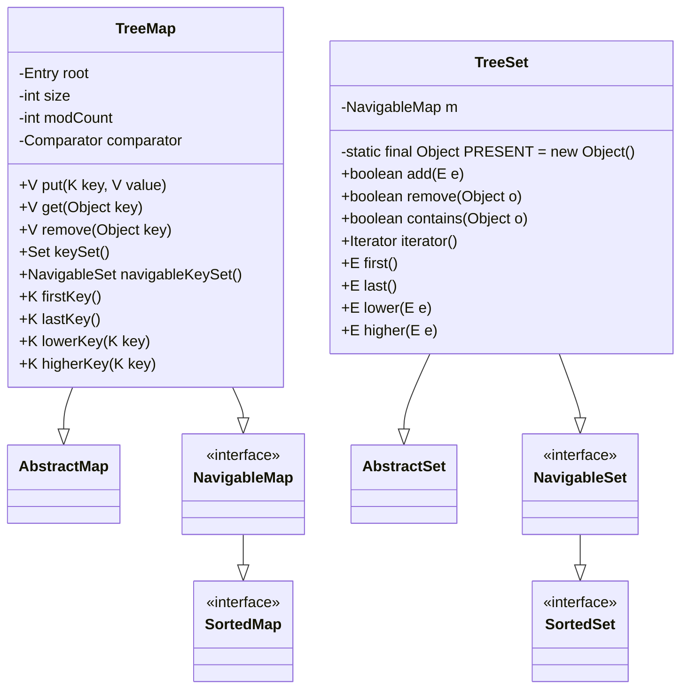
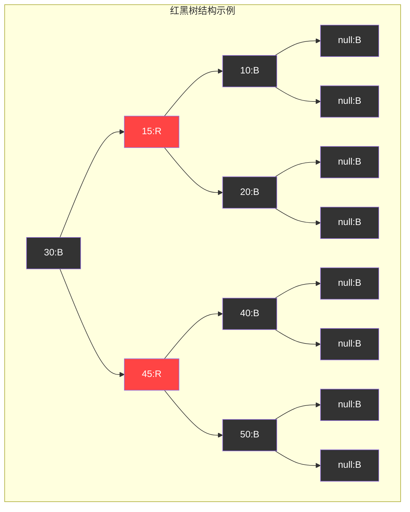

# 1.4.0 集合-TreeSet&TreeMap源码

## 一、核理论
### 1.1 TreeMap与TreeSet类结构分析
TreeMap是基于红黑树实现的有序键值对存储结构，而TreeSet则是基于TreeMap实现的有序集合，用于存储不重复元素。两者都实现了Navigable接口，支持一系列导航方法，默认按自然顺序排序或通过Comparator自定义排序。



### 1.2 核心成员变量
#### TreeMap核心变量
- `root`: 红黑树的根节点
- `size`: 键值对数量
- `comparator`: 用于排序的比较器，null表示自然排序
- `modCount`: 结构修改计数器，用于快速失败机制

#### TreeSet核心变量
- `m`: 内部使用的NavigableMap实例（实际为TreeMap）
- `PRESENT`: 静态常量，作为Map中的value占位符

### 1.3 红黑树特性
红黑树是一种自平衡的二叉查找树，具有以下特性：
1. 每个节点要么是红色，要么是黑色
2. 根节点是黑色
3. 所有叶子节点（NIL）是黑色
4. 如果一个节点是红色，则它的两个子节点都是黑色
5. 从任一节点到其每个叶子的所有路径都包含相同数目的黑色节点

这些特性确保了红黑树的平衡，使得基本操作（插入、删除、查找）的时间复杂度为O(log n)。

### 1.4 JDK版本特性差异
- JDK 1.2: 引入TreeMap和TreeSet
- JDK 1.6: 引入NavigableMap和NavigableSet接口，TreeMap和TreeSet实现这些接口
- JDK 1.8: 优化红黑树实现，提高并发性能
- JDK 1.9: 引入of()静态工厂方法创建不可变SortedMap
- JDK 16: 增强NavigableMap接口，添加更多便捷方法

## 二、代码实践
### 2.1 TreeMap核心方法实现
#### 2.1.1 红黑树节点结构
```java
/**
 * 红黑树节点
 */
static final class Entry<K,V> implements Map.Entry<K,V> {
    K key;
    V value;
    Entry<K,V> left;
    Entry<K,V> right;
    Entry<K,V> parent;
    boolean color = BLACK; // 默认黑色

    // 构造方法和其他方法...
}
```

#### 2.1.2 put方法实现
```java
/**
 * 将键值对放入映射
 * @param key 键
 * @param value 值
 * @return 之前与key关联的值，或null
 */
public V put(K key, V value) {
    Entry<K,V> t = root;
    // 树为空，创建根节点
    if (t == null) {
        compare(key, key); // 检查key是否为null（自然排序时）
        root = new Entry<>(key, value, null);
        size = 1;
        modCount++;
        return null;
    }
    int cmp;
    Entry<K,V> parent;
    // 分裂比较器和比较逻辑
    Comparator<? super K> cpr = comparator;
    if (cpr != null) {
        // 使用自定义比较器查找插入位置
        do {
            parent = t;
            cmp = cpr.compare(key, t.key);
            if (cmp < 0)
                t = t.left;
            else if (cmp > 0)
                t = t.right;
            else // 键已存在，替换值
                return t.setValue(value);
        } while (t != null);
    }
    else {
        // 使用自然排序
        if (key == null)
            throw new NullPointerException();
        @SuppressWarnings("unchecked")
        Comparable<? super K> k = (Comparable<? super K>) key;
        do {
            parent = t;
            cmp = k.compareTo(t.key);
            if (cmp < 0)
                t = t.left;
            else if (cmp > 0)
                t = t.right;
            else // 键已存在，替换值
                return t.setValue(value);
        } while (t != null);
    }
    // 创建新节点
    Entry<K,V> e = new Entry<>(key, value, parent);
    if (cmp < 0)
        parent.left = e;
    else
        parent.right = e;
    // 插入后修复红黑树平衡
    fixAfterInsertion(e);
    size++;
    modCount++;
    return null;
}
```

#### 2.1.3 红黑树插入后修复
```java
/**
 * 插入后修复红黑树平衡
 */
private void fixAfterInsertion(Entry<K,V> x) {
    x.color = RED; // 新节点默认为红色

    // 父节点为红色时需要修复
    while (x != null && x != root && x.parent.color == RED) {
        if (parentOf(x) == leftOf(parentOf(parentOf(x)))) {
            Entry<K,V> y = rightOf(parentOf(parentOf(x)));
            if (colorOf(y) == RED) {
                // 情况1：叔叔节点为红色
                setColor(parentOf(x), BLACK);
                setColor(y, BLACK);
                setColor(parentOf(parentOf(x)), RED);
                x = parentOf(parentOf(x));
            } else {
                if (x == rightOf(parentOf(x))) {
                    // 情况2：叔叔节点为黑色，且当前节点为右孩子
                    x = parentOf(x);
                    rotateLeft(x);
                }
                // 情况3：叔叔节点为黑色，且当前节点为左孩子
                setColor(parentOf(x), BLACK);
                setColor(parentOf(parentOf(x)), RED);
                rotateRight(parentOf(parentOf(x)));
            }
        } else {
            // 镜像情况：父节点是祖父节点的右孩子
            Entry<K,V> y = leftOf(parentOf(parentOf(x)));
            if (colorOf(y) == RED) {
                // 情况1：叔叔节点为红色
                setColor(parentOf(x), BLACK);
                setColor(y, BLACK);
                setColor(parentOf(parentOf(x)), RED);
                x = parentOf(parentOf(x));
            } else {
                if (x == leftOf(parentOf(x))) {
                    // 情况2：叔叔节点为黑色，且当前节点为左孩子
                    x = parentOf(x);
                    rotateRight(x);
                }
                // 情况3：叔叔节点为黑色，且当前节点为右孩子
                setColor(parentOf(x), BLACK);
                setColor(parentOf(parentOf(x)), RED);
                rotateLeft(parentOf(parentOf(x)));
            }
        }
        x = parentOf(x);
    }
    // 确保根节点为黑色
    root.color = BLACK;
}
```

#### 2.1.4 旋转操作
```java
/**
 * 左旋操作
 */
private void rotateLeft(Entry<K,V> p) {
    if (p != null) {
        Entry<K,V> r = p.right;
        p.right = r.left;
        if (r.left != null)
            r.left.parent = p;
        r.parent = p.parent;
        if (p.parent == null)
            root = r;
        else if (p.parent.left == p)
            p.parent.left = r;
        else
            p.parent.right = r;
        r.left = p;
        p.parent = r;
    }
}

/**
 * 右旋操作
 */
private void rotateRight(Entry<K,V> p) {
    if (p != null) {
        Entry<K,V> l = p.left;
        p.left = l.right;
        if (l.right != null)
            l.right.parent = p;
        l.parent = p.parent;
        if (p.parent == null)
            root = l;
        else if (p.parent.right == p)
            p.parent.right = l;
        else
            p.parent.left = l;
        l.right = p;
        p.parent = l;
    }
}
```

### 2.2 TreeSet核心方法实现
```java
/**
 * 向集合中添加元素
 * @param e 要添加的元素
 * @return 如果元素不存在且添加成功则返回true
 */
public boolean add(E e) {
    return m.put(e, PRESENT) == null;
}

/**
 * 获取集合的迭代器
 * @return 按升序排列的元素迭代器
 */
public Iterator<E> iterator() {
    return m.navigableKeySet().iterator();
}

/**
 * 获取小于指定元素的最大元素
 * @param e 要比较的元素
 * @return 小于e的最大元素，不存在则返回null
 */
public E lower(E e) {
    return m.lowerKey(e);
}

/**
 * 获取大于指定元素的最小元素
 * @param e 要比较的元素
 * @return 大于e的最小元素，不存在则返回null
 */
public E higher(E e) {
    return m.higherKey(e);
}
```

### 2.3 实际应用示例
#### 2.3.1 自定义排序示例
```java
/**
 * 使用自定义比较器的TreeMap示例
 * 按字符串长度排序，长度相同则按字母顺序
 */
public class CustomComparatorExample {
    public static void main(String[] args) {
        // 创建自定义比较器
        Comparator<String> lengthComparator = (s1, s2) -> {
            if (s1.length() != s2.length()) {
                return Integer.compare(s1.length(), s2.length());
            } else {
                return s1.compareTo(s2);
            }
        };

        // 使用自定义比较器创建TreeMap
        Map<String, Integer> treeMap = new TreeMap<>(lengthComparator);

        // 添加元素
        treeMap.put("apple", 1);
        treeMap.put("banana", 2);
        treeMap.put("pear", 3);
        treeMap.put("orange", 4);
        treeMap.put("grape", 5);

        // 输出将按字符串长度排序
        for (Map.Entry<String, Integer> entry : treeMap.entrySet()) {
            System.out.println(entry.getKey() + ": " + entry.getValue());
        }
        // 输出顺序: pear(4), apple(5), grape(5), banana(6), orange(6)
    }
}
```

#### 2.3.2 导航方法使用示例
```java
/**
 * TreeSet导航方法使用示例
 */
public class TreeSetNavigationExample {
    public static void main(String[] args) {
        TreeSet<Integer> numbers = new TreeSet<>();
        numbers.add(10);
        numbers.add(20);
        numbers.add(30);
        numbers.add(40);
        numbers.add(50);

        System.out.println("集合: " + numbers); // [10, 20, 30, 40, 50]
        System.out.println("第一个元素: " + numbers.first()); // 10
        System.out.println("最后一个元素: " + numbers.last()); // 50
        System.out.println("小于30的最大元素: " + numbers.lower(30)); // 20
        System.out.println("大于30的最小元素: " + numbers.higher(30)); // 40
        System.out.println("小于等于30的最大元素: " + numbers.floor(30)); // 30
        System.out.println("大于等于30的最小元素: " + numbers.ceiling(30)); // 30

        // 子集视图
        SortedSet<Integer> subset = numbers.subSet(20, 40);
        System.out.println("20到40的子集: " + subset); // [20, 30]
    }
}
```

## 三、设计思想
### 3.1 红黑树数据结构
TreeMap采用红黑树作为底层数据结构，具有以下优势：
- 自平衡：通过旋转和变色操作保持树的平衡
- 有序性：中序遍历可得到有序序列
- 高效性：插入、删除、查找操作的时间复杂度均为O(log n)



### 3.2 排序机制
TreeMap支持两种排序方式：
1. **自然排序**：键必须实现Comparable接口，通过compareTo()方法比较
2. **定制排序**：创建TreeMap时提供Comparator对象，通过compare()方法比较

排序机制确保了TreeMap中的键始终处于有序状态，支持高效的范围查询操作。

### 3.3 视图机制
TreeMap提供了多种视图：
- keySet()：返回键的Set视图
- values()：返回值的Collection视图
- entrySet()：返回键值对的Set视图
- navigableKeySet()：返回支持导航方法的键集视图
- descendingKeySet()：返回逆序的键集视图

这些视图是动态的，对视图的修改会反映到底层Map，反之亦然。

### 3.4 与HashMap的对比
| 特性 | TreeMap | HashMap |
|------|---------|---------|
| 数据结构 | 红黑树 | 数组+链表+红黑树 |
| 有序性 | 按键有序 | 无序 |
| 时间复杂度 | O(log n) | 平均O(1)，最坏O(n) |
| 排序方式 | 自然排序/定制排序 | 无 |
| 导航方法 | 支持 | 不支持 |
| 哈希依赖 | 不依赖 | 依赖hashCode()和equals() |

## 四、避坑指南
### 4.1 键的可比较性
使用自然排序时，键必须实现Comparable接口，否则会抛出ClassCastException：
```java
// 错误示例：使用不可比较的对象作为键
class UncomparableKey {
    private int value;
    // 省略构造方法和getter
}

Map<UncomparableKey, String> map = new TreeMap<>();
map.put(new UncomparableKey(1), "value"); // 抛出ClassCastException
```

### 4.2 键的不可变性
作为TreeMap键的对象应保持不可变，否则修改键可能导致排序混乱：
```java
// 错误示例：使用可变对象作为键
class MutableKey implements Comparable<MutableKey> {
    private int value;
    // 省略构造方法和getter

    @Override
    public int compareTo(MutableKey o) {
        return Integer.compare(this.value, o.value);
    }
}

TreeMap<MutableKey, String> map = new TreeMap<>();
MutableKey key = new MutableKey(1);
map.put(key, "value");
key.setValue(2); // 修改键的值
String value = map.get(key); // 可能为null或错误值
```

### 4.3 线程安全问题
TreeMap是非线程安全的，多线程环境下可能导致：
- 数据不一致
- ConcurrentModificationException异常

解决方案：
```java
// 1. 使用Collections.synchronizedSortedMap
SortedMap<String, Integer> syncMap = Collections.synchronizedSortedMap(new TreeMap<>());

// 2. 使用并发工具类加锁
Map<String, Integer> concurrentMap = new TreeMap<>();
// ... 使用ReentrantLock或synchronized块保护访问 ...
```

### 4.4 性能陷阱
- **频繁插入删除**：红黑树的旋转和变色操作开销较大，频繁修改可能影响性能
- **错误的比较器实现**：比较器违反compareTo()约定（如不对称、不传递）会导致异常行为
- **范围查询效率**：TreeMap的范围查询（如subMap()）效率远高于HashMap

## 五、深度思考题
1. TreeMap中的红黑树与HashMap中的红黑树有何异同？为什么HashMap在JDK 8中才引入红黑树？
2. 如何实现一个线程安全的TreeMap？ConcurrentSkipListMap与TreeMap相比有哪些优势和劣势？
3. TreeMap的subMap()方法返回的视图与原Map是什么关系？修改视图会对原Map产生什么影响？
4. 比较TreeSet、HashSet和LinkedHashSet的性能特性，分析各自适用的场景。
5. 如何在TreeMap中实现自定义排序，同时保证equals()方法与compareTo()方法的一致性？

思考题回答:
1. TreeMap与HashMap中红黑树的异同:
   - 相同点: 都实现了自平衡二叉查找树特性，保证O(log n)时间复杂度
   - 不同点: TreeMap的红黑树用于维护键的有序性，是其唯一数据结构；HashMap的红黑树仅在链表长度超过阈值时使用，用于解决哈希冲突
   - HashMap在JDK 8引入红黑树的原因: 提高哈希冲突严重时的查询性能，从O(n)提升到O(log n)

2. 线程安全的TreeMap实现方式:
   - 使用Collections.synchronizedSortedMap包装
   - 使用ConcurrentSkipListMap (JDK 6+)
   - ConcurrentSkipListMap优势: 无锁设计，支持更高并发；劣势: 内存占用更大，随机访问性能略低于TreeMap