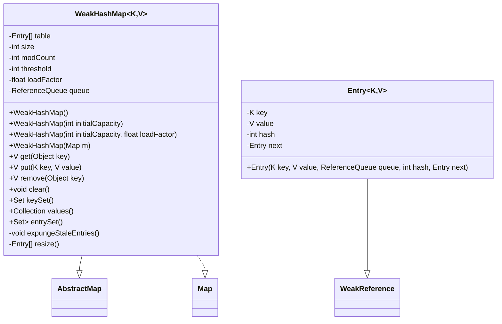
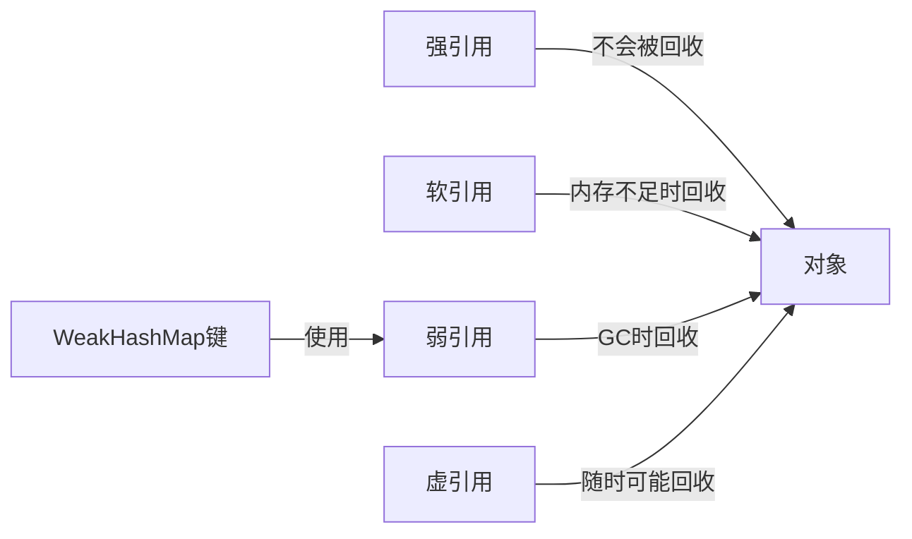
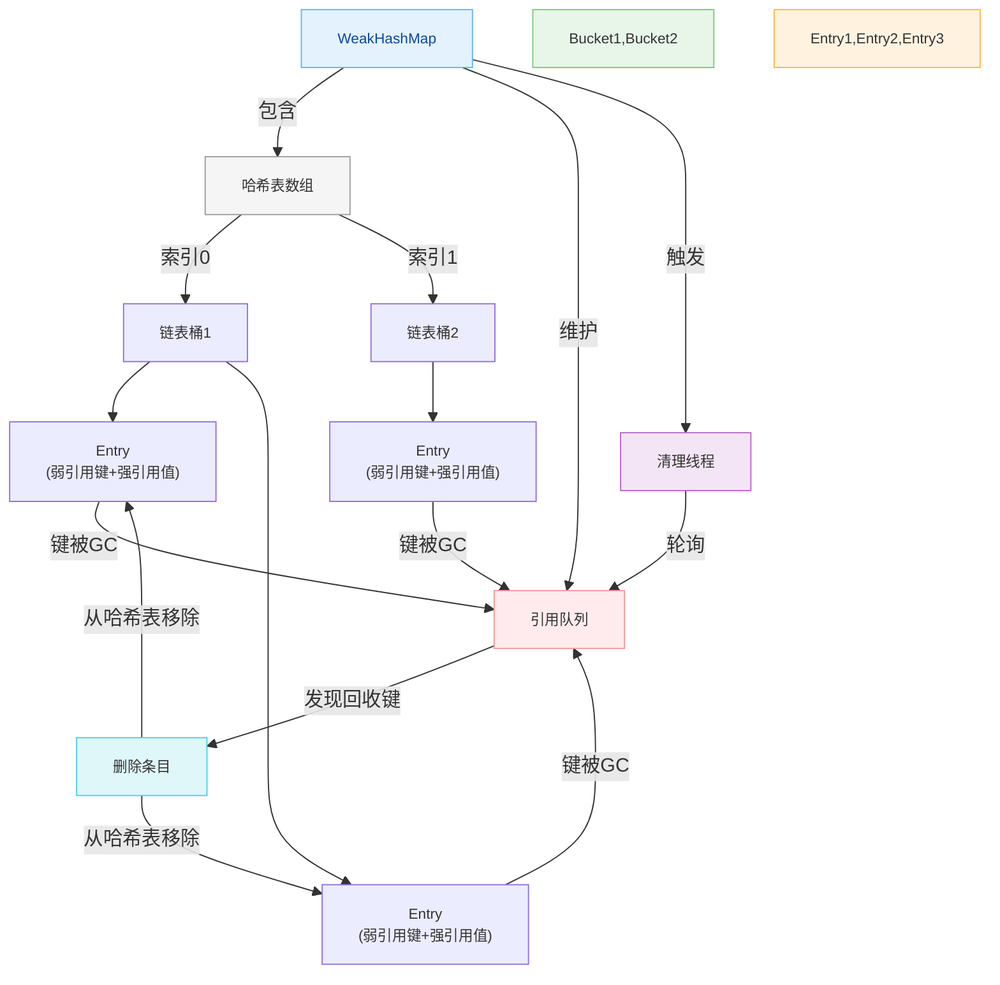

# 1.4.1 集合-WeakHashMap源码

## 核理論
### 1.1 类结构分析
WeakHashMap是Java集合框架中一种特殊的Map实现，它使用弱引用(WeakReference)作为键(key)，当键对象不再被强引用时，对应的键值对会被自动移除。这种特性使得WeakHashMap非常适合实现缓存功能，能够自动释放不再使用的对象，避免内存泄漏。



### 1.2 弱引用机制
在Java中，引用分为四种级别：强引用(Strong Reference)、软引用(Soft Reference)、弱引用(Weak Reference)和虚引用(Phantom Reference)。WeakHashMap使用弱引用作为键，这意味着当键对象没有被其他强引用指向时，可能会被垃圾回收器回收，即使此时它仍然是WeakHashMap的键。



### 1.3 JDK版本特性
- **JDK 1.2**：WeakHashMap首次被引入
- **JDK 8**：实现了Map.Entry接口的spliterator()方法
- **JDK 9+**：添加了of()、copyOf()等静态工厂方法，支持创建不可变WeakHashMap实例

## 代码实践
### 2.1 核心成员变量
```java
public class WeakHashMap<K,V> extends AbstractMap<K,V> implements Map<K,V> {
    // 存储键值对的数组
    private Entry<K,V>[] table;
    // 键值对数量
    private int size;
    // 修改计数器，用于快速失败机制
    private int modCount;
    // 扩容阈值
    private int threshold;
    // 负载因子
    private final float loadFactor;
    // 引用队列，用于存储被回收的键
    private final ReferenceQueue<K> queue = new ReferenceQueue<>();
    // ...
}
```

### 2.2 Entry节点实现
```java
private static class Entry<K,V> extends WeakReference<K> implements Map.Entry<K,V> {
    V value;
    final int hash;
    Entry<K,V> next;

    /**
     * 创建一个新的Entry节点
     * @param key 键，将被包装为弱引用
     * @param value 值，强引用
     * @param queue 引用队列，当键被回收时会加入此队列
     * @param hash 键的哈希值
     * @param next 下一个节点
     */
    Entry(K key, V value, ReferenceQueue<K> queue, int hash, Entry<K,V> next) {
        super(key, queue);
        this.value = value;
        this.hash = hash;
        this.next = next;
    }

    // Entry接口实现
    public K getKey() { return get(); }
    public V getValue() { return value; }
    public V setValue(V newValue) { ... }
    public boolean equals(Object o) { ... }
    public int hashCode() { ... }
}
```

### 2.3 清理过期条目
expungeStaleEntries()方法是WeakHashMap的核心，它负责从表中移除那些键已经被回收的条目：

```java
/**
 * 清理所有键已被回收的条目
 */
private void expungeStaleEntries() {
    Entry<K,V> e;
    // 循环从引用队列中获取被回收的键对应的Entry
    while ((e = (Entry<K,V>) queue.poll()) != null) {
        int h = e.hash;
        int i = indexFor(h, table.length);

        Entry<K,V> prev = table[i];
        Entry<K,V> p = prev;
        while (p != null) {
            Entry<K,V> next = p.next;
            if (p == e) {
                // 找到要删除的节点
                if (prev == e)
                    table[i] = next;
                else
                    prev.next = next;
                e.value = null; // 帮助GC回收value
                size--;
            } else {
                int i = indexFor(e.hash, dest.length);
                e.next = dest[i];
                dest[i] = e;
            }
            e = next;
        }
    }
}
```

### 2.4 get方法实现
```java
/**
 * 根据键获取值
 * @param key 要查找的键
 * @return 键对应的值，如果键不存在或已被回收则返回null
 */
public V get(Object key) {
    Object k = maskNull(key);
    int h = hash(k);
    Entry<K,V>[] tab = getTable();
    int index = indexFor(h, tab.length);
    Entry<K,V> e = tab[index];
    // 遍历链表查找
    while (e != null) {
        if (e.hash == h && eq(k, e.get()))
            return e.value;
        e = e.next;
    }
    return null;
}

/**
 * 获取哈希表前先清理过期条目
 */
private Entry<K,V>[] getTable() {
    expungeStaleEntries();
    return table;
}
```

### 2.5 put方法实现
```java
/**
 * 添加键值对到映射中
 * @param key 键
 * @param value 值
 * @return 之前与key关联的值，如果没有则返回null
 */
public V put(K key, V value) {
    Object k = maskNull(key);
    int h = hash(k);
    Entry<K,V>[] tab = getTable();
    int i = indexFor(h, tab.length);

    // 查找是否已存在该键，如果存在则替换值
    for (Entry<K,V> e = tab[i]; e != null; e = e.next) {
        if (h == e.hash && eq(k, e.get())) {
            V oldValue = e.value;
            if (value != oldValue)
                e.value = value;
            return oldValue;
        }
    }

    modCount++;
    Entry<K,V> e = tab[i];
    // 创建新的Entry并添加到链表头部
    tab[i] = new Entry<>(k, value, queue, h, e);
    // 检查是否需要扩容
    if (++size >= threshold)
        resize(tab.length * 2);
    return null;
}
```

### 2.6 扩容机制
```java
/**
 * 调整哈希表大小
 * @param newCapacity 新容量
 * @return 调整后的哈希表
 */
private Entry<K,V>[] resize(int newCapacity) {
    Entry<K,V>[] oldTable = getTable();
    int oldCapacity = oldTable.length;
    if (oldCapacity == MAXIMUM_CAPACITY) {
        threshold = Integer.MAX_VALUE;
        return oldTable;
    }

    Entry<K,V>[] newTable = new Entry[newCapacity];
    // 转移条目到新表
    transfer(oldTable, newTable);
    table = newTable;
    // 计算新的扩容阈值
    threshold = (int)(newCapacity * loadFactor);
    return newTable;
}

/**
 * 将条目从旧表转移到新表
 */
private void transfer(Entry<K,V>[] src, Entry<K,V>[] dest) {
    for (int j = 0; j < src.length; ++j) {
        Entry<K,V> e = src[j];
        src[j] = null;
        while (e != null) {
            Entry<K,V> next = e.next;
            K key = e.get();
            if (key == null) {
                e.next = null;  // 帮助GC
                e.value = null; // 帮助GC回收value
                size--;
            } else {
                int i = indexFor(e.hash, dest.length);
                e.next = dest[i];
                dest[i] = e;
            }
            e = next;
        }
    }
}
```

### 2.7 WeakHashMap缓存示例
```java
import java.util.WeakHashMap;

/**
 * 使用WeakHashMap实现简单缓存
 */
public class WeakHashMapCacheExample {
    private final WeakHashMap<String, Object> cache = new WeakHashMap<>();

    /**
     * 从缓存获取对象
     */
    public Object get(String key) {
        return cache.get(key);
    }

    /**
     * 添加对象到缓存
     */
    public void put(String key, Object value) {
        cache.put(key, value);
    }

    /**
     * 清除缓存
     */
    public void clear() {
        cache.clear();
    }

    public static void main(String[] args) {
        WeakHashMapCacheExample cache = new WeakHashMapCacheExample();
        String key = new String("testKey");
        Object value = new Object();

        cache.put(key, value);
        System.out.println("缓存中获取值: " + (cache.get(key) != null)); // true

        // 移除强引用
        key = null;
        value = null;

        // 触发GC
        System.gc();

        // 短暂等待GC完成
        try {
            Thread.sleep(1000);
        } catch (InterruptedException e) {
            e.printStackTrace();
        }

        // 缓存中的条目已被自动移除
        System.out.println("GC后缓存中获取值: " + (cache.get("testKey") != null)); // false
    }
}
```

## 设计思想
### 3.1 数据结构设计
WeakHashMap的核心设计思想是结合哈希表和弱引用机制，实现自动过期的键值对存储。它的内部结构与HashMap类似，都使用数组+链表的结构来存储键值对，但有以下关键区别：

1. **键的存储方式**：WeakHashMap的键被包装在WeakReference中，而HashMap使用强引用
2. **引用队列**：WeakHashMap维护一个引用队列，用于跟踪被回收的键
3. **自动清理机制**：在每次操作前会清理过期条目



### 3.2 自动清理策略
WeakHashMap采用**懒清理**策略，在以下几种情况下会触发过期条目的清理：
1. 调用get()、put()、remove()等方法时
2. 调用size()、isEmpty()等查询方法时
3. 遍历集合视图时(如keySet()、entrySet())

这种策略避免了专门的清理线程，简化了实现并提高了并发性能，但可能导致已回收键对应的条目不会立即从表中移除。

### 3.3 性能权衡
与HashMap相比，WeakHashMap在性能上有以下特点：
- **插入性能**：略低于HashMap，因为需要创建WeakReference包装键
- **查询性能**：类似HashMap，但需要额外处理过期条目
- **内存占用**：通常更低，因为不再使用的键值对会被自动回收
- **GC影响**：GC可能会导致条目被移除，影响迭代行为

## 避坑指南
### 4.1 键的强引用问题
**问题**：如果键对象仍然被强引用，即使不再需要，WeakHashMap也不会自动移除对应的条目。

**解决方案**：确保只将临时对象或明确希望被自动回收的对象作为WeakHashMap的键，避免意外的强引用。

```java
// 错误示例：字符串常量池中的字符串是强引用，不会被回收
WeakHashMap<String, Object> map = new WeakHashMap<>();
map.put("permanentKey", new Object()); // 键是常量池中的字符串，永远不会被回收

// 正确示例：使用new创建的字符串对象，可以被回收
WeakHashMap<String, Object> map = new WeakHashMap<>();
map.put(new String("temporaryKey"), new Object()); // 键是新创建的对象，没有其他强引用时可以被回收
```

### 4.2 线程安全问题
**问题**：WeakHashMap不是线程安全的，多线程环境下可能导致并发修改异常或数据不一致。

**解决方案**：使用Collections.synchronizedMap()包装，或使用ConcurrentHashMap(如果不需要弱引用特性)。

```java
// 线程安全的WeakHashMap
Map<K, V> safeMap = Collections.synchronizedMap(new WeakHashMap<>());
```

### 4.3 值的内存泄漏
**问题**：虽然键是弱引用，但值是强引用。如果值对象很大且生命周期长，即使键被回收，值也可能导致内存泄漏。

**解决方案**：考虑使用弱引用包装值，或使用专门的缓存框架如Guava Cache。

```java
// 使用弱引用包装值
WeakHashMap<K, WeakReference<V>> map = new WeakHashMap<>();
map.put(key, new WeakReference<>(value));
```

### 4.4 迭代行为不可预测
**问题**：在迭代过程中，GC可能回收键导致条目被移除，产生不可预测的迭代行为。

**解决方案**：迭代前获取快照，或使用同步块确保迭代过程中不发生GC。

```java
// 获取键集快照后迭代
Set<K> keySet;
synchronized (map) {
    keySet = new HashSet<>(map.keySet());
}
for (K key : keySet) {
    // 使用key访问map
}
```

## 深度思考题
### 思考题1：WeakHashMap与HashMap的红黑树实现有何不同？

思考题回答：WeakHashMap在JDK 8及之后的版本中没有像HashMap那样引入红黑树优化。这是因为WeakHashMap的设计目标和使用场景与HashMap不同：
1. WeakHashMap通常用于存储临时对象，条目数量一般不会太大
2. 键的生命周期不确定，红黑树的维护成本可能超过其带来的性能收益
3. 频繁的GC回收可能导致树结构频繁重组，降低性能

如果需要高性能的大容量弱引用映射，可能需要考虑第三方库或自定义实现。

### 思考题2：如何实现一个线程安全的WeakHashMap？

思考题回答：实现线程安全的WeakHashMap可以有以下几种方案：
1. **使用Collections.synchronizedMap()**：最简单的方式，但并发性能较差
2. **分段锁实现**：类似ConcurrentHashMap的分段锁机制，将表分成多个段，每个段独立加锁
3. **读写锁**：使用ReentrantReadWriteLock分离读写操作，提高并发读性能
4. **ConcurrentReferenceHashMap**：Guava库提供的并发引用映射实现，比WeakHashMap更适合高并发场景

以下是一个基于读写锁的简单实现：
```java
public class ConcurrentWeakHashMap<K, V> {
    private final WeakHashMap<K, V> map = new WeakHashMap<>();
    private final ReentrantReadWriteLock rwLock = new ReentrantReadWriteLock();
    private final Lock readLock = rwLock.readLock();
    private final Lock writeLock = rwLock.writeLock();

    public V get(K key) {
        readLock.lock();
        try {
            return map.get(key);
        } finally {
            readLock.unlock();
        }
    }

    public V put(K key, V value) {
        writeLock.lock();
        try {
            return map.put(key, value);
        } finally {
            writeLock.unlock();
        }
    }

    // 其他方法...
}
```

### 思考题3：WeakHashMap、SoftReference和PhantomReference在缓存实现中有何区别？

思考题回答：在缓存实现中，这三种引用类型有明显区别：
1. **WeakHashMap(弱引用)**：键被GC时立即回收，适合存储临时对象缓存
2. **SoftReference(软引用)**：内存不足时才回收，适合实现内存敏感的缓存
3. **PhantomReference(虚引用)**：仅用于跟踪对象回收，无法通过虚引用获取对象，不适合缓存

选择建议：
- 频繁使用且内存占用小的对象：WeakHashMap
- 不常使用但内存占用大的对象：SoftReference
- 需要在对象回收前执行清理操作：PhantomReference

Java 9引入的Cleaner API结合PhantomReference提供了更灵活的对象清理机制，可以替代finalize()方法。