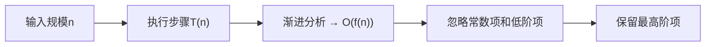
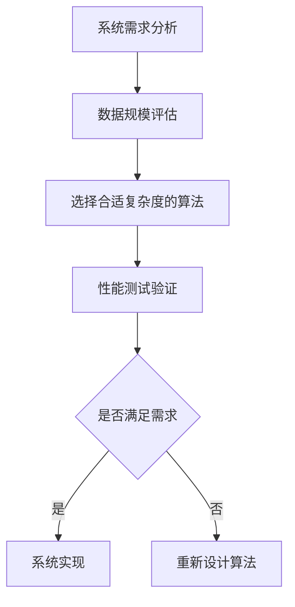

# 1.4.2 时间复杂度

## 核心理论
### 1.1 时间复杂度定义与表示法
时间复杂度是衡量算法执行时间随输入规模增长的变化趋势，通常使用大O符号（O-notation）表示。它描述了在最坏情况下算法执行步骤的数量级，忽略常数因子和低阶项。



### 1.2 常见时间复杂度类型
| 复杂度 | 名称 | 增长速率 | 典型算法 |
|--------|------|----------|----------|
| O(1) | 常数时间 | 恒定 | 数组访问、哈希表查找 |
| O(log n) | 对数时间 | 缓慢增长 | 二分查找、平衡树操作 |
| O(n) | 线性时间 | 线性增长 | 线性查找、数组遍历 |
| O(n log n) | 线性对数时间 | 温和增长 | 快速排序、归并排序 |
| O(n²) | 平方时间 | 较快增长 | 冒泡排序、选择排序 |
| O(n³) | 立方时间 | 快速增长 | 矩阵乘法 |
| O(2ⁿ) | 指数时间 | 爆炸增长 | 子集生成、汉诺塔 |
| O(n!) | 阶乘时间 | 极速增长 | 全排列生成 |

### 1.3 空间复杂度基础
空间复杂度用于衡量算法在执行过程中所需存储空间的增长趋势，同样使用大O符号表示。包括输入空间、辅助空间和输出空间三部分，通常关注辅助空间的增长情况。

### 1.4 摊还时间复杂度
摊还时间复杂度用于分析在一系列操作中，即使个别操作具有较高复杂度，但平均下来每个操作的复杂度较低的情况。典型例子包括动态数组的扩容和栈的多 pop 操作。

```java
/**
 * 动态数组扩容的摊还复杂度分析
 * 平均每次add操作的摊还复杂度为O(1)
 */
public class DynamicArray {
    private int[] array;
    private int size;
    private int capacity;

    public DynamicArray() {
        capacity = 4;
        array = new int[capacity];
        size = 0;
    }

    public void add(int element) {
        if (size == capacity) {
            // 扩容操作，复杂度O(n)
            capacity *= 2;
            int[] newArray = new int[capacity];
            System.arraycopy(array, 0, newArray, 0, size);
            array = newArray;
        }
        // 普通添加操作，复杂度O(1)
        array[size++] = element;
    }
}
```

## 代码实践
### 2.1 复杂度分析实例
#### 2.1.1 常数时间复杂度O(1)
```java
/**
 * 交换数组中两个元素
 * @param arr 数组
 * @param i 索引i
 * @param j 索引j
 * 时间复杂度：O(1)，无论数组大小，操作步骤固定
 */
public void swap(int[] arr, int i, int j) {
    if (i < 0 || i >= arr.length || j < 0 || j >= arr.length) {
        throw new IndexOutOfBoundsException();
    }
    int temp = arr[i];
    arr[i] = arr[j];
    arr[j] = temp;
}
```

#### 2.1.2 线性时间复杂度O(n)
```java
/**
 * 查找数组中的最大值
 * @param arr 输入数组
 * @return 最大值
 * 时间复杂度：O(n)，需遍历整个数组
 */
public int findMax(int[] arr) {
    if (arr == null || arr.length == 0) {
        throw new IllegalArgumentException("Array must not be null or empty");
    }
    int max = arr[0];
    for (int i = 1; i < arr.length; i++) {
        if (arr[i] > max) {
            max = arr[i];
        }
    }
    return max;
}
```

#### 2.1.3 平方时间复杂度O(n²)
```java
/**
 * 冒泡排序算法
 * @param arr 待排序数组
 * 时间复杂度：O(n²)，双层嵌套循环
 */
public void bubbleSort(int[] arr) {
    if (arr == null || arr.length <= 1) {
        return;
    }
    for (int i = 0; i < arr.length - 1; i++) {
        boolean swapped = false;
        for (int j = 0; j < arr.length - 1 - i; j++) {
            if (arr[j] > arr[j + 1]) {
                // 交换元素
                int temp = arr[j];
                arr[j] = arr[j + 1];
                arr[j + 1] = temp;
                swapped = true;
            }
        }
        // 如果没有交换，说明数组已排序完成
        if (!swapped) {
            break;
        }
    }
}
```

#### 2.1.4 对数时间复杂度O(log n)
```java
/**
 * 二分查找算法
 * @param arr 已排序数组
 * @param target 目标值
 * @return 目标值索引，未找到返回-1
 * 时间复杂度：O(log n)，每次查找范围减半
 */
public int binarySearch(int[] arr, int target) {
    if (arr == null || arr.length == 0) {
        return -1;
    }
    int left = 0;
    int right = arr.length - 1;
    while (left <= right) {
        int mid = left + (right - left) / 2; // 避免溢出
        if (arr[mid] == target) {
            return mid;
        } else if (arr[mid] < target) {
            left = mid + 1;
        } else {
            right = mid - 1;
        }
    }
    return -1;
}
```

### 2.2 递归算法复杂度分析
```java
/**
 * 斐波那契数列递归实现
 * @param n 数列索引
 * @return 第n个斐波那契数
 * 时间复杂度：O(2ⁿ)，指数级增长
 * 空间复杂度：O(n)，递归调用栈深度
 */
public int fibonacci(int n) {
    if (n <= 1) {
        return n;
    }
    return fibonacci(n - 1) + fibonacci(n - 2);
}

/**
 * 优化后的斐波那契数列（尾递归）
 * @param n 数列索引
 * @return 第n个斐波那契数
 * 时间复杂度：O(n)，线性增长
 * 空间复杂度：O(1)，常数空间（若编译器支持尾递归优化）
 */
public int fibonacciOptimized(int n) {
    return fibonacciTail(n, 0, 1);
}

private int fibonacciTail(int n, int a, int b) {
    if (n == 0) return a;
    if (n == 1) return b;
    return fibonacciTail(n - 1, b, a + b);
}
```

### 2.3 集合框架操作复杂度分析
```java
/**
 * 不同集合的常见操作复杂度对比
 */
public class CollectionComplexityDemo {
    public static void main(String[] args) {
        // ArrayList操作复杂度
        List<Integer> arrayList = new ArrayList<>();
        arrayList.add(1); // O(1)  amortized
        arrayList.get(0); // O(1)
        arrayList.remove(0); // O(n)
        arrayList.contains(1); // O(n)

        // LinkedList操作复杂度
        List<Integer> linkedList = new LinkedList<>();
        linkedList.add(1); // O(1)
        linkedList.get(0); // O(n)
        linkedList.remove(0); // O(1)
        linkedList.contains(1); // O(n)

        // HashSet操作复杂度
        Set<Integer> hashSet = new HashSet<>();
        hashSet.add(1); // O(1) average
        hashSet.contains(1); // O(1) average
        hashSet.remove(1); // O(1) average

        // TreeSet操作复杂度
        Set<Integer> treeSet = new TreeSet<>();
        treeSet.add(1); // O(log n)
        treeSet.contains(1); // O(log n)
        treeSet.remove(1); // O(log n)
    }
}
```

## 设计思想
### 3.1 复杂度优化策略
#### 3.1.1 空间换时间
通过增加额外存储空间来降低时间复杂度，如哈希表的使用：

```java
/**
 * 两数之和问题：空间换时间优化
 * @param nums 输入数组
 * @param target 目标和
 * @return 两个数的索引
 * 时间复杂度：O(n)，空间复杂度：O(n)
 */
public int[] twoSum(int[] nums, int target) {
    Map<Integer, Integer> numMap = new HashMap<>();
    for (int i = 0; i < nums.length; i++) {
        int complement = target - nums[i];
        if (numMap.containsKey(complement)) {
            return new int[] { numMap.get(complement), i };
        }
        numMap.put(nums[i], i);
    }
    throw new IllegalArgumentException("No solution");
}
```

#### 3.1.2 时间换空间
在内存受限情况下，通过增加计算时间来减少空间占用，如斐波那契数列的迭代实现：

```java
/**
 * 斐波那契数列迭代实现（时间换空间）
 * @param n 数列索引
 * @return 第n个斐波那契数
 * 时间复杂度：O(n)，空间复杂度：O(1)
 */
public int fibonacciIterative(int n) {
    if (n <= 1) return n;
    int a = 0, b = 1, c;
    for (int i = 2; i <= n; i++) {
        c = a + b;
        a = b;
        b = c;
    }
    return b;
}
```

### 3.2 复杂度分析在系统设计中的应用
在大型系统设计中，时间复杂度分析有助于选择合适的数据结构和算法：
- 高频查询场景：选择O(1)或O(log n)复杂度的数据结构（哈希表、平衡树）
- 大数据量处理：避免O(n²)及以上复杂度的算法
- 实时系统：严格控制时间复杂度上限



## 避坑指南
### 4.1 常见复杂度分析错误
#### 4.1.1 忽略常数因子
虽然大O表示法忽略常数因子，但在实际工程中，当输入规模较小时，常数因子可能显著影响性能。

#### 4.1.2 混淆最好、最坏和平均情况
分析算法时需明确说明是哪种情况的复杂度：
- 最好情况：最理想输入下的复杂度
- 最坏情况：最不利输入下的复杂度
- 平均情况：所有可能输入的期望复杂度

```java
/**
 * 顺序查找算法
 * @param arr 数组
 * @param target 目标值
 * @return 目标值索引，未找到返回-1
 * 最好情况：O(1)（第一个元素即目标）
 * 最坏情况：O(n)（最后一个元素或不存在）
 * 平均情况：O(n)
 */
public int sequentialSearch(int[] arr, int target) {
    for (int i = 0; i < arr.length; i++) {
        if (arr[i] == target) {
            return i;
        }
    }
    return -1;
}
```

### 4.2 面试中的复杂度陷阱
#### 4.2.1 隐藏的复杂度
某些看似简单的操作可能隐藏着较高的复杂度：
```java
// 看似O(n)，实则O(n²)，因为字符串拼接每次都会创建新对象
public String concatenateStrings(List<String> strings) {
    String result = "";
    for (String s : strings) {
        result += s; // 每次拼接都是O(k)，k为当前字符串长度
    }
    return result;
}

// 优化后：O(n)，使用StringBuilder避免重复创建对象
public String concatenateStringsOptimized(List<String> strings) {
    StringBuilder sb = new StringBuilder();
    for (String s : strings) {
        sb.append(s);
    }
    return sb.toString();
}
```

#### 4.2.2 递归调用栈溢出风险
递归算法虽然简洁，但可能导致栈溢出：
```java
// 递归过深会导致StackOverflowError
public long factorial(int n) {
    if (n == 0) return 1;
    return n * factorial(n - 1);
}

// 优化：使用迭代或增加尾递归优化
public long factorialIterative(int n) {
    long result = 1;
    for (int i = 1; i <= n; i++) {
        result *= i;
    }
    return result;
}
```

## 深度思考题
### 思考题1：如何分析嵌套循环的时间复杂度？

思考题回答：嵌套循环的时间复杂度分析需考虑各层循环变量之间的关系：
1. **独立循环变量**：时间复杂度为各层循环次数的乘积，如for(i=0;i<n;i++){for(j=0;j<m;j++){...}}的复杂度为O(n×m)
2. **循环变量相关**：如for(i=0;i<n;i++){for(j=i;j<n;j++){...}}的复杂度为O(n²/2)=O(n²)
3. **指数级增长**：如递归嵌套或循环变量按指数增长，复杂度可能为O(2ⁿ)或O(n!)

分析时需关注循环条件和迭代步长，步长为2的倍数通常意味着对数复杂度。

### 思考题2：如何在不使用额外空间的情况下优化时间复杂度？

思考题回答：无额外空间优化时间复杂度的常用策略：
1. **原地算法**：直接修改输入数据，如原地排序（快速排序、堆排序）
2. **双指针技术**：使用两个指针遍历数据，如链表反转、数组去重
3. **数学变换**：通过数学公式减少计算步骤，如高斯求和公式
4. **位运算**：利用位操作替代算术运算，如使用异或进行交换

示例：使用双指针技术实现O(n)时间复杂度、O(1)空间复杂度的数组反转：
```java
public void reverseArray(int[] arr) {
    if (arr == null || arr.length <= 1) return;
    int left = 0, right = arr.length - 1;
    while (left < right) {
        // 不使用额外变量交换元素
        arr[left] = arr[left] ^ arr[right];
        arr[right] = arr[left] ^ arr[right];
        arr[left] = arr[left] ^ arr[right];
        left++;
        right--;
    }
}
```

### 思考题3：如何评估一个系统的性能瓶颈并进行优化？

思考题回答：系统性能瓶颈评估与优化步骤：
1. **性能基准测试**：建立性能指标基线，如响应时间、吞吐量
2. **性能剖析**：使用工具识别瓶颈位置（CPU、内存、IO或网络）
3. **复杂度分析**：检查关键算法和数据结构的时间/空间复杂度
4. **针对性优化**：
   - CPU瓶颈：优化算法复杂度，减少计算量
   - 内存瓶颈：优化数据结构，减少内存占用
   - IO瓶颈：增加缓存，减少IO操作
   - 网络瓶颈：优化数据传输格式和协议
5. **验证优化效果**：重新测试并与基线对比
6. **持续监控**：建立长期性能监控机制

实际案例：电商系统商品搜索优化可采用"倒排索引+缓存+异步更新"策略，将O(n)的全文搜索优化为O(log n)的索引查找，同时通过缓存减轻数据库压力。