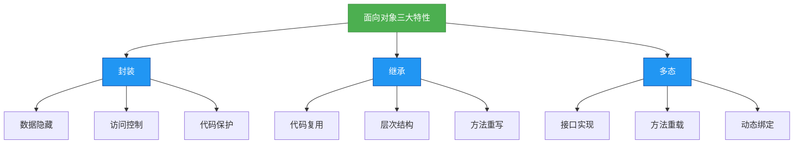

# 1.4.1 三大特性
## 概述
面向对象编程（OOP）的三大核心特性是封装（Encapsulation）、继承（Inheritance）和多态（Polymorphism）。这些特性共同构成了面向对象设计的基础，帮助开发者构建模块化、可维护和可扩展的代码。



## 知识要点
### 2.1 封装
封装是指将对象的状态（属性）和行为（方法）捆绑在一起，并通过访问控制修饰符限制对内部实现的直接访问，仅暴露必要的接口。

#### 2.1.1 访问控制修饰符
Java提供四种访问控制级别，从严格到宽松依次为：
- `private`：仅本类可见
- 默认（package-private）：本包可见
- `protected`：本包及子类可见
- `public`：全局可见

```java
public class User {
    // 私有属性，仅本类可直接访问
    private String username;
    private int age;

    // 公共getter方法，控制属性访问
    public String getUsername() {
        return username;
    }

    // 公共setter方法，控制属性修改
    public void setUsername(String username) {
        // 可以添加验证逻辑
        if (username != null && username.length() <= 20) {
            this.username = username;
        }
    }

    // 省略age的getter和setter
}
```

#### 2.1.2 JavaBean规范
JavaBean是遵循特定规范的Java类，是封装的典型应用：
1. 类必须是公共的（public）
2. 属性私有化（private）
3. 提供公共的getter/setter方法
4. 提供无参构造方法

```java
public class Student implements Serializable {
    private String id;
    private String name;
    private int score;

    // 无参构造方法
    public Student() {}

    // 有参构造方法
    public Student(String id, String name) {
        this.id = id;
        this.name = name;
    }

    // getter和setter方法
    public String getId() { return id; }
    public void setId(String id) { this.id = id; }
    public String getName() { return name; }
    public void setName(String name) { this.name = name; }
    public int getScore() { return score; }
    public void setScore(int score) { this.score = score; }
}
```

### 2.2 继承
继承允许一个类（子类）继承另一个类（父类）的属性和方法，实现代码复用和层次化设计。Java中使用`extends`关键字实现单继承。

#### 2.2.1 继承的基本语法
```java
// 父类
public class Animal {
    protected String name;
    protected int age;

    public void eat() {
        System.out.println(name + "正在进食");
    }

    public void sleep() {
        System.out.println(name + "正在睡觉");
    }
}

// 子类继承父类
public class Dog extends Animal {
    // 子类特有属性
    private String breed;

    // 子类特有方法
    public void bark() {
        System.out.println(name + "汪汪叫");
    }

    // 重写父类方法
    @Override
    public void eat() {
        System.out.println(name + "正在吃骨头");
    }
}
```

#### 2.2.2 方法重写（Override）
子类可以重写父类的方法，以提供特定实现。重写需满足：
- 方法名、参数列表必须与父类一致
- 返回类型必须与父类兼容（JDK7+允许协变返回类型）
- 访问修饰符不能严于父类
- 不能抛出比父类更多的 checked 异常

```java
public class Cat extends Animal {
    @Override
    public void eat() {
        System.out.println(name + "正在吃鱼");
    }

    // 错误示例：参数列表与父类不一致，这是重载而非重写
    // @Override
    // public void eat(String food) {
    //     System.out.println(name + "正在吃" + food);
    // }
}
```

#### 2.2.3 super关键字
`super`关键字用于访问父类的成员和构造方法：
```java
public class Bird extends Animal {
    private String color;

    public Bird(String name, int age, String color) {
        // 调用父类构造方法
        super(name, age);
        this.color = color;
    }

    @Override
    public void eat() {
        // 调用父类方法
        super.eat();
        System.out.println("这只" + color + "的鸟吃得很开心");
    }
}
```

### 2.3 多态
多态是指同一操作作用于不同对象时，会产生不同的执行结果。Java通过方法重写和方法重载实现多态。

#### 2.3.1 向上转型
子类对象可以赋值给父类引用，这是实现多态的基础：
```java
Animal animal1 = new Dog(); // 向上转型
Animal animal2 = new Cat(); // 向上转型
Animal animal3 = new Bird(); // 向上转型

// 调用相同方法，表现不同行为
animal1.eat(); // 输出：正在吃骨头
animal2.eat(); // 输出：正在吃鱼
animal3.eat(); // 输出：正在进食
```

#### 2.3.2 方法重载（Overload）
在同一个类中，允许存在多个同名方法，只要它们的参数列表不同（参数类型、个数或顺序）：
```java
public class Calculator {
    // 两个整数相加
    public int add(int a, int b) {
        return a + b;
    }

    // 三个整数相加（参数个数不同）
    public int add(int a, int b, int c) {
        return a + b + c;
    }

    // 两个浮点数相加（参数类型不同）
    public double add(double a, double b) {
        return a + b;
    }

    // 注意：返回类型不同不足以构成重载
    // public double add(int a, int b) {
    //     return a + b;
    // }
}
```

#### 2.3.3 接口与多态
接口是实现多态的重要方式，不同类可以实现相同接口并提供不同实现：
```java
// 定义接口
public interface Shape {
    double calculateArea();
    double calculatePerimeter();
}

// 圆形实现
public class Circle implements Shape {
    private double radius;

    public Circle(double radius) {
        this.radius = radius;
    }

    @Override
    public double calculateArea() {
        return Math.PI * radius * radius;
    }

    @Override
    public double calculatePerimeter() {
        return 2 * Math.PI * radius;
    }
}

// 矩形实现
public class Rectangle implements Shape {
    private double length;
    private double width;

    public Rectangle(double length, double width) {
        this.length = length;
        this.width = width;
    }

    @Override
    public double calculateArea() {
        return length * width;
    }

    @Override
    public double calculatePerimeter() {
        return 2 * (length + width);
    }
}

// 使用多态
public class ShapeCalculator {
    public static void printShapeInfo(Shape shape) {
        System.out.println("面积: " + shape.calculateArea());
        System.out.println("周长: " + shape.calculatePerimeter());
    }

    public static void main(String[] args) {
        Shape circle = new Circle(5);
        Shape rectangle = new Rectangle(4, 6);

        printShapeInfo(circle);    // 输出圆形的面积和周长
        printShapeInfo(rectangle); // 输出矩形的面积和周长
    }
}
```

## 知识扩展
### 3.1 设计思想
#### 3.1.1 里氏替换原则
任何父类出现的地方，都可以用子类替换，且不会影响程序的正确性。这要求子类不能改变父类的预期行为。

**反例**：
```java
public class Rectangle {
    protected int width;
    protected int height;

    public void setWidth(int width) { this.width = width; }
    public void setHeight(int height) { this.height = height; }
    public int getArea() { return width * height; }
}

// 违反里氏替换原则的正方形类
public class Square extends Rectangle {
    @Override
    public void setWidth(int width) {
        this.width = width;
        this.height = width; // 修改了父类的行为
    }

    @Override
    public void setHeight(int height) {
        this.width = height;
        this.height = height; // 修改了父类的行为
    }
}
```

**解决方案**：使用组合而非继承，或重新设计类层次结构。

#### 3.1.2 开闭原则
软件实体（类、模块、函数等）应该对扩展开放，对修改关闭。通过多态可以很好地实现这一原则。

```java
// 符合开闭原则的设计
public interface Payment {
    void pay(double amount);
}

public class Alipay implements Payment {
    @Override
    public void pay(double amount) {
        System.out.println("支付宝支付: " + amount + "元");
    }
}

public class WechatPay implements Payment {
    @Override
    public void pay(double amount) {
        System.out.println("微信支付: " + amount + "元");
    }
}

// 新增支付方式时无需修改现有代码
public class UnionPay implements Payment {
    @Override
    public void pay(double amount) {
        System.out.println("银联支付: " + amount + "元");
    }
}
```

### 3.2 避坑指南
#### 3.2.1 继承滥用
**问题**：过度使用继承导致类层次结构复杂，耦合度高。
**解决方案**：优先考虑组合而非继承。组合是"有一个"关系，继承是"是一个"关系。

```java
// 继承方式（可能不合适）
public class Bird extends Animal {
    private Flyable flyable;
    // ...
}

// 组合方式（更灵活）
public class Bird extends Animal {
    private Flyable flyable;
    
    public Bird(Flyable flyable) {
        this.flyable = flyable;
    }
    
    public void fly() {
        flyable.fly();
    }
}

public interface Flyable {
    void fly();
}

public class HighFly implements Flyable {
    @Override
    public void fly() {
        System.out.println("高空飞行");
    }
}

public class LowFly implements Flyable {
    @Override
    public void fly() {
        System.out.println("低空飞行");
    }
}
```

#### 3.2.2 多态误用
**问题**：向下转型不安全，可能导致ClassCastException。
**解决方案**：使用instanceof关键字进行类型检查。

```java
public void doSomething(Animal animal) {
    if (animal instanceof Dog) {
        Dog dog = (Dog) animal; // 安全的向下转型
        dog.bark();
    } else if (animal instanceof Cat) {
        Cat cat = (Cat) animal;
        cat.meow();
    }
}
```

#### 3.2.3 封装过度
**问题**：将所有属性都私有化并提供简单的getter/setter，实际上破坏了封装。
**解决方案**：暴露行为而非状态，将业务逻辑封装在对象内部。

```java
// 不好的设计
public class BankAccount {
    private double balance;
    
    public double getBalance() { return balance; }
    public void setBalance(double balance) { this.balance = balance; }
}

// 好的设计
public class BankAccount {
    private double balance;
    
    public void deposit(double amount) {
        if (amount > 0) {
            balance += amount;
        }
    }
    
    public void withdraw(double amount) {
        if (amount > 0 && amount <= balance) {
            balance -= amount;
        }
    }
    
    public double getBalance() { return balance; }
}
```

### 3.3 深度思考题
#### 思考题1：重载和重写的区别是什么？
**回答**：
- **重载（Overload）**：发生在同一个类中，方法名相同，参数列表不同（类型、个数、顺序），与返回类型和访问修饰符无关。是编译时多态。
- **重写（Override）**：发生在父子类中，方法名、参数列表、返回类型必须相同，访问修饰符不能严于父类，不能抛出更多checked异常。是运行时多态。

#### 思考题2：Java为什么不支持多继承？
**回答**：
Java不支持类的多继承，主要是为了避免菱形继承问题（钻石问题）。当一个类同时继承两个父类，而这两个父类又继承自同一个祖父类时，如果祖父类的方法被子类重写，子类将无法确定应该继承哪个父类的方法。

Java通过接口实现了多继承的功能，一个类可以实现多个接口，从而避免了菱形继承问题，因为接口只定义方法签名，没有具体实现。

#### 思考题3：如何理解"多态是封装和继承的延伸"？
**回答**：
封装隐藏了对象的内部实现，继承实现了代码复用和类层次结构，而多态则在这两者的基础上实现了接口的统一和行为的多样化。

多态依赖于继承（或接口实现）来建立类型关系，依赖于封装来隐藏具体实现细节。通过多态，我们可以编写不依赖于具体类型的代码，而是依赖于抽象类型，从而提高代码的灵活性和可扩展性。

例如，通过面向接口编程，我们可以在不修改现有代码的情况下，添加新的实现类，这正是多态带来的好处，也是封装和继承无法单独实现的。