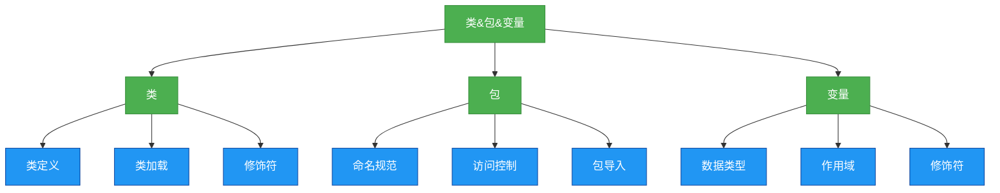
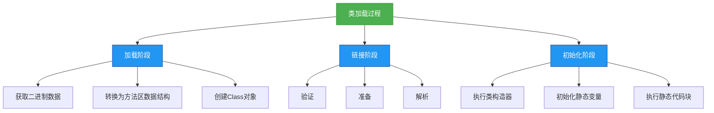
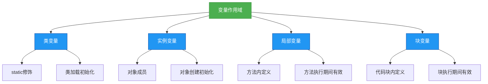

# 1.4.2 类&包&变量

## 概述
Java面向对象编程的基础构建块包括类、包和变量三大核心元素。类是对象的模板，封装了数据和行为；包用于组织类并控制访问权限；变量则是程序中存储数据的基本单元。这三个概念相互关联，共同构成了Java程序的基本结构。



## 知识要点
### 2.1 类
类是Java面向对象编程的核心，是创建对象的模板。一个类通常包含属性（成员变量）和方法（成员函数）。

#### 2.1.1 类的定义与结构
在Java中，类使用`class`关键字定义，基本结构如下：

```java
/**
 * 企业级用户实体类
 * 遵循JavaBean规范，实现基本的用户信息管理
 */
public class User {
    // 成员变量（属性）
    private Long id;
    private String username;
    private String email;
    private boolean isActive;

    // 构造方法
    public User() {
        // 无参构造方法
    }

    public User(Long id, String username) {
        this.id = id;
        this.username = username;
    }

    // 成员方法（行为）
    /**
     * 获取用户全名
     * @return 格式化的用户全名
     */
    public String getFullName() {
        return username;
    }

    /**
     * 激活用户账号
     */
    public void activate() {
        this.isActive = true;
    }

    // 省略getter和setter方法
}
```

#### 2.1.2 类的加载机制
当Java程序运行时，JVM需要将类加载到内存中。类加载过程分为三个主要阶段：加载（Loading）、链接（Linking）和初始化（Initialization）。



#### 2.1.3 类的修饰符
Java类支持多种修饰符，用于控制类的访问权限和行为特性：

```java
// 公共类：可被任何包访问
public class PublicClass {}

// 抽象类：不能实例化，只能被继承
abstract class AbstractClass {
    // 抽象方法：必须在子类中实现
    public abstract void abstractMethod();
}

// 最终类：不能被继承
final class FinalClass {}

// 普通类：仅包内可见
class DefaultClass {}
```

### 2.2 包
包（Package）是Java中用于组织类和接口的命名空间，解决了类名冲突问题，并提供了访问控制机制。

#### 2.2.1 包的命名规范
Java包名通常采用反转域名的方式命名，全部小写，例如：`com.company.project.module`。

**企业级项目包结构示例**：
```
com.company.project
├── controller      // 控制器层
├── service         // 服务层
│   ├── impl        // 服务实现
├── dao             // 数据访问层
├── model           // 数据模型
│   ├── entity      // 实体类
│   ├── dto         // 数据传输对象
│   └── vo          // 视图对象
├── util            // 工具类
└── config          // 配置类
```

### 2.3 变量
变量是Java程序中存储数据的基本单元，根据作用域和生命周期可分为不同类型。

#### 2.2.2 包的访问控制
Java通过访问修饰符控制包内类的可见性：
- `public`：对所有类可见
- `protected`：在本包和子类可见
- 默认（包私有）：仅在本包可见
- `private`：仅对本类可见

**包级私有类示例**：
```java
// 包级私有工具类，仅在本包内可见
class PackageUtils {
    static String formatDate(Date date) {
        SimpleDateFormat sdf = new SimpleDateFormat("yyyy-MM-dd");
        return sdf.format(date);
    }
}
```

#### 2.3.1 数据类型
Java变量类型分为基本类型和引用类型两大类：

**基本类型**（8种）：
- 整数类型：byte(1字节), short(2), int(4), long(8)
- 浮点类型：float(4), double(8)
- 字符类型：char(2)
- 布尔类型：boolean(1位)

**引用类型**：
- 类（Class）
- 接口（Interface）
- 数组（Array）

#### 2.3.2 变量作用域
Java变量根据作用域可分为：
1. **类变量（静态变量）**：用`static`修饰，属于类，在类加载时初始化
2. **实例变量**：属于对象，在对象创建时初始化
3. **局部变量**：在方法或代码块中定义，仅在执行期间有效
4. **块变量**：在代码块中定义，仅在该代码块执行期间有效



#### 2.2.3 包导入语法
Java使用`import`语句导入其他包的类：

```java
// 导入单个类
import java.util.Date;

// 导入整个包
import java.util.*;

// 静态导入
import static java.lang.Math.PI;
import static java.util.Arrays.sort;
```

**最佳实践**：避免使用通配符`*`导入，明确指定所需类以提高代码可读性。

### 3.1 设计思想
#### 3.1.1 单一职责原则
一个类应该只有一个引起它变化的原因，即一个类只负责一项职责。这有助于提高代码的内聚性和可维护性。

**反例**：
```java
// 违反单一职责原则：一个类负责用户管理和订单管理
public class UserOrderService {
    public void createUser(User user) { ... }
    public void updateUser(User user) { ... }
    public void createOrder(Order order) { ... }
    public void cancelOrder(Long orderId) { ... }
}
```

**正例**：
```java
// 用户服务：只负责用户管理
public class UserService {
    public void createUser(User user) { ... }
    public void updateUser(User user) { ... }
}

// 订单服务：只负责订单管理
public class OrderService {
    public void createOrder(Order order) { ... }
    public void cancelOrder(Long orderId) { ... }
}
```

#### 3.1.3 封装原则
封装是面向对象的核心特性之一，通过隐藏内部实现细节，只暴露必要的接口来提高代码安全性和可维护性。

**最佳实践**：
- 成员变量私有化（private）
- 通过公共方法（getter/setter）控制访问
- 对敏感操作进行权限检查

#### 3.1.4 接口隔离原则
客户端不应该依赖它不需要的接口，一个类对另一个类的依赖应该建立在最小的接口上。

### 3.2 避坑指南
#### 3.2.2 变量作用域过大
**问题**：变量定义在过大作用域，增加意外修改风险
**解决方案**：局部变量在使用前定义，避免类级别定义仅方法内使用的变量

#### 3.2.3 静态变量滥用
**问题**：过度使用静态变量存储可变状态，导致线程安全问题和测试困难。
**解决方案**：
- 静态变量只用于存储不变的常量
- 避免使用静态变量共享对象状态
- 考虑使用依赖注入代替静态变量

#### 3.2.4 基本类型与包装类型混用
**问题**：基本类型与包装类型混用可能导致自动装箱/拆箱带来的性能问题或NPE。
**解决方案**：
- 集合中只能使用包装类型
- 注意包装类型的null值处理
- 优先使用基本类型进行计算

#### 3.2.2 变量作用域过大
**问题**：变量定义在过大作用域，增加意外修改风险
**解决方案**：局部变量在使用前定义，避免类级别定义仅方法内使用的变量

### 3.3 深度思考题
#### 思考题2：如何设计一个不可变对象？
**回答**：
设计不可变对象需遵循以下原则：
1. 类声明为final，防止被继承
2. 所有属性设为final
3. 不提供setter方法
4. 引用类型属性需防御性拷贝

**代码示例**：
```java
public final class ImmutableUser {
    private final Long id;
    private final String username;
    private final Date birthday;

    // 构造方法初始化所有属性
    public ImmutableUser(Long id, String username, Date birthday) {
        this.id = id;
        this.username = username;
        // 防御性拷贝
        this.birthday = new Date(birthday.getTime());
    }

    // 只提供getter方法
    public Long getId() { return id; }
    public String getUsername() { return username; }

    // 返回不可变的日期对象
    public Date getBirthday() {
        return new Date(birthday.getTime());
    }
}
```

#### 思考题3：JDK8中的接口有哪些新特性？
**回答**：
JDK8允许接口包含默认方法（default）和静态方法（static），默认方法需有方法体，实现类可选择性重写。