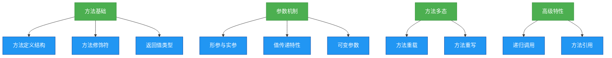

# 1.4.3 方法&参数


## 概述
方法是Java中封装行为的基本单元，参数则是方法与外界交互的数据载体。本章将系统讲解方法的定义规范、参数传递机制、方法重载与重写的区别，以及实战开发中的最佳实践。



## 知识要点

### 1. 方法的定义与结构
Java方法由访问修饰符、返回值类型、方法名、参数列表和方法体组成，基本语法如下：

```java
public class MethodDemo {
    // 无参无返回值方法
    public void printHello() {
        System.out.println("Hello, Method!");
    }
    
    // 有参有返回值方法
    public int calculateSum(int a, int b) {
        return a + b; // 方法返回值
    }
}
```

**方法命名规范**：采用小驼峰式命名，动词开头，如`getUserInfo()`、`calculateTotal()`，清晰表达方法功能。

### 2. 参数传递机制
Java中方法参数传递严格遵循"值传递"原则：
- 基本类型：传递值的副本，方法内修改不影响原变量
- 引用类型：传递引用地址的副本，方法内修改引用对象内容会影响原对象

```java
public class ParameterDemo {
    public static void main(String[] args) {
        int num = 10;
        String str = "Hello";
        
        modifyValue(num);
        modifyReference(str);
        
        System.out.println(num);  // 输出：10（基本类型未改变）
        System.out.println(str);  // 输出：Hello（字符串不可变特性）
    }
    
    private static void modifyValue(int a) {
        a = 20; // 修改的是副本
    }
    
    private static void modifyReference(String s) {
        s = "World"; // 引用指向新对象
    }
}
```

### 3. 方法重载（Overload）
在同一类中，允许存在多个同名方法，只要参数列表（类型、个数或顺序）不同即可：

```java
public class OverloadDemo {
    // 整数相加
    public int add(int a, int b) {
        return a + b;
    }
    
    // 浮点数相加（参数类型不同）
    public double add(double a, double b) {
        return a + b;
    }
    
    // 三个整数相加（参数个数不同）
    public int add(int a, int b, int c) {
        return a + b + c;
    }
}
```

**重载判断依据**：仅看参数列表，与返回值类型和访问修饰符无关。

## 知识扩展

### 设计思想
1. **单一职责原则**：一个方法只做一件事，提高可读性和可维护性
2. **最小知识原则**：方法参数越少越好，避免传递不需要修改的对象
3. **防御式编程**：对方法参数进行合法性校验

### 避坑指南
1. **递归调用风险**：确保有明确终止条件，避免栈溢出
2. **可变参数陷阱**：可变参数必须作为方法最后一个参数，且一个方法只能有一个可变参数
3. **自动装箱开销**：避免在循环中频繁使用包装类型作为方法参数

### 深度思考题
**问题**：为什么Java中没有真正的引用传递？
**回答**：Java设计哲学强调简单安全，值传递模型避免了指针操作风险。对于引用类型，传递的是对象地址的副本，而非引用本身，因此严格来说仍是值传递。