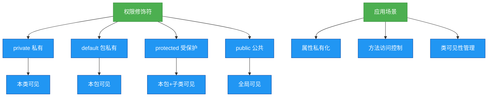

# 1.4.4 权限修饰符


## 概述
权限修饰符是Java实现封装特性的核心机制，通过控制类、方法和属性的访问范围，保障代码安全性和封装性。本章将详细讲解Java中的四种权限修饰符（private、default、protected、public）的作用范围、使用场景及最佳实践。



## 知识要点

### 1. 权限修饰符作用范围
Java四种权限修饰符的访问控制范围如下表所示：

| 修饰符 | 本类 | 本包 | 子类 | 其他包 |
|--------|------|------|------|--------|
| private | ✅ | ❌ | ❌ | ❌ |
| default | ✅ | ✅ | ❌ | ❌ |
| protected | ✅ | ✅ | ✅ | ❌ |
| public | ✅ | ✅ | ✅ | ✅ |

### 2. private修饰符
私有修饰符，仅在当前类内部可见，是封装的核心体现：

```java
public class User {
    private String name; // 私有属性
    private int age;
    
    // 通过公共方法暴露访问接口
    public String getName() {
        return name;
    }
    
    public void setName(String name) {
        this.name = name;
    }
}
```

**使用场景**：类的属性、内部辅助方法，避免外部直接访问和修改。

### 3. default修饰符（包私有）
无显式修饰符，默认在同一包内可见：

```java
// 包com.example.service
package com.example.service;

class OrderService { // 包私有类
    void processOrder() { // 包私有方法
        // 业务逻辑
    }
}
```

**使用场景**：包内组件协作，不对外暴露的实现类。

### 4. protected修饰符
受保护修饰符，允许子类访问父类成员：

```java
// 父类
public class Animal {
    protected String name;
    
    protected void eat() {
        System.out.println("动物进食");
    }
}

// 子类
public class Dog extends Animal {
    public void bark() {
        name = "小狗"; // 访问父类protected属性
        eat(); // 调用父类protected方法
    }
}
```

**注意**：子类只能访问自己继承的protected成员，不能访问其他子类实例的protected成员。

### 5. public修饰符
公共修饰符，全局可见，用于对外提供接口：

```java
public class MathUtils {
    public static final double PI = 3.1415926;
    
    public static int max(int a, int b) {
        return a > b ? a : b;
    }
}
```

## 知识扩展

### 设计思想
1. **最小权限原则**：尽可能使用小范围的权限修饰符，降低组件间耦合
2. **接口隔离原则**：public成员应构成最小接口，隐藏内部实现细节
3. **开闭原则**：通过protected预留扩展点，允许子类重写扩展功能

### 避坑指南
1. **protected跨包访问陷阱**：跨包子类只能通过继承关系访问protected成员，不能通过父类实例直接访问
2. **内部类权限问题**：内部类可以访问外部类的private成员，但外部类不能访问内部类的private成员
3. **接口成员权限**：接口中定义的成员默认都是public static final，方法默认是public abstract

### 深度思考题
**问题**：为什么Java不允许在外部类上使用protected修饰符？
**回答**：外部类的访问控制主要通过包结构管理，protected修饰符设计初衷是支持继承体系中的成员访问控制。如果允许外部类使用protected，会导致包管理与继承体系的权限控制混淆，违背Java简洁的设计哲学。