# 1.4.5 关键字


## 概述
Java关键字是被语言赋予特定含义的保留单词，用于定义程序结构、控制流程和数据类型。本章将系统梳理Java中的53个关键字（JDK8版本），按功能分类讲解其用法、注意事项及编程最佳实践。

```mermaid
graph TD
    A[访问控制] --> B[private]
    A --> C[protected]
    A --> D[public]
    E[类与方法] --> F[class]
    E --> G[interface]
    E --> H[extends]
    E --> I[implements]
    E --> J[static]
    E --> K[final]
    L[流程控制] --> M[if]
    L --> N[else]
    L --> O[switch]
    L --> P[case]
    L --> Q[default]
    L --> R[while]
    L --> S[for]
    L --> T[break]
    L --> U[continue]
    
    classDef structure fill:#4CAF50,stroke:#388E3C,color:white;
    classDef algorithm fill:#2196F3,stroke:#0D47A1,color:white;
    classDef performance fill:#FFC107,stroke:#FF9800,color:black;
    
    class A,E,L structure
    class B,C,D,F,G,H,I,J,K,M,N,O,P,Q,R,S,T,U algorithm
```



## 知识要点

### 1. 关键字分类与特性
Java关键字按功能可分为以下几类：

#### （1）访问控制关键字
- `private`: 仅本类可见
- `protected`: 本类、子类及同包可见
- `public`: 全局可见

#### （2）类与方法修饰关键字
- `class`: 声明类
- `interface`: 声明接口
- `extends`: 类继承
- `implements`: 接口实现
- `static`: 静态成员
- `final`: 不可变标记
- `abstract`: 抽象成员

```java
public abstract class Shape { // abstract关键字定义抽象类
    public abstract double area(); // 抽象方法
    
    public static void printType() { // static关键字定义静态方法
        System.out.println("This is a shape");
    }
}

public class Circle extends Shape { // extends关键字实现继承
    private final double radius; // final关键字定义常量
    
    public Circle(double radius) {
        this.radius = radius;
    }
    
    @Override
    public double area() {
        return Math.PI * radius * radius;
    }
}
```

#### （3）流程控制关键字
- 条件分支: `if`/`else`/`switch`/`case`/`default`
- 循环控制: `for`/`while`/`do`/`break`/`continue`
- 异常处理: `try`/`catch`/`finally`/`throw`/`throws`

```java
public void processNumber(int num) {
    switch(num) { // switch-case结构
        case 1:
            System.out.println("One");
            break;
        case 2:
            System.out.println("Two");
            break;
        default:
            System.out.println("Other");
    }
    
    for(int i=0; i<num; i++) { // for循环
        if(i % 2 == 0) continue; // continue关键字
        System.out.println(i);
    }
}
```

### 2. 特殊关键字
- `this`: 指代当前对象
- `super`: 指代父类对象
- `null`: 空引用
- `void`: 无返回值
- `package`/`import`: 包管理

```java
public class Person {
    private String name;
    
    public Person(String name) {
        this.name = name; // this关键字
    }
    
    public void printInfo() {
        System.out.println("Name: " + name);
    }
}
```

## 知识扩展

### 设计思想
1. **语义化编程**：合理使用关键字使代码自文档化
2. **不可变设计**：通过`final`关键字保障数据安全性
3. **接口隔离**：使用`interface`定义清晰的功能边界

### 避坑指南
1. **关键字误用**：避免将关键字用作标识符
2. **final修饰引用**：`final`修饰引用类型时，仅保证引用不变，对象内容可变
3. **static与实例成员**：静态方法不能直接访问非静态成员
4. **switch穿透**：忘记添加`break`导致case穿透执行

### 深度思考题
**问题**：为什么Java中没有`goto`关键字的实际应用？
**回答**：Java保留`goto`作为关键字但未实现其功能，主要出于代码可读性和结构化编程考虑。`goto`可能导致代码流程混乱，增加维护难度，不符合Java强调的安全性和可读性设计哲学。