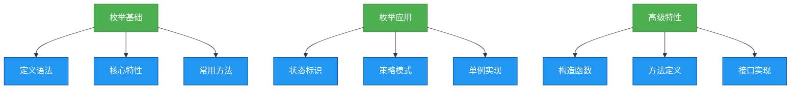

# 1.4.6 枚举


## 概述
枚举（Enumeration）是Java中一种特殊的引用类型，用于定义固定数量的命名常量集合。JDK5引入枚举类型（enum），提供了类型安全的常量定义方式，替代了传统的常量定义模式。本章将详细讲解枚举的定义语法、核心特性、使用场景及高级应用。



## 知识要点

### 1. 枚举的基本定义
枚举使用`enum`关键字定义，常量之间用逗号分隔，末尾可省略分号：

```java
// 基本枚举定义
public enum Weekday {
    MONDAY, TUESDAY, WEDNESDAY, THURSDAY, FRIDAY, SATURDAY, SUNDAY
}
```

**编译期特性**：枚举在编译后会生成一个继承`java.lang.Enum`的类，每个枚举常量都是该类的实例。

### 2. 枚举的核心特性
- **类型安全**：编译期检查，避免常量值错误赋值
- **不可变**：枚举常量在类加载时创建，且不可修改
- **单例性**：每个枚举常量在JVM中只有一个实例
- **线程安全**：枚举常量的初始化是线程安全的

```java
public class EnumDemo {
    public static void main(String[] args) {
        Weekday day = Weekday.MONDAY;
        System.out.println(day); // 输出：MONDAY
        System.out.println(day.ordinal()); // 输出：0（枚举常量的索引）
        System.out.println(day.name()); // 输出：MONDAY
    }
}
```

### 3. 枚举的常用方法
`java.lang.Enum`提供的核心方法：
- `values()`: 返回所有枚举常量的数组
- `valueOf(String name)`: 根据名称获取枚举常量
- `ordinal()`: 返回枚举常量的索引位置
- `name()`: 返回枚举常量的名称

```java
// 枚举遍历
for (Weekday day : Weekday.values()) {
    System.out.println(day.ordinal() + ": " + day.name());
}

// 枚举转换
Weekday day = Weekday.valueOf("FRIDAY");
```

### 4. 带成员的枚举
枚举可以包含字段、方法和构造函数，增强枚举的功能性：

```java
public enum Season {
    SPRING("春季", 1),
    SUMMER("夏季", 2),
    AUTUMN("秋季", 3),
    WINTER("冬季", 4);
    
    private final String chineseName;
    private final int seasonCode;
    
    // 私有构造函数
    private Season(String chineseName, int seasonCode) {
        this.chineseName = chineseName;
        this.seasonCode = seasonCode;
    }
    
    // 自定义方法
    public String getChineseName() {
        return chineseName;
    }
    
    public int getSeasonCode() {
        return seasonCode;
    }
}
```

### 5. 枚举与switch结合
枚举是switch语句的理想选择，编译期确保case值的合法性：

```java
public void printSeasonInfo(Season season) {
    switch (season) {
        case SPRING:
            System.out.println("春暖花开");
            break;
        case SUMMER:
            System.out.println("夏日炎炎");
            break;
        case AUTUMN:
            System.out.println("秋高气爽");
            break;
        case WINTER:
            System.out.println("冬雪皑皑");
            break;
        // 无需default，枚举已覆盖所有可能值
    }
}
```

## 知识扩展

### 设计思想
1. **替代常量模式**：相比`public static final`常量，枚举提供更强的类型安全
2. **有限状态集合**：适合表示固定数量的状态（如星期、季节、订单状态等）
3. **单例实现**：枚举是实现单例模式的最佳方式，简洁且避免反射攻击

```java
// 枚举实现单例
public enum Singleton {
    INSTANCE;
    
    public void doSomething() {
        // 单例业务逻辑
    }
}
```

### 避坑指南
1. **避免继承**：枚举类默认继承`Enum`，不能再继承其他类
2. **序列化安全**：枚举序列化机制特殊，不会创建新实例，保证单例性
3. **谨慎使用ordinal()**：依赖索引位置可能因枚举常量顺序变化导致错误
4. **枚举与反射**：反射无法创建枚举实例，`newInstance()`方法会抛出异常

### 深度思考题
**问题**：枚举实现的单例模式相比其他方式有哪些优势？
**回答**：枚举单例具有以下优势：1. 天然线程安全，无需同步处理；2. 防止反射攻击，Java规范保证反射无法实例化枚举；3. 自动支持序列化，无需重写`readResolve()`方法；4. 代码简洁，只需声明枚举常量即可实现单例。这使枚举成为实现单例模式的最佳实践。