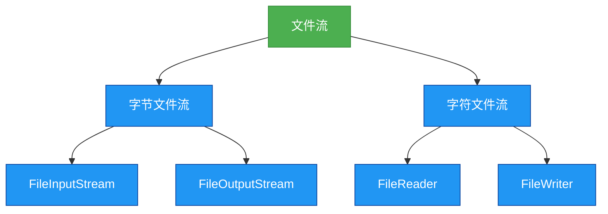

# 1.5.1 文件流

## 概述
文件流是Java IO中用于直接操作文件的流类型，主要包括`FileInputStream`、`FileOutputStream`、`FileReader`和`FileWriter`四大核心类。它们是所有IO操作的基础，用于实现文件的读取和写入功能。



## 知识要点

### 1. 文件流的分类与特点
文件流根据处理数据的单位不同，分为字节文件流和字符文件流：

- **字节文件流**：以字节为单位处理数据，适用于所有类型文件（文本、图片、音频等）
  - `FileInputStream`：字节输入流，用于从文件读取字节数据
  - `FileOutputStream`：字节输出流，用于向文件写入字节数据

- **字符文件流**：以字符为单位处理数据，仅适用于文本文件
  - `FileReader`：字符输入流，用于从文件读取字符数据
  - `FileWriter`：字符输出流，用于向文件写入字符数据

### 2. FileInputStream的使用
`FileInputStream`用于从文件中读取字节数据，常用构造方法和核心方法如下：

```java
import java.io.FileInputStream;
import java.io.IOException;

/**
 * FileInputStream使用示例
 * 演示如何读取文件内容
 */
public class FileInputStreamExample {
    public static void main(String[] args) {
        // 声明流对象
        FileInputStream fis = null;
        try {
            // 创建流对象，指定文件路径
            fis = new FileInputStream("example.txt");
            
            // 读取数据
            byte[] buffer = new byte[1024];
            int length;
            StringBuilder content = new StringBuilder();
            
            // 循环读取文件内容，返回-1表示读取结束
            while ((length = fis.read(buffer)) != -1) {
                content.append(new String(buffer, 0, length));
            }
            
            System.out.println("文件内容：" + content.toString());
        } catch (IOException e) {
            e.printStackTrace();
        } finally {
            // 关闭流资源
            if (fis != null) {
                try {
                    fis.close();
                } catch (IOException e) {
                    e.printStackTrace();
                }
            }
        }
    }
}
```

**关键要点**：
- 使用`read(byte[] buffer)`方法可以提高读取效率
- 必须在finally块中关闭流资源，避免资源泄漏
- JDK7+可使用try-with-resources语法自动关闭流

### 3. FileOutputStream的使用
`FileOutputStream`用于向文件中写入字节数据，常用构造方法和核心方法如下：

```java
import java.io.FileOutputStream;
import java.io.IOException;

/**
 * FileOutputStream使用示例
 * 演示如何写入数据到文件
 */
public class FileOutputStreamExample {
    public static void main(String[] args) {
        // 使用try-with-resources语法，自动关闭流
        try (FileOutputStream fos = new FileOutputStream("output.txt")) {
            String content = "Hello, FileOutputStream!";
            byte[] data = content.getBytes();
            
            // 写入数据
            fos.write(data);
            System.out.println("数据写入成功！");
        } catch (IOException e) {
            e.printStackTrace();
        }
    }
}
```

**关键要点**：
- 默认情况下，写入会覆盖文件原有内容
- 若要追加内容，可使用构造方法`FileOutputStream(String name, boolean append)`并设置append为true
- `write(byte[] b)`方法可以写入字节数组

### 4. FileReader和FileWriter的使用
字符文件流适用于文本文件的读写，使用方式与字节流类似，但以字符为单位处理数据：

```java
import java.io.FileReader;
import java.io.FileWriter;
import java.io.IOException;

/**
 * FileReader和FileWriter使用示例
 * 演示文本文件的读写操作
 */
public class FileReaderWriterExample {
    public static void main(String[] args) {
        // 复制文本文件
        try (FileReader fr = new FileReader("source.txt");
             FileWriter fw = new FileWriter("destination.txt")) {
            
            char[] buffer = new char[1024];
            int length;
            
            // 读取并写入数据
            while ((length = fr.read(buffer)) != -1) {
                fw.write(buffer, 0, length);
            }
            System.out.println("文件复制成功！");
        } catch (IOException e) {
            e.printStackTrace();
        }
    }
}
```

**关键要点**：
- 字符流会使用默认字符编码，可能导致跨平台问题
- 推荐使用`InputStreamReader`和`OutputStreamWriter`指定字符编码
- `read(char[] cbuf)`和`write(char[] cbuf, int off, int len)`方法用于字符数组操作

## 知识扩展

### 设计思想
文件流设计遵循了以下核心思想：
1. **装饰器模式**：基础流（如FileInputStream）可被缓冲流等装饰，增强功能
2. **开闭原则**：通过继承`InputStream`/`OutputStream`和`Reader`/`Writer`抽象类，可扩展新的流类型
3. **资源管理**：流资源需要显式关闭，JDK7引入的try-with-resources语法简化了资源管理

### 避坑指南
1. **文件路径问题**：
   - 使用绝对路径可避免相对路径带来的问题
   - Windows系统路径分隔符使用`\\`或`/`，Linux/Mac使用`/`
   - 推荐使用`File.separator`实现跨平台路径处理

2. **异常处理**：
   - IO操作必须进行异常处理
   - try-with-resources是推荐的资源管理方式
   - 关闭流操作应放在finally块中，确保执行

3. **性能优化**：
   - 避免使用单个字节/字符读写，使用缓冲区提高效率
   - 大文件操作时，合理设置缓冲区大小（通常为1KB~8KB）
   - 及时关闭不再使用的流资源

### 深度思考题
**思考题1**：如何使用文件流实现大文件的复制，并显示复制进度？

**思考题回答**：
可以通过以下步骤实现带进度显示的大文件复制：
1. 获取源文件大小
2. 读取数据时累计已复制字节数
3. 计算并显示复制进度百分比

```java
import java.io.FileInputStream;
import java.io.FileOutputStream;
import java.io.IOException;

public class LargeFileCopy {
    public static void main(String[] args) {
        String sourcePath = "large_file.iso";
        String destPath = "copied_file.iso";
        
        try (FileInputStream fis = new FileInputStream(sourcePath);
             FileOutputStream fos = new FileOutputStream(destPath)) {
            
            long fileSize = fis.available();
            byte[] buffer = new byte[8192]; // 8KB缓冲区
            int bytesRead;
            long totalRead = 0;
            
            while ((bytesRead = fis.read(buffer)) != -1) {
                fos.write(buffer, 0, bytesRead);
                totalRead += bytesRead;
                
                // 计算并显示进度
                int progress = (int) ((totalRead * 100) / fileSize);
                System.out.printf("复制进度：%d%%\r", progress);
            }
            System.out.println("\n文件复制完成！");
        } catch (IOException e) {
            e.printStackTrace();
        }
    }
}
```

**思考题2**：使用FileWriter写入中文时出现乱码如何解决？

**思考题回答**：
FileWriter使用默认字符编码，可能导致中文乱码。解决方法是使用`OutputStreamWriter`并显式指定编码：

```java
import java.io.FileOutputStream;
import java.io.IOException;
import java.io.OutputStreamWriter;
import java.nio.charset.StandardCharsets;

public class ChineseEncodingExample {
    public static void main(String[] args) {
        try (OutputStreamWriter osw = new OutputStreamWriter(
                new FileOutputStream("chinese.txt"), StandardCharsets.UTF_8)) {
            
            osw.write("中文内容测试");
            System.out.println("写入成功！");
        } catch (IOException e) {
            e.printStackTrace();
        }
    }
}
```