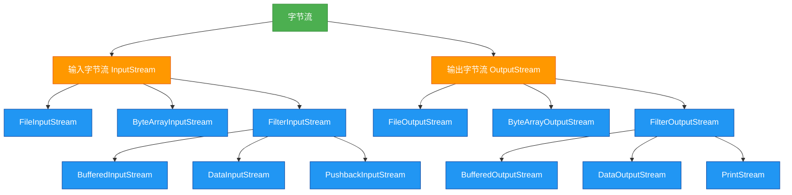

# 1.5.2 字节流

## 概述
字节流是Java IO中最基础的流类型，以字节为单位处理数据，适用于所有类型的文件（文本、图片、音频、视频等）。字节流主要包括`InputStream`和`OutputStream`两大抽象基类，以及它们的各种实现类，是整个Java IO体系的基础。



## 知识要点

### 1. InputStream抽象类
`InputStream`是所有输入字节流的超类，定义了基本的字节读取方法：

| 方法签名 | 描述 |
|---------|------|
| `int read()` | 读取一个字节，返回0-255的整数，若到达流末尾返回-1 |
| `int read(byte[] b)` | 读取多个字节到缓冲区数组b，返回实际读取的字节数 |
| `int read(byte[] b, int off, int len)` | 读取最多len个字节到缓冲区数组b，从偏移量off开始存储 |
| `long skip(long n)` | 跳过并丢弃n个字节的数据 |
| `int available()` | 返回可读取的字节数估计值 |
| `void close()` | 关闭此输入流并释放相关资源 |
| `void mark(int readlimit)` | 在此输入流中标记当前位置 |
| `void reset()` | 将此流重新定位到上次标记的位置 |
| `boolean markSupported()` | 测试此流是否支持mark()和reset()方法 |

### 2. OutputStream抽象类
`OutputStream`是所有输出字节流的超类，定义了基本的字节写入方法：

| 方法签名 | 描述 |
|---------|------|
| `void write(int b)` | 写入指定的字节 |
| `void write(byte[] b)` | 将b.length个字节从数组b写入此输出流 |
| `void write(byte[] b, int off, int len)` | 从数组b的偏移量off开始写入len个字节 |
| `void flush()` | 刷新此输出流并强制写出所有缓冲的输出字节 |
| `void close()` | 关闭此输出流并释放相关资源 |

### 3. 字节流的基本使用
以下是使用字节流进行文件复制的基础示例：

```java
import java.io.FileInputStream;
import java.io.FileOutputStream;
import java.io.IOException;

/**
 * 字节流基础使用示例
 * 演示如何使用FileInputStream和FileOutputStream复制文件
 */
public class BasicByteStreamExample {
    public static void main(String[] args) {
        // 源文件和目标文件路径
        String sourceFile = "source.jpg";
        String destFile = "destination.jpg";
        
        // 声明流对象
        FileInputStream fis = null;
        FileOutputStream fos = null;
        
        try {
            // 创建流对象
            fis = new FileInputStream(sourceFile);
            fos = new FileOutputStream(destFile);
            
            // 创建缓冲区
            byte[] buffer = new byte[1024];
            int bytesRead;
            
            // 读取并写入数据
            while ((bytesRead = fis.read(buffer)) != -1) {
                fos.write(buffer, 0, bytesRead);
            }
            System.out.println("文件复制成功！");
        } catch (IOException e) {
            e.printStackTrace();
        } finally {
            // 关闭流资源
            try {
                if (fos != null) fos.close();
                if (fis != null) fis.close();
            } catch (IOException e) {
                e.printStackTrace();
            }
        }
    }
}
```

### 4. 字节数组流
字节数组流用于在内存中操作字节数据，无需实际文件：

```java
import java.io.ByteArrayInputStream;
import java.io.ByteArrayOutputStream;
import java.io.IOException;

/**
 * 字节数组流示例
 * 演示在内存中使用字节流进行数据操作
 */
public class ByteArrayStreamExample {
    public static void main(String[] args) {
        String originalData = "Hello, ByteArray Streams!";
        
        // 使用ByteArrayOutputStream写入数据到内存
        try (ByteArrayOutputStream baos = new ByteArrayOutputStream()) {
            // 写入数据
            baos.write(originalData.getBytes());
            
            // 获取内存中的字节数组
            byte[] byteData = baos.toByteArray();
            System.out.println("写入的数据: " + new String(byteData));
            
            // 使用ByteArrayInputStream读取内存中的数据
            try (ByteArrayInputStream bais = new ByteArrayInputStream(byteData)) {
                byte[] buffer = new byte[1024];
                int bytesRead = bais.read(buffer);
                String readData = new String(buffer, 0, bytesRead);
                System.out.println("读取的数据: " + readData);
            }
        } catch (IOException e) {
            e.printStackTrace();
        }
    }
}
```

### 5. 数据流
`DataInputStream`和`DataOutputStream`允许读取和写入基本Java数据类型：

```java
import java.io.DataInputStream;
import java.io.DataOutputStream;
import java.io.FileInputStream;
import java.io.FileOutputStream;
import java.io.IOException;

/**
 * 数据流示例
 * 演示如何读写基本数据类型
 */
public class DataStreamExample {
    public static void main(String[] args) {
        String fileName = "data.dat";
        
        // 写入基本数据类型
        try (DataOutputStream dos = new DataOutputStream(new FileOutputStream(fileName))) {
            dos.writeBoolean(true);
            dos.writeInt(42);
            dos.writeDouble(3.14159);
            dos.writeUTF("Hello, Data Streams!");
            System.out.println("数据写入完成！");
        } catch (IOException e) {
            e.printStackTrace();
        }
        
        // 读取基本数据类型
        try (DataInputStream dis = new DataInputStream(new FileInputStream(fileName))) {
            boolean boolValue = dis.readBoolean();
            int intValue = dis.readInt();
            double doubleValue = dis.readDouble();
            String stringValue = dis.readUTF();
            
            System.out.println("读取的数据:");
            System.out.println("布尔值: " + boolValue);
            System.out.println("整数: " + intValue);
            System.out.println("双精度数: " + doubleValue);
            System.out.println("字符串: " + stringValue);
        } catch (IOException e) {
            e.printStackTrace();
        }
    }
}
```

## 知识扩展

### 设计思想
字节流设计体现了以下核心思想：
1. **抽象与实现分离**：`InputStream`和`OutputStream`定义接口，具体子类提供实现
2. **装饰器模式**：通过`FilterInputStream`和`FilterOutputStream`为基础流添加功能
3. **单一职责**：每个流类专注于单一功能（如缓冲、数据转换、文件操作等）
4. **资源管理**：流资源需要显式释放，体现了Java的资源管理哲学

### 避坑指南
1. **缓冲区使用**：
   - 避免使用`read()`和`write()`的单字节操作，性能极低
   - 始终使用带缓冲区的`read(byte[])`和`write(byte[], int, int)`方法
   - 合理设置缓冲区大小（通常为1KB~8KB），过大可能浪费内存

2. **异常处理**：
   - IO操作必须捕获或声明`IOException`
   - 多个流嵌套时，关闭顺序应与创建顺序相反
   - 优先使用try-with-resources语法自动管理资源

3. **流的关闭**：
   - 输出流在关闭前应调用`flush()`确保数据写入
   - 即使发生异常，也要确保流被关闭
   - 可以使用try-with-resources自动关闭实现了`AutoCloseable`接口的流

4. **文件操作**：
   - 使用`available()`方法获取文件大小时需谨慎，对于网络流可能不准确
   - 操作大文件时，考虑分块处理而非一次性读取到内存

### 深度思考题
**思考题1**：如何使用字节流实现文件的断点续传功能？

**思考题回答**：
断点续传可以通过记录已传输字节数，下次从该位置继续传输来实现：

```java
import java.io.FileInputStream;
import java.io.FileOutputStream;
import java.io.IOException;
import java.io.RandomAccessFile;

public class ResumeDownloadExample {
    public static void main(String[] args) {
        String sourceFile = "large_file.zip";
        String targetFile = "downloaded.zip";
        long startPosition = getLastDownloadPosition(targetFile);
        
        try (FileInputStream fis = new FileInputStream(sourceFile);
             RandomAccessFile raf = new RandomAccessFile(targetFile, "rw")) {
            
            // 跳过已下载的字节
            fis.skip(startPosition);
            raf.seek(startPosition);
            
            byte[] buffer = new byte[4096];
            int bytesRead;
            long totalRead = startPosition;
            long fileSize = fis.available() + startPosition;
            
            while ((bytesRead = fis.read(buffer)) != -1) {
                raf.write(buffer, 0, bytesRead);
                totalRead += bytesRead;
                
                // 更新下载进度
                int progress = (int) ((totalRead * 100) / fileSize);
                System.out.printf("下载进度: %d%%\r", progress);
                
                // 保存当前下载位置（实际应用中可写入配置文件）
                saveDownloadPosition(targetFile, totalRead);
            }
            System.out.println("\n文件下载完成！");
        } catch (IOException e) {
            e.printStackTrace();
        }
    }
    
    private static long getLastDownloadPosition(String fileName) {
        // 实际应用中应从配置文件读取
        return 0; // 简化示例，实际应返回上次中断的位置
    }
    
    private static void saveDownloadPosition(String fileName, long position) {
        // 实际应用中应写入配置文件
    }
}
```

**思考题2**：如何检测一个输入流是否支持mark()和reset()方法，并举例说明其应用场景？

**思考题回答**：
可以使用`markSupported()`方法检测流是否支持标记和重置功能。这在需要多次读取同一部分数据的场景非常有用：

```java
import java.io.BufferedInputStream;
import java.io.FileInputStream;
import java.io.IOException;

public class MarkResetExample {
    public static void main(String[] args) {
        String fileName = "example.txt";
        
        try (BufferedInputStream bis = new BufferedInputStream(new FileInputStream(fileName))) {
            // 检查是否支持mark/reset
            if (bis.markSupported()) {
                System.out.println("流支持mark和reset操作");
                
                // 读取前5个字节
                byte[] first5Bytes = new byte[5];
                bis.read(first5Bytes);
                System.out.println("前5个字节: " + new String(first5Bytes));
                
                // 标记当前位置
                bis.mark(100); // 参数表示在标记位置失效前可读取的最大字节数
                
                // 读取接下来的10个字节
                byte[] next10Bytes = new byte[10];
                bis.read(next10Bytes);
                System.out.println("接下来10个字节: " + new String(next10Bytes));
                
                // 重置到标记位置
                bis.reset();
                
                // 再次读取这10个字节
                byte[] again10Bytes = new byte[10];
                bis.read(again10Bytes);
                System.out.println("再次读取的10个字节: " + new String(again10Bytes));
            } else {
                System.out.println("流不支持mark和reset操作");
            }
        } catch (IOException e) {
            e.printStackTrace();
        }
    }
}
```

应用场景包括：解析文件格式时需要回溯、实现缓存机制、预览流内容后决定处理方式等。