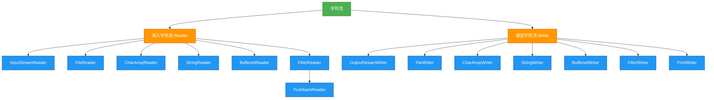

# 1.5.3 字符流

## 概述
字符流是Java IO中以字符为单位处理数据的流类型，专门用于处理文本数据。字符流基于Unicode编码，能够正确处理各种语言的字符，解决了字节流处理文本时可能出现的乱码问题。字符流主要包括`Reader`和`Writer`两大抽象基类，以及它们的各种实现类，为文本处理提供了便捷的API。



## 知识要点

### 1. Reader抽象类
`Reader`是所有输入字符流的超类，定义了基本的字符读取方法：

| 方法签名 | 描述 |
|---------|------|
| `int read()` | 读取单个字符，返回0-65535的整数，若到达流末尾返回-1 |
| `int read(char[] cbuf)` | 读取多个字符到缓冲区数组cbuf，返回实际读取的字符数 |
| `int read(char[] cbuf, int off, int len)` | 读取最多len个字符到缓冲区数组cbuf，从偏移量off开始存储 |
| `long skip(long n)` | 跳过并丢弃n个字符的数据 |
| `boolean ready()` | 判断此流是否已准备好读取 |
| `void close()` | 关闭此输入流并释放相关资源 |
| `void mark(int readAheadLimit)` | 在此输入流中标记当前位置 |
| `void reset()` | 将此流重新定位到上次标记的位置 |
| `boolean markSupported()` | 测试此流是否支持mark()和reset()方法 |

### 2. Writer抽象类
`Writer`是所有输出字符流的超类，定义了基本的字符写入方法：

| 方法签名 | 描述 |
|---------|------|
| `void write(int c)` | 写入单个字符 |
| `void write(char[] cbuf)` | 写入字符数组cbuf的所有字符 |
| `void write(char[] cbuf, int off, int len)` | 从数组cbuf的偏移量off开始写入len个字符 |
| `void write(String str)` | 写入字符串str的所有字符 |
| `void write(String str, int off, int len)` | 从字符串str的偏移量off开始写入len个字符 |
| `Writer append(CharSequence csq)` | 将指定的字符序列追加到此writer |
| `Writer append(CharSequence csq, int start, int end)` | 将指定字符序列的子序列追加到此writer |
| `Writer append(char c)` | 追加指定字符到此writer |
| `void flush()` | 刷新此输出流并强制写出所有缓冲的输出字符 |
| `void close()` | 关闭此输出流并释放相关资源 |

### 3. 字符流与字节流的转换
`InputStreamReader`和`OutputStreamWriter`是字节流与字符流之间的桥梁，允许指定字符编码：

```java
import java.io.FileInputStream;
import java.io.FileOutputStream;
import java.io.IOException;
import java.io.InputStreamReader;
import java.io.OutputStreamWriter;
import java.nio.charset.StandardCharsets;

/**
 * 字节流与字符流转换示例
 * 演示如何指定字符编码读写文本文件
 */
public class StreamConversionExample {
    public static void main(String[] args) {
        String fileName = "encoded_text.txt";
        
        // 使用指定编码写入文件
        try (OutputStreamWriter osw = new OutputStreamWriter(
                new FileOutputStream(fileName), StandardCharsets.UTF_8)) {
            osw.write("Hello, 世界! 这是UTF-8编码的文本。");
            System.out.println("文件写入成功！");
        } catch (IOException e) {
            e.printStackTrace();
        }
        
        // 使用指定编码读取文件
        try (InputStreamReader isr = new InputStreamReader(
                new FileInputStream(fileName), StandardCharsets.UTF_8)) {
            char[] buffer = new char[1024];
            int charsRead = isr.read(buffer);
            String content = new String(buffer, 0, charsRead);
            System.out.println("文件内容：" + content);
        } catch (IOException e) {
            e.printStackTrace();
        }
    }
}
```

### 4. 缓冲字符流
`BufferedReader`和`BufferedWriter`提供缓冲功能，显著提高字符流的读写性能：

```java
import java.io.BufferedReader;
import java.io.BufferedWriter;
import java.io.FileReader;
import java.io.FileWriter;
import java.io.IOException;

/**
 * 缓冲字符流示例
 * 演示高效读写文本文件
 */
public class BufferedCharStreamExample {
    public static void main(String[] args) {
        String sourceFile = "source.txt";
        String destFile = "destination.txt";
        
        try (BufferedReader br = new BufferedReader(new FileReader(sourceFile));
             BufferedWriter bw = new BufferedWriter(new FileWriter(destFile))) {
            
            String line;
            int lineNumber = 0;
            
            // 按行读取文件内容
            while ((line = br.readLine()) != null) {
                lineNumber++;
                // 写入行号和内容
                bw.write(lineNumber + ": " + line);
                // 写入换行符
                bw.newLine();
            }
            System.out.println("文件复制成功！共复制" + lineNumber + "行");
        } catch (IOException e) {
            e.printStackTrace();
        }
    }
}
```

### 5. 字符数组流和字符串流
`CharArrayReader`、`CharArrayWriter`、`StringReader`和`StringWriter`用于在内存中操作字符数据：

```java
import java.io.CharArrayReader;
import java.io.CharArrayWriter;
import java.io.IOException;
import java.io.StringReader;
import java.io.StringWriter;

/**
 * 内存字符流示例
 * 演示在内存中操作字符数据
 */
public class MemoryCharStreamExample {
    public static void main(String[] args) {
        // 使用CharArrayWriter写入字符数据到内存
        try (CharArrayWriter caw = new CharArrayWriter()) {
            caw.write("Hello, CharArrayWriter!");
            caw.append(" 这是追加的内容。");
            
            // 获取内存中的字符数组
            char[] charData = caw.toCharArray();
            System.out.println("CharArrayWriter写入的数据: " + new String(charData));
            
            // 使用CharArrayReader读取内存中的字符数据
            try (CharArrayReader car = new CharArrayReader(charData)) {
                char[] buffer = new char[1024];
                int charsRead = car.read(buffer);
                System.out.println("CharArrayReader读取的数据: " + new String(buffer, 0, charsRead));
            }
        } catch (IOException e) {
            e.printStackTrace();
        }
        
        // 使用StringWriter和StringReader
        try (StringWriter sw = new StringWriter()) {
            sw.write("Hello, StringWriter!");
            sw.write(" 这是另一部分内容。");
            
            String stringData = sw.toString();
            System.out.println("StringWriter写入的数据: " + stringData);
            
            try (StringReader sr = new StringReader(stringData)) {
                char[] buffer = new char[1024];
                int charsRead = sr.read(buffer);
                System.out.println("StringReader读取的数据: " + new String(buffer, 0, charsRead));
            }
        } catch (IOException e) {
            e.printStackTrace();
        }
    }
}
```

## 知识扩展

### 设计思想
字符流设计体现了以下核心思想：
1. **分层设计**：基础流处理数据传输，装饰流添加功能（缓冲、编码转换等）
2. **适配器模式**：`InputStreamReader`和`OutputStreamWriter`充当字节流和字符流之间的适配器
3. **开闭原则**：通过抽象类定义接口，具体实现可灵活扩展
4. **关注点分离**：字符流专注于文本处理，字节流专注于二进制数据处理

### 避坑指南
1. **字符编码问题**：
   - 始终显式指定字符编码，避免依赖系统默认编码
   - 使用`StandardCharsets`类中的常量（如`StandardCharsets.UTF_8`）确保编码一致
   - 读写文件时使用相同的字符编码

2. **性能优化**：
   - 处理文本文件时，始终使用缓冲字符流（`BufferedReader`/`BufferedWriter`）
   - 使用`readLine()`方法按行读取文本比单个字符读取效率高
   - 大文件处理时，避免一次性读取全部内容到内存

3. **资源管理**：
   - 字符流也需要显式关闭，推荐使用try-with-resources语法
   - 输出字符流在关闭前会自动刷新，但显式调用`flush()`可确保数据及时写入
   - 嵌套流关闭时，只需关闭最外层流即可

4. **特殊字符处理**：
   - 注意不同操作系统换行符的差异（Windows: \r\n, Linux: \n, Mac: \r）
   - 使用`BufferedWriter.newLine()`方法生成平台无关的换行符
   - 处理包含特殊Unicode字符的文本时，确保字体支持

### 深度思考题
**思考题1**：如何实现一个功能，读取一个GBK编码的文本文件并转换为UTF-8编码的文件？

**思考题回答**：
可以通过组合使用`InputStreamReader`和`OutputStreamWriter`并指定不同编码来实现：

```java
import java.io.FileInputStream;
import java.io.FileOutputStream;
import java.io.IOException;
import java.io.InputStreamReader;
import java.io.OutputStreamWriter;
import java.nio.charset.Charset;

public class EncodingConversionExample {
    public static void main(String[] args) {
        String gbkFile = "input_gbk.txt";
        String utf8File = "output_utf8.txt";
        
        try (InputStreamReader isr = new InputStreamReader(
                new FileInputStream(gbkFile), Charset.forName("GBK"));
             OutputStreamWriter osw = new OutputStreamWriter(
                new FileOutputStream(utf8File), Charset.forName("UTF-8"));
             BufferedReader br = new BufferedReader(isr);
             BufferedWriter bw = new BufferedWriter(osw)) {
            
            String line;
            while ((line = br.readLine()) != null) {
                bw.write(line);
                bw.newLine();
            }
            System.out.println("文件编码转换成功！");
        } catch (IOException e) {
            e.printStackTrace();
        }
    }
}
```

**思考题2**：比较`BufferedReader`的`readLine()`方法和`Scanner`类的`nextLine()`方法在读取文本时的优缺点。

**思考题回答**：
两者各有优缺点，适用于不同场景：

| 特性 | BufferedReader.readLine() | Scanner.nextLine() |
|------|---------------------------|-------------------|
| 性能 | 更高，专为字符流设计 | 较低，功能更全面但有额外开销 |
| 异常处理 | 需要显式处理IOException | 不需要显式处理异常 |
| 分隔符 | 只能按行分隔 | 可自定义分隔符 |
| 功能 | 仅读取行 | 提供丰富的解析方法（nextInt(), nextDouble()等） |
| 大文件处理 | 更适合，内存效率高 | 不适合，可能有性能问题 |
| 空行处理 | 保留空行 | 保留空行 |
| 流关闭 | 需要显式关闭 | 需要显式关闭 |

**使用建议**：
- 简单读取文本文件时，优先使用`BufferedReader`，性能更好
- 需要解析基本数据类型或使用自定义分隔符时，使用`Scanner`更方便
- 处理大文件时，`BufferedReader`是更好的选择
- 无论使用哪种方式，都要确保资源正确关闭