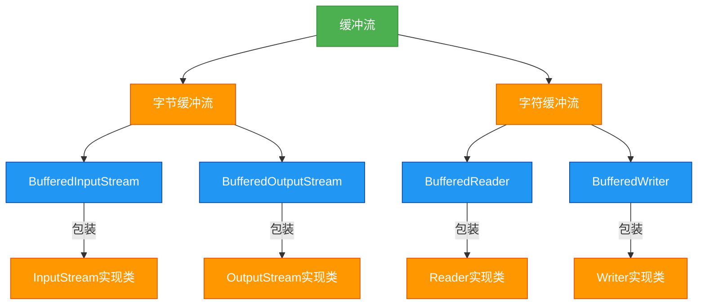

# 1.5.4 缓冲流

## 概述
缓冲流（Buffered Stream）是Java IO中提供的一种带缓冲功能的流，通过在内存中创建缓冲区来提高IO操作的性能。缓冲流本身并不直接与数据源或目标交互，而是作为装饰器包装其他基本流，通过减少实际的IO操作次数来提升读写效率。Java中的缓冲流主要包括`BufferedInputStream`、`BufferedOutputStream`、`BufferedReader`和`BufferedWriter`，分别对应字节缓冲流和字符缓冲流。



## 知识要点

### 1. 缓冲流的工作原理
缓冲流的核心原理是在内存中创建一个缓冲区（字节数组或字符数组），当进行读写操作时，数据先被传输到缓冲区，当缓冲区满或手动刷新时，才将数据一次性写入到目标设备或从源设备读取。这种方式显著减少了与磁盘等外部设备的交互次数，从而提高了IO性能。

- **读取过程**：从数据源读取数据到缓冲区，程序从缓冲区读取数据
- **写入过程**：程序将数据写入缓冲区，当缓冲区满时，将数据一次性写入目标
- **缓冲区大小**：默认缓冲区大小通常为8KB（8192字节），也可自定义

### 2. 字节缓冲流
`BufferedInputStream`和`BufferedOutputStream`用于包装字节流，提供缓冲功能：

```java
import java.io.BufferedInputStream;
import java.io.BufferedOutputStream;
import java.io.FileInputStream;
import java.io.FileOutputStream;
import java.io.IOException;

/**
 * 字节缓冲流示例
 * 演示使用缓冲流复制大文件以提高性能
 */
public class BufferedByteStreamExample {
    private static final int BUFFER_SIZE = 8192; // 8KB缓冲区
    
    public static void main(String[] args) {
        String sourceFile = "large_file.dat";
        String destFile = "copied_file.dat";
        
        long startTime = System.currentTimeMillis();
        
        try (BufferedInputStream bis = new BufferedInputStream(
                new FileInputStream(sourceFile), BUFFER_SIZE);
             BufferedOutputStream bos = new BufferedOutputStream(
                new FileOutputStream(destFile), BUFFER_SIZE)) {
            
            byte[] buffer = new byte[BUFFER_SIZE];
            int bytesRead;
            
            // 读取数据到缓冲区，再写入目标文件
            while ((bytesRead = bis.read(buffer)) != -1) {
                bos.write(buffer, 0, bytesRead);
            }
            
            // 确保所有缓冲数据都被写入
            bos.flush();
        } catch (IOException e) {
            e.printStackTrace();
        }
        
        long endTime = System.currentTimeMillis();
        System.out.println("文件复制完成，耗时: " + (endTime - startTime) + "毫秒");
    }
}
```

### 3. 字符缓冲流
`BufferedReader`和`BufferedWriter`用于包装字符流，除了缓冲功能外，还提供了便捷的按行读写方法：

```java
import java.io.BufferedReader;
import java.io.BufferedWriter;
import java.io.FileReader;
import java.io.FileWriter;
import java.io.IOException;

/**
 * 字符缓冲流示例
 * 演示高效读写文本文件，包括按行读写功能
 */
public class BufferedCharStreamExample {
    public static void main(String[] args) {
        String sourceFile = "input.txt";
        String destFile = "output.txt";
        
        try (BufferedReader br = new BufferedReader(new FileReader(sourceFile));
             BufferedWriter bw = new BufferedWriter(new FileWriter(destFile))) {
            
            String line;
            int lineNumber = 0;
            
            // 按行读取文件内容
            while ((line = br.readLine()) != null) {
                lineNumber++;
                // 写入行号和内容
                bw.write(lineNumber + ": " + line);
                // 写入平台无关的换行符
                bw.newLine();
            }
            System.out.println("文件处理完成，共处理" + lineNumber + "行");
        } catch (IOException e) {
            e.printStackTrace();
        }
    }
}
```

### 4. 缓冲流的性能优势
使用缓冲流可以显著提升IO性能，特别是对于大文件操作。以下是一个性能对比示例：

```java
import java.io.FileInputStream;
import java.io.FileOutputStream;
import java.io.IOException;
import java.io.InputStream;
import java.io.OutputStream;

/**
 * 缓冲流与非缓冲流性能对比
 * 演示使用缓冲流对大文件复制性能的提升
 */
public class BufferPerformanceComparison {
    private static final String LARGE_FILE = "large_test_file.dat";
    private static final String COPY_WITHOUT_BUFFER = "copy_without_buffer.dat";
    private static final String COPY_WITH_BUFFER = "copy_with_buffer.dat";
    
    public static void main(String[] args) {
        // 创建测试文件
        createTestFile(LARGE_FILE, 1024 * 1024 * 100); // 100MB
        
        // 不使用缓冲流复制
        long startTime = System.currentTimeMillis();
        copyWithoutBuffer(LARGE_FILE, COPY_WITHOUT_BUFFER);
        long endTime = System.currentTimeMillis();
        System.out.println("不使用缓冲流耗时: " + (endTime - startTime) + "ms");
        
        // 使用缓冲流复制
        startTime = System.currentTimeMillis();
        copyWithBuffer(LARGE_FILE, COPY_WITH_BUFFER);
        endTime = System.currentTimeMillis();
        System.out.println("使用缓冲流耗时: " + (endTime - startTime) + "ms");
    }
    
    private static void createTestFile(String fileName, int size) {
        try (OutputStream os = new FileOutputStream(fileName)) {
            byte[] data = new byte[1024];
            for (int i = 0; i < size / 1024; i++) {
                os.write(data);
            }
        } catch (IOException e) {
            e.printStackTrace();
        }
    }
    
    private static void copyWithoutBuffer(String source, String dest) {
        try (InputStream is = new FileInputStream(source);
             OutputStream os = new FileOutputStream(dest)) {
            int b;
            while ((b = is.read()) != -1) {
                os.write(b);
            }
        } catch (IOException e) {
            e.printStackTrace();
        }
    }
    
    private static void copyWithBuffer(String source, String dest) {
        try (BufferedInputStream bis = new BufferedInputStream(new FileInputStream(source));
             BufferedOutputStream bos = new BufferedOutputStream(new FileOutputStream(dest))) {
            byte[] buffer = new byte[8192];
            int bytesRead;
            while ((bytesRead = bis.read(buffer)) != -1) {
                bos.write(buffer, 0, bytesRead);
            }
        } catch (IOException e) {
            e.printStackTrace();
        }
    }
}
```

### 5. 缓冲流的特殊方法
字符缓冲流提供了一些额外的便捷方法：

- **BufferedReader**:
  - `String readLine()`: 读取一行文本
  - `void mark(int readAheadLimit)`: 标记当前位置
  - `void reset()`: 重置到标记位置

- **BufferedWriter**:
  - `void newLine()`: 写入平台特定的换行符
  - `void write(String s, int off, int len)`: 写入字符串的一部分

## 知识扩展

### 设计思想
缓冲流体现了以下设计模式和思想：
1. **装饰器模式**：缓冲流不改变原有流的功能，而是在其基础上添加缓冲功能
2. **空间换时间**：通过使用内存缓冲区减少IO操作次数，提高性能
3. **懒加载策略**：数据只有在缓冲区满或显式刷新时才写入目标
4. **接口隔离原则**：缓冲流专注于提供缓冲功能，不改变原有流的接口

### 避坑指南
1. **缓冲区大小选择**：
   - 默认缓冲区大小（8KB）适用于大多数场景
   - 对于大文件传输，可以适当增大缓冲区（如64KB或128KB）
   - 缓冲区并非越大越好，过大会浪费内存并可能降低性能

2. **刷新与关闭**：
   - 输出缓冲流必须在操作完成后刷新或关闭，否则数据可能残留在缓冲区
   - 使用try-with-resources语法可自动关闭流并刷新缓冲区
   - 手动刷新使用`flush()`方法，通常在需要立即写入数据时使用

3. **异常处理**：
   - 缓冲流的`close()`方法可能抛出IOException，需要适当处理
   - 关闭外层缓冲流会自动关闭内层被包装的流，无需单独关闭
   - 读写操作都可能抛出异常，应使用try-catch-finally或try-with-resources

4. **性能优化**：
   - 避免频繁的小数据量写入，尽量批量处理
   - 自定义缓冲区大小时，使用2的幂次方值（如4096, 8192）通常更高效
   - 对于顺序读写，缓冲流性能优势明显；随机访问时优势不大

### 深度思考题
**思考题1**：如何设计一个自定义大小的缓冲区，并实现高效的缓冲读写功能？

**思考题回答**：
可以通过封装一个字节数组作为缓冲区，并实现基本的读写方法：

```java
import java.io.IOException;
import java.io.InputStream;

/**
 * 自定义缓冲区输入流实现
 * 演示缓冲流的基本工作原理
 */
public class CustomBufferedInputStream extends InputStream {
    private final InputStream in;
    private final byte[] buffer;
    private int position;
    private int count;
    
    public CustomBufferedInputStream(InputStream in, int bufferSize) {
        this.in = in;
        this.buffer = new byte[bufferSize];
        this.position = 0;
        this.count = 0;
    }
    
    @Override
    public int read() throws IOException {
        // 如果缓冲区已读完，从底层流填充缓冲区
        if (position >= count) {
            fillBuffer();
            if (count == -1) {
                return -1; // 流结束
            }
        }
        return buffer[position++] & 0xFF; // 返回下一个字节
    }
    
    @Override
    public int read(byte[] b, int off, int len) throws IOException {
        if (b == null) {
            throw new NullPointerException();
        } else if (off < 0 || len < 0 || len > b.length - off) {
            throw new IndexOutOfBoundsException();
        } else if (len == 0) {
            return 0;
        }
        
        // 从缓冲区读取数据
        int bytesRead = 0;
        while (len > 0) {
            if (position >= count) {
                fillBuffer();
                if (count == -1) {
                    break; // 流结束
                }
            }
            
            int available = count - position;
            int toRead = Math.min(available, len);
            System.arraycopy(buffer, position, b, off + bytesRead, toRead);
            
            position += toRead;
            bytesRead += toRead;
            len -= toRead;
        }
        
        return bytesRead == 0 && count == -1 ? -1 : bytesRead;
    }
    
    private void fillBuffer() throws IOException {
        count = in.read(buffer);
        position = 0;
    }
    
    @Override
    public void close() throws IOException {
        in.close();
    }
}
```

**思考题2**：缓冲流在什么情况下性能提升不明显甚至可能降低性能？如何避免？

**思考题回答**：
缓冲流性能可能下降的情况及避免方法：

1. **缓冲区过大**：
   - 情况：缓冲区超过内存页大小或系统缓存
   - 影响：增加内存开销，可能导致频繁的内存页交换
   - 避免：使用适中的缓冲区大小，通常8KB-64KB

2. **频繁随机访问**：
   - 情况：对文件进行大量随机读写操作
   - 影响：缓冲命中率低，反而增加内存复制开销
   - 避免：随机访问时考虑使用NIO的Channel和Buffer

3. **已经有缓冲的流**：
   - 情况：对已经带缓冲的流再次包装缓冲流
   - 影响：双重缓冲，增加内存使用和复制操作
   - 避免：检查流的类型，避免重复缓冲

4. **小文件操作**：
   - 情况：文件大小远小于缓冲区大小
   - 影响：缓冲区优势无法发挥，增加初始化开销
   - 避免：小文件可考虑不使用缓冲流或使用较小缓冲区

5. **频繁刷新**：
   - 情况：在循环中频繁调用`flush()`方法
   - 影响：破坏缓冲机制，增加IO操作次数
   - 避免：减少刷新次数，仅在必要时刷新