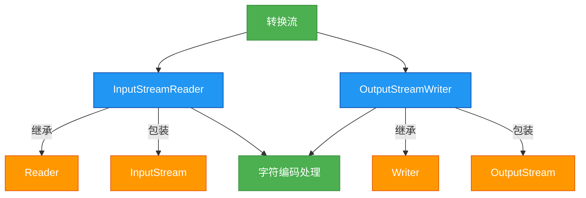

# 1.5.5 转换流

## 概述
转换流是Java IO中用于在字节流和字符流之间进行转换的特殊流，主要包括`InputStreamReader`和`OutputStreamWriter`两个类。它们充当字节流与字符流之间的桥梁，允许应用程序将字节流转换为字符流，并指定字符编码格式，从而解决不同编码导致的乱码问题。转换流在处理文本数据时尤为重要，特别是当需要明确控制字符编码时。



## 知识要点

### 1. 转换流的作用与原理
转换流的核心作用是在字节流和字符流之间架起桥梁，实现两者之间的转换，并处理字符编码：

- **字节流到字符流**：`InputStreamReader`将字节流转换为字符流，通过指定的字符编码将字节解码为字符
- **字符流到字节流**：`OutputStreamWriter`将字符流转换为字节流，通过指定的字符编码将字符编码为字节
- **编码处理**：允许显式指定字符编码（如UTF-8、GBK等），解决不同编码环境下的文本处理问题

转换流的工作原理：
1. 接收字节流作为输入（`InputStreamReader`）或输出（`OutputStreamWriter`）
2. 使用指定的字符编码（Charset）进行字节与字符的转换
3. 提供字符流接口，供上层应用操作

### 2. InputStreamReader详解
`InputStreamReader`是字节流通向字符流的桥梁，它使用指定的`charset`读取字节并将其解码为字符：

```java
import java.io.FileInputStream;
import java.io.IOException;
import java.io.InputStreamReader;
import java.nio.charset.StandardCharsets;

/**
 * InputStreamReader示例
 * 演示如何使用指定编码读取文本文件
 */
public class InputStreamReaderExample {
    public static void main(String[] args) {
        String fileName = "encoded_text.txt";
        
        // 使用UTF-8编码读取文件
        try (InputStreamReader isr = new InputStreamReader(
                new FileInputStream(fileName), StandardCharsets.UTF_8)) {
            
            char[] buffer = new char[1024];
            int charsRead;
            
            System.out.println("文件内容(UTF-8):");
            while ((charsRead = isr.read(buffer)) != -1) {
                System.out.print(new String(buffer, 0, charsRead));
            }
        } catch (IOException e) {
            e.printStackTrace();
        }
        
        // 使用GBK编码读取同一文件（可能产生乱码）
        try (InputStreamReader isr = new InputStreamReader(
                new FileInputStream(fileName), "GBK")) {
            
            char[] buffer = new char[1024];
            int charsRead;
            
            System.out.println("\n文件内容(GBK):");
            while ((charsRead = isr.read(buffer)) != -1) {
                System.out.print(new String(buffer, 0, charsRead));
            }
        } catch (IOException e) {
            e.printStackTrace();
        }
    }
}
```

### 3. OutputStreamWriter详解
`OutputStreamWriter`是字符流通向字节流的桥梁，它使用指定的`charset`将字符编码为字节：

```java
import java.io.FileOutputStream;
import java.io.IOException;
import java.io.OutputStreamWriter;
import java.nio.charset.StandardCharsets;

/**
 * OutputStreamWriter示例
 * 演示如何使用指定编码写入文本文件
 */
public class OutputStreamWriterExample {
    public static void main(String[] args) {
        String fileName = "output_utf8.txt";
        String content = "Hello, 世界! 这是使用UTF-8编码写入的文本。";
        
        // 使用UTF-8编码写入文件
        try (OutputStreamWriter osw = new OutputStreamWriter(
                new FileOutputStream(fileName), StandardCharsets.UTF_8)) {
            osw.write(content);
            System.out.println("文件写入成功！");
        } catch (IOException e) {
            e.printStackTrace();
        }
        
        // 使用GBK编码写入另一个文件
        fileName = "output_gbk.txt";
        try (OutputStreamWriter osw = new OutputStreamWriter(
                new FileOutputStream(fileName), "GBK")) {
            osw.write(content);
            System.out.println("GBK编码文件写入成功！");
        } catch (IOException e) {
            e.printStackTrace();
        }
    }
}
```

### 4. 转换流与缓冲流的结合使用
转换流通常与缓冲流结合使用，以提高读写性能并提供更便捷的API：

```java
import java.io.BufferedReader;
import java.io.BufferedWriter;
import java.io.FileInputStream;
import java.io.FileOutputStream;
import java.io.IOException;
import java.io.InputStreamReader;
import java.io.OutputStreamWriter;
import java.nio.charset.StandardCharsets;

/**
 * 转换流与缓冲流结合示例
 * 演示高效的编码转换文件复制
 */
public class ConversionWithBufferExample {
    public static void main(String[] args) {
        String sourceFile = "source_gbk.txt";
        String destFile = "dest_utf8.txt";
        
        try (BufferedReader br = new BufferedReader(
                new InputStreamReader(new FileInputStream(sourceFile), "GBK"));
             BufferedWriter bw = new BufferedWriter(
                new OutputStreamWriter(new FileOutputStream(destFile), StandardCharsets.UTF_8))) {
            
            String line;
            while ((line = br.readLine()) != null) {
                bw.write(line);
                bw.newLine();
            }
            System.out.println("文件编码转换完成！");
        } catch (IOException e) {
            e.printStackTrace();
        }
    }
}
```

### 5. 字符编码的处理
转换流的关键功能是处理字符编码，Java支持多种字符集：

```java
import java.nio.charset.Charset;
import java.util.SortedMap;

/**
 * 字符编码示例
 * 演示Java支持的字符集
 */
public class CharsetExample {
    public static void main(String[] args) {
        // 获取所有可用的字符集
        SortedMap<String, Charset> charsets = Charset.availableCharsets();
        
        System.out.println("可用字符集总数: " + charsets.size());
        System.out.println("常用字符集:");
        
        // 打印常用字符集
        printCharsetInfo(charsets, "UTF-8");
        printCharsetInfo(charsets, "GBK");
        printCharsetInfo(charsets, "ISO-8859-1");
        printCharsetInfo(charsets, "UTF-16");
        printCharsetInfo(charsets, "GB2312");
    }
    
    private static void printCharsetInfo(SortedMap<String, Charset> charsets, String name) {
        Charset charset = charsets.get(name);
        if (charset != null) {
            System.out.printf("- %s: 别名=%s, 是否支持=%s%n",
                    name, charset.aliases(), charset.isSupported());
        }
    }
}
```

## 知识扩展

### 设计思想
转换流体现了以下设计思想和模式：
1. **适配器模式**：将字节流接口适配为字符流接口，使不兼容的接口可以一起工作
2. **桥接模式**：将抽象部分与实现部分分离，使它们可以独立变化（字符流操作与字节流实现分离）
3. **单一职责原则**：转换流专注于字节与字符的转换，不改变原有流的其他功能
4. **开闭原则**：通过抽象类（Reader/Writer）定义接口，具体实现可灵活扩展

### 避坑指南
1. **编码一致性问题**：
   - 读取和写入文件时必须使用相同的字符编码，否则会产生乱码
   - 推荐使用`StandardCharsets`类中的常量（如`StandardCharsets.UTF_8`）而非字符串编码名
   - 避免依赖系统默认编码，始终显式指定编码

2. **异常处理**：
   - 处理不支持的编码时会抛出`UnsupportedEncodingException`
   - JDK7+推荐使用`StandardCharsets`类避免检查异常
   - 使用try-with-resources确保流资源正确关闭

3. **性能优化**：
   - 转换流本身不提供缓冲功能，必须与缓冲流结合使用以提高性能
   - 大文件处理时，合理设置缓冲区大小（通常8KB~64KB）
   - 避免频繁的字符与字节转换操作

4. **特殊字符处理**：
   - 某些编码不支持所有Unicode字符（如ISO-8859-1不支持中文）
   - 处理特殊字符时选择合适的编码（如UTF-8支持所有Unicode字符）
   - 考虑使用BOM（字节顺序标记）处理UTF-8/UTF-16编码的文件开头标识

### 深度思考题
**思考题1**：如何检测一个文本文件的字符编码？

**思考题回答**：
Java标准库没有提供直接检测文件编码的API，但可以通过第三方库如ICU4J或juniversalchardet，或实现简单的编码检测算法：

```java
import java.io.FileInputStream;
import java.io.IOException;
import java.nio.ByteBuffer;
import java.nio.charset.CharacterCodingException;
import java.nio.charset.Charset;
import java.nio.charset.CharsetDecoder;

/**
 * 简单的文件编码检测示例
 */
public class EncodingDetector {
    public static void main(String[] args) {
        String fileName = "unknown_encoding.txt";
        
        // 尝试常用编码检测
        String[] encodings = {"UTF-8", "GBK", "ISO-8859-1", "UTF-16"};
        
        try (FileInputStream fis = new FileInputStream(fileName)) {
            byte[] buffer = new byte[1024];
            int bytesRead = fis.read(buffer);
            ByteBuffer byteBuffer = ByteBuffer.wrap(buffer, 0, bytesRead);
            
            for (String encoding : encodings) {
                Charset charset = Charset.forName(encoding);
                CharsetDecoder decoder = charset.newDecoder();
                
                try {
                    decoder.decode(byteBuffer);
                    byteBuffer.rewind(); // 重置缓冲区以便下次尝试
                    System.out.println("可能的编码: " + encoding);
                } catch (CharacterCodingException e) {
                    // 解码失败，尝试下一种编码
                }
            }
        } catch (IOException e) {
            e.printStackTrace();
        }
    }
}
```

**思考题2**：`InputStreamReader`和`FileReader`有什么区别？在什么情况下应该使用哪个？

**思考题回答**：
`InputStreamReader`和`FileReader`的主要区别及使用场景：

| 特性 | InputStreamReader | FileReader |
|------|-------------------|------------|
| 继承关系 | 继承自Reader | 继承自InputStreamReader |
| 功能 | 字节流到字符流的转换 | 便捷的文件字符读取 |
| 编码控制 | 可显式指定字符编码 | 使用系统默认编码 |
| 灵活性 | 可包装任何InputStream | 只能读取文件 |
| 兼容性 | JDK1.1及以上 | JDK1.1及以上 |
| 推荐使用 | 需要控制编码时 | 简单文件读取且不关心编码 |

**使用建议**：
- 当需要读取文件且明确知道编码时，优先使用`InputStreamReader`+`FileInputStream`组合
- 当需要读取网络流或其他字节流并转换为字符流时，必须使用`InputStreamReader`
- 当编写跨平台应用时，避免使用`FileReader`，因为它依赖系统默认编码
- 当处理中文等非ASCII字符时，始终使用`InputStreamReader`并显式指定编码