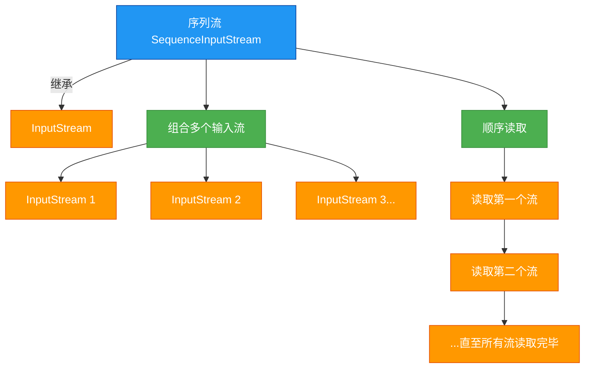

# 1.5.6 序列流

## 概述
序列流（SequenceInputStream）是Java IO中一种特殊的输入流，它允许将多个输入流逻辑上串联起来，形成一个单一的输入流进行顺序读取。通过序列流，应用程序可以像操作单个流一样依次读取多个数据源，而无需关心底层多个流的存在。这种流的组合方式在处理分散存储的数据或需要合并多个输入源时非常有用。



## 知识要点

### 1. 序列流的工作原理
序列流的核心功能是将多个输入流组合成一个逻辑流，其工作原理如下：

- **流的组合**：通过构造方法接收多个输入流（可以是两个独立流或一个包含多个流的Enumeration枚举）
- **顺序读取**：从第一个输入流开始读取，当到达流的末尾时自动切换到下一个输入流
- **透明操作**：对使用者而言，多个流的组合读取过程是透明的，就像读取单个流一样
- **资源管理**：当序列流关闭时，会自动关闭所有被组合的输入流

### 2. SequenceInputStream的构造方法
SequenceInputStream提供两种构造方法来组合输入流：

```java
// 构造方法1：组合两个输入流
public SequenceInputStream(InputStream s1, InputStream s2)

// 构造方法2：组合多个输入流（通过Enumeration枚举）
public SequenceInputStream(Enumeration<? extends InputStream> e)
```

### 3. 组合两个输入流的示例
使用第一个构造方法组合两个输入流并读取数据：

```java
import java.io.ByteArrayInputStream;
import java.io.IOException;
import java.io.SequenceInputStream;

/**
 * 组合两个输入流的示例
 */
public class TwoStreamsExample {
    public static void main(String[] args) {
        // 创建两个字节输入流
        byte[] data1 = "Hello ".getBytes();
        byte[] data2 = "World! ".getBytes();
        ByteArrayInputStream stream1 = new ByteArrayInputStream(data1);
        ByteArrayInputStream stream2 = new ByteArrayInputStream(data2);
        
        // 使用SequenceInputStream组合两个流
        try (SequenceInputStream sequenceStream = new SequenceInputStream(stream1, stream2)) {
            int data;
            System.out.print("组合流内容: ");
            while ((data = sequenceStream.read()) != -1) {
                System.out.print((char) data);
            }
        } catch (IOException e) {
            e.printStackTrace();
        }
    }
}
```

### 4. 组合多个输入流的示例
使用第二个构造方法通过Enumeration组合多个输入流：

```java
import java.io.ByteArrayInputStream;
import java.io.IOException;
import java.io.SequenceInputStream;
import java.util.Enumeration;
import java.util.Vector;

/**
 * 组合多个输入流的示例
 */
public class MultipleStreamsExample {
    public static void main(String[] args) {
        // 创建多个字节输入流
        ByteArrayInputStream stream1 = new ByteArrayInputStream("Java ".getBytes());
        ByteArrayInputStream stream2 = new ByteArrayInputStream("IO ".getBytes());
        ByteArrayInputStream stream3 = new ByteArrayInputStream("Sequence ".getBytes());
        ByteArrayInputStream stream4 = new ByteArrayInputStream("Stream".getBytes());
        
        // 将流添加到Vector集合
        Vector<ByteArrayInputStream> vector = new Vector<>();
        vector.add(stream1);
        vector.add(stream2);
        vector.add(stream3);
        vector.add(stream4);
        
        // 获取Enumeration对象
        Enumeration<ByteArrayInputStream> enumeration = vector.elements();
        
        // 使用SequenceInputStream组合多个流
        try (SequenceInputStream sequenceStream = new SequenceInputStream(enumeration)) {
            byte[] buffer = new byte[1024];
            int bytesRead;
            System.out.print("组合流内容: ");
            while ((bytesRead = sequenceStream.read(buffer)) != -1) {
                System.out.print(new String(buffer, 0, bytesRead));
            }
        } catch (IOException e) {
            e.printStackTrace();
        }
    }
}
```

### 5. 序列流的实际应用场景
序列流在以下场景中特别有用：

```java
import java.io.*;
import java.util.Enumeration;
import java.util.Vector;

/**
 * 序列流的实际应用：合并多个文本文件
 */
public class FileMergeExample {
    public static void main(String[] args) {
        String[] inputFiles = {"part1.txt", "part2.txt", "part3.txt"};
        String outputFile = "merged.txt";
        
        try {
            // 创建多个文件输入流
            Vector<FileInputStream> inputStreams = new Vector<>();
            for (String file : inputFiles) {
                inputStreams.add(new FileInputStream(file));
            }
            
            // 获取Enumeration对象
            Enumeration<FileInputStream> enumeration = inputStreams.elements();
            
            // 使用序列流组合所有输入流
            try (SequenceInputStream sequenceStream = new SequenceInputStream(enumeration);
                 BufferedOutputStream outputStream = new BufferedOutputStream(new FileOutputStream(outputFile))) {
                
                byte[] buffer = new byte[1024];
                int bytesRead;
                
                // 读取序列流并写入到输出文件
                while ((bytesRead = sequenceStream.read(buffer)) != -1) {
                    outputStream.write(buffer, 0, bytesRead);
                }
                
                System.out.println("文件合并完成！");
            }
        } catch (IOException e) {
            e.printStackTrace();
        }
    }
}
```

## 知识扩展

### 设计思想
序列流体现了以下设计思想和模式：
1. **组合模式**：将对象组合成树形结构以表示"部分-整体"的层次结构，使得用户对单个对象和组合对象的使用具有一致性
2. **装饰器模式**：动态地给一个对象添加一些额外的职责，就增加功能来说，装饰器模式比生成子类更为灵活
3. **单一职责原则**：每个流专注于单一功能，序列流专注于流的组合，而不是数据读取本身
4. **开闭原则**：可以灵活添加新的输入流类型，而无需修改序列流的代码

### 避坑指南
1. **流的关闭顺序**：
   - 序列流关闭时会自动关闭所有被组合的输入流，无需手动关闭每个流
   - 避免在序列流关闭后再次使用被组合的流
   - 即使某个被组合的流关闭失败，序列流仍会尝试关闭其他流

2. **空流处理**：
   - 避免组合空的输入流，这会导致读取时直接跳过
   - 组合流中如果某个流为null，会抛出NullPointerException
   - 处理可能为空的流时，应先进行非空判断

3. **异常处理**：
   - 序列流的read()方法在遇到一个流的IO异常时会停止读取并抛出异常
   - 对于关键数据，应考虑单个流的异常处理机制
   - 使用try-with-resources确保资源正确释放

4. **性能考量**：
   - 序列流本身不提供缓冲功能，建议与缓冲流一起使用
   - 对于大量小文件的合并，序列流比多次单独读取更高效
   - 避免组合过多流导致的性能开销

### 深度思考题
**思考题1**：如何使用序列流实现多个文件的合并，同时在每个文件内容之间添加分隔符？

**思考题回答**：
可以通过自定义InputStream包装类在每个文件内容之间添加分隔符：

```java
import java.io.*;
import java.util.Enumeration;
import java.util.Vector;

/**
 * 带分隔符的文件合并示例
 */
public class FileMergeWithSeparatorExample {
    public static void main(String[] args) {
        String[] inputFiles = {"part1.txt", "part2.txt", "part3.txt"};
        String outputFile = "merged_with_separator.txt";
        String separator = "\n--- 文件分隔符 ---\n";
        
        try {
            Vector<InputStream> inputStreams = new Vector<>();
            
            for (int i = 0; i < inputFiles.length; i++) {
                // 添加文件输入流
                inputStreams.add(new FileInputStream(inputFiles[i]));
                
                // 除最后一个文件外，添加分隔符输入流
                if (i != inputFiles.length - 1) {
                    inputStreams.add(new ByteArrayInputStream(separator.getBytes()));
                }
            }
            
            Enumeration<InputStream> enumeration = inputStreams.elements();
            
            try (SequenceInputStream sequenceStream = new SequenceInputStream(enumeration);
                 BufferedOutputStream outputStream = new BufferedOutputStream(new FileOutputStream(outputFile))) {
                
                byte[] buffer = new byte[1024];
                int bytesRead;
                while ((bytesRead = sequenceStream.read(buffer)) != -1) {
                    outputStream.write(buffer, 0, bytesRead);
                }
                
                System.out.println("带分隔符的文件合并完成！");
            }
        } catch (IOException e) {
            e.printStackTrace();
        }
    }
}
```

**思考题2**：SequenceInputStream和其他流组合方式（如使用管道流）有什么区别？各适用于什么场景？

**思考题回答**：
SequenceInputStream与管道流（PipedInputStream/PipedOutputStream）的区别及适用场景：

| 特性 | SequenceInputStream | 管道流 |
|------|---------------------|--------|
| 核心功能 | 组合多个输入流顺序读取 | 线程间通信的流 |
| 数据流方向 | 仅输入 | 输入输出配对使用 |
| 并发性 | 不支持并发，顺序读取 | 支持并发，通常用于不同线程 |
| 连接方式 | 静态组合多个流 | 动态连接两个线程 |
| 主要用途 | 合并多个数据源 | 线程间数据传递 |
| 实现复杂度 | 简单，无需额外线程 | 复杂，需要处理线程同步 |

**适用场景**：
- **SequenceInputStream**：适用于需要按顺序读取多个数据源的场景，如合并多个文件、读取分散存储的数据片段等
- **管道流**：适用于多线程环境下的数据通信，如生产者-消费者模型、后台线程处理数据并传递给主线程等
- 当需要合并多个输入源且不需要并发处理时，优先使用SequenceInputStream
- 当需要在不同线程间传递数据时，必须使用管道流