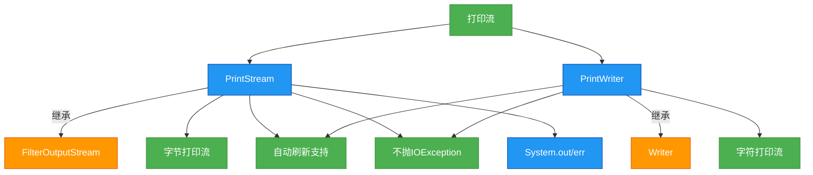

# 1.5.7 打印流

## 概述
打印流（Print Stream）是Java IO中用于方便地输出各种数据类型的特殊流，主要包括`PrintStream`和`PrintWriter`两个类。它们提供了一系列重载的`print()`和`println()`方法，可以直接输出基本数据类型、对象和字符串等，而无需手动进行类型转换。打印流的特点是操作简便、支持自动刷新、不会抛出`IOException`（而是通过`checkError()`方法检查错误），是日常开发中输出数据的常用工具。



## 知识要点

### 1. 打印流的核心特点
打印流具有以下核心特点，使其在IO操作中广泛应用：

- **多种数据类型输出**：提供`print()`和`println()`方法的重载版本，支持输出基本数据类型、字符数组、字符串、对象等
- **自动刷新机制**：当启用自动刷新时，写入换行符（`\n`）、调用`println()`或`format()`方法后会自动刷新缓冲区
- **异常处理机制**：不抛出`IOException`，而是通过`checkError()`方法检查是否发生错误
- **格式化输出**：支持使用`printf()`方法进行格式化字符串输出，类似C语言的`printf`函数
- **便捷性**：无需手动转换数据类型，直接输出各种类型数据

### 2. PrintStream详解
`PrintStream`是字节打印流，继承自`FilterOutputStream`，主要用于处理字节输出：

```java
import java.io.FileNotFoundException;
import java.io.FileOutputStream;
import java.io.PrintStream;

/**
 * PrintStream示例
 * 演示字节打印流的基本用法
 */
public class PrintStreamExample {
    public static void main(String[] args) {
        String fileName = "printstream_demo.txt";
        
        // 创建PrintStream，指定文件输出流和自动刷新
        try (PrintStream ps = new PrintStream(new FileOutputStream(fileName), true)) {
            // 输出各种数据类型
            ps.print("整数: ");
            ps.println(123);
            
            ps.print("浮点数: ");
            ps.println(3.14159);
            
            ps.print("布尔值: ");
            ps.println(true);
            
            ps.print("字符: ");
            ps.println('A');
            
            ps.print("对象: ");
            ps.println(new Object());
            
            // 格式化输出
            ps.printf("格式化输出: 姓名=%s, 年龄=%d, 成绩=%.2f%n", "张三", 20, 95.5);
            
            System.out.println("数据写入完成！");
        } catch (FileNotFoundException e) {
            e.printStackTrace();
        }
        
        // 标准输出流System.out就是PrintStream的实例
        System.out.println("这是标准输出流");
        System.err.println("这是标准错误流");
    }
}
```

### 3. PrintWriter详解
`PrintWriter`是字符打印流，继承自`Writer`，主要用于处理字符输出，支持指定字符编码：

```java
import java.io.FileWriter;
import java.io.IOException;
import java.io.PrintWriter;
import java.nio.charset.StandardCharsets;

/**
 * PrintWriter示例
 * 演示字符打印流的基本用法
 */
public class PrintWriterExample {
    public static void main(String[] args) {
        String fileName = "printwriter_demo.txt";
        
        // 创建PrintWriter，指定文件写入器和自动刷新
        try (PrintWriter pw = new PrintWriter(new FileWriter(fileName), true)) {
            // 输出各种数据类型
            pw.print("Hello, ");
            pw.println("世界！"); // 支持 Unicode 字符
            
            pw.print("数组: ");
            pw.println(new int[]{1, 2, 3, 4, 5});
            
            // 格式化输出
            pw.printf("用户信息: ID=%d, 名称=%s, 状态=%b%n", 1001, "管理员", true);
            
            System.out.println("字符数据写入完成！");
        } catch (IOException e) {
            e.printStackTrace();
        }
        
        // 创建指定编码的PrintWriter
        try (PrintWriter pw = new PrintWriter(fileName, StandardCharsets.UTF_8.name())) {
            pw.println("使用指定编码写入的文本: 你好，世界！");
        } catch (IOException e) {
            e.printStackTrace();
        }
    }
}
```

### 4. 自动刷新机制
打印流的自动刷新功能可以通过构造方法启用，当满足特定条件时自动刷新缓冲区：

```java
import java.io.ByteArrayOutputStream;
import java.io.PrintStream;

/**
 * 打印流自动刷新示例
 */
public class AutoFlushExample {
    public static void main(String[] args) {
        ByteArrayOutputStream baos = new ByteArrayOutputStream();
        
        // 第二个参数为true表示启用自动刷新
        try (PrintStream ps = new PrintStream(baos, true)) {
            // 情况1: 使用println()方法会触发自动刷新
            ps.println("这行内容会被自动刷新");
            System.out.println("缓冲区内容长度: " + baos.size());
            
            // 情况2: 输出包含换行符的字符串不会触发自动刷新
            ps.print("这行内容不会被自动刷新\n");
            System.out.println("缓冲区内容长度: " + baos.size());
            
            // 情况3: 使用printf()方法输出包含换行符会触发自动刷新
            ps.printf("这行内容会被自动刷新%n");
            System.out.println("缓冲区内容长度: " + baos.size());
            
            // 情况4: 调用flush()方法手动刷新
            ps.print("这行内容需要手动刷新");
            ps.flush();
            System.out.println("缓冲区内容长度: " + baos.size());
        }
    }
}
```

### 5. 格式化输出详解
打印流提供了强大的格式化输出功能，通过`printf()`方法实现：

```java
import java.io.PrintWriter;
import java.util.Date;

/**
 * 打印流格式化输出示例
 */
public class FormatOutputExample {
    public static void main(String[] args) {
        try (PrintWriter pw = new PrintWriter(System.out)) {
            // 格式化整数
            pw.printf("十进制: %d, 八进制: %o, 十六进制: %x%n", 255, 255, 255);
            
            // 格式化浮点数
            pw.printf("默认浮点: %f, 保留两位小数: %.2f, 科学计数法: %e%n", 3.14159, 3.14159, 3.14159);
            
            // 格式化字符串
            pw.printf("姓名: %s, 年龄: %d%n", "张三", 25);
            
            // 格式化日期时间
            pw.printf("当前时间: %tF %tT%n", new Date(), new Date());
            
            // 格式化宽度和对齐
            pw.printf("左对齐: %-10s 右对齐: %10s%n", "左侧", "右侧");
            
            // 格式化百分比
            pw.printf("成功率: %.2f%%%n", 98.76);
        }
    }
}
```

## 知识扩展

### 设计思想
打印流体现了以下设计思想和模式：
1. **装饰器模式**：包装其他输出流，添加打印和格式化功能
2. **简化接口模式**：提供简单易用的接口，隐藏底层复杂的转换细节
3. **责任分离原则**：将数据输出和格式化的责任分离到专门的类中
4. **便利性设计**：以开发者友好为目标，提供直观的API设计

### 避坑指南
1. **异常处理问题**：
   - 打印流不会抛出`IOException`，必须主动调用`checkError()`方法检查错误
   - `checkError()`方法会刷新流，可能导致之前未检测到的错误被发现
   - 建议在关键操作后调用`checkError()`验证操作是否成功

2. **自动刷新陷阱**：
   - 自动刷新仅在调用`println()`、`printf()`或`format()`方法时生效，普通`print()`方法不会触发
   - 自动刷新需要在构造方法中显式启用（第二个参数设为true）
   - 输出包含`\n`的字符串不会触发自动刷新

3. **字符编码问题**：
   - `PrintStream`使用平台默认编码，可能导致跨平台字符问题
   - 处理字符数据时优先使用`PrintWriter`并显式指定编码
   - 创建`PrintWriter`时使用`new PrintWriter(file, charset)`构造方法确保编码一致

4. **资源关闭问题**：
   - 确保正确关闭打印流，否则可能导致缓冲区数据未写入
   - 优先使用try-with-resources语句自动管理资源
   - 关闭打印流会自动关闭其包装的底层输出流

### 深度思考题
**思考题1**：如何重定向System.out和System.err输出到文件？

**思考题回答**：
可以通过`System.setOut()`和`System.setErr()`方法重定向标准输出流：

```java
import java.io.FileNotFoundException;
import java.io.PrintStream;

/**
 * 重定向标准输出流示例
 */
public class RedirectSystemOutExample {
    public static void main(String[] args) {
        String logFile = "system_out.log";
        String errFile = "system_err.log";
        
        // 保存原始输出流
        PrintStream originalOut = System.out;
        PrintStream originalErr = System.err;
        
        try {
            // 重定向System.out到文件
            System.setOut(new PrintStream(logFile));
            // 重定向System.err到文件
            System.setErr(new PrintStream(errFile));
            
            // 测试输出
            System.out.println("这行内容会写入到日志文件");
            System.err.println("这行错误信息会写入到错误日志文件");
            
            // 故意产生一个错误
            int division = 1 / 0;
        } catch (FileNotFoundException | ArithmeticException e) {
            // 错误信息会写入到重定向的错误日志
            e.printStackTrace();
        } finally {
            // 恢复原始输出流
            System.setOut(originalOut);
            System.setErr(originalErr);
            System.out.println("输出流已恢复正常");
        }
    }
}
```

**思考题2**：PrintStream和PrintWriter有哪些主要区别？在实际开发中如何选择？

**思考题回答**：
PrintStream和PrintWriter的主要区别及选择依据：

| 特性 | PrintStream | PrintWriter |
|------|-------------|-------------|
| 流类型 | 字节流 | 字符流 |
| 继承关系 | 继承自FilterOutputStream | 继承自Writer |
| 编码支持 | 使用平台默认编码，不支持显式指定 | 支持显式指定字符编码 |
| 构造方法 | 接受OutputStream | 接受Writer或OutputStream |
| 方法差异 | 提供write(byte[])方法 | 提供write(int c)和write(char[])方法 |
| 错误处理 | checkError()返回boolean | checkError()返回boolean |
| 自动刷新 | 支持 | 支持 |
| 格式化输出 | 支持printf() | 支持printf() |
| 标准流 | System.out和System.err是PrintStream实例 | 无对应的标准流 |

**选择建议**：
- 当处理字节数据或需要与标准输出流交互时，使用PrintStream
- 当处理字符数据且需要控制编码时，优先使用PrintWriter
- 写入文件时推荐使用PrintWriter并指定编码，如`new PrintWriter(file, StandardCharsets.UTF_8)`
- 网络编程中，根据数据类型选择：二进制数据用PrintStream，文本数据用PrintWriter
- 跨平台应用必须使用PrintWriter并显式指定编码，避免依赖平台默认编码