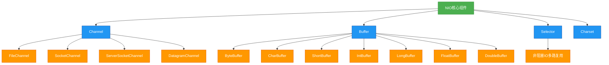

# 1.5.8 NIO流

## 概述
Java NIO（New IO）是JDK 1.4引入的新IO模型，提供了与传统IO（InputStream/OutputStream）不同的工作方式，主要基于通道（Channel）和缓冲区（Buffer）进行操作，支持非阻塞IO、选择器（Selector）和内存映射文件等高级特性。NIO旨在提高IO操作的效率，特别适用于高并发、高吞吐量的网络编程场景。与传统IO的面向流（Stream-oriented）不同，NIO是面向缓冲区（Buffer-oriented）的，数据读取到缓冲区后进行处理，大大提升了IO操作的灵活性和性能。



## 知识要点

### 1. NIO与传统IO的主要区别
NIO相比传统IO（也称为BIO，Blocking IO）具有以下显著区别：

| 特性 | 传统IO (BIO) | NIO |
|------|-------------|-----|
| 操作方式 | 面向流(Stream) | 面向缓冲区(Buffer) |
| 阻塞特性 | 阻塞IO | 非阻塞IO |
| 处理模式 | 同步阻塞 | 同步非阻塞(可通过Selector实现多路复用) |
| 线程模型 | 一个连接一个线程 | 一个线程处理多个连接 |
| 数据处理 | 流式处理，一次一个字节 | 缓冲区批量处理 |
| 适用场景 | 连接数少且固定 | 高并发、高吞吐量 |

### 2. 缓冲区(Buffer)详解
Buffer是NIO中用于存储数据的容器，所有数据操作都通过缓冲区进行。Buffer本质上是一个数组，提供了对数据的结构化访问和维护读写位置的机制。

```java
import java.nio.ByteBuffer;

/**
 * Buffer基本操作示例
 * 演示缓冲区的创建、写入、读取和翻转等核心操作
 */
public class BufferExample {
    public static void main(String[] args) {
        // 1. 创建缓冲区，分配容量为1024字节
        ByteBuffer buffer = ByteBuffer.allocate(1024);
        System.out.println("初始化状态: " + buffer);
        
        // 2. 写入数据到缓冲区
        String data = "Hello NIO Buffer!";
        buffer.put(data.getBytes());
        System.out.println("写入数据后: " + buffer);
        
        // 3. 翻转缓冲区(切换为读模式)
        buffer.flip();
        System.out.println("翻转后: " + buffer);
        
        // 4. 从缓冲区读取数据
        byte[] readData = new byte[buffer.remaining()];
        buffer.get(readData);
        System.out.println("读取的数据: " + new String(readData));
        System.out.println("读取数据后: " + buffer);
        
        // 5. 清空缓冲区(切换为写模式)
        buffer.clear();
        System.out.println("清空后: " + buffer);
        
        // 6. 压缩缓冲区(保留未读取数据)
        buffer.put("追加的数据".getBytes());
        buffer.flip();
        byte[] partialData = new byte[5];
        buffer.get(partialData);
        System.out.println("部分读取后: " + buffer);
        buffer.compact();
        System.out.println("压缩后: " + buffer);
    }
}
```

Buffer的核心属性：
- **capacity**: 缓冲区容量，创建后不可改变
- **position**: 当前读写位置
- **limit**: 读写限制位置
- **mark**: 标记位置，用于后续重置

Buffer的核心方法：
- `allocate(int capacity)`: 创建缓冲区
- `put()`: 写入数据到缓冲区
- `get()`: 从缓冲区读取数据
- `flip()`: 翻转缓冲区，切换读写模式
- `rewind()`: 重置position为0，可重新读取数据
- `clear()`: 清空缓冲区，准备重新写入
- `compact()`: 压缩缓冲区，保留未读取数据
- `mark()`/`reset()`: 标记和重置position

### 3. 通道(Channel)详解
Channel是NIO中用于连接数据源和目标的通道，类似于传统IO中的流，但具有双向性和异步操作能力。

```java
import java.io.FileInputStream;
import java.io.FileOutputStream;
import java.io.IOException;
import java.nio.ByteBuffer;
import java.nio.channels.FileChannel;

/**
 * FileChannel示例
 * 演示使用通道进行文件复制操作
 */
public class FileChannelExample {
    public static void main(String[] args) {
        String sourcePath = "source.txt";
        String destPath = "destination.txt";
        
        try (
            FileInputStream fis = new FileInputStream(sourcePath);
            FileOutputStream fos = new FileOutputStream(destPath);
            FileChannel sourceChannel = fis.getChannel();
            FileChannel destChannel = fos.getChannel();
        ) {
            // 创建缓冲区
            ByteBuffer buffer = ByteBuffer.allocate(1024);
            
            // 从源通道读取数据到缓冲区
            while (sourceChannel.read(buffer) != -1) {
                // 切换为读模式
                buffer.flip();
                
                // 从缓冲区写入数据到目标通道
                destChannel.write(buffer);
                
                // 清空缓冲区，准备下一次读取
                buffer.clear();
            }
            
            System.out.println("文件复制完成！");
        } catch (IOException e) {
            e.printStackTrace();
        }
    }
}
```

常用Channel类型：
- **FileChannel**: 文件通道，用于文件读写
- **SocketChannel**: 套接字通道，用于TCP客户端
- **ServerSocketChannel**: 服务器套接字通道，用于TCP服务器
- **DatagramChannel**: 数据报通道，用于UDP通信

### 4. 选择器(Selector)详解
Selector是NIO实现非阻塞IO的核心组件，允许单个线程监控多个通道的IO事件（如连接、读取、写入等），实现一个线程处理多个通道的高效IO模型。

```java
import java.io.IOException;
import java.net.InetSocketAddress;
import java.nio.ByteBuffer;
import java.nio.channels.SelectionKey;
import java.nio.channels.Selector;
import java.nio.channels.ServerSocketChannel;
import java.nio.channels.SocketChannel;
import java.util.Iterator;
import java.util.Set;

/**
 * Selector示例
 * 演示非阻塞IO多路复用
 */
public class SelectorExample {
    public static void main(String[] args) {
        try {
            // 创建选择器
            Selector selector = Selector.open();
            
            // 创建服务器通道
            ServerSocketChannel serverSocketChannel = ServerSocketChannel.open();
            serverSocketChannel.socket().bind(new InetSocketAddress(8080));
            serverSocketChannel.configureBlocking(false);
            
            // 注册通道到选择器，关注接受连接事件
            serverSocketChannel.register(selector, SelectionKey.OP_ACCEPT);
            
            System.out.println("服务器启动，监听端口8080...");
            
            while (true) {
                // 阻塞等待就绪事件
                int readyChannels = selector.select();
                if (readyChannels == 0) continue;
                
                // 获取就绪事件集合
                Set<SelectionKey> selectionKeys = selector.selectedKeys();
                Iterator<SelectionKey> iterator = selectionKeys.iterator();
                
                while (iterator.hasNext()) {
                    SelectionKey key = iterator.next();
                    
                    // 处理接受连接事件
                    if (key.isAcceptable()) {
                        handleAccept(key, selector);
                    }
                    
                    // 处理读事件
                    if (key.isReadable()) {
                        handleRead(key);
                    }
                    
                    // 移除已处理的事件
                    iterator.remove();
                }
            }
        } catch (IOException e) {
            e.printStackTrace();
        }
    }
    
    private static void handleAccept(SelectionKey key, Selector selector) throws IOException {
        ServerSocketChannel serverSocketChannel = (ServerSocketChannel) key.channel();
        SocketChannel socketChannel = serverSocketChannel.accept();
        socketChannel.configureBlocking(false);
        
        System.out.println("接受新连接: " + socketChannel.getRemoteAddress());
        
        // 注册读事件
        socketChannel.register(selector, SelectionKey.OP_READ, ByteBuffer.allocate(1024));
    }
    
    private static void handleRead(SelectionKey key) throws IOException {
        SocketChannel socketChannel = (SocketChannel) key.channel();
        ByteBuffer buffer = (ByteBuffer) key.attachment();
        
        int bytesRead = socketChannel.read(buffer);
        if (bytesRead == -1) {
            // 客户端关闭连接
            socketChannel.close();
            System.out.println("连接关闭: " + socketChannel.getRemoteAddress());
            return;
        }
        
        // 处理读取的数据
        buffer.flip();
        byte[] data = new byte[buffer.remaining()];
        buffer.get(data);
        System.out.println("收到数据: " + new String(data) + " 来自: " + socketChannel.getRemoteAddress());
        
        // 清空缓冲区
        buffer.clear();
        
        // 回写数据
        String response = "服务器已收到: " + new String(data);
        buffer.put(response.getBytes());
        buffer.flip();
        socketChannel.write(buffer);
    }
}
```

Selector的核心操作：
- `open()`: 创建选择器
- `register(Selector sel, int ops)`: 注册通道到选择器
- `select()`: 阻塞等待就绪事件
- `selectedKeys()`: 获取就绪事件集合
- `wakeup()`: 唤醒阻塞的select()方法

### 5. 内存映射文件
NIO提供了内存映射文件（Memory-mapped Files）功能，允许将文件直接映射到内存地址空间，实现高效的文件读写操作。

```java
import java.io.IOException;
import java.nio.MappedByteBuffer;
import java.nio.channels.FileChannel;
import java.nio.file.Paths;
import java.nio.file.StandardOpenOption;

/**
 * 内存映射文件示例
 * 演示高效的大文件读写
 */
public class MappedFileExample {
    public static void main(String[] args) {
        String filePath = "large_file.txt";
        int fileSize = 1024 * 1024; // 1MB
        
        try (FileChannel channel = FileChannel.open(
                Paths.get(filePath),
                StandardOpenOption.READ,
                StandardOpenOption.WRITE,
                StandardOpenOption.CREATE)) {
            
            // 将文件映射到内存
            MappedByteBuffer buffer = channel.map(
                    FileChannel.MapMode.READ_WRITE,
                    0, // 映射起始位置
                    fileSize); // 映射大小
            
            // 写入数据
            String data = "内存映射文件测试数据";            
            buffer.put(data.getBytes());
            
            // 切换到读模式
            buffer.flip();
            
            // 读取数据
            byte[] readData = new byte[data.getBytes().length];
            buffer.get(readData);
            System.out.println("读取数据: " + new String(readData));
            
            // 强制刷新到磁盘
            buffer.force();
        } catch (IOException e) {
            e.printStackTrace();
        }
    }
}
```

## 知识扩展

### 设计思想
NIO的设计体现了以下核心思想：
1. **面向缓冲区**：通过缓冲区实现数据的批量处理，减少IO操作次数
2. **非阻塞IO**：通过Selector实现单线程处理多通道，提高并发处理能力
3. **事件驱动**：基于事件模型，只在有IO事件发生时才进行处理
4. **零拷贝**：通过内存映射文件减少数据拷贝次数，提高性能
5. **双向通道**：通道支持双向操作，比单向流更灵活

### 避坑指南
1. **Buffer操作顺序问题**：
   - 忘记调用`flip()`方法切换读写模式，导致数据读取错误
   - 读取后未调用`clear()`或`compact()`，导致后续写入覆盖数据
   - 解决方案：严格遵循"写入→flip()→读取→clear()/compact()"的操作顺序

2. **Selector空轮询问题**：
   - 在某些JDK版本中存在Selector空轮询bug，导致CPU使用率100%
   - 解决方案：使用`select(timeout)`设置超时时间，或升级JDK版本

3. **通道关闭问题**：
   - 未正确关闭通道导致资源泄漏
   - 关闭通道前未确保缓冲区数据已写入
   - 解决方案：使用try-with-resources自动管理通道资源

4. **内存映射文件陷阱**：
   - 内存映射文件大小受限于可用虚拟内存
   - 写入后未调用`force()`方法可能导致数据丢失
   - 关闭通道后映射内存依然可访问，但操作会导致异常
   - 解决方案：合理设置映射大小，关键数据写入后调用`force()`

5. **非阻塞模式下的异常处理**：
   - 非阻塞模式下`read()`和`write()`可能返回0，表示未读取/写入任何数据
   - 错误处理需要检查返回值，不能简单依赖异常
   - 解决方案：正确处理返回值为0的情况，实现循环读写

### 深度思考题
**思考题1**：NIO的Reactor模式和Proactor模式有什么区别？在Java NIO中如何实现Reactor模式？

**思考题回答**：
Reactor模式和Proactor模式是两种常见的异步IO设计模式：

**Reactor模式**（反应器模式）：
- 基于同步IO，由应用程序主动等待IO事件就绪
- 当IO事件就绪后，应用程序负责完成实际的IO操作
- Java NIO的Selector就是Reactor模式的实现
- 优点：实现简单，控制流清晰
- 缺点：IO操作仍在应用线程中完成，可能阻塞

**Proactor模式**（前摄器模式）：
- 基于异步IO，由操作系统完成IO操作
- 应用程序只需发起IO请求，由操作系统在后台完成
- 当IO操作完成后，操作系统通知应用程序
- Java没有原生Proactor模式实现，但可以通过CompletableFuture等方式模拟
- 优点：应用线程不参与IO操作，效率更高
- 缺点：实现复杂，依赖操作系统支持

**Java NIO实现Reactor模式示例**：
```java
import java.io.IOException;
import java.net.InetSocketAddress;
import java.nio.channels.SelectionKey;
import java.nio.channels.Selector;
import java.nio.channels.ServerSocketChannel;
import java.util.concurrent.ExecutorService;
import java.util.concurrent.Executors;

/**
 * Reactor模式实现
 * 单Reactor单线程模型
 */
public class ReactorPatternExample {
    private final Selector selector;
    private final ServerSocketChannel serverSocketChannel;
    private final ExecutorService handlerPool;
    
    public ReactorPatternExample(int port) throws IOException {
        // 创建选择器
        selector = Selector.open();
        
        // 创建服务器通道
        serverSocketChannel = ServerSocketChannel.open();
        serverSocketChannel.socket().bind(new InetSocketAddress(port));
        serverSocketChannel.configureBlocking(false);
        
        // 注册接受事件
        serverSocketChannel.register(selector, SelectionKey.OP_ACCEPT, new AcceptHandler());
        
        // 创建处理器线程池
        handlerPool = Executors.newFixedThreadPool(Runtime.getRuntime().availableProcessors());
    }
    
    public void start() {
        new Thread(this::reactorLoop).start();
        System.out.println("Reactor服务器启动...");
    }
    
    private void reactorLoop() {
        try {
            while (!Thread.interrupted()) {
                selector.select();
                var iterator = selector.selectedKeys().iterator();
                while (iterator.hasNext()) {
                    SelectionKey key = iterator.next();
                    iterator.remove();
                    
                    // 分发事件到对应的处理器
                    Runnable handler = (Runnable) key.attachment();
                    if (handler != null) {
                        handler.run();
                    }
                }
            }
        } catch (IOException e) {
            e.printStackTrace();
        }
    }
    
    // 接受连接处理器
    private class AcceptHandler implements Runnable {
        @Override
        public void run() {
            try {
                var socketChannel = serverSocketChannel.accept();
                if (socketChannel != null) {
                    System.out.println("接受新连接: " + socketChannel.getRemoteAddress());
                    socketChannel.configureBlocking(false);
                    
                    // 注册读事件和处理器
                    var readHandler = new ReadHandler(socketChannel);
                    socketChannel.register(selector, SelectionKey.OP_READ, readHandler);
                }
            } catch (IOException e) {
                e.printStackTrace();
            }
        }
    }
    
    // 读取数据处理器
    private class ReadHandler implements Runnable {
        private final SocketChannel socketChannel;
        
        public ReadHandler(SocketChannel socketChannel) {
            this.socketChannel = socketChannel;
        }
        
        @Override
        public void run() {
            // 提交到线程池处理
            handlerPool.submit(() -> {
                try {
                    ByteBuffer buffer = ByteBuffer.allocate(1024);
                    int bytesRead = socketChannel.read(buffer);
                    
                    if (bytesRead == -1) {
                        socketChannel.close();
                        System.out.println("连接关闭: " + socketChannel.getRemoteAddress());
                        return;
                    }
                    
                    if (bytesRead > 0) {
                        buffer.flip();
                        byte[] data = new byte[buffer.remaining()];
                        buffer.get(data);
                        System.out.println("收到数据: " + new String(data));
                        
                        // 处理数据...
                        String response = "处理结果: " + new String(data);
                        
                        // 写入响应
                        buffer.clear();
                        buffer.put(response.getBytes());
                        buffer.flip();
                        socketChannel.write(buffer);
                    }
                } catch (IOException e) {
                    e.printStackTrace();
                }
            });
        }
    }
    
    public static void main(String[] args) throws IOException {
        new ReactorPatternExample(8080).start();
    }
}
```

**思考题2**：如何使用Java NIO实现一个简单的HTTP服务器？

**思考题回答**：
以下是使用Java NIO实现简单HTTP服务器的核心代码：

```java
import java.io.IOException;
import java.net.InetSocketAddress;
import java.nio.ByteBuffer;
import java.nio.channels.SelectionKey;
import java.nio.channels.Selector;
import java.nio.channels.ServerSocketChannel;
import java.nio.channels.SocketChannel;
import java.util.Iterator;
import java.util.Set;

/**
 * 简单NIO HTTP服务器
 */
public class SimpleHttpServer {
    public static void main(String[] args) {
        try {
            Selector selector = Selector.open();
            ServerSocketChannel serverSocket = ServerSocketChannel.open();
            serverSocket.bind(new InetSocketAddress(8080));
            serverSocket.configureBlocking(false);
            serverSocket.register(selector, SelectionKey.OP_ACCEPT);
            
            System.out.println("HTTP服务器启动，监听端口8080...");
            
            while (true) {
                selector.select();
                Set<SelectionKey> selectedKeys = selector.selectedKeys();
                Iterator<SelectionKey> iterator = selectedKeys.iterator();
                
                while (iterator.hasNext()) {
                    SelectionKey key = iterator.next();
                    
                    if (key.isAcceptable()) {
                        handleAccept(key, selector);
                    } else if (key.isReadable()) {
                        handleRead(key);
                    }
                    
                    iterator.remove();
                }
            }
        } catch (IOException e) {
            e.printStackTrace();
        }
    }
    
    private static void handleAccept(SelectionKey key, Selector selector) throws IOException {
        ServerSocketChannel serverSocket = (ServerSocketChannel) key.channel();
        SocketChannel clientSocket = serverSocket.accept();
        clientSocket.configureBlocking(false);
        clientSocket.register(selector, SelectionKey.OP_READ);
    }
    
    private static void handleRead(SelectionKey key) throws IOException {
        SocketChannel clientSocket = (SocketChannel) key.channel();
        ByteBuffer buffer = ByteBuffer.allocate(1024);
        
        int bytesRead = clientSocket.read(buffer);
        if (bytesRead == -1) {
            clientSocket.close();
            return;
        }
        
        if (bytesRead > 0) {
            buffer.flip();
            byte[] requestData = new byte[buffer.remaining()];
            buffer.get(requestData);
            String request = new String(requestData);
            
            // 解析HTTP请求
            String[] requestLines = request.split("\r\n");
            String[] firstLine = requestLines[0].split(" ");
            String method = firstLine[0];
            String path = firstLine[1];
            
            System.out.println("收到请求: " + method + " " + path);
            
            // 构建HTTP响应
            String response = "HTTP/1.1 200 OK\r\n"
                    + "Content-Type: text/html\r\n"
                    + "Connection: close\r\n"
                    + "\r\n"
                    + "<html><body><h1>Hello NIO HTTP Server</h1>"
                    + "<p>Request: " + method + " " + path + "</p></body></html>";
            
            // 发送响应
            ByteBuffer responseBuffer = ByteBuffer.wrap(response.getBytes());
            clientSocket.write(responseBuffer);
            clientSocket.close();
        }
    }
}
```

这个简单的HTTP服务器实现了以下功能：
1. 使用Selector实现非阻塞IO
2. 处理客户端连接请求
3. 解析HTTP请求的方法和路径
4. 返回简单的HTML响应
5. 支持基本的HTTP 1.1协议

实际应用中还需要添加错误处理、请求路由、静态资源处理等功能，但这个示例展示了NIO在网络编程中的基本应用。