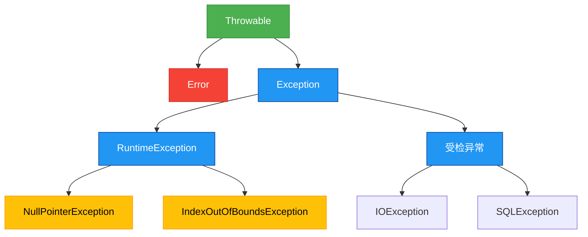

# 基础-异常体系设计

## 概述
异常是程序运行过程中出现的意外情况，Java通过异常处理机制提供了一种结构化的错误处理方式。Java异常体系以`Throwable`为根类，分为`Error`和`Exception`两大分支，其中`Exception`又分为受检异常（Checked Exception）和非受检异常（Unchecked Exception）。



## 知识要点

### 1. 异常体系结构
Java异常体系的核心类层次结构如下：
- `Throwable`: 所有错误和异常的父类，包含异常信息和堆栈跟踪
- `Error`: 表示严重错误，如`OutOfMemoryError`，程序通常无法恢复
- `Exception`: 表示程序可以处理的异常
  - `RuntimeException`: 非受检异常，编译器不强制捕获
  - 其他Exception子类: 受检异常，编译器强制要求捕获或声明抛出

### 2. 异常的分类
- **受检异常（Checked Exception）**: 编译期检查的异常，必须显式捕获或声明抛出，如`IOException`、`ClassNotFoundException`
- **非受检异常（Unchecked Exception）**: 运行时异常，编译器不强制处理，通常由程序逻辑错误导致，如`NullPointerException`、`ArrayIndexOutOfBoundsException`

### 3. 异常的基本使用
```java
import java.io.FileInputStream;
import java.io.FileNotFoundException;
import java.io.IOException;

/**
 * 异常处理基本示例
 */
public class ExceptionBasicExample {
    
    /**
     * 读取文件内容
     * @param filePath 文件路径
     * @throws FileNotFoundException 如果文件不存在
     * @throws IOException 如果读取文件时发生错误
     */
    public void readFile(String filePath) throws FileNotFoundException, IOException {
        FileInputStream fis = null;
        try {
            fis = new FileInputStream(filePath);
            int data = fis.read();
            while (data != -1) {
                System.out.print((char) data);
                data = fis.read();
            }
        } finally {
            // 确保资源关闭
            if (fis != null) {
                try {
                    fis.close();
                } catch (IOException e) {
                    e.printStackTrace();
                }
            }
        }
    }
    
    /**
     * 演示运行时异常
     */
    public void demonstrateRuntimeException() {
        String str = null;
        // 会抛出NullPointerException，无需显式捕获
        System.out.println(str.length());
    }
}
```

## 知识扩展

### 设计思想
异常体系设计遵循了以下原则：
1. **层次化**: 通过类继承构建异常体系，便于分类和处理
2. **区分错误类型**: 将严重错误(Error)与普通异常(Exception)分离
3. **编译时检查**: 受检异常确保程序员处理可预见的错误
4. **异常链**: 支持异常包装，保留原始异常信息

### 避坑指南
1. **避免捕获Exception基类**: 这会隐藏潜在错误，应该捕获具体异常
2. **不要忽略异常**: 空的catch块会导致错误被掩盖
3. **资源释放**: 使用try-finally或try-with-resources确保资源正确释放
4. **异常信息**: 提供有意义的异常消息，便于调试
5. **不要在finally中使用return**: 会覆盖try或catch中的return值

### 深度思考题
**思考题**: 为什么Java将异常分为受检异常和非受检异常？这种设计有什么优缺点？

**思考题回答**: Java的异常分类设计基于错误的可预测性和处理责任。受检异常用于表示可预见且应该处理的错误（如文件操作），强制程序员处理这些情况，提高了代码健壮性。非受检异常用于表示编程错误（如空指针），这类错误通常应该在开发阶段修复，而非运行时处理。

优点：提高代码可靠性，强制处理可预见错误，使异常处理更加结构化。
缺点：有时过度使用受检异常会导致代码臃肿（如IO操作），程序员可能会用空catch块简单规避，反而降低代码质量。Java 8的Stream API和Lambda表达式更倾向于使用非受检异常，反映了设计思想的演变。