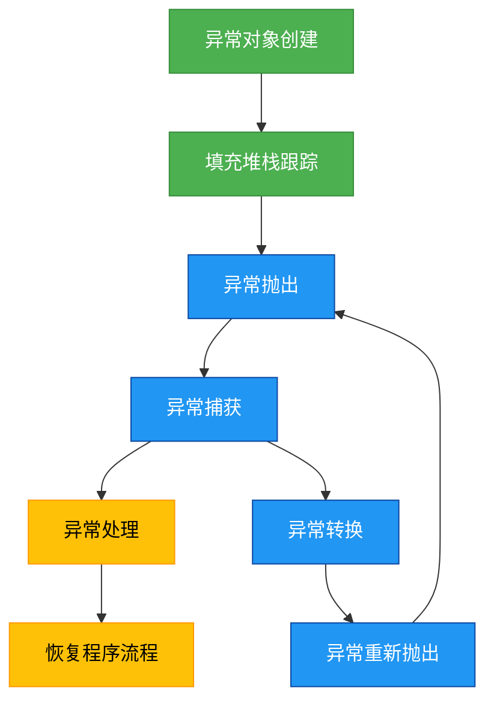

# 深化-深入理解异常

## 概述
深入理解异常处理需要掌握异常的底层实现机制、异常链传递、自定义异常设计以及异常对性能的影响。本章将从JVM层面解析异常处理原理，探讨异常链的构建与使用，指导如何设计高质量的自定义异常，并分析异常处理的性能考量。



## 知识要点

### 1. 异常的底层实现机制
JVM通过异常表（Exception Table）实现异常处理，当异常发生时，JVM会在当前方法的异常表中查找匹配的catch块。异常表包含以下信息：
- from: 可能抛出异常的起始字节码索引
- to: 可能抛出异常的结束字节码索引
- target: 异常处理代码的起始字节码索引
- type: 捕获的异常类型

```java
/**
 * 演示异常表机制
 */
public class ExceptionTableDemo {
    public void process() {
        try {
            riskyOperation();
        } catch (IOException e) {
            handleException(e);
        } catch (SQLException e) {
            handleException(e);
        }
    }
    
    private void riskyOperation() throws IOException, SQLException {
        // 可能抛出异常的操作
    }
    
    private void handleException(Exception e) {
        // 异常处理
    }
}
```
编译后，process()方法的异常表会包含两个条目，分别对应IOException和SQLException的捕获范围。

### 2. 堆栈跟踪（Stack Trace）
堆栈跟踪记录了异常发生时的方法调用链，通过`Throwable.getStackTrace()`获取。JVM在创建异常对象时自动填充堆栈信息，这一过程会遍历调用栈，存在一定性能开销。

```java
/**
 * 堆栈跟踪使用示例
 */
public class StackTraceDemo {
    public static void main(String[] args) {
        try {
            methodA();
        } catch (Exception e) {
            System.out.println("异常信息:");
            e.printStackTrace();
            
            System.out.println("\n堆栈跟踪元素:");
            StackTraceElement[] stackTrace = e.getStackTrace();
            for (StackTraceElement element : stackTrace) {
                System.out.println(element.getClassName() + "." + element.getMethodName() + ":" + element.getLineNumber());
            }
        }
    }
    
    private static void methodA() {
        methodB();
    }
    
    private static void methodB() {
        methodC();
    }
    
    private static void methodC() {
        throw new RuntimeException("演示堆栈跟踪");
    }
}
```

### 3. 异常链（Exception Chaining）
异常链用于包装原始异常，传递底层错误信息，同时提供高层异常语义。通过`initCause()`方法或构造函数参数设置原因异常。

```java
/**
 * 异常链示例
 */
public class ExceptionChainingDemo {
    public void businessOperation() throws BusinessException {
        try {
            dataAccessOperation();
        } catch (SQLException e) {
            // 包装原始异常，传递业务异常
            BusinessException be = new BusinessException("业务操作失败");
            be.initCause(e);
            throw be;
        }
    }
    
    private void dataAccessOperation() throws SQLException {
        throw new SQLException("数据库连接失败");
    }
    
    // 自定义业务异常
    static class BusinessException extends Exception {
        public BusinessException(String message) {
            super(message);
        }
    }
}
```

### 4. 自定义异常设计
设计高质量自定义异常应遵循以下原则：
- 选择合适的父类（受检或非受检）
- 提供有意义的异常消息
- 包含必要的错误码和上下文信息
- 实现序列化接口（Serializable）

```java
import java.io.Serializable;

/**
 * 自定义业务异常示例
 */
public class OrderException extends Exception implements Serializable {
    // 错误码
    private final int errorCode;
    // 订单ID
    private final String orderId;
    
    public OrderException(String message, int errorCode, String orderId) {
        super(message);
        this.errorCode = errorCode;
        this.orderId = orderId;
    }
    
    public OrderException(String message, Throwable cause, int errorCode, String orderId) {
        super(message, cause);
        this.errorCode = errorCode;
        this.orderId = orderId;
    }
    
    // Getters
    public int getErrorCode() { return errorCode; }
    public String getOrderId() { return orderId; }
}
```

## 知识扩展

### 设计思想
异常处理的核心设计思想包括：
1. **责任分离**: 异常的产生者负责抛出异常，调用者负责处理异常
2. **信息完整**: 异常应包含足够的上下文信息，便于问题定位
3. **异常转换**: 底层技术异常应转换为高层业务异常，隐藏实现细节
4. **异常聚合**: 将多个相关异常聚合为一个复合异常，简化异常处理

### 避坑指南
1. **避免过度使用异常**: 不要用异常控制正常业务流程，这会影响性能
2. **谨慎使用异常链**: 避免创建过长的异常链，增加调试复杂度
3. **堆栈跟踪开销**: 异常创建时的堆栈填充是昂贵操作，高频场景需优化
4. **序列化问题**: 自定义异常如需要跨进程传输，必须正确实现序列化
5. **异常匹配规则**: catch块顺序应从具体到一般，否则特定异常会被父类异常捕获

### 深度思考题
**思考题**: 为什么在高性能系统中应避免在循环中创建异常对象？如何优化频繁异常场景的性能？

**思考题回答**: 在循环中创建异常对象会导致频繁的堆栈跟踪生成和内存分配，严重影响性能。异常对象创建时，JVM需要遍历当前线程的调用栈并记录每个栈帧信息，这是一个O(n)操作。

优化方案：
1. **异常缓存**: 对于频繁发生的已知异常，可以缓存异常对象（注意线程安全）
2. **预检查机制**: 在可能抛出异常前进行条件检查，避免异常发生
3. **状态码模式**: 对于高频操作，使用状态码代替异常传递错误信息
4. **延迟异常创建**: 仅在确实需要抛出异常时才创建异常对象
5. **异常抑制**: Java 7+提供addSuppressed()方法，可将多个异常关联到一个主异常

示例代码（预检查优化）：
```java
// 低效方式
public int getValue(List<Integer> list, int index) {
    try {
        return list.get(index);
    } catch (IndexOutOfBoundsException e) {
        return -1; // 高频场景下性能差
    }
}

// 优化方式
public int getValueOptimized(List<Integer> list, int index) {
    if (index < 0 || index >= list.size()) {
        return -1; // 预检查避免异常
    }
    return list.get(index);
}
```