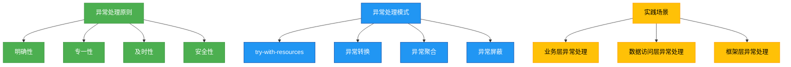

# 进阶-异常处理最佳实践

## 概述

异常处理最佳实践是构建健壮Java应用的关键环节，它涉及异常的合理抛出、捕获、处理和日志记录等方面。本章将系统介绍异常处理的设计原则、实用模式以及在不同场景下的最佳实践，帮助开发者编写更具可维护性和可靠性的代码。



## 知识要点

### 1. 异常处理的核心原则

#### 1.1 明确性原则
异常应该准确反映问题本质，异常消息应包含具体上下文信息，避免模糊不清的描述。

```java
/**
 * 明确异常示例
 */
public void transferMoney(Account from, Account to, BigDecimal amount) {
    if (amount.compareTo(BigDecimal.ZERO) <= 0) {
        // 异常消息包含具体金额信息，便于问题定位
        throw new IllegalArgumentException("转账金额必须为正数: " + amount);
    }
    if (from.getBalance().compareTo(amount) < 0) {
        // 包含账户ID和余额信息
        throw new InsufficientFundsException(
            String.format("账户%s余额不足，当前余额: %s, 需要: %s",
            from.getId(), from.getBalance(), amount)
        );
    }
    // 执行转账逻辑
}
```

#### 1.2 专一性原则
每个方法应只抛出与其职责相关的特定异常，避免抛出过于宽泛的异常类型。

```java
/**
 * 专一性异常示例 - 反面教材
 */
public void processOrder(Order order) throws Exception { // 不推荐: 抛出过于宽泛的Exception
    // 处理订单逻辑
}

/**
 * 专一性异常示例 - 推荐做法
 */
public void processOrder(Order order) 
    throws OrderNotFoundException, InvalidOrderStatusException, PaymentFailedException {
    // 处理订单逻辑
}
```

#### 1.3 及时性原则
异常应在错误发生时立即抛出，避免在后续处理中丢失上下文信息。

```java
/**
 * 及时性原则示例
 */
public Product findProduct(String productId) {
    if (productId == null || productId.trim().isEmpty()) {
        // 立即抛出异常，不继续执行
        throw new IllegalArgumentException("产品ID不能为空");
    }
    Product product = productRepository.findById(productId);
    if (product == null) {
        // 发现问题立即抛出
        throw new ProductNotFoundException("产品不存在: " + productId);
    }
    return product;
}
```

### 2. 异常处理实用模式

#### 2.1 try-with-resources自动资源管理
JDK7引入的try-with-resources语句可以自动关闭实现AutoCloseable接口的资源，避免资源泄漏。

```java
/**
 * try-with-resources使用示例
 */
public String readFileContent(String filePath) throws IOException {
    // 资源会自动关闭，无需手动finally块
    try (FileInputStream fis = new FileInputStream(filePath);
         BufferedReader br = new BufferedReader(new InputStreamReader(fis, StandardCharsets.UTF_8))) {
        StringBuilder content = new StringBuilder();
        String line;
        while ((line = br.readLine()) != null) {
            content.append(line).append(System.lineSeparator());
        }
        return content.toString();
    }
    // 无需显式关闭资源
}
```

#### 2.2 异常转换模式
将底层技术异常转换为高层业务异常，隐藏实现细节，同时保留原始异常信息。

```java
/**
 * 异常转换示例
 */
public Order getOrder(String orderId) {
    try {
        return orderDao.findById(orderId);
    } catch (SQLException e) {
        // 将SQL异常转换为业务异常，保留原始异常作为原因
        throw new DataAccessException(
            "获取订单信息失败: " + orderId, e);
    }
}
```

#### 2.3 异常聚合模式
在批量操作中，收集多个异常并聚合为一个复合异常，避免单个异常导致整个操作失败。

```java
/**
 * 异常聚合示例
 */
public void batchProcess(List<Order> orders) {
    List<OrderProcessingException> exceptions = new ArrayList<>();
    
    for (Order order : orders) {
        try {
            processSingleOrder(order);
        } catch (Exception e) {
            // 收集异常而非立即抛出
            exceptions.add(new OrderProcessingException(
                "处理订单失败: " + order.getId(), e));
        }
    }
    
    if (!exceptions.isEmpty()) {
        // 聚合多个异常并抛出
        throw new BatchProcessingException(
            "批量处理失败，共" + exceptions.size() + "个订单处理异常", exceptions);
    }
}
```

### 3. 不同层级的异常处理策略

#### 3.1 业务层异常处理
业务层应抛出有业务含义的异常，由上层统一处理。

```java
/**
 * 业务层异常处理示例
 */
@Service
public class OrderService {
    
    @Autowired
    private PaymentService paymentService;
    
    public OrderResult createOrder(OrderRequest request) {
        // 业务规则验证
        validateOrderRequest(request);
        
        try {
            // 调用支付服务
            PaymentResult paymentResult = paymentService.processPayment(
                request.getUserId(), request.getAmount());
            
            if (!paymentResult.isSuccess()) {
                throw new PaymentFailedException(
                    "支付失败: " + paymentResult.getErrorCode(),
                    paymentResult.getErrorCode());
            }
            
            // 创建订单
            Order order = createOrderRecord(request, paymentResult);
            return new OrderResult(order.getId(), OrderStatus.SUCCESS);
        } catch (PaymentServiceUnavailableException e) {
            // 特定异常处理
            log.error("支付服务不可用", e);
            throw new ServiceUnavailableException("支付服务暂时不可用，请稍后重试");
        }
    }
}
```

#### 3.2 控制器层异常统一处理
使用Spring的@ControllerAdvice统一处理控制器层异常，返回友好响应。

```java
/**
 * 全局异常处理器
 */
@ControllerAdvice
public class GlobalExceptionHandler {
    
    private static final Logger log = LoggerFactory.getLogger(GlobalExceptionHandler.class);
    
    @ExceptionHandler(BusinessException.class)
    @ResponseBody
    public ApiResponse handleBusinessException(BusinessException e) {
        // 业务异常，返回友好消息
        return ApiResponse.fail(e.getErrorCode(), e.getMessage());
    }
    
    @ExceptionHandler(ResourceNotFoundException.class)
    @ResponseStatus(HttpStatus.NOT_FOUND)
    @ResponseBody
    public ApiResponse handleResourceNotFound(ResourceNotFoundException e) {
        // 资源未找到异常
        return ApiResponse.fail(404, e.getMessage());
    }
    
    @ExceptionHandler(Exception.class)
    @ResponseStatus(HttpStatus.INTERNAL_SERVER_ERROR)
    @ResponseBody
    public ApiResponse handleGenericException(Exception e) {
        // 未捕获的异常，记录日志
        log.error("未处理的异常", e);
        return ApiResponse.fail(500, "系统繁忙，请稍后重试");
    }
}
```

## 知识扩展

### 设计思想

异常处理的设计思想主要基于以下几个核心概念：

1. **责任分离**：异常的产生者负责抛出准确的异常，调用者负责适当处理异常
2. **信息完整**：异常应包含足够的上下文信息，便于问题诊断和修复
3. **关注点分离**：业务逻辑与错误处理分离，提高代码可读性和可维护性
4. **防御式编程**：在可能出错的地方进行预判和保护，但不过度使用异常控制流程

### 避坑指南

1. **避免过度使用try-catch**
不要在循环内部使用try-catch，这会严重影响性能。应将try-catch放在循环外部，或重构代码避免频繁异常。

```java
// 不推荐
for (String id : ids) {
    try {
        process(id);
    } catch (ProcessingException e) {
        // 处理异常
    }
}

// 推荐
List<String> failedIds = new ArrayList<>();
for (String id : ids) {
    if (!canProcess(id)) { // 预检查
        failedIds.add(id);
        continue;
    }
    try {
        process(id);
    } catch (ProcessingException e) {
        failedIds.add(id);
        log.error("处理{}失败", id, e);
    }
}
```

2. **不要忽略异常**
空的catch块会隐藏错误，导致问题难以诊断。至少应记录异常信息。

```java
// 不推荐
try {
    riskyOperation();
} catch (Exception e) {
    // 空catch块，隐藏错误
}

// 推荐
try {
    riskyOperation();
} catch (Exception e) {
    log.error("执行风险操作失败", e);
    // 或者重新抛出包装后的异常
    throw new ServiceException("操作失败，请联系管理员", e);
}
```

3. **正确使用finally块**
finally块用于释放资源，但不应在finally中使用return语句，这会覆盖try或catch中的返回值。

```java
// 错误示例
public boolean process() {
    try {
        return true;
    } finally {
        return false; // 这会覆盖try中的return
    }
}

// 正确示例
public boolean process() {
    boolean success = false;
    try {
        // 处理逻辑
        success = true;
    } finally {
        // 释放资源
        cleanup();
    }
    return success;
}
```

### 深度思考题

**思考题**：在微服务架构中，如何设计跨服务的异常处理策略？如何保证异常信息在服务间传递的完整性和安全性？

**思考题回答**：在微服务架构中，跨服务异常处理需要考虑以下几点：

1. **统一异常响应格式**：定义跨服务的标准异常响应格式，包含错误码、消息、时间戳和请求ID等信息

2. **异常传递机制**：使用Feign等客户端时，通过Decoder捕获远程服务异常并转换为本地异常

```java
public class FeignErrorDecoder implements ErrorDecoder {
    @Override
    public Exception decode(String methodKey, Response response) {
        try {
            ErrorResponse error = new ObjectMapper().readValue(
                response.body().asInputStream(), ErrorResponse.class);
            return new RemoteServiceException(
                error.getCode(), error.getMessage(), error.getRequestId());
        } catch (Exception e) {
            return new ServiceCommunicationException(
                "服务通信异常: " + response.status());
        }
    }
}
```

3. **分布式追踪**：集成Sleuth和Zipkin等工具，在异常中包含追踪ID，便于跨服务问题定位

4. **安全考虑**：异常信息不应包含敏感数据，在API网关层对异常信息进行过滤和脱敏

5. **熔断降级**：结合Resilience4j或Hystrix等框架，当依赖服务异常时执行降级策略

6. **异常聚合**：在BFF层聚合多个微服务的异常信息，返回统一的用户友好响应

通过这些策略，可以在保证异常信息完整性的同时，确保系统的安全性和可靠性，为用户提供一致的错误体验。