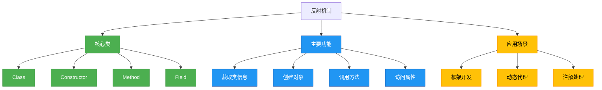

# 基础-反射机制原理

## 概述

反射是Java语言的一种强大特性，它允许程序在运行时动态获取类的信息并操作类的属性、方法和构造函数。通过反射，我们可以打破封装性，访问私有成员，实现框架的灵活配置和动态代理等高级功能。本章节将深入解析反射的底层原理、核心API及其基本使用方法。



## 知识要点

### 1. 反射的核心类与获取方式

#### 1.1 Class类
Class类是反射机制的入口，它代表一个类的字节码文件，包含了类的所有信息。获取Class对象有三种常用方式：

```java
/**
 * Class对象的三种获取方式
 */
public class ClassObjectDemo {
    public static void main(String[] args) throws ClassNotFoundException {
        // 方式1：通过类名.class获取（编译期确定）
        Class<?> clazz1 = User.class;
        System.out.println("方式1: " + clazz1.getName());

        // 方式2：通过对象.getClass()获取（运行期确定）
        User user = new User();
        Class<?> clazz2 = user.getClass();
        System.out.println("方式2: " + clazz2.getName());

        // 方式3：通过Class.forName()获取（动态加载类）
        Class<?> clazz3 = Class.forName("com.example.reflection.User");
        System.out.println("方式3: " + clazz3.getName());

        // 验证三种方式获取的是同一个Class对象
        System.out.println("clazz1 == clazz2: " + (clazz1 == clazz2));
        System.out.println("clazz1 == clazz3: " + (clazz1 == clazz3));
    }
}

class User {
    private String name;
    private int age;

    // 省略getter和setter方法
}
```

#### 1.2 反射核心API
Java反射API主要包含在java.lang.reflect包中，核心类包括：
- **Constructor**：类的构造方法
- **Method**：类的方法
- **Field**：类的属性
- **Modifier**：访问修饰符工具类
- **Parameter**：方法参数（JDK8+）

### 2. 反射的基本操作

#### 2.1 获取类的基本信息
通过Class对象可以获取类的完整信息，包括类名、父类、接口、注解等：

```java
import java.lang.annotation.Annotation;
import java.lang.reflect.Modifier;

/**
 * 获取类的基本信息
 */
public class ClassInfoDemo {
    public static void main(String[] args) {
        Class<?> clazz = User.class;

        // 获取类名
        System.out.println("类名: " + clazz.getName());
        System.out.println("简单类名: " + clazz.getSimpleName());

        // 获取修饰符
        int modifiers = clazz.getModifiers();
        System.out.println("修饰符: " + Modifier.toString(modifiers));

        // 获取父类
        Class<?> superClass = clazz.getSuperclass();
        System.out.println("父类: " + (superClass != null ? superClass.getName() : "无"));

        // 获取实现的接口
        Class<?>[] interfaces = clazz.getInterfaces();
        System.out.println("实现的接口: ");
        for (Class<?> inter : interfaces) {
            System.out.println("- " + inter.getName());
        }

        // 获取类注解
        Annotation[] annotations = clazz.getAnnotations();
        System.out.println("类注解: ");
        for (Annotation anno : annotations) {
            System.out.println("- " + anno.annotationType().getName());
        }
    }
}

@Deprecated
class User implements Cloneable {
    private String name;
    private int age;

    // 省略getter和setter方法
}
```

#### 2.2 创建对象
通过反射可以使用构造方法创建对象，包括无参构造和有参构造：

```java
import java.lang.reflect.Constructor;

/**
 * 通过反射创建对象
 */
public class ObjectCreationDemo {
    public static void main(String[] args) throws Exception {
        Class<?> clazz = User.class;

        // 1. 使用无参构造创建对象（需要类有无参构造）
        User user1 = (User) clazz.newInstance();
        user1.setName("张三");
        user1.setAge(20);
        System.out.println("无参构造创建: " + user1.getName() + ", " + user1.getAge());

        // 2. 使用有参构造创建对象
        Constructor<?> constructor = clazz.getConstructor(String.class, int.class);
        User user2 = (User) constructor.newInstance("李四", 25);
        System.out.println("有参构造创建: " + user2.getName() + ", " + user2.getAge());

        // 3. 使用私有构造创建对象
        Constructor<?> privateConstructor = clazz.getDeclaredConstructor(String.class);
        privateConstructor.setAccessible(true); // 暴力访问私有构造
        User user3 = (User) privateConstructor.newInstance("王五");
        user3.setAge(30);
        System.out.println("私有构造创建: " + user3.getName() + ", " + user3.getAge());
    }
}

class User {
    private String name;
    private int age;

    // 无参构造
    public User() {}

    // 有参构造
    public User(String name, int age) {
        this.name = name;
        this.age = age;
    }

    // 私有构造
    private User(String name) {
        this.name = name;
    }

    // getter和setter
    public String getName() { return name; }
    public void setName(String name) { this.name = name; }
    public int getAge() { return age; }
    public void setAge(int age) { this.age = age; }
}
```

#### 2.3 调用方法
反射可以调用类的方法，包括公有方法、私有方法和静态方法：

```java
import java.lang.reflect.Method;

/**
 * 通过反射调用方法
 */
public class MethodInvocationDemo {
    public static void main(String[] args) throws Exception {
        Class<?> clazz = User.class;
        User user = new User("张三", 20);

        // 1. 调用公有方法
        Method setNameMethod = clazz.getMethod("setName", String.class);
        setNameMethod.invoke(user, "张三三");
        System.out.println("调用公有方法后: " + user.getName());

        Method getNameMethod = clazz.getMethod("getName");
        String name = (String) getNameMethod.invoke(user);
        System.out.println("获取姓名: " + name);

        // 2. 调用私有方法
        Method privateMethod = clazz.getDeclaredMethod("privateMethod");
        privateMethod.setAccessible(true); // 暴力访问私有方法
        privateMethod.invoke(user);

        // 3. 调用静态方法
        Method staticMethod = clazz.getMethod("staticMethod");
        staticMethod.invoke(null); // 静态方法调用时，对象参数为null

        // 4. 调用带返回值的方法
        Method calculateMethod = clazz.getMethod("calculate", int.class, int.class);
        int result = (int) calculateMethod.invoke(user, 10, 20);
        System.out.println("计算结果: " + result);
    }
}

class User {
    private String name;
    private int age;

    public User(String name, int age) {
        this.name = name;
        this.age = age;
    }

    public String getName() { return name; }
    public void setName(String name) { this.name = name; }
    public int getAge() { return age; }
    public void setAge(int age) { this.age = age; }

    // 私有方法
    private void privateMethod() {
        System.out.println("调用了私有方法");
    }

    // 静态方法
    public static void staticMethod() {
        System.out.println("调用了静态方法");
    }

    // 带返回值的方法
    public int calculate(int a, int b) {
        return a + b;
    }
}
```

#### 2.4 访问属性
反射可以获取和修改类的属性值，包括私有属性：

```java
import java.lang.reflect.Field;

/**
 * 通过反射访问属性
 */
public class FieldAccessDemo {
    public static void main(String[] args) throws Exception {
        Class<?> clazz = User.class;
        User user = new User("张三", 20);

        // 1. 获取公有属性
        Field publicField = clazz.getField("publicField");
        System.out.println("公有属性值: " + publicField.get(user));
        publicField.set(user, "修改后的公有属性");
        System.out.println("修改后公有属性值: " + publicField.get(user));

        // 2. 获取私有属性
        Field nameField = clazz.getDeclaredField("name");
        nameField.setAccessible(true); // 暴力访问私有属性
        System.out.println("私有属性name值: " + nameField.get(user));
        nameField.set(user, "李四");
        System.out.println("修改后name值: " + nameField.get(user));

        Field ageField = clazz.getDeclaredField("age");
        ageField.setAccessible(true);
        System.out.println("私有属性age值: " + ageField.get(user));
        ageField.setInt(user, 25);
        System.out.println("修改后age值: " + ageField.get(user));

        // 3. 获取静态属性
        Field staticField = clazz.getField("staticField");
        System.out.println("静态属性值: " + staticField.get(null)); // 静态属性获取时，对象参数为null
        staticField.set(null, "修改后的静态属性");
        System.out.println("修改后静态属性值: " + staticField.get(null));
    }
}

class User {
    private String name;
    private int age;
    public String publicField = "公有属性";
    public static String staticField = "静态属性";

    public User(String name, int age) {
        this.name = name;
        this.age = age;
    }
}
```

## 知识扩展

### 设计思想

反射机制体现了Java的动态性和灵活性，其设计思想主要包括：

1. **开-闭原则**：通过反射可以在不修改原有代码的情况下，动态扩展程序功能
2. **接口隔离原则**：反射允许基于接口而非具体实现进行编程，降低耦合度
3. **控制反转**：框架通过反射实现对应用程序的控制，如Spring的依赖注入
4. **元数据驱动**：通过反射读取注解等元数据，实现配置与代码的分离

### 避坑指南

使用反射时需要注意以下问题：

1. **性能问题**
反射调用比直接调用慢约10-100倍，因为需要动态解析类信息。解决方法：
- 缓存反射对象（Class、Method、Field等）
- 避免在性能敏感的代码中频繁使用反射
- 使用MethodHandle（JDK7+）替代反射获取更好性能

```java
import java.lang.invoke.MethodHandle;
import java.lang.invoke.MethodHandles;
import java.lang.invoke.MethodType;

/**
 * 使用MethodHandle提高反射性能
 */
public class MethodHandleDemo {
    public static void main(String[] args) throws Throwable {
        User user = new User("张三", 20);
        MethodHandles.Lookup lookup = MethodHandles.lookup();

        // 获取setName方法的MethodHandle
        MethodType methodType = MethodType.methodType(void.class, String.class);
        MethodHandle setNameHandle = lookup.findVirtual(User.class, "setName", methodType);

        // 调用方法
        setNameHandle.invokeExact(user, "张三三");
        System.out.println(user.getName());
    }
}
```

2. **安全问题**
反射可以访问私有成员，破坏封装性。解决方法：
- 在安全管理器（SecurityManager）中限制反射权限
- 谨慎使用setAccessible(true)，避免暴露敏感信息
- 生产环境中对反射调用进行审计和监控

3. **兼容性问题**
反射依赖于类结构，当类发生变化（如方法签名修改）时，反射代码可能会抛出异常。解决方法：
- 尽量使用接口而非具体实现类
- 反射调用时捕获并处理NoSuchMethodException等异常
- 版本升级时进行充分的反射兼容性测试

### 深度思考题

**思考题1**：为什么Java反射可以访问私有成员？这是否违背了Java的封装性原则？

**思考题1回答**：Java反射能够访问私有成员是因为它通过调用setAccessible(true)方法绕过了访问检查。这并不完全违背封装性原则，而是提供了一种灵活的机制，允许在特定场景下（如框架开发、调试工具）访问私有成员。封装性主要是编译期的概念，而反射是运行期的特性，合理使用反射可以在不破坏整体设计的前提下实现高级功能。不过，滥用反射确实会降低代码的可维护性和安全性，因此需要谨慎使用。

**思考题2**：Class对象在JVM中是如何存储的？一个类在JVM中会对应几个Class对象？

**思考题2回答**：Class对象是在类加载过程中由JVM创建的，存储在方法区（Method Area）中。对于同一个类加载器加载的同一个类，JVM中只会有一个Class对象。即使创建多个实例对象，它们的getClass()方法返回的都是同一个Class对象。但是，如果一个类被不同的类加载器加载，即使类名相同，也会产生不同的Class对象，并且这些对象不相等。