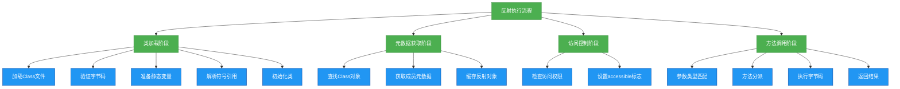

# 理解-反射机制执行的流程

## 概述

反射机制的执行流程是Java动态性的核心体现，它涉及类加载、元数据解析、访问控制和方法调用等多个环节。深入理解反射的执行流程，不仅有助于掌握其底层实现原理，还能帮助开发者优化反射性能、规避潜在风险。本章将从JVM视角详细剖析反射机制的完整执行流程，包括Class对象的生成、成员查找、权限检查和方法调用的底层实现。



## 知识要点

### 1. 类加载与Class对象生成流程

反射的起点是Class对象，它的生成依赖于JVM的类加载机制。完整的类加载流程包括以下阶段：

#### 1.1 类加载的生命周期

```java
/**
 * 演示类加载过程与Class对象生成
 */
public class ClassLoadingDemo {
    public static void main(String[] args) throws Exception {
        // 初始状态：User类未加载
        System.out.println("初始状态: User类未加载");

        // 触发类加载（方式1：Class.forName）
        System.out.println("调用Class.forName加载类...");
        Class<?> clazz = Class.forName("com.example.reflection.User");
        System.out.println("类加载完成，Class对象: " + clazz);

        // 验证Class对象唯一性
        Class<?> clazz2 = User.class;
        System.out.println("通过类名.class获取的Class对象是否相同: " + (clazz == clazz2));
    }
}

class User {
    // 静态代码块，类初始化阶段执行
    static {
        System.out.println("User类初始化阶段执行静态代码块");
    }

    private String name;
    private int age;

    // 省略getter和setter方法
}
```

执行上述代码会输出：
```
初始状态: User类未加载
调用Class.forName加载类...
User类初始化阶段执行静态代码块
类加载完成，Class对象: class com.example.reflection.User
通过类名.class获取的Class对象是否相同: true
```

#### 1.2 Class对象在JVM中的存储
Class对象存储在方法区（Method Area），包含以下关键信息：
- 类的运行时常量池
- 字段信息（Field）
- 方法信息（Method）
- 构造函数信息（Constructor）
- 类加载器引用
- 父类引用
- 接口信息
- 访问修饰符
- 常量池

### 2. 反射成员查找机制

反射获取类成员（方法、字段、构造函数）的过程涉及复杂的查找逻辑，JVM会按照特定规则搜索并返回匹配的成员。

#### 2.1 方法查找流程

```java
import java.lang.reflect.Method;

/**
 * 演示反射方法查找机制
 */
public class MethodLookupDemo {
    public static void main(String[] args) throws Exception {
        Class<?> clazz = User.class;

        // 1. 获取公有方法（包括继承的公有方法）
        Method publicMethod = clazz.getMethod("toString");
        System.out.println("getMethod获取公有方法: " + publicMethod);

        // 2. 获取当前类声明的方法（包括私有方法，但不包括继承的方法）
        Method declaredMethod = clazz.getDeclaredMethod("privateMethod");
        System.out.println("getDeclaredMethod获取声明的方法: " + declaredMethod);

        // 3. 获取所有公有方法
        Method[] publicMethods = clazz.getMethods();
        System.out.println("getMethods获取公有方法数量: " + publicMethods.length);

        // 4. 获取当前类声明的所有方法
        Method[] declaredMethods = clazz.getDeclaredMethods();
        System.out.println("getDeclaredMethods获取声明的方法数量: " + declaredMethods.length);
    }
}

class User {
    private String name;
    private int age;

    public String getName() { return name; }
    public void setName(String name) { this.name = name; }
    public int getAge() { return age; }
    public void setAge(int age) { this.age = age; }

    private void privateMethod() {}
    protected void protectedMethod() {}
    void defaultMethod() {}
}
```

方法查找规则：
1. `getMethod(String name, Class<?>... parameterTypes)`：
   - 首先搜索当前类声明的公有方法
   - 若未找到，递归搜索父类的公有方法
   - 若未找到，搜索实现的接口方法
   - 找到后进行参数类型匹配

2. `getDeclaredMethod(String name, Class<?>... parameterTypes)`：
   - 仅搜索当前类声明的方法（不包括继承的方法）
   - 不检查访问修饰符
   - 找到后进行参数类型匹配

#### 2.2 字段查找流程
字段查找与方法查找类似，但有重要区别：私有字段不会被继承，因此`getDeclaredField`只能找到当前类声明的字段。

```java
import java.lang.reflect.Field;

/**
 * 演示反射字段查找机制
 */
public class FieldLookupDemo {
    public static void main(String[] args) throws Exception {
        Class<?> clazz = User.class;

        // 获取公有字段
        Field publicField = clazz.getField("publicField");
        System.out.println("公有字段: " + publicField);

        // 获取私有字段
        Field privateField = clazz.getDeclaredField("name");
        System.out.println("私有字段: " + privateField);

        // 尝试获取父类私有字段（会抛出异常）
        try {
            Field parentField = clazz.getDeclaredField("parentField");
            System.out.println("父类私有字段: " + parentField);
        } catch (NoSuchFieldException e) {
            System.out.println("无法获取父类私有字段: " + e.getMessage());
        }
    }
}

class Parent {
    private String parentField;
}

class User extends Parent {
    private String name;
    private int age;
    public String publicField;
}
```

### 3. 反射调用的底层实现

反射调用方法的底层实现与直接方法调用有显著差异，涉及更多的运行时检查和动态分派。

#### 3.1 反射调用与直接调用的区别

```java
import java.lang.reflect.Method;

/**
 * 比较反射调用与直接调用的区别
 */
public class ReflectionPerformanceDemo {
    private static final int ITERATIONS = 10_000_000;
    private final User user = new User();

    public static void main(String[] args) throws Exception {
        ReflectionPerformanceDemo demo = new ReflectionPerformanceDemo();

        // 直接调用
        long directTime = demo.testDirectCall();
        System.out.println("直接调用耗时: " + directTime + "ms");

        // 反射调用（未优化）
        long reflectionTime = demo.testReflectionCall(false);
        System.out.println("反射调用(未优化)耗时: " + reflectionTime + "ms");

        // 反射调用（优化后）
        long optimizedReflectionTime = demo.testReflectionCall(true);
        System.out.println("反射调用(优化后)耗时: " + optimizedReflectionTime + "ms");
    }

    // 直接调用测试
    public long testDirectCall() {
        long start = System.currentTimeMillis();
        for (int i = 0; i < ITERATIONS; i++) {
            user.setName("test" + i);
        }
        return System.currentTimeMillis() - start;
    }

    // 反射调用测试
    public long testReflectionCall(boolean optimize) throws Exception {
        Method method = User.class.getMethod("setName", String.class);
        if (optimize) {
            method.setAccessible(true); // 关闭访问检查
        }

        long start = System.currentTimeMillis();
        for (int i = 0; i < ITERATIONS; i++) {
            method.invoke(user, "test" + i);
        }
        return System.currentTimeMillis() - start;
    }
}

class User {
    private String name;
    public void setName(String name) { this.name = name; }
}
```

典型输出（不同环境可能有差异）：
```
直接调用耗时: 5ms
反射调用(未优化)耗时: 850ms
反射调用(优化后)耗时: 320ms
```

性能差异原因：
1. 直接调用在编译期确定方法，执行效率高
2. 反射调用需要：
   - 运行时验证方法参数类型
   - 检查访问权限
   - 动态分派方法
   - 可能的安全管理器检查

#### 3.2 反射调用的字节码实现
反射调用最终通过`Method.invoke()`方法实现，其底层依赖于JVM的`invokevirtual`或`invokeinterface`指令。JDK源码中，`Method.invoke()`的实现如下（简化版）：

```java
public Object invoke(Object obj, Object... args) throws ... {
    // 检查访问权限
    if (!override) {
        if (!Reflection.quickCheckMemberAccess(clazz, modifiers)) {
            Class<?> caller = Reflection.getCallerClass();
            checkAccess(caller, clazz, obj, modifiers);
        }
    }
    // 方法调用的实际实现
    MethodAccessor ma = methodAccessor;
    if (ma == null) {
        ma = acquireMethodAccessor();
    }
    // 调用MethodAccessor实现
    return ma.invoke(obj, args);
}
```

`MethodAccessor`有两个实现：
- `NativeMethodAccessorImpl`：本地实现，初始调用使用
- `DelegatingMethodAccessorImpl`：动态生成字节码实现，调用次数超过阈值（默认15次）后切换，提供更好性能

### 4. 反射中的访问控制

Java反射机制提供了访问私有成员的能力，但这需要绕过JVM的访问控制检查。

#### 4.1 AccessibleObject与访问控制
`AccessibleObject`是Field、Method和Constructor的父类，提供了`setAccessible(boolean)`方法来启用/禁用访问检查。

```java
import java.lang.reflect.Field;
import java.lang.reflect.Method;

/**
 * 演示反射访问控制机制
 */
public class AccessControlDemo {
    public static void main(String[] args) throws Exception {
        User user = new User("张三", 20);
        Class<?> clazz = User.class;

        // 访问私有字段
        Field nameField = clazz.getDeclaredField("name");
        // nameField.setAccessible(true); // 不设置会抛出IllegalAccessException
        try {
            System.out.println("私有字段值: " + nameField.get(user));
        } catch (IllegalAccessException e) {
            System.out.println("访问私有字段失败: " + e.getMessage());
            nameField.setAccessible(true);
            System.out.println("设置setAccessible(true)后的值: " + nameField.get(user));
        }

        // 访问私有方法
        Method privateMethod = clazz.getDeclaredMethod("privateMethod");
        privateMethod.setAccessible(true);
        privateMethod.invoke(user);
    }
}

class User {
    private String name;
    private int age;

    public User(String name, int age) {
        this.name = name;
        this.age = age;
    }

    private void privateMethod() {
        System.out.println("调用私有方法成功");
    }
}
```

#### 4.2 安全管理器对反射的限制
当Java安全管理器（SecurityManager）启用时，反射访问私有成员可能会被阻止，即使调用了`setAccessible(true)`。

```java
/**
 * 安全管理器对反射的限制示例
 */
public class SecurityManagerDemo {
    public static void main(String[] args) {
        // 设置安全管理器
        System.setSecurityManager(new SecurityManager() {
            @Override
            public void checkPermission(Permission perm) {
                // 拒绝反射访问权限
                if (perm instanceof ReflectPermission) {
                    throw new SecurityException("反射访问被拒绝");
                }
            }
        });

        try {
            User user = new User();
            Field field = User.class.getDeclaredField("name");
            field.setAccessible(true); // 会抛出SecurityException
            field.set(user, "测试");
        } catch (Exception e) {
            System.out.println("反射操作失败: " + e.getMessage());
        }
    }
}

class User {
    private String name;
}
```

## 知识扩展

### 设计思想

反射机制的设计体现了以下重要思想：

1. **动态性与静态性平衡**：Java是静态类型语言，但反射提供了动态操作能力，平衡了静态类型检查的安全性和动态编程的灵活性

2. **元数据驱动设计**：反射允许程序通过元数据（类信息、注解等）驱动行为，实现配置与代码分离，这是Spring、Hibernate等框架的核心设计思想

3. **开闭原则**：通过反射，框架可以在不修改自身代码的情况下支持新的用户类，如Spring可以管理任何标注了@Component的类

4. **代理模式的基础**：动态代理（如JDK动态代理）完全基于反射实现，允许在运行时创建代理类，为方法调用提供横切关注点（AOP）支持

### 避坑指南

使用反射时需要特别注意以下问题：

1. **性能优化策略**
   - **缓存反射对象**：Class、Method、Field等对象创建成本高，应缓存重用
   ```java
   // 缓存反射对象的示例
   public class ReflectionCacheDemo {
       // 缓存Method对象
       private static final Method SET_NAME_METHOD;
       
       static {
           try {
               SET_NAME_METHOD = User.class.getMethod("setName", String.class);
               SET_NAME_METHOD.setAccessible(true); // 提前设置访问权限
           } catch (NoSuchMethodException e) {
               throw new RuntimeException(e);
           }
       }
       
       public void updateName(User user, String name) throws Exception {
           SET_NAME_METHOD.invoke(user, name); // 直接使用缓存的Method
       }
   }
   ```
   - **使用MethodHandle**：JDK7引入的MethodHandle比反射性能更好
   - **批量操作**：减少反射调用次数，尽量批量处理
   - **避免在循环中使用反射**：循环内反射调用性能开销大

2. **安全风险防范**
   - **最小权限原则**：仅对必要的反射操作设置setAccessible(true)
   - **输入验证**：反射操作的类名、方法名等参数应严格验证，防止恶意输入
   - **安全管理器**：生产环境可通过安全管理器限制反射权限
   - **审计日志**：记录反射调用，特别是私有成员访问

3. **兼容性处理**
   - **处理类结构变化**：反射依赖类结构，当类发生变化时可能抛出异常
   ```java
   // 安全的反射调用示例
   public void safeInvoke(User user, String methodName) {
       try {
           Method method = User.class.getMethod(methodName);
           method.invoke(user);
       } catch (NoSuchMethodException e) {
           log.error("方法不存在: {}", methodName, e);
           // 提供降级策略
           fallbackMethod(user);
       } catch (Exception e) {
           log.error("反射调用失败", e);
       }
   }
   ```
   - **版本适配**：不同JDK版本反射行为可能不同，需测试验证
   - **避免依赖私有API**：私有API可能在未来版本中移除

### 深度思考题

**思考题1**：JDK动态代理为什么只能代理接口而不能代理类？这与反射机制有什么关系？

**思考题1回答**：JDK动态代理基于接口实现，主要原因有两点：一是Java不支持多继承，如果动态生成的代理类已经继承了Proxy类，就无法再继承其他类；二是接口通常定义了契约，代理模式的目的是增强接口实现的功能。反射在动态代理中扮演关键角色：Proxy.newProxyInstance()通过反射创建代理类实例，InvocationHandler.invoke()通过反射调用目标方法。CGLIB可以代理类是因为它使用字节码生成技术创建目标类的子类，而非反射直接实现。

**思考题2**：为什么反射调用在JDK9及以上版本中对模块化类的访问会受到限制？如何解决？

**思考题2回答**：JDK9引入的模块系统（JPMS）加强了封装性，默认情况下模块不会导出其内部包，即使使用反射也无法访问未导出包中的类。解决方法有：1. 在module-info.java中使用exports语句导出包；2. 使用opens语句允许反射访问未导出包；3. 添加--add-opens命令行参数（如--add-opens java.base/java.lang=ALL-UNNAMED）临时开放访问。这种限制体现了Java对安全性和封装性的重视，即使反射也不能随意打破模块边界。