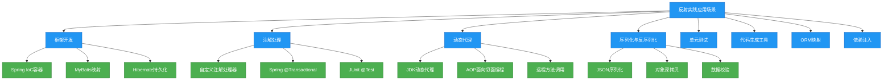

# 进阶-反射在实践中的应用

## 概述

反射机制作为Java语言的重要特性，在实际开发中有着广泛的应用场景。它为框架设计、动态编程和元编程提供了强大的支持，是许多主流Java框架（如Spring、Hibernate、MyBatis）实现的核心技术之一。本章将从实践角度出发，深入探讨反射机制在框架开发、注解处理、动态代理、序列化与反序列化等场景中的具体应用，分析其实现原理，并提供可直接应用于项目的代码示例和最佳实践。



## 知识要点

### 1. 反射在框架设计中的应用

#### 1.1 Spring IoC容器的反射应用

Spring IoC容器的核心功能是对象的创建和依赖注入，这一过程大量使用了反射机制。

```java
/**
 * Spring IoC容器反射应用简化实现
 */
public class SimpleIocContainer {
    // 存储Bean定义
    private Map<String, BeanDefinition> beanDefinitions = new HashMap<>();
    // 存储实例化的Bean
    private Map<String, Object> singletonBeans = new HashMap<>();

    /**
     * 注册Bean定义
     */
    public void registerBeanDefinition(String beanName, BeanDefinition beanDefinition) {
        beanDefinitions.put(beanName, beanDefinition);
    }

    /**
     * 获取Bean实例
     */
    public Object getBean(String beanName) throws Exception {
        // 如果单例Bean已存在，直接返回
        if (singletonBeans.containsKey(beanName)) {
            return singletonBeans.get(beanName);
        }

        // 获取Bean定义
        BeanDefinition beanDefinition = beanDefinitions.get(beanName);
        if (beanDefinition == null) {
            throw new RuntimeException("Bean definition not found for: " + beanName);
        }

        // 反射创建Bean实例
        Class<?> beanClass = Class.forName(beanDefinition.getClassName());
        Object bean = createBean(beanClass);

        // 依赖注入
        populateBean(bean, beanClass);

        // 存储单例Bean
        if (beanDefinition.isSingleton()) {
            singletonBeans.put(beanName, bean);
        }

        return bean;
    }

    // 反射创建Bean实例
    private Object createBean(Class<?> beanClass) throws Exception {
        // 获取默认构造函数
        Constructor<?> constructor = beanClass.getDeclaredConstructor();
        // 设置可访问私有构造函数
        constructor.setAccessible(true);
        // 实例化对象
        return constructor.newInstance();
    }

    // 反射实现依赖注入
    private void populateBean(Object bean, Class<?> beanClass) throws Exception {
        // 获取所有字段
        Field[] fields = beanClass.getDeclaredFields();
        for (Field field : fields) {
            // 检查是否有@Autowired注解
            if (field.isAnnotationPresent(Autowired.class)) {
                // 获取字段类型
                Class<?> fieldType = field.getType();
                // 递归获取依赖的Bean
                Object dependency = getBean(fieldType.getSimpleName().substring(0, 1).toLowerCase() + 
                                           fieldType.getSimpleName().substring(1));
                // 设置字段可访问
                field.setAccessible(true);
                // 设置字段值
                field.set(bean, dependency);
            }
        }
    }

    // Bean定义类
    public static class BeanDefinition {
        private String className;
        private boolean singleton = true;

        // 省略构造函数和getter/setter
    }
}

// 自定义@Autowired注解
@interface Autowired {}

// 示例Service类
class UserService {
    @Autowired
    private UserDao userDao;

    public void saveUser() {
        userDao.save();
    }
}

class UserDao {
    public void save() {
        System.out.println("Saving user...");
    }
}

// 使用示例
class SpringIocDemo {
    public static void main(String[] args) throws Exception {
        SimpleIocContainer container = new SimpleIocContainer();

        // 注册Bean定义
        container.registerBeanDefinition("userService", 
            new SimpleIocContainer.BeanDefinition("com.example.UserService"));
        container.registerBeanDefinition("userDao", 
            new SimpleIocContainer.BeanDefinition("com.example.UserDao"));

        // 获取Bean并使用
        UserService userService = (UserService) container.getBean("userService");
        userService.saveUser(); // 输出: Saving user...
    }
}
```

Spring IoC容器使用反射的主要步骤：
1. 根据类名反射加载Class对象
2. 通过构造函数反射创建实例
3. 检查字段和方法上的注解
4. 反射设置字段值或调用方法完成依赖注入
5. 将创建好的实例存入容器

#### 1.2 MyBatis中的反射应用

MyBatis使用反射实现数据库结果集到Java对象的映射：

```java
/**
 * MyBatis结果集映射简化实现
 */
public class ResultSetMapper {
    /**
     * 将ResultSet映射为Java对象列表
     */
    public <T> List<T> mapResultSet(ResultSet rs, Class<T> clazz) throws Exception {
        List<T> results = new ArrayList<>();
        ResultSetMetaData metaData = rs.getMetaData();
        int columnCount = metaData.getColumnCount();

        while (rs.next()) {
            // 创建对象实例
            T instance = clazz.getDeclaredConstructor().newInstance();

            // 遍历所有列
            for (int i = 1; i <= columnCount; i++) {
                String columnName = metaData.getColumnName(i);
                Object columnValue = rs.getObject(i);

                // 下划线转驼峰
                String fieldName = underlineToCamel(columnName);

                try {
                    // 获取字段并设置值
                    Field field = clazz.getDeclaredField(fieldName);
                    field.setAccessible(true);
                    field.set(instance, columnValue);
                } catch (NoSuchFieldException e) {
                    // 忽略不存在的字段
                    System.out.println("Field not found: " + fieldName);
                }
            }

            results.add(instance);
        }

        return results;
    }

    // 下划线转驼峰命名
    private String underlineToCamel(String name) {
        StringBuilder result = new StringBuilder();
        boolean nextUpperCase = false;
        for (char c : name.toCharArray()) {
            if (c == '_') {
                nextUpperCase = true;
            } else {
                if (nextUpperCase) {
                    result.append(Character.toUpperCase(c));
                    nextUpperCase = false;
                } else {
                    result.append(Character.toLowerCase(c));
                }
            }
        }
        return result.toString();
    }
}

// 使用示例
class MyBatisReflectionDemo {
    public static void main(String[] args) throws Exception {
        // 模拟ResultSet
        ResultSet rs = mockResultSet();
        
        // 映射结果集
        ResultSetMapper mapper = new ResultSetMapper();
        List<User> users = mapper.mapResultSet(rs, User.class);
        
        // 输出结果
        for (User user : users) {
            System.out.println(user.getId() + ": " + user.getUserName());
        }
    }

    // 模拟数据库结果集
    private static ResultSet mockResultSet() throws Exception {
        // 此处使用Mock框架模拟ResultSet，实际项目中由JDBC提供
        // 省略模拟实现
        return null;
    }
}

class User {
    private Long id;
    private String userName;
    private Integer age;
    
    // 省略构造函数和getter/setter
}
```

### 2. 反射与注解处理

反射与注解结合使用可以实现强大的元数据驱动编程，这是许多框架和库的核心功能。

#### 2.1 自定义注解处理器

```java
import java.lang.annotation.*;
import java.lang.reflect.Method;

/**
 * 自定义注解与反射处理器示例
 */

// 自定义日志注解
@Target(ElementType.METHOD)
@Retention(RetentionPolicy.RUNTIME)
@interface Logging {
    String value() default "Executing method";
    boolean logParameters() default true;
    boolean logResult() default true;
}

// 服务类
class OrderService {
    @Logging("Creating new order", logParameters = true, logResult = true)
    public Order createOrder(Long userId, String productId, int quantity) {
        System.out.println("Creating order for user: " + userId);
        return new Order(System.currentTimeMillis(), userId, productId, quantity);
    }

    @Logging("Canceling order", logParameters = true)
    public void cancelOrder(Long orderId) {
        System.out.println("Canceling order: " + orderId);
    }
}

// 订单类
class Order {
    private Long id;
    private Long userId;
    private String productId;
    private int quantity;

    // 构造函数和toString
    public Order(Long id, Long userId, String productId, int quantity) {
        this.id = id;
        this.userId = userId;
        this.productId = productId;
        this.quantity = quantity;
    }

    @Override
    public String toString() {
        return "Order{id=" + id + ", userId=" + userId + ", productId='" + productId + "', quantity=" + quantity + "}";
    }
}

// 注解处理器
class LoggingAnnotationProcessor {
    public static Object process(Object target, Method method, Object[] args) throws Exception {
        // 检查方法是否有@Logging注解
        if (method.isAnnotationPresent(Logging.class)) {
            Logging logging = method.getAnnotation(Logging.class);

            // 记录方法执行开始
            System.out.println("[LOG] " + logging.value() + ": " + method.getName());

            // 记录参数
            if (logging.logParameters() && args != null) {
                System.out.println("[LOG] Parameters: ");
                for (int i = 0; i < args.length; i++) {
                    String paramName = getParameterName(method, i);
                    System.out.println("[LOG]   " + paramName + ": " + args[i]);
                }
            }

            // 执行原方法
            long startTime = System.currentTimeMillis();
            Object result = method.invoke(target, args);
            long endTime = System.currentTimeMillis();

            // 记录返回结果
            if (logging.logResult()) {
                System.out.println("[LOG] Result: " + result);
            }

            // 记录执行时间
            System.out.println("[LOG] Execution time: " + (endTime - startTime) + "ms");

            return result;
        }

        // 如果没有注解，直接执行方法
        return method.invoke(target, args);
    }

    // 获取参数名称（简化实现）
    private static String getParameterName(Method method, int index) {
        // 在实际应用中，可以使用Parameter.getName() (Java 8+)或ASM库获取参数名
        return "param" + (index + 1);
    }
}

// 动态代理实现日志切面
class LoggingProxy implements InvocationHandler {
    private Object target;

    private LoggingProxy(Object target) {
        this.target = target;
    }

    public static <T> T createProxy(T target) {
        return (T) Proxy.newProxyInstance(
            target.getClass().getClassLoader(),
            target.getClass().getInterfaces(),
            new LoggingProxy(target)
        );
    }

    @Override
    public Object invoke(Object proxy, Method method, Object[] args) throws Throwable {
        return LoggingAnnotationProcessor.process(target, method, args);
    }
}

// 使用示例
class AnnotationReflectionDemo {
    public static void main(String[] args) throws Exception {
        // 创建目标对象
        OrderService orderService = new OrderService();

        // 创建代理对象
        OrderService proxy = LoggingProxy.createProxy(orderService);

        // 调用带注解的方法
        proxy.createOrder(123L, "PROD-456", 2);
        proxy.cancelOrder(789L);
    }
}
```

执行上述代码会输出：
```
[LOG] Creating new order: createOrder
[LOG] Parameters: 
[LOG]   param1: 123
[LOG]   param2: PROD-456
[LOG]   param3: 2
Creating order for user: 123
[LOG] Result: Order{id=1622500000000, userId=123, productId='PROD-456', quantity=2}
[LOG] Execution time: 1ms
[LOG] Canceling order: cancelOrder
[LOG] Parameters: 
[LOG]   param1: 789
Canceling order: 789
[LOG] Execution time: 0ms
```

#### 2.2 基于反射的注解验证框架

```java
import java.lang.annotation.*;
import java.lang.reflect.Field;

/**
 * 基于反射的注解验证框架
 */

// 非空注解
@Target(ElementType.FIELD)
@Retention(RetentionPolicy.RUNTIME)
@interface NotNull {
    String message() default "Field cannot be null";
}

// 长度验证注解
@Target(ElementType.FIELD)
@Retention(RetentionPolicy.RUNTIME)
@interface Length {
    int min() default 0;
    int max() default Integer.MAX_VALUE;
    String message() default "Field length is invalid";
}

// 范围验证注解
@Target(ElementType.FIELD)
@Retention(RetentionPolicy.RUNTIME)
@interface Range {
    long min() default Long.MIN_VALUE;
    long max() default Long.MAX_VALUE;
    String message() default "Value out of range";
}

// 用户类
class User {
    @NotNull(message = "ID cannot be null")
    private Long id;

    @NotNull(message = "Username cannot be null")
    @Length(min = 3, max = 20, message = "Username must be 3-20 characters")
    private String username;

    @Range(min = 18, max = 120, message = "Age must be between 18 and 120")
    private Integer age;

    // 构造函数和getter/setter
    public User(Long id, String username, Integer age) {
        this.id = id;
        this.username = username;
        this.age = age;
    }
}

// 验证器
class Validator {
    public static <T> void validate(T object) throws ValidationException {
        Class<?> clazz = object.getClass();
        Field[] fields = clazz.getDeclaredFields();

        for (Field field : fields) {
            field.setAccessible(true);
            Object value;

            try {
                value = field.get(object);
            } catch (IllegalAccessException e) {
                throw new ValidationException("Cannot access field: " + field.getName());
            }

            // 验证@NotNull
            if (field.isAnnotationPresent(NotNull.class) && value == null) {
                NotNull annotation = field.getAnnotation(NotNull.class);
                throw new ValidationException(annotation.message() + " (field: " + field.getName() + ")");
            }

            // 验证@Length
            if (field.isAnnotationPresent(Length.class) && value instanceof String) {
                Length annotation = field.getAnnotation(Length.class);
                String strValue = (String) value;
                if (strValue.length() < annotation.min() || strValue.length() > annotation.max()) {
                    throw new ValidationException(annotation.message() + " (field: " + field.getName() + ", length: " + strValue.length() + ")");
                }
            }

            // 验证@Range
            if (field.isAnnotationPresent(Range.class) && value instanceof Number) {
                Range annotation = field.getAnnotation(Range.class);
                long numValue = ((Number) value).longValue();
                if (numValue < annotation.min() || numValue > annotation.max()) {
                    throw new ValidationException(annotation.message() + " (field: " + field.getName() + ", value: " + numValue + ")");
                }
            }
        }
    }
}

// 自定义验证异常
class ValidationException extends Exception {
    public ValidationException(String message) {
        super(message);
    }
}

// 使用示例
class AnnotationValidationDemo {
    public static void main(String[] args) {
        // 验证通过的对象
        User validUser = new User(1L, "john_doe", 25);
        try {
            Validator.validate(validUser);
            System.out.println("Validation passed for validUser");
        } catch (ValidationException e) {
            System.out.println("Validation failed: " + e.getMessage());
        }

        // 验证失败的对象
        User invalidUser = new User(null, "jd", 15);
        try {
            Validator.validate(invalidUser);
            System.out.println("Validation passed for invalidUser");
        } catch (ValidationException e) {
            System.out.println("Validation failed: " + e.getMessage());
        }
    }
}
```

### 3. 反射与动态代理

动态代理是反射机制的重要应用之一，广泛用于AOP编程、远程方法调用等场景。

#### 3.1 JDK动态代理实现事务管理

```java
import java.lang.reflect.InvocationHandler;
import java.lang.reflect.Method;
import java.lang.reflect.Proxy;
import java.sql.Connection;
import java.sql.DriverManager;

/**
 * 使用反射和动态代理实现事务管理
 */

// 事务注解
@Target(ElementType.METHOD)
@Retention(RetentionPolicy.RUNTIME)
@interface Transactional {
    boolean readOnly() default false;
}

// 数据访问接口
interface UserDao {
    @Transactional
    void createUser(String name, int age);

    @Transactional(readOnly = true)
    String getUserById(long id);
}

// 数据访问实现
class UserDaoImpl implements UserDao {
    private Connection connection;

    public UserDaoImpl(Connection connection) {
        this.connection = connection;
    }

    @Override
    public void createUser(String name, int age) {
        try {
            // 执行SQL（简化实现）
            System.out.println("Executing SQL: INSERT INTO users (name, age) VALUES ('" + name + "', " + age + ")");
            // 模拟可能的异常
            if (age < 0) {
                throw new RuntimeException("Age cannot be negative");
            }
        } catch (Exception e) {
            throw new RuntimeException("Failed to create user", e);
        }
    }

    @Override
    public String getUserById(long id) {
        try {
            // 执行SQL（简化实现）
            System.out.println("Executing SQL: SELECT * FROM users WHERE id = " + id);
            return "User{id=" + id + ", name='John Doe', age=30}";
        } catch (Exception e) {
            throw new RuntimeException("Failed to get user", e);
        }
    }
}

// 事务代理
class TransactionProxy implements InvocationHandler {
    private Object target;
    private Connection connection;

    private TransactionProxy(Object target, Connection connection) {
        this.target = target;
        this.connection = connection;
    }

    public static <T> T createProxy(T target, Connection connection) {
        return (T) Proxy.newProxyInstance(
            target.getClass().getClassLoader(),
            target.getClass().getInterfaces(),
            new TransactionProxy(target, connection)
        );
    }

    @Override
    public Object invoke(Object proxy, Method method, Object[] args) throws Throwable {
        // 检查方法是否有@Transactional注解
        if (method.isAnnotationPresent(Transactional.class)) {
            Transactional transactional = method.getAnnotation(Transactional.class);
            boolean readOnly = transactional.readOnly();

            try {
                // 设置事务属性
                connection.setAutoCommit(false);
                connection.setReadOnly(readOnly);

                System.out.println("Starting transaction (readOnly: " + readOnly + ")");

                // 执行目标方法
                Object result = method.invoke(target, args);

                // 提交事务
                if (!readOnly) {
                    connection.commit();
                    System.out.println("Transaction committed");
                }

                return result;
            } catch (Exception e) {
                // 回滚事务
                if (!readOnly) {
                    connection.rollback();
                    System.out.println("Transaction rolled back due to exception: " + e.getMessage());
                }
                throw e;
            } finally {
                // 恢复自动提交
                connection.setAutoCommit(true);
                connection.setReadOnly(false);
            }
        }

        // 如果没有事务注解，直接执行方法
        return method.invoke(target, args);
    }
}

// 使用示例
class TransactionProxyDemo {
    public static void main(String[] args) throws Exception {
        // 获取数据库连接（简化实现）
        Connection connection = DriverManager.getConnection("jdbc:h2:mem:test");

        // 创建目标对象
        UserDao userDao = new UserDaoImpl(connection);

        // 创建事务代理
        UserDao transactionalUserDao = TransactionProxy.createProxy(userDao, connection);

        try {
            // 执行有事务的写操作
            transactionalUserDao.createUser("John Doe", 30);

            // 执行有事务的读操作
            String user = transactionalUserDao.getUserById(1);
            System.out.println("User: " + user);

            // 执行会导致异常的操作
            transactionalUserDao.createUser("Invalid User", -5);
        } catch (Exception e) {
            System.out.println("Operation failed: " + e.getMessage());
        }
    }
}
```

### 4. 反射在序列化与反序列化中的应用

反射机制常用于实现通用的序列化和反序列化功能，如JSON框架、对象深拷贝等。

#### 4.1 通用对象深拷贝工具

```java
import java.lang.reflect.Constructor;
import java.lang.reflect.Field;
import java.lang.reflect.Modifier;
import java.util.*;

/**
 * 基于反射的通用深拷贝工具
 */
public class DeepCopyUtils {
    // 缓存已拷贝的对象，处理循环引用
    private static final ThreadLocal<Map<Object, Object>> COPIED_OBJECTS = ThreadLocal.withInitial(HashMap::new);

    /**
     * 深拷贝对象
     */
    @SuppressWarnings("unchecked")
    public static <T> T deepCopy(T obj) throws Exception {
        if (obj == null) {
            return null;
        }

        // 处理基本类型和包装类
        if (obj instanceof Boolean || obj instanceof Byte || obj instanceof Character ||
            obj instanceof Short || obj instanceof Integer || obj instanceof Long ||
            obj instanceof Float || obj instanceof Double || obj instanceof String) {
            return obj;
        }

        // 处理枚举
        if (obj.getClass().isEnum()) {
            return obj;
        }

        // 处理已经拷贝过的对象（循环引用）
        Map<Object, Object> copied = COPIED_OBJECTS.get();
        if (copied.containsKey(obj)) {
            return (T) copied.get(obj);
        }

        Class<?> clazz = obj.getClass();
        Object copy;

        // 处理数组
        if (clazz.isArray()) {
            int length = Array.getLength(obj);
            copy = Array.newInstance(clazz.getComponentType(), length);
            copied.put(obj, copy);

            for (int i = 0; i < length; i++) {
                Array.set(copy, i, deepCopy(Array.get(obj, i)));
            }
            return (T) copy;
        }

        // 处理集合
        if (obj instanceof Collection) {
            Collection<Object> originalCollection = (Collection<Object>) obj;
            Collection<Object> newCollection;

            // 根据具体类型创建新集合
            if (obj instanceof List) {
                newCollection = new ArrayList<>();
            } else if (obj instanceof Set) {
                if (obj instanceof SortedSet) {
                    newCollection = new TreeSet<>();
                } else {
                    newCollection = new HashSet<>();
                }
            } else if (obj instanceof Queue) {
                newCollection = new LinkedList<>();
            } else {
                // 使用默认构造函数
                newCollection = (Collection<Object>) clazz.getDeclaredConstructor().newInstance();
            }

            copied.put(obj, newCollection);
            for (Object item : originalCollection) {
                newCollection.add(deepCopy(item));
            }
            return (T) newCollection;
        }

        // 处理Map
        if (obj instanceof Map) {
            Map<Object, Object> originalMap = (Map<Object, Object>) obj;
            Map<Object, Object> newMap;

            // 根据具体类型创建新Map
            if (obj instanceof SortedMap) {
                newMap = new TreeMap<>();
            } else if (obj instanceof HashMap) {
                newMap = new HashMap<>();
            } else if (obj instanceof LinkedHashMap) {
                newMap = new LinkedHashMap<>();
            } else {
                // 使用默认构造函数
                newMap = (Map<Object, Object>) clazz.getDeclaredConstructor().newInstance();
            }

            copied.put(obj, newMap);
            for (Map.Entry<Object, Object> entry : originalMap.entrySet()) {
                newMap.put(deepCopy(entry.getKey()), deepCopy(entry.getValue()));
            }
            return (T) newMap;
        }

        // 处理普通对象
        try {
            // 获取无参构造函数
            Constructor<?> constructor = clazz.getDeclaredConstructor();
            constructor.setAccessible(true);
            copy = constructor.newInstance();

            // 缓存已创建的拷贝对象
            copied.put(obj, copy);

            // 拷贝字段值
            Field[] fields = clazz.getDeclaredFields();
            for (Field field : fields) {
                // 跳过静态字段
                if (Modifier.isStatic(field.getModifiers())) {
                    continue;
                }

                field.setAccessible(true);
                Object fieldValue = field.get(obj);
                Object copiedFieldValue = deepCopy(fieldValue);
                field.set(copy, copiedFieldValue);
            }

            return (T) copy;
        } finally {
            // 清除ThreadLocal，避免内存泄漏
            copied.remove(obj);
        }
    }
}

// 使用示例
class DeepCopyDemo {
    static class Address {
        private String street;
        private String city;

        // 构造函数、getter/setter和toString
        public Address(String street, String city) {
            this.street = street;
            this.city = city;
        }

        @Override
        public String toString() {
            return "Address{street='" + street + "', city='" + city + "'}";
        }
    }

    static class Person {
        private String name;
        private int age;
        private Address address;
        private List<String> hobbies;

        // 构造函数、getter/setter和toString
        public Person(String name, int age, Address address, List<String> hobbies) {
            this.name = name;
            this.age = age;
            this.address = address;
            this.hobbies = hobbies;
        }

        @Override
        public String toString() {
            return "Person{name='" + name + "', age=" + age + ", address=" + address + ", hobbies=" + hobbies + "}";
        }
    }

    public static void main(String[] args) throws Exception {
        // 创建原始对象
        Address address = new Address("Main St", "New York");
        List<String> hobbies = new ArrayList<>();
        hobbies.add("Reading");
        hobbies.add("Sports");
        Person original = new Person("John Doe", 30, address, hobbies);

        // 深拷贝对象
        Person copy = DeepCopyUtils.deepCopy(original);

        // 修改原始对象的属性
        original.getAddress().setCity("Boston");
        original.getHobbies().add("Cooking");

        // 打印结果，验证深拷贝是否成功
        System.out.println("Original: " + original);
        System.out.println("Copy: " + copy);
    }
}
```

执行上述代码会输出：
```
Original: Person{name='John Doe', age=30, address=Address{street='Main St', city='Boston'}, hobbies=[Reading, Sports, Cooking]}
Copy: Person{name='John Doe', age=30, address=Address{street='Main St', city='New York'}, hobbies=[Reading, Sports]}
```

## 知识扩展

### 设计思想

反射机制的实践应用体现了以下重要设计思想：

1. **控制反转（IoC）**：反射允许框架控制对象的创建和依赖注入，将对象创建的控制权从应用代码转移到框架，实现了好莱坞原则（"不要调用我们，我们会调用你"）

2. **面向切面编程（AOP）**：通过反射和动态代理，可以在不修改原有代码的情况下，为方法添加横切关注点（如日志、事务、安全检查），实现功能的模块化

3. **元数据驱动开发**：反射与注解结合，允许程序通过元数据描述如何处理数据，实现了配置与代码的分离，提高了系统的灵活性和可维护性

4. **开闭原则**：反射使得框架可以在不修改自身代码的情况下支持新的用户类，只需遵循框架定义的接口或注解规范

5. **组合优于继承**：反射提供了在运行时动态组合对象功能的能力，比静态继承更加灵活，减少了类层次结构的复杂性

### 避坑指南

在实践中使用反射时，需要特别注意以下问题：

1. **性能优化高级策略**
   - **使用MethodHandle替代反射**：JDK 7引入的MethodHandle提供了比反射更高的性能和更灵活的调用方式
   ```java
   import java.lang.invoke.MethodHandle;
   import java.lang.invoke.MethodHandles;
   import java.lang.invoke.MethodType;
   
   public class MethodHandleDemo {
       public static void main(String[] args) throws Throwable {
           // 获取MethodHandles.Lookup
           MethodHandles.Lookup lookup = MethodHandles.lookup();
           
           // 查找方法
           MethodType methodType = MethodType.methodType(void.class, String.class);
           MethodHandle setNameHandle = lookup.findVirtual(User.class, "setName", methodType);
           
           // 创建对象
           User user = new User();
           
           // 调用方法
           setNameHandle.invoke(user, "John Doe");
           System.out.println(user.getName()); // 输出: John Doe
       }
   }
   
   class User {
       private String name;
       
       public void setName(String name) { this.name = name; }
       public String getName() { return name; }
   }
   ```
   - **反射操作预热**：对于频繁使用的反射操作，可以在应用启动时进行预热，触发JVM的优化
   - **使用字节码生成技术**：对于性能要求极高的场景，可以考虑使用ASM、Javassist等字节码生成框架，直接生成字节码替代反射
   - **反射缓存优化**：使用ConcurrentHashMap等线程安全的缓存机制，避免反射对象的重复创建

2. **安全最佳实践**
   - **避免过度使用setAccessible(true)**：只在必要时才开放私有成员的访问权限，并在使用后恢复
   - **使用SecurityManager限制反射权限**：在生产环境中配置适当的安全策略，限制反射对敏感类和成员的访问
   - **输入验证和过滤**：对于通过反射加载的类名、方法名等外部输入，必须进行严格验证，防止类加载漏洞
   - **反射操作审计**：记录反射调用，特别是对私有成员的访问，便于安全审计和问题排查

3. **兼容性处理策略**
   - **模块化系统适配**：在JDK 9+中，处理反射对模块化类的访问限制
   ```java
   // module-info.java中允许反射访问
   module com.example {
       // 导出包供正常使用
       exports com.example.publicapi;
       // 开放包供反射访问
       opens com.example.internal to com.example.reflector;
   }
   ```
   - **处理不同JDK版本差异**：反射行为在不同JDK版本中可能存在差异，需进行充分测试
   - **避免依赖不稳定的API**：不依赖未公开的内部API和私有方法，这些可能在未来版本中移除
   - **优雅降级**：当反射操作失败时，提供合理的降级策略，避免整个应用崩溃

### 深度思考题

**思考题1**：为什么许多主流框架（如Spring、MyBatis）在使用反射的同时，还会结合缓存机制？如何设计一个高效的反射缓存策略？

**思考题1回答**：框架使用反射缓存主要是为了解决反射性能问题。反射操作（如获取Class对象、Method对象、Field对象等）的创建成本较高，且每次反射调用都需要进行访问权限检查和参数验证，这些都会影响性能。通过缓存反射对象，可以显著减少重复创建和验证的开销。

高效的反射缓存策略设计要点：
1. **缓存粒度**：可以缓存Class对象、Method对象、Constructor对象、Field对象，甚至可以缓存MethodAccessor等底层调用器
2. **缓存键设计**：对于方法缓存，可以使用类名+方法名+参数类型组合作为键；对于字段缓存，可以使用类名+字段名作为键
3. **缓存实现**：使用ConcurrentHashMap等线程安全的容器，结合弱引用（WeakReference）避免内存泄漏
4. **缓存预热**：在应用启动时预加载常用的反射对象
5. **缓存失效**：当类被重新加载时，及时清理对应的缓存项

**思考题2**：在Java安全编程中，如何防止反射机制被恶意利用来绕过访问控制？有哪些防御措施？

**思考题2回答**：防止反射被恶意利用的防御措施包括：
1. **使用SecurityManager**：配置安全策略文件，限制反射权限，特别是禁止setAccessible(true)操作
2. **模块化封装**：在JDK 9+中使用模块系统，不导出或开放内部包，限制对内部API的反射访问
3. **敏感操作检查**：在关键方法中添加调用者检查，验证是否是受信任的类进行反射调用
4. **字节码增强**：使用AspectJ等工具在编译期或类加载期对敏感方法添加保护逻辑
5. **输入验证**：对反射操作中使用的类名、方法名等外部输入进行严格验证
6. **审计日志**：记录所有反射调用，特别是对私有成员的访问，便于安全审计
7. **最小权限原则**：应用程序只授予完成其功能所必需的最小权限，减少反射被滥用的风险