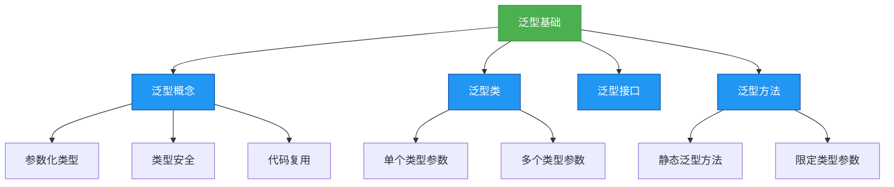

# 基础-泛型基础

## 概述
泛型是Java SE 5引入的核心特性，它允许在定义类、接口和方法时使用类型参数，从而实现代码的参数化类型，提高代码复用性和类型安全性。本章节将从泛型的基本概念入手，系统讲解泛型类、泛型接口、泛型方法的定义与使用，以及泛型带来的优势与基本限制。



## 知识要点

### 1. 泛型的基本概念

#### 1.1 什么是泛型？
泛型（Generics）是一种允许在定义类、接口和方法时使用类型参数（type parameter）的机制。这些类型参数在使用时被具体的类型所替代，从而实现代码的参数化类型，达到代码复用和类型安全的目的。

**泛型的核心思想**：将类型确定的工作推迟到创建对象或调用方法时才去明确指定的特殊类型。

#### 1.2 为什么需要泛型？
在没有泛型之前，Java集合只能存储Object类型的对象，这会导致以下问题：
- **类型不安全**：可以向集合中添加任意类型的对象
- **强制类型转换**：从集合中取出元素时需要手动强制转换，容易引发ClassCastException

泛型的出现解决了这些问题，通过在编译时进行类型检查，确保集合中只存储指定类型的对象，避免了运行时异常。

```java
// 没有泛型的情况
List list = new ArrayList();
list.add("hello");
list.add(123); // 可以添加任意类型
String str = (String) list.get(1); // 运行时抛出ClassCastException

// 使用泛型的情况
List<String> strList = new ArrayList<>();
strList.add("hello");
strList.add(123); // 编译时错误，不允许添加非String类型
String str2 = strList.get(0); // 无需强制类型转换
```

### 2. 泛型类与泛型接口

#### 2.1 泛型类的定义与使用
泛型类是指在类定义时使用类型参数的类。类型参数通常使用大写字母表示，如T（Type）、E（Element）、K（Key）、V（Value）等。

**定义格式**：
```java
class 类名<T> {
    // 成员变量可以使用类型参数
    private T data;
    
    // 构造方法可以使用类型参数
    public 类名(T data) {
        this.data = data;
    }
    
    // 成员方法可以使用类型参数
    public T getData() {
        return data;
    }
}
```

**使用示例**：
```java
// 创建泛型类实例时指定具体类型
GenericClass<String> strObj = new GenericClass<>("Hello");
String strData = strObj.getData();

GenericClass<Integer> intObj = new GenericClass<>(123);
int intData = intObj.getData();
```

#### 2.2 多类型参数的泛型类
泛型类可以定义多个类型参数，用逗号分隔：

```java
class Pair<K, V> {
    private K key;
    private V value;
    
    public Pair(K key, V value) {
        this.key = key;
        this.value = value;
    }
    
    // 省略getter和setter方法
}

// 使用示例
Pair<String, Integer> pair = new Pair<>("age", 25);
String key = pair.getKey();
Integer value = pair.getValue();
```

#### 2.3 泛型接口的定义与实现
泛型接口的定义方式与泛型类类似：

```java
interface Generator<T> {
    T generate();
}
```

实现泛型接口时有两种方式：
1. **指定具体类型**
```java
class StringGenerator implements Generator<String> {
    @Override
    public String generate() {
        return "Generated string";
    }
}
```

2. **继续保留类型参数（泛型类实现泛型接口）**
```java
class NumberGenerator<T extends Number> implements Generator<T> {
    private T seed;
    
    public NumberGenerator(T seed) {
        this.seed = seed;
    }
    
    @Override
    public T generate() {
        // 生成基于seed的数字
        return seed;
    }
}
```

### 3. 泛型方法

#### 3.1 泛型方法的定义
泛型方法是指在方法声明时定义类型参数的方法，它可以独立于类而存在，即使所在的类不是泛型类。

**定义格式**：
```java
public <T> T 方法名(T 参数) {
    // 方法体
}
```

**示例**：
```java
public class GenericMethodDemo {
    
    // 泛型方法
    public <T> T getMiddleElement(T[] array) {
        if (array == null || array.length == 0) {
            return null;
        }
        return array[array.length / 2];
    }
    
    public static void main(String[] args) {
        GenericMethodDemo demo = new GenericMethodDemo();
        
        String[] strArray = {"A", "B", "C", "D", "E"};
        String middleStr = demo.getMiddleElement(strArray);
        System.out.println("Middle string: " + middleStr); // 输出: Middle string: C
        
        Integer[] intArray = {1, 2, 3, 4, 5, 6};
        Integer middleInt = demo.getMiddleElement(intArray);
        System.out.println("Middle integer: " + middleInt); // 输出: Middle integer: 4
    }
}
```

#### 3.2 静态泛型方法
静态方法无法访问类的类型参数，因此如果静态方法需要使用泛型能力，必须将其定义为静态泛型方法。

**定义格式**：
```java
public static <T> T 静态方法名(T 参数) {
    // 方法体
}
```

**示例**：
```java
public class StaticGenericMethodDemo {
    
    // 静态泛型方法
    public static <T> T getFirstElement(T[] array) {
        if (array == null || array.length == 0) {
            return null;
        }
        return array[0];
    }
    
    public static void main(String[] args) {
        String[] strArray = {"Hello", "World"};
        String firstStr = getFirstElement(strArray);
        System.out.println(firstStr); // 输出: Hello
        
        Double[] doubleArray = {1.5, 2.5, 3.5};
        Double firstDouble = getFirstElement(doubleArray);
        System.out.println(firstDouble); // 输出: 1.5
    }
}
```

#### 3.3 限定类型参数
泛型方法可以对类型参数进行限定，使用`extends`关键字指定类型参数必须是某个类的子类或实现某个接口。

**语法格式**：
```java
public <T extends 限定类型> T 方法名(T 参数) {
    // 方法体
}
```

**示例**：计算数组中元素的总和（限定类型为Number及其子类）
```java
public class BoundedTypeDemo {
    
    public static <T extends Number> double sum(T[] array) {
        double total = 0.0;
        for (T element : array) {
            total += element.doubleValue();
        }
        return total;
    }
    
    public static void main(String[] args) {
        Integer[] intArray = {1, 2, 3, 4};
        System.out.println("Sum: " + sum(intArray)); // 输出: Sum: 10.0
        
        Double[] doubleArray = {1.5, 2.5, 3.5};
        System.out.println("Sum: " + sum(doubleArray)); // 输出: Sum: 7.5
        
        // String[] strArray = {"1", "2", "3"};
        // System.out.println(sum(strArray)); // 编译错误，String不是Number的子类
    }
}
```

## 知识扩展

### 1. 设计思想
泛型体现了Java中的"参数化类型"设计思想，通过将类型抽象为参数，实现了代码的高度复用和类型安全。这种思想在集合框架、框架设计（如Spring、MyBatis）中被广泛应用，是面向抽象编程的重要体现。

### 2. 避坑指南
- **避免使用原始类型**：原始类型（如List而非List< String>）会失去泛型的类型安全优势，应尽量避免
- **泛型数组的限制**：不能创建泛型数组（如new T[10]），可使用ArrayList替代
- **泛型类型参数不能是基本类型**：泛型类型参数只能是引用类型，如使用Integer而非int
- **泛型信息在运行时被擦除**：无法在运行时获取泛型的具体类型信息

### 3. 深度思考题
1. 为什么Java泛型要使用类型擦除（Type Erasure）机制？它带来了哪些优势和局限？
2. 如何理解泛型中的通配符（?）、上界通配符（? extends T）和下界通配符（? super T）？它们各自的使用场景是什么？
3. 泛型方法与泛型类的类型参数有何区别？在什么情况下应该使用泛型方法而非泛型类？