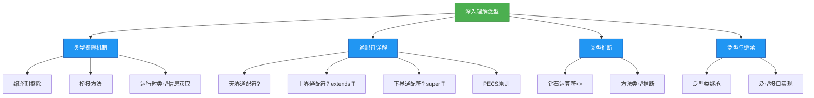

# 理解-深入理解泛型

## 概述
泛型作为Java的核心特性之一，其底层实现机制和高级用法对编写高效、安全的代码至关重要。本章将深入探讨泛型的类型擦除机制、通配符的灵活应用、类型推断原理以及泛型在继承体系中的表现，帮助开发者从底层理解泛型的工作原理，避免常见误区，掌握复杂场景下的泛型使用技巧。



## 知识要点

### 1. 泛型类型擦除机制

#### 1.1 什么是类型擦除？
类型擦除（Type Erasure）是Java泛型实现的核心机制，指编译器在编译时会移除泛型类型信息，将泛型类型替换为其原始类型（Raw Type）。这一机制确保了泛型代码与Java 5之前的非泛型代码的兼容性，但也带来了一些特性限制。

**擦除规则**：
- 无限制类型参数（如< T>）会被替换为Object
- 有限制类型参数（如< T extends Number>）会被替换为其边界类型（Number）
- 泛型方法的类型参数也会被相应的边界类型或Object替换

**示例**：
```java
// 泛型类定义
class GenericClass<T> {
    private T value;
    public T getValue() { return value; }
    public void setValue(T value) { this.value = value; }
}

// 编译后类型擦除为
class GenericClass {
    private Object value;
    public Object getValue() { return value; }
    public void setValue(Object value) { this.value = value; }
}
```

#### 1.2 类型擦除的影响

**1.2.1 运行时无法获取泛型类型信息**
由于类型信息在编译时被擦除，运行时无法通过`getClass()`或`instanceof`判断泛型的具体类型：

```java
List<String> strList = new ArrayList<>();
List<Integer> intList = new ArrayList<>();

// 运行时泛型类型信息已擦除，均为ArrayList.class
System.out.println(strList.getClass() == intList.getClass()); // 输出: true

// 编译错误，无法使用instanceof判断泛型类型
// if (strList instanceof List<String>)
```

**1.2.2 泛型数组创建限制**
不能直接创建泛型数组，因为数组在运行时需要知道其元素类型，而泛型类型信息已被擦除：

```java
// 编译错误
List<String>[] strLists = new List<String>[10];

// 可以使用通配符创建泛型数组，但存在类型安全隐患
List<?>[] wildcardLists = new List<?>[10];
wildcardLists[0] = new ArrayList<String>();
wildcardLists[1] = new ArrayList<Integer>();
```

**1.2.3 泛型方法重载限制**
方法重载时，由于类型擦除可能导致方法签名冲突：

```java
class OverloadDemo {
    // 编译错误：类型擦除后方法签名相同
    // public void method(List<String> list) {}
    // public void method(List<Integer> list) {}
}
```

#### 1.3 桥接方法（Bridge Method）
为了维持泛型类型的多态性，编译器会在泛型类的子类中自动生成桥接方法。当泛型类的方法被重写时，桥接方法确保了类型擦除后的方法调用正确性。

**示例**：
```java
class Parent<T> {
    public T getValue() { return null; }
}

class Child extends Parent<String> {
    @Override
    public String getValue() { return "Hello"; }
}

// 编译后Child类会生成桥接方法
class Child extends Parent {
    // 实际重写的方法
    public String getValue() { return "Hello"; }
    
    // 编译器生成的桥接方法
    public Object getValue() { return getValue(); }
}
```

### 2. 泛型通配符详解

#### 2.1 无界通配符（?）
无界通配符`?`表示未知类型，可用于表示任意类型的泛型实例。主要用于读取操作，不允许添加元素（除null外）。

**使用场景**：当方法需要处理多种泛型类型，但不依赖于具体类型时。

```java
public void printList(List<?> list) {
    for (Object element : list) {
        System.out.println(element);
    }
    // list.add("test"); // 编译错误，无法添加具体类型元素
    list.add(null); // 允许添加null
}

// 可以接收任意泛型类型的List
printList(new ArrayList<String>());
printList(new ArrayList<Integer>());
```

#### 2.2 上界通配符（? extends T）
上界通配符`? extends T`表示类型参数是T或T的子类。适用于读取操作，提供了类型安全的上限。

**使用场景**：需要获取T类型对象，如集合元素的读取。

```java
// 计算数字列表的总和
public double sumOfList(List<? extends Number> list) {
    double sum = 0.0;
    for (Number num : list) {
        sum += num.doubleValue();
    }
    return sum;
}

// 可以接收Number及其子类的List
sumOfList(new ArrayList<Integer>());
sumOfList(new ArrayList<Double>());
// sumOfList(new ArrayList<String>()); // 编译错误，String不是Number子类
```

#### 2.3 下界通配符（? super T）
下界通配符`? super T`表示类型参数是T或T的父类。适用于写入操作，提供了类型安全的下限。

**使用场景**：需要添加T类型对象，如集合元素的写入。

```java
// 向列表添加整数
public void addIntegers(List<? super Integer> list) {
    list.add(1);
    list.add(2);
    list.add(3);
}

// 可以接收Integer及其父类的List
addIntegers(new ArrayList<Integer>());
addIntegers(new ArrayList<Number>());
addIntegers(new ArrayList<Object>());
```

#### 2.4 PECS原则
PECS（Producer Extends, Consumer Super）是使用通配符的指导原则：
- **Producer（生产者）**：如果只需要从集合中获取元素（生产数据），使用`? extends T`
- **Consumer（消费者）**：如果只需要向集合中添加元素（消费数据），使用`? super T`
- 如果既需要生产又需要消费，不使用通配符

**示例**：
```java
// 生产者：获取元素（extends）
public List<String> getUpperCaseStrings(List<? extends String> producerList) {
    List<String> result = new ArrayList<>();
    for (String s : producerList) {
        result.add(s.toUpperCase());
    }
    return result;
}

// 消费者：添加元素（super）
public void addLowercaseStrings(List<? super String> consumerList) {
    consumerList.add("hello");
    consumerList.add("world");
}
```