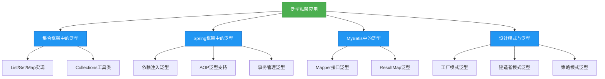

# 进阶-泛型在框架设计中的应用

## 概述
泛型在现代Java框架设计中扮演着至关重要的角色，它不仅提升了代码的类型安全性和可读性，还为框架提供了强大的灵活性和可扩展性。本章将深入剖析泛型在核心类库（如集合框架）、主流框架（如Spring、MyBatis）以及设计模式中的应用实践，揭示泛型如何简化框架API设计、支持复杂业务场景，并通过实例展示泛型在框架开发中的最佳实践。



## 知识要点

### 1. Java集合框架中的泛型应用

#### 1.1 核心集合接口与泛型
Java集合框架是泛型应用的典范，所有核心集合接口（List、Set、Map等）都通过泛型实现了类型安全的数据存储。

**示例：List与Map的泛型定义**
```java
// List接口的泛型定义
public interface List<E> extends Collection<E> {
    E get(int index);
    boolean add(E e);
    // ...
}

// Map接口的泛型定义
public interface Map<K, V> {
    V get(Object key);
    V put(K key, V value);
    // ...
}
```

**使用示例**：
```java
// 类型安全的List
List<String> stringList = new ArrayList<>();
stringList.add("泛型");
String value = stringList.get(0); // 无需类型转换

// 类型安全的Map
Map<String, Integer> scoreMap = new HashMap<>();
scoreMap.put("数学", 90);
Integer mathScore = scoreMap.get("数学");
```

#### 1.2 Collections工具类的泛型方法
Collections工具类提供了大量泛型方法，用于集合的排序、查找、同步控制等操作，实现了算法与数据结构的解耦。

**示例：排序与二分查找**
```java
List<Integer> numbers = Arrays.asList(3, 1, 4, 1, 5, 9);

// 泛型排序方法
Collections.sort(numbers);
System.out.println(numbers); // 输出: [1, 1, 3, 4, 5, 9]

// 泛型二分查找方法
int index = Collections.binarySearch(numbers, 4);
System.out.println("元素4的索引: " + index); // 输出: 元素4的索引: 3
```

### 2. Spring框架中的泛型应用

#### 2.1 依赖注入中的泛型自动装配
Spring通过泛型类型信息实现了更精确的依赖注入，当Bean的属性为泛型类型时，Spring能根据泛型参数自动匹配对应的实现类。

**示例：泛型DAO与Service**
```java
// 泛型DAO接口
public interface BaseDao<T> {
    void save(T entity);
    T findById(Long id);
}

// 泛型DAO实现
@Repository
public class BaseDaoImpl<T> implements BaseDao<T> {
    @Autowired
    private JdbcTemplate jdbcTemplate;
    
    // 基于泛型的CRUD实现...
}

// 用户DAO接口
public interface UserDao extends BaseDao<User> {}

// 订单DAO接口
public interface OrderDao extends BaseDao<Order> {}

// 服务层使用
@Service
public class UserService {
    // Spring自动注入UserDao的实现
    @Autowired
    private UserDao userDao;
    
    public void createUser(User user) {
        userDao.save(user);
    }
}
```

#### 2.2 Spring Data JPA的泛型Repository
Spring Data JPA通过泛型Repository接口大幅简化了数据访问层代码，开发者只需定义接口即可自动获得CRUD功能。

**示例：Spring Data JPA泛型接口**
```java
// Spring提供的泛型Repository
public interface JpaRepository<T, ID> extends PagingAndSortingRepository<T, ID> {
    Optional<T> findById(ID id);
    <S extends T> S save(S entity);
    List<T> findAll();
    // ...
}

// 自定义Repository接口（无需实现类）
public interface UserRepository extends JpaRepository<User, Long> {
    // 自动实现根据用户名查询
    Optional<User> findByUsername(String username);
}

// 使用示例
@Service
public class UserService {
    @Autowired
    private UserRepository userRepository;
    
    public User getUserById(Long id) {
        return userRepository.findById(id)
            .orElseThrow(() -> new RuntimeException("用户不存在"));
    }
}
```

### 3. MyBatis中的泛型应用

#### 3.1 泛型Mapper接口
MyBatis支持泛型Mapper接口，通过定义泛型基类Mapper，可以实现通用的CRUD操作，减少重复代码。

**示例：泛型BaseMapper**
```java
// 泛型BaseMapper
public interface BaseMapper<T> {
    @Insert("INSERT INTO ${tableName} VALUES(#{entity})")
    int insert(@Param("entity") T entity);
    
    @Select("SELECT * FROM ${tableName} WHERE id = #{id}")
    T selectById(Long id);
    // ...
}

// 用户Mapper
public interface UserMapper extends BaseMapper<User> {
    // 自定义查询
    List<User> selectByRole(String role);
}

// 使用示例
@Service
public class UserService {
    @Autowired
    private UserMapper userMapper;
    
    public User getUser(Long id) {
        return userMapper.selectById(id);
    }
}
```

#### 3.2 泛型ResultMap
MyBatis的ResultMap支持泛型类型，可以将查询结果自动映射到泛型实体类或包含泛型的复杂对象。

**示例：泛型ResultMap配置**
```xml
<!-- 泛型ResultMap定义 -->
<resultMap id="BaseResultMap" type="com.example.entity.BaseEntity<T>">
    <id column="id" property="id"/>
    <result column="create_time" property="createTime"/>
    <result column="update_time" property="updateTime"/>
</resultMap>

<!-- UserResultMap继承泛型ResultMap -->
<resultMap id="UserResultMap" type="com.example.entity.User" extends="BaseResultMap">
    <result column="username" property="username"/>
    <result column="password" property="password"/>
</resultMap>
```