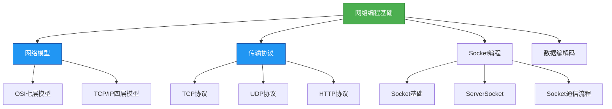

# 基础-网络编程基础概念

## 概述
网络编程是Java开发中实现跨进程通信的核心技术，主要基于TCP/IP协议栈，通过Socket接口实现不同主机间的数据传输。本章节将从网络模型、通信协议到Java Socket编程逐步展开，建立完整的网络编程知识体系。



## 知识要点

### 1. 网络模型

#### 1.1 OSI七层模型
OSI七层模型是国际标准化组织(ISO)提出的网络通信参考模型，从下到上分为：物理层、数据链路层、网络层、传输层、会话层、表示层和应用层。每一层负责不同的通信功能，通过分层设计实现网络通信的模块化。

#### 1.2 TCP/IP四层模型
TCP/IP模型是实际应用中广泛采用的网络模型，将OSI七层模型简化为四层：网络接口层、网络层、传输层和应用层。Java网络编程主要涉及传输层(TCP/UDP)和应用层(HTTP等协议)。

### 2. 核心传输协议

#### 2.1 TCP协议
TCP(传输控制协议)是一种面向连接的、可靠的、基于字节流的传输层协议。它通过三次握手建立连接，四次挥手释放连接，并采用确认重传、流量控制和拥塞控制等机制保证数据传输的可靠性。

#### 2.2 UDP协议
UDP(用户数据报协议)是一种无连接的、不可靠的传输层协议。它不保证数据的可靠传输和顺序到达，但具有传输速度快、开销小的特点，适用于实时性要求高的场景如视频通话、在线游戏等。

### 3. Java Socket编程基础

#### 3.1 Socket概念
Socket(套接字)是网络通信的端点，由IP地址和端口号唯一标识。Java中通过`java.net.Socket`类表示客户端套接字，`java.net.ServerSocket`类表示服务器端套接字。

#### 3.2 TCP通信流程
TCP通信需要经历服务器端启动、客户端连接、数据传输和连接关闭四个阶段，以下是基于Java的TCP通信示例：

**服务器端代码：**
```java
import java.io.IOException;
import java.io.InputStream;
import java.io.OutputStream;
import java.net.ServerSocket;
import java.net.Socket;

/**
 * TCP服务器端示例
 * 功能：监听指定端口，接收客户端连接并处理数据
 */
public class TcpServer {
    public static void main(String[] args) {
        ServerSocket serverSocket = null;
        Socket clientSocket = null;
        try {
            // 1. 创建ServerSocket，绑定端口8888
            serverSocket = new ServerSocket(8888);
            System.out.println("服务器已启动，等待客户端连接...");

            // 2. 监听客户端连接（阻塞方法）
            clientSocket = serverSocket.accept();
            System.out.println("客户端已连接：" + clientSocket.getInetAddress());

            // 3. 获取输入流，读取客户端数据
            try (InputStream in = clientSocket.getInputStream()) {
                byte[] buffer = new byte[1024];
                int len = in.read(buffer);
                String message = new String(buffer, 0, len);
                System.out.println("收到客户端消息：" + message);

                // 4. 获取输出流，向客户端发送响应
                try (OutputStream out = clientSocket.getOutputStream()) {
                    String response = "服务器已收到消息：" + message;
                    out.write(response.getBytes());
                    out.flush();
                }
            }
        } catch (IOException e) {
            e.printStackTrace();
        } finally {
            // 5. 关闭资源
            try {
                if (clientSocket != null) clientSocket.close();
                if (serverSocket != null) serverSocket.close();
            } catch (IOException e) {
                e.printStackTrace();
            }
        }
    }
}
```

**客户端代码：**
```java
import java.io.IOException;
import java.io.InputStream;
import java.io.OutputStream;
import java.net.Socket;

/**
 * TCP客户端示例
 * 功能：连接服务器，发送数据并接收响应
 */
public class TcpClient {
    public static void main(String[] args) {
        Socket socket = null;
        try {
            // 1. 创建Socket，连接服务器（IP地址和端口）
            socket = new Socket("127.0.0.1", 8888);

            // 2. 获取输出流，向服务器发送数据
            try (OutputStream out = socket.getOutputStream()) {
                String message = "Hello, TCP Server!";
                out.write(message.getBytes());
                out.flush();
                System.out.println("已向服务器发送消息：" + message);

                // 3. 获取输入流，接收服务器响应
                try (InputStream in = socket.getInputStream()) {
                    byte[] buffer = new byte[1024];
                    int len = in.read(buffer);
                    String response = new String(buffer, 0, len);
                    System.out.println("收到服务器响应：" + response);
                }
            }
        } catch (IOException e) {
            e.printStackTrace();
        } finally {
            // 4. 关闭资源
            try {
                if (socket != null) socket.close();
            } catch (IOException e) {
                e.printStackTrace();
            }
        }
    }
}
```

#### 3.3 UDP通信示例
UDP通信不需要建立连接，直接发送数据报，以下是UDP通信的简单实现：

**UDP发送端代码：**
```java
import java.io.IOException;
import java.net.DatagramPacket;
import java.net.DatagramSocket;
import java.net.InetAddress;

/**
 * UDP发送端示例
 * 功能：向指定地址和端口发送UDP数据报
 */
public class UdpSender {
    public static void main(String[] args) {
        try (DatagramSocket socket = new DatagramSocket()) {
            // 1. 准备发送数据
            String message = "Hello, UDP Receiver!";
            byte[] data = message.getBytes();

            // 2. 创建数据报包，指定目标地址和端口
            InetAddress address = InetAddress.getByName("127.0.0.1");
            DatagramPacket packet = new DatagramPacket(data, data.length, address, 9999);

            // 3. 发送数据报
            socket.send(packet);
            System.out.println("UDP数据发送成功：" + message);
        } catch (IOException e) {
            e.printStackTrace();
        }
    }
}
```

**UDP接收端代码：**
```java
import java.io.IOException;
import java.net.DatagramPacket;
import java.net.DatagramSocket;

/**
 * UDP接收端示例
 * 功能：监听指定端口，接收UDP数据报
 */
public class UdpReceiver {
    public static void main(String[] args) {
        try (DatagramSocket socket = new DatagramSocket(9999)) {
            // 1. 创建缓冲区
            byte[] buffer = new byte[1024];
            DatagramPacket packet = new DatagramPacket(buffer, buffer.length);

            System.out.println("UDP接收端已启动，等待数据...");
            // 2. 接收数据（阻塞方法）
            socket.receive(packet);

            // 3. 处理数据
            String message = new String(packet.getData(), 0, packet.getLength());
            System.out.println("收到UDP数据：" + message);
            System.out.println("发送方地址：" + packet.getAddress() + ", 端口：" + packet.getPort());
        } catch (IOException e) {
            e.printStackTrace();
        }
    }
}
```

## 知识扩展

### 设计思想
网络编程的核心设计思想是"分层抽象"和"接口标准化"：
1. **分层抽象**：通过OSI/TCP/IP模型将复杂的网络通信分解为多个独立的层次，每个层次专注于解决特定问题，降低系统复杂度
2. **接口标准化**：Java提供统一的Socket API，屏蔽了底层操作系统的差异，使开发者可以用相同的方式编写跨平台的网络应用
3. **面向连接与无连接并存**：TCP和UDP协议分别满足不同场景的需求，体现了"按需选择"的设计哲学

### 避坑指南
1. **资源释放问题**：Socket、ServerSocket等网络资源必须显式关闭，建议使用try-with-resources语法自动管理资源
2. **端口占用问题**：绑定端口时可能出现AddressAlreadyInUseException，可通过设置SO_REUSEADDR参数允许端口复用
   ```java
   serverSocket.setReuseAddress(true); // 服务器端设置
   socket.setReuseAddress(true);       // 客户端设置
   ```
3. **数据粘包问题**：TCP是流式协议，可能出现数据粘包，解决方案包括：
   - 固定长度消息
   - 消息长度+数据格式
   - 特殊分隔符
4. **超时处理**：网络操作应设置超时时间，避免程序无限阻塞
   ```java
   socket.setSoTimeout(3000); // 设置读取超时时间为3秒
   ```
5. **异常处理**：网络通信中可能出现各种IO异常，需要全面的异常处理机制

### 深度思考题
**思考题1**：TCP三次握手和四次挥手的具体过程是什么？为什么挥手需要四次而握手只需要三次？

**思考题回答**：
TCP三次握手过程：
1. 客户端发送SYN包（同步序列编号）请求建立连接
2. 服务器收到SYN包后，发送SYN+ACK包（同步+确认）响应
3. 客户端收到SYN+ACK包后，发送ACK包（确认）完成连接建立

四次挥手过程：
1. 主动关闭方发送FIN包（结束）请求关闭连接
2. 被动关闭方收到FIN包后，发送ACK包确认
3. 被动关闭方准备好后，发送FIN包请求关闭连接
4. 主动关闭方发送ACK包确认

挥手需要四次的原因：TCP连接是全双工的，双方需要分别关闭各自的发送通道。被动关闭方收到FIN包时，可能还有数据未发送完成，因此需要先发送ACK确认，待数据发送完毕后再发送FIN包。而握手时服务器可以将SYN和ACK合并发送，因此只需三次。

**思考题2**：如何在Java中实现一个简单的HTTP服务器？

**思考题回答**：
可以基于ServerSocket实现简单的HTTP服务器，核心步骤包括：
1. 创建ServerSocket监听80端口
2. 循环接收客户端连接
3. 读取HTTP请求报文
4. 解析请求行、请求头和请求体
5. 构造HTTP响应报文
6. 通过输出流发送响应
7. 关闭连接（HTTP/1.0）或保持连接（HTTP/1.1）

核心代码框架：
```java
ServerSocket serverSocket = new ServerSocket(80);
while (true) {
    Socket socket = serverSocket.accept();
    try (InputStream in = socket.getInputStream();
         OutputStream out = socket.getOutputStream()) {
        // 读取请求
        BufferedReader reader = new BufferedReader(new InputStreamReader(in));
        String requestLine = reader.readLine();
        
        // 构造响应
        String response = "HTTP/1.1 200 OK\r\n"
                        + "Content-Type: text/html\r\n"
                        + "\r\n"
                        + "<h1>Hello, HTTP Server!</h1>";
        out.write(response.getBytes());
    } finally {
        socket.close();
    }
}
```