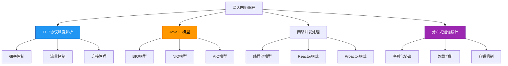
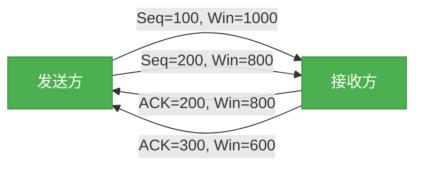
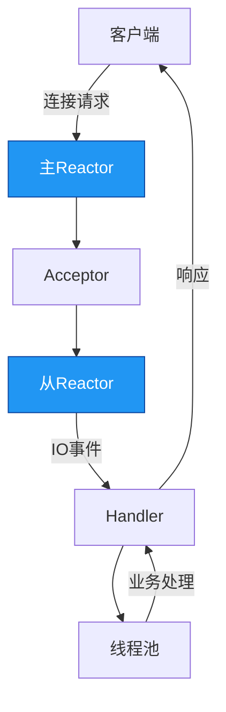

# 理解-深入理解网络编程

## 概述
深入理解网络编程需要掌握TCP/IP协议栈的底层机制、Java IO模型的演进以及分布式系统的通信设计原则。本章将从协议细节、IO模型、并发处理到分布式通信逐步深入，揭示网络编程的核心原理与实践技巧。



## 知识要点

### 1. TCP协议深度解析

#### 1.1 拥塞控制机制
TCP拥塞控制是防止网络因过载而瘫痪的关键机制，主要通过四个算法实现：慢启动、拥塞避免、快速重传和快速恢复。

**慢启动**：初始拥塞窗口较小（通常为1-2个MSS），每收到一个ACK，拥塞窗口大小翻倍，指数增长。
**拥塞避免**：当拥塞窗口达到慢启动阈值(ssthresh)后，进入线性增长阶段，每RTT拥塞窗口增加1个MSS。
**快速重传**：当收到3个重复ACK时，立即重传丢失的报文段，无需等待超时。
**快速恢复**：快速重传后，将ssthresh设为当前拥塞窗口的一半，拥塞窗口设为ssthresh+3*MSS，进入拥塞避免阶段。

#### 1.2 流量控制机制
TCP通过滑动窗口机制实现流量控制，防止发送方发送速度过快导致接收方缓冲区溢出。
- 接收方通过TCP头部的窗口字段告知发送方可接收的字节数（接收窗口）
- 发送方的发送窗口不能超过接收窗口和拥塞窗口中的最小值
- 零窗口探测机制处理接收窗口为0的情况



### 2. Java IO模型演进

#### 2.1 BIO（阻塞IO）模型
BIO是Java最早的IO模型，特点是每个连接对应一个线程，线程在IO操作期间会被阻塞。

**缺点**：资源消耗大，并发能力有限，不适用于高并发场景。

**代码示例**：
```java
// BIO服务器端示例
ServerSocket serverSocket = new ServerSocket(8080);
while (true) {
    Socket socket = serverSocket.accept(); // 阻塞
    new Thread(() -> {
        try (InputStream in = socket.getInputStream();
             OutputStream out = socket.getOutputStream()) {
            // 处理IO（阻塞）
        } catch (IOException e) {
            e.printStackTrace();
        }
    }).start();
}
```

#### 2.2 NIO（非阻塞IO）模型
JDK1.4引入NIO，基于Channel、Buffer和Selector实现非阻塞IO操作，一个线程可管理多个连接。

**核心组件**：
- **Channel**：双向通道，支持非阻塞读写（如SocketChannel、ServerSocketChannel）
- **Buffer**：数据缓冲区，IO操作直接与Buffer交互
- **Selector**：多路复用器，监听Channel的就绪事件

**Reactor模式**：NIO的典型应用模式，通过Selector轮询就绪事件，分发处理

**代码示例**：
```java
// NIO服务器端示例
Selector selector = Selector.open();
ServerSocketChannel serverSocketChannel = ServerSocketChannel.open();
serverSocketChannel.bind(new InetSocketAddress(8080));
serverSocketChannel.configureBlocking(false);
serverSocketChannel.register(selector, SelectionKey.OP_ACCEPT);

while (selector.select() > 0) {
    Iterator<SelectionKey> keyIterator = selector.selectedKeys().iterator();
    while (keyIterator.hasNext()) {
        SelectionKey key = keyIterator.next();
        if (key.isAcceptable()) {
            // 处理连接事件
            ServerSocketChannel server = (ServerSocketChannel) key.channel();
            SocketChannel client = server.accept();
            client.configureBlocking(false);
            client.register(selector, SelectionKey.OP_READ);
        } else if (key.isReadable()) {
            // 处理读事件
            SocketChannel client = (SocketChannel) key.channel();
            ByteBuffer buffer = ByteBuffer.allocate(1024);
            int len = client.read(buffer);
            if (len > 0) {
                buffer.flip();
                byte[] data = new byte[len];
                buffer.get(data);
                System.out.println(new String(data));
            }
        }
        keyIterator.remove();
    }
}
```

#### 2.3 AIO（异步IO）模型
JDK1.7引入AIO，基于回调机制实现完全异步的IO操作，IO操作完成后通知应用程序。

**特点**：真正的异步非阻塞，无需轮询，资源消耗更低，但编程复杂度高。

### 3. 网络并发处理模型

#### 3.1 线程池模型
通过线程池管理线程资源，避免频繁创建销毁线程的开销，提高并发处理能力。

**核心参数**：核心线程数、最大线程数、队列容量、拒绝策略

**代码示例**：
```java
// 线程池处理网络请求
ExecutorService threadPool = new ThreadPoolExecutor(
    5, // 核心线程数
    10, // 最大线程数
    60, TimeUnit.SECONDS, // 空闲线程存活时间
    new ArrayBlockingQueue<>(20), // 任务队列
    new ThreadPoolExecutor.AbortPolicy() // 拒绝策略
);

ServerSocket serverSocket = new ServerSocket(8080);
while (true) {
    Socket socket = serverSocket.accept();
    threadPool.submit(() -> handleRequest(socket));
}
```

#### 3.2 Reactor模式
基于事件驱动的并发处理模式，将IO事件分发到相应的处理器处理，分为单Reactor单线程、单Reactor多线程和主从Reactor多线程三种实现。

**主从Reactor多线程模式**：
- 主Reactor：处理连接事件
- 从Reactor：处理IO事件
- 线程池：处理业务逻辑



### 4. 分布式通信设计

#### 4.1 序列化协议
序列化是将对象转换为字节流以便网络传输的过程，常用的Java序列化协议包括：

**Java原生序列化**：通过实现Serializable接口，使用ObjectInputStream和ObjectOutputStream进行序列化。
**缺点**：性能差、体积大、不跨语言。

**JSON**：轻量级文本协议，可读性好，跨语言支持广泛（如Jackson、FastJSON）。
**缺点**：二进制数据处理差，类型信息丢失。

**Protobuf**：Google开发的二进制协议，高效紧凑，支持版本兼容和跨语言。
**优点**：序列化速度快，数据体积小，生成代码优化。

**Protobuf使用示例**：
1. 定义.proto文件：
```protobuf
syntax = "proto3";
package com.example;

message User {
    int32 id = 1;
    string name = 2;
    repeated string hobbies = 3;
}
```

2. Java序列化/反序列化代码：
```java
/**
 * Protobuf序列化示例
 */
public class ProtobufDemo {
    public static void main(String[] args) throws Exception {
        // 创建对象
        UserProto.User user = UserProto.User.newBuilder()
            .setId(1)
            .setName("Alice")
            .addHobbies("reading")
            .addHobbies("coding")
            .build();

        // 序列化
        byte[] data = user.toByteArray();
        System.out.println("序列化后长度：" + data.length);

        // 反序列化
        UserProto.User deserializedUser = UserProto.User.parseFrom(data);
        System.out.println("反序列化结果：" + deserializedUser.getName());
    }
}
```

#### 4.2 负载均衡
负载均衡用于将请求分发到多个服务器，提高系统可用性和吞吐量，常见策略：

**轮询(Round Robin)**：按顺序依次分配请求到服务器。
**加权轮询(Weighted Round Robin)**：根据服务器性能设置权重，权重高的服务器接收更多请求。
**一致性哈希(Consistent Hashing)**：解决分布式缓存中的数据分布问题，减少节点变化时的缓存失效。

**一致性哈希实现示例**：
```java
/**
 * 一致性哈希简单实现
 */
public class ConsistentHash<T> {
    private final int numberOfReplicas; // 虚拟节点数量
    private final SortedMap<Integer, T> circle = new TreeMap<>();

    public ConsistentHash(int numberOfReplicas, Collection<T> nodes) {
        this.numberOfReplicas = numberOfReplicas;
        for (T node : nodes) {
            add(node);
        }
    }

    // 添加节点
    public void add(T node) {
        for (int i = 0; i < numberOfReplicas; i++) {
            circle.put(hash(node.toString() + i), node);
        }
    }

    // 移除节点
    public void remove(T node) {
        for (int i = 0; i < numberOfReplicas; i++) {
            circle.remove(hash(node.toString() + i));
        }
    }

    // 获取目标节点
    public T get(Object key) {
        if (circle.isEmpty()) return null;
        int hash = hash(key.toString());
        if (!circle.containsKey(hash)) {
            // 顺时针查找下一个节点
            SortedMap<Integer, T> tailMap = circle.tailMap(hash);
            hash = tailMap.isEmpty() ? circle.firstKey() : tailMap.firstKey();
        }
        return circle.get(hash);
    }

    // FNV1哈希算法
    private int hash(String key) {
        final int p = 16777619;
        int hash = (int) 2166136261L;
        for (int i = 0; i < key.length(); i++) {
            hash = (hash ^ key.charAt(i)) * p;
        }
        hash += hash << 13;
        hash ^= hash >> 7;
        hash += hash << 3;
        hash ^= hash >> 17;
        hash += hash << 5;
        return hash & 0x7FFFFFFF; // 确保非负
    }
}
```

#### 4.3 容错机制
分布式系统中常用的容错机制包括：

**重试机制**：请求失败后自动重试，适用于暂时性错误。
**超时控制**：设置请求超时时间，避免无限等待。
**熔断机制**：当服务故障比例超过阈值时，快速失败并降级，保护系统。
**限流机制**：限制并发请求数量，防止系统过载。

**熔断器模式示例**：
```java
/**
 * 简单熔断器实现
 */
public class CircuitBreaker {
    private enum State { CLOSED, OPEN, HALF_OPEN }

    private State state = State.CLOSED;
    private int failureCount = 0;
    private int successCount = 0;
    private final int failureThreshold; // 失败阈值
    private final int successThreshold; // 半开状态成功阈值
    private final long resetTimeout; // 重置超时时间
    private long lastFailureTime;

    public CircuitBreaker(int failureThreshold, int successThreshold, long resetTimeout) {
        this.failureThreshold = failureThreshold;
        this.successThreshold = successThreshold;
        this.resetTimeout = resetTimeout;
    }

    public <T> T execute(Supplier<T> operation) throws Exception {
        if (state == State.OPEN) {
            if (System.currentTimeMillis() - lastFailureTime > resetTimeout) {
                state = State.HALF_OPEN;
            } else {
                throw new Exception("Circuit breaker is open");
            }
        }

        try {
            T result = operation.get();
            onSuccess();
            return result;
        } catch (Exception e) {
            onFailure();
            throw e;
        }
    }

    private void onSuccess() {
        if (state == State.HALF_OPEN) {
            successCount++;
            if (successCount >= successThreshold) {
                state = State.CLOSED;
                successCount = 0;
                failureCount = 0;
            }
        }
    }

    private void onFailure() {
        if (state == State.HALF_OPEN) {
            state = State.OPEN;
            lastFailureTime = System.currentTimeMillis();
            successCount = 0;
            return;
        }

        failureCount++;
        if (failureCount >= failureThreshold) {
            state = State.OPEN;
            lastFailureTime = System.currentTimeMillis();
        }
    }
}
```

## 知识扩展

### 设计思想
深入网络编程的核心设计思想包括：

1. **事件驱动架构**：基于事件响应而非主动轮询，提高系统吞吐量（如NIO的Selector）
2. **分层与关注点分离**：将网络通信分为协议层、IO层、业务层，降低耦合
3. **异步非阻塞**：通过回调和事件通知机制，最大化CPU利用率
4. **资源池化**：线程池、连接池等技术减少资源创建销毁开销
5. **弹性设计**：通过限流、熔断、降级等机制提高系统容错能力

### 避坑指南
1. **Selector线程瓶颈**：单个Selector处理过多连接会成为瓶颈，建议使用主从Reactor模型分散负载
2. **Buffer管理不当**：
   - 避免频繁创建Buffer，建议使用Buffer池
   - 注意flip()和clear()方法的正确使用，防止数据错乱
3. **NIO空轮询bug**：JDK早期版本存在Selector.select()无限返回0的bug，需设置超时时间或升级JDK
4. **线程安全问题**：Channel和Selector不是线程安全的，需注意同步
5. **TCP粘包/拆包**：
   - 解决方案：固定长度、分隔符、长度前缀
   - 推荐使用Netty等成熟框架处理
6. **连接泄漏**：确保Socket/Channel在finally块中关闭，或使用try-with-resources

### 深度思考题
**思考题1**：Reactor模式和Proactor模式的本质区别是什么？分别适用于什么场景？

**思考题回答**：
本质区别在于IO操作的发起者不同：
- **Reactor模式**：应用程序主动发起IO操作（同步IO），内核通知IO就绪事件
- **Proactor模式**：内核主动完成IO操作并通知应用程序（异步IO）

适用场景：
- Reactor：适用于IO密集型应用，如Web服务器、即时通讯系统
- Proactor：适用于需要处理大量并发连接且IO操作耗时较长的场景，如文件服务器

Java NIO实现的是Reactor模式，而AIO尝试实现Proactor模式，但由于操作系统支持有限，实际应用较少。Netty等框架通过NIO模拟了Proactor模式的效果。

**思考题2**：如何设计一个高性能的Java网络服务器？关键优化点有哪些？

**思考题回答**：
高性能网络服务器设计要点：
1. **IO模型选择**：使用NIO/Epoll而非BIO，减少线程开销
2. **线程模型优化**：
   - 主从Reactor多线程模型
   - 业务逻辑与IO处理分离
3. **内存管理**：
   - 使用直接内存（DirectByteBuffer）减少JVM堆外内存拷贝
   - Buffer池化复用
4. **协议优化**：
   - 使用二进制协议（如Protobuf）替代文本协议
   - 合理设计消息格式，减少序列化开销
5. **连接管理**：
   - TCP参数调优（SO_RCVBUF、SO_SNDBUF、TCP_NODELAY）
   - 连接池化与超时控制
6. **并发控制**：
   - 无锁化设计
   - 减少共享状态
7. **监控与调优**：
   - 关键指标监控（吞吐量、延迟、错误率）
   - JVM参数调优（堆大小、GC策略）

典型实现如Netty框架，通过上述优化可支持百万级并发连接。