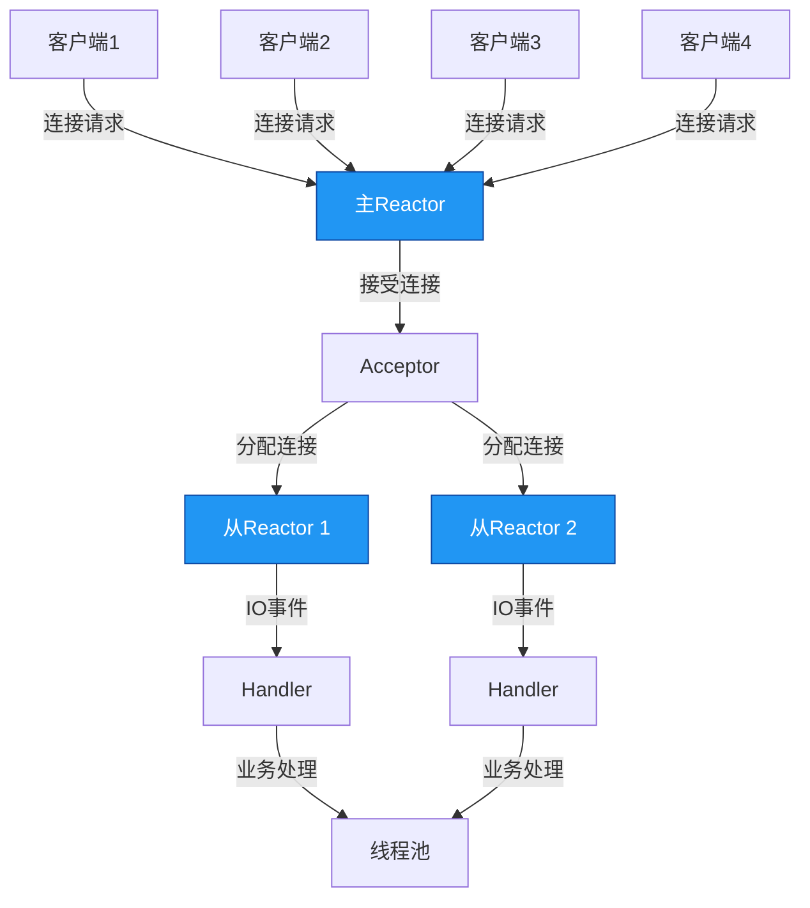

# 进阶-NIO与异步编程

## 概述
Java NIO（New IO）是JDK 1.4引入的异步非阻塞IO模型，通过Buffer、Channel和Selector三大核心组件实现高效的IO操作。相较于传统BIO（Blocking IO）的阻塞特性，NIO支持单线程处理多个连接，显著提升了高并发场景下的系统性能。本章节将深入剖析NIO的底层原理、异步编程模型及Netty框架的实战应用，帮助开发者构建高性能网络应用。

## 知识要点

### 1. NIO核心组件

#### 1.1 Buffer缓冲区
Buffer是NIO中数据存储的基本单元，用于在通道（Channel）中读写数据。所有Buffer都继承自java.nio.Buffer类，常用实现包括ByteBuffer、CharBuffer、IntBuffer等。

**Buffer的核心属性**：
- capacity：缓冲区容量，创建后不可改变
- position：当前读写位置，初始为0
- limit：读写限制位置，默认为capacity
- mark：标记位置，用于临时记录position

**Buffer操作流程**：
1. 写入数据到Buffer
2. 调用flip()切换为读模式（limit=position，position=0）
3. 从Buffer读取数据
4. 调用clear()或compact()清空缓冲区

**ByteBuffer使用示例**：
```java
/**
 * ByteBuffer基本操作示例
 */
public class ByteBufferDemo {
    public static void main(String[] args) {
        // 创建容量为1024字节的缓冲区
        ByteBuffer buffer = ByteBuffer.allocate(1024);
        System.out.println("初始化状态: " + buffer);

        // 写入数据
        String data = "Hello NIO!";
        buffer.put(data.getBytes());
        System.out.println("写入后状态: " + buffer);

        // 切换为读模式
        buffer.flip();
        System.out.println("切换读模式后: " + buffer);

        // 读取数据
        byte[] readData = new byte[buffer.limit()];
        buffer.get(readData);
        System.out.println("读取内容: " + new String(readData));
        System.out.println("读取后状态: " + buffer);

        // 清空缓冲区（compact保留未读数据）
        buffer.compact();
        System.out.println("compact后状态: " + buffer);
    }
}
```

#### 1.2 Channel通道
Channel是NIO中数据传输的通道，类似于BIO中的流，但支持双向读写和非阻塞操作。常用Channel实现包括：
- FileChannel：文件IO操作
- SocketChannel：TCP客户端通道
- ServerSocketChannel：TCP服务端通道
- DatagramChannel：UDP通信通道
- Pipe.SinkChannel/Pipe.SourceChannel：线程间通信

**Channel的主要特点**：
- 双向性：既可读又可写
- 非阻塞：支持非阻塞模式
- 面向缓冲区：数据必须通过Buffer读写

**SocketChannel示例**：
```java
/**
 * 非阻塞SocketChannel客户端示例
 */
public class NonBlockingSocketClient {
    public static void main(String[] args) throws IOException {
        // 创建非阻塞SocketChannel
        SocketChannel socketChannel = SocketChannel.open();
        socketChannel.configureBlocking(false);

        // 连接服务器（非阻塞，立即返回）
        socketChannel.connect(new InetSocketAddress("localhost", 8080));

        // 轮询等待连接完成
        while (!socketChannel.finishConnect()) {
            System.out.println("等待连接中...");
            // 可以执行其他任务
        }

        // 发送数据
        String message = "Hello from NIO client!";
        ByteBuffer buffer = ByteBuffer.wrap(message.getBytes());
        while (buffer.hasRemaining()) {
            socketChannel.write(buffer);
        }

        // 读取响应
        buffer.clear();
        int bytesRead = socketChannel.read(buffer);
        if (bytesRead > 0) {
            buffer.flip();
            byte[] response = new byte[bytesRead];
            buffer.get(response);
            System.out.println("服务器响应: " + new String(response));
        }

        // 关闭通道
        socketChannel.close();
    }
}
```

#### 1.3 Selector选择器
Selector是NIO实现多路复用的核心组件，允许单个线程监控多个Channel的IO事件。通过Selector，一个线程可以高效地管理成百上千个网络连接。

**Selector的工作流程**：
1. 创建Selector
2. 将Channel注册到Selector，并指定关注的事件
3. 调用select()方法等待事件就绪
4. 处理就绪事件

**关注的事件类型**：
- SelectionKey.OP_READ：可读事件
- SelectionKey.OP_WRITE：可写事件
- SelectionKey.OP_CONNECT：连接完成事件
- SelectionKey.OP_ACCEPT：接受连接事件

**Selector服务端示例**：
```java
/**
 * Selector多路复用服务端示例
 */
public class SelectorServer {
    public static void main(String[] args) throws IOException {
        // 创建Selector
        Selector selector = Selector.open();

        // 创建ServerSocketChannel
        ServerSocketChannel serverSocketChannel = ServerSocketChannel.open();
        serverSocketChannel.bind(new InetSocketAddress(8080));
        serverSocketChannel.configureBlocking(false);

        // 注册接受连接事件
        serverSocketChannel.register(selector, SelectionKey.OP_ACCEPT);
        System.out.println("服务器启动，监听端口8080...");

        while (true) {
            // 等待事件就绪（阻塞）
            int readyChannels = selector.select();
            if (readyChannels == 0) continue;

            // 获取就绪事件集合
            Set<SelectionKey> selectionKeys = selector.selectedKeys();
            Iterator<SelectionKey> iterator = selectionKeys.iterator();

            while (iterator.hasNext()) {
                SelectionKey key = iterator.next();

                // 处理接受连接事件
                if (key.isAcceptable()) {
                    handleAccept(key);
                }
                // 处理可读事件
                else if (key.isReadable()) {
                    handleRead(key);
                }

                // 移除已处理的事件
                iterator.remove();
            }
        }
    }

    private static void handleAccept(SelectionKey key) throws IOException {
        ServerSocketChannel serverSocketChannel = (ServerSocketChannel) key.channel();
        SocketChannel socketChannel = serverSocketChannel.accept();
        socketChannel.configureBlocking(false);
        System.out.println("新客户端连接: " + socketChannel.getRemoteAddress());

        // 注册可读事件
        socketChannel.register(key.selector(), SelectionKey.OP_READ);
    }

    private static void handleRead(SelectionKey key) throws IOException {
        SocketChannel socketChannel = (SocketChannel) key.channel();
        ByteBuffer buffer = ByteBuffer.allocate(1024);
        int bytesRead = socketChannel.read(buffer);

        if (bytesRead == -1) {
            // 客户端关闭连接
            socketChannel.close();
            System.out.println("客户端断开连接");
            return;
        }

        if (bytesRead > 0) {
            buffer.flip();
            byte[] data = new byte[bytesRead];
            buffer.get(data);
            System.out.println("收到消息: " + new String(data) + " from " + socketChannel.getRemoteAddress());

            // 回写数据
            buffer.clear();
            buffer.put("已收到: ".getBytes());
            buffer.put(data);
            buffer.flip();
            socketChannel.write(buffer);
        }
    }
}
```

### 2. 异步编程模型

#### 2.1 Java NIO.2 (AIO) 
JDK 7引入了NIO.2，提供了真正的异步IO（AIO）支持，也称为Asynchronous IO。AIO基于回调机制，当IO操作完成后通知应用程序。

**AIO的核心类**：
- AsynchronousSocketChannel：异步Socket通道
- AsynchronousServerSocketChannel：异步ServerSocket通道
- CompletionHandler：异步操作完成处理器

**AIO服务端示例**：
```java
/**
 * AIO异步服务器示例
 */
public class AIOServer {
    public static void main(String[] args) throws IOException {
        // 创建异步服务器通道
        AsynchronousServerSocketChannel serverSocketChannel = AsynchronousServerSocketChannel.open();
        serverSocketChannel.bind(new InetSocketAddress(8080));
        System.out.println("AIO服务器启动，监听端口8080...");

        // 接受连接（异步操作）
        serverSocketChannel.accept(null, new CompletionHandler<AsynchronousSocketChannel, Object>() {
            @Override
            public void completed(AsynchronousSocketChannel socketChannel, Object attachment) {
                // 继续接受下一个连接
                serverSocketChannel.accept(null, this);

                try {
                    System.out.println("新客户端连接: " + socketChannel.getRemoteAddress());
                    ByteBuffer buffer = ByteBuffer.allocate(1024);

                    // 读取数据（异步操作）
                    socketChannel.read(buffer, buffer, new CompletionHandler<Integer, ByteBuffer>() {
                        @Override
                        public void completed(Integer bytesRead, ByteBuffer buffer) {
                            if (bytesRead == -1) {
                                try {
                                    socketChannel.close();
                                } catch (IOException e) {}
                                return;
                            }

                            buffer.flip();
                            byte[] data = new byte[bytesRead];
                            buffer.get(data);
                            System.out.println("收到消息: " + new String(data));

                            // 回写数据
                            buffer.clear();
                            buffer.put("AIO服务器已收到: ".getBytes());
                            buffer.put(data);
                            buffer.flip();
                            socketChannel.write(buffer, buffer, new CompletionHandler<Integer, ByteBuffer>() {
                                @Override
                                public void completed(Integer result, ByteBuffer buffer) {
                                    if (buffer.hasRemaining()) {
                                        socketChannel.write(buffer, buffer, this);
                                    } else {
                                        buffer.clear();
                                        socketChannel.read(buffer, buffer, this);
                                    }
                                }

                                @Override
                                public void failed(Throwable exc, ByteBuffer buffer) {
                                    exc.printStackTrace();
                                    try {
                                        socketChannel.close();
                                    } catch (IOException e) {}
                                }
                            });
                        }

                        @Override
                        public void failed(Throwable exc, ByteBuffer buffer) {
                            exc.printStackTrace();
                            try {
                                socketChannel.close();
                            } catch (IOException e) {}
                        }
                    });
                } catch (IOException e) {
                    e.printStackTrace();
                }
            }

            @Override
            public void failed(Throwable exc, Object attachment) {
                exc.printStackTrace();
            }
        });

        // 防止主线程退出
        try {
            Thread.sleep(Integer.MAX_VALUE);
        } catch (InterruptedException e) {
            e.printStackTrace();
        }
    }
}
```

#### 2.2 Reactor模式
Reactor模式是NIO编程的经典设计模式，通过事件驱动实现高效的多路复用IO。主要分为三种变体：

**单Reactor单线程模型**：
- 一个Reactor线程处理所有事件（接受连接、读写数据）
- 优点：简单，无多线程竞争
- 缺点：无法充分利用多核CPU，业务处理耗时会阻塞IO

**单Reactor多线程模型**：
- Reactor线程负责接受连接和IO事件分发
- 业务处理交给线程池
- 优点：IO处理与业务分离，充分利用多核
- 缺点：Reactor线程仍是瓶颈

**主从Reactor多线程模型**：
- 主Reactor：负责接受连接
- 从Reactor：负责IO事件处理
- 业务处理交给线程池
- 优点：高并发，高可用，充分利用多核
- 缺点：实现复杂

**主从Reactor模型示意图**：


### 3. Netty框架实战

#### 3.1 Netty简介
Netty是一个高性能、异步事件驱动的NIO框架，简化了TCP、UDP和文件传输的编程。它基于主从Reactor模型，提供了丰富的功能和灵活的扩展机制。

**Netty的核心优势**：
- 高性能：基于NIO的多路复用
- 可靠性：处理半包、粘包等问题
- 易用性：简化NIO编程复杂度
- 可扩展性：丰富的ChannelHandler机制
- 安全性：支持SSL/TLS

#### 3.2 Netty核心组件
- Channel：通信通道
- EventLoop：事件循环，处理IO操作
- ChannelHandler：处理IO事件和数据
- ChannelPipeline：Handler链，责任链模式
- Bootstrap/ServerBootstrap：客户端/服务端启动器

#### 3.3 Netty服务端示例
```java
/**
 * Netty Echo服务器示例
 */
public class NettyEchoServer {
    private final int port;

    public NettyEchoServer(int port) {
        this.port = port;
    }

    public void start() throws Exception {
        // 创建主从Reactor线程组
        EventLoopGroup bossGroup = new NioEventLoopGroup(1); // 主Reactor线程组
        EventLoopGroup workerGroup = new NioEventLoopGroup(); // 从Reactor线程组

        try {
            // 服务器启动器
            ServerBootstrap b = new ServerBootstrap();
            b.group(bossGroup, workerGroup)
             .channel(NioServerSocketChannel.class) // 使用NIO通道
             .childHandler(new ChannelInitializer<SocketChannel>() {
                 @Override
                 public void initChannel(SocketChannel ch) throws Exception {
                     // 添加Handler到Pipeline
                     ChannelPipeline p = ch.pipeline();
                     p.addLast(new StringDecoder()); // 字符串解码
                     p.addLast(new StringEncoder()); // 字符串编码
                     p.addLast(new EchoServerHandler()); // 自定义业务Handler
                 }
             })
             .option(ChannelOption.SO_BACKLOG, 128) // 连接队列大小
             .childOption(ChannelOption.SO_KEEPALIVE, true); // 保持连接

            // 绑定端口并启动服务器
            ChannelFuture f = b.bind(port).sync();
            System.out.println("Netty Echo服务器启动，监听端口" + port);

            // 等待服务器关闭
            f.channel().closeFuture().sync();
        } finally {
            // 优雅关闭线程组
            workerGroup.shutdownGracefully();
            bossGroup.shutdownGracefully();
        }
    }

    // 自定义业务Handler
    public static class EchoServerHandler extends ChannelInboundHandlerAdapter {
        @Override
        public void channelRead(ChannelHandlerContext ctx, Object msg) {
            String message = (String) msg;
            System.out.println("收到客户端消息: " + message);
            // 回写消息
            ctx.writeAndFlush("服务器已收到: " + message);
        }

        @Override
        public void exceptionCaught(ChannelHandlerContext ctx, Throwable cause) {
            cause.printStackTrace();
            ctx.close();
        }
    }

    public static void main(String[] args) throws Exception {
        int port = 8080;
        new NettyEchoServer(port).start();
    }
}
```

#### 3.4 Netty粘包/拆包解决方案
TCP粘包/拆包是网络编程中的常见问题，Netty提供了多种解码器解决：

**LineBasedFrameDecoder**：基于换行符
**DelimiterBasedFrameDecoder**：基于自定义分隔符
**FixedLengthFrameDecoder**：固定长度
**LengthFieldBasedFrameDecoder**：基于长度字段

**使用LengthFieldBasedFrameDecoder示例**：
```java
// 在ChannelPipeline中添加
p.addLast(new LengthFieldBasedFrameDecoder(
    1024, // 最大帧长度
    0,    // 长度字段偏移量
    4,    // 长度字段长度
    0,    // 长度字段调整值
    4));  // 跳过的字节数
p.addLast(new LengthFieldPrepender(4)); // 发送时添加长度字段
```

## 知识扩展

### 设计思想
NIO与异步编程体现的核心设计思想：

1. **事件驱动**：基于事件而非轮询，减少资源浪费
2. **多路复用**：单线程管理多连接，提高系统吞吐量
3. **零拷贝**：Netty的FileRegion实现零拷贝传输
4. **责任链模式**：ChannelPipeline中的Handler链
5. **池化思想**：EventLoop线程池、对象池减少创建开销
6. **异步回调**：非阻塞IO操作，提高CPU利用率

### 避坑指南
1. **NIO空轮询问题**：JDK NIO存在Selector.select()无限返回0的bug，Netty通过设置超时时间和自旋次数解决
2. **Buffer泄漏**：确保在finally块中释放DirectByteBuffer
3. **EventLoop线程安全**：不要在EventLoop线程中执行耗时操作
4. **Netty线程模型**：理解IO线程和业务线程的分离
5. **内存管理**：合理设置接收缓冲区大小，避免OOM
6. **半包处理**：务必使用Netty提供的解码器处理粘包/拆包
7. **连接超时**：设置合理的连接超时和读写超时

### 深度思考题
**思考题1**：Netty的零拷贝机制是如何实现的？有哪些应用场景？

**思考题回答**：
Netty的零拷贝主要通过以下方式实现：
1. **FileRegion**：使用FileChannel.transferTo()实现文件传输，避免内核态到用户态的数据拷贝
2. **CompositeByteBuf**：组合多个ByteBuf而不发生拷贝
3. **Unpooled.wrappedBuffer()**：包装字节数组而不拷贝
4. **Slice**：创建ByteBuf的视图，共享底层数据

应用场景：
- 文件服务器：高效传输大文件
- 代理服务器：减少数据中转开销
- 大数据传输：如日志收集、视频流传输

**思考题2**：比较NIO和AIO的适用场景，为什么Netty选择基于NIO而非AIO实现？

**思考题回答**：
NIO与AIO适用场景对比：
- **NIO**：适用于连接数多但数据量小的场景（如聊天服务器），CPU密集型应用
- **AIO**：适用于连接数少但数据量大的场景（如文件传输），IO密集型应用

Netty选择NIO的原因：
1. **跨平台一致性**：Windows的IOCP和Linux的epoll实现差异大
2. **性能考量**：在高并发场景下，NIO的Reactor模型性能优于AIO
3. **控制力**：NIO给予开发者更多底层控制
4. **成熟度**：NIO经过长期验证，稳定性更高
5. **编程模型**：Netty的事件驱动模型与NIO更契合